```
┌─┐┬─┐┌─┐┌─┐┬─┐┌─┐┌┬┐┌┬┐┬┌┐┌┌─┐
├─┘├┬┘│ ││ ┬├┬┘├─┤│││││││││││ ┬
┴  ┴└─└─┘└─┘┴└─┴ ┴┴ ┴┴ ┴┴┘└┘└─┘
┌─┐┌─┐┬─┐                      
├┤ │ │├┬┘                      
└  └─┘┴└─                      
┬┌─┬┌┬┐┌─┐                     
├┴┐│ ││└─┐                     
┴ ┴┴─┴┘└─┘                                       


> by: Borislav Nikolov
> year: 2021

The parent has to know how to program.
Spend 30 minutes per day. Every day.

"Anything worth doing is worth doing badly." — G. K. Chesterton

```

<br>
<br>
<br>
<br>

<div style="page-break-before:always"></div>

# Hello World

::: warning
*This chapter is for parents, kids skip to the next one.* [day 0 - the computer](https://github.com/jackdoe/programming-for-kids#day-0-the-computer)
:::


## Why

I think modern education treats programming as 'career path', I think of that to be wrong. I treat it as literacy. Being literate lets to experience a different world than those who aren't. It is not about having a job, I can't even explain it, being literate just allows you to see the fabric of what everything is made of.

Imagine schools were teaching violin en masse, how would that go? How many kids will be able to make a decent sound? How many will drop out because they are stuck and the rest have to move on because the tests say so?

Sometimes my daughter doesn't like to code, or to read for that matter, of course the rest of the internet is so much more interesting. We are competing with hundreds of thousands of developers in Supercell and Facebook and TikTok and Netflix that train billion parameters models so they can squeeze every last bit of attention from our kids. Of course it is going to be difficult. But, I thought to myself, does that mean I should not try? So a change of approach is needed, completely individualistic and personal approach.

Maybe she will grow hating it, or even hating me. Parenting is difficult.

We are 3 months in, and so far she doesn't hate me.

## About the book

This book is for parents who know how to code and for kids who don't, but especially for parents and kids who can spend 30 minutes per day, _every day_. I am writing this book as I am teaching my daughter (10), and you know how in some cooking shows, they skip the part where the food is cooking? I wont do that. The book will be longer than it should.

Again, if your children are older, or younger, this book might not work, you could of course still find pieces that work for you.

This is more of a log of my experience so far. I am writing it as if I am talking to my daughter, so the style might be weird, but for you it should be more of an pool of examples you could use, and maybe just get ideas from the text. Try to avoid giving the book to your child and say "do this chapter", but in is also good experience to be able to do something alone.

Also its nice to print a copy so they don't just copy paste.

What you need:

* Computer
* Patience
* Internet
* Patience

If you don't have a you can buy raspberry pi 400 for 70$ or so, or something similar that you attach to your TV. If you don't have patience, buy some chamomile tea. You don't need internet subscription, but you would need a bit of internet to download python and do few google searches.

In most of the weeks you also go back, waaay back, every day you re-iterate variables and for loops, print the numbers from one to 10 forever, ask how many times to be printed, etc.

The emphasis on HTML helps with understanding hierarchy, `tr` is child of `table`, `table` is child of `body` body is child of `html`, `td` is a sister to `td` and both are children of `tr` etc, it helped a lot with my daughter understanding how the `else` is sibling to the `if` and how both are children to `while`.

Also it is very easy to debug, and inspect, and get immediate feedback. There are many 'hackers' now on tiktok or youtube that shows you how to get a lot robux(money) in roblox by inspecting the page and modifying the HTML, so I think HTML is very important to be understood, not only because it teaches hierarchy, but also it is the canvas of the web.


## Other materials

Play other games as well, https://tomorrowcorporation.com/ has some brilliant games, Human Resource Machine is great way to learn loops and conditional jumps, and 7 Billion Humans is amazing for high level concepts, including variables, recursion and sorting. Before we started with HTML we spent about 1 month with those games. They are just incredible and well worth their money.

The Robot Turtles game is amazing as well, you can find it here: https://www.thinkfun.com/products/robot-turtles/

Scratch works for some kids, mine didn't enjoy it much.

Buy few Arduino NANOs (cheap clones from amazon work as well, but you need to install ch340 driver), and some servo motors and write few super basic programs that turn the servo slowly in one direction or another. Connect `black/brown wire to gnd, red wire to 5v and orange wire to D9`, and run:

```
#include <Servo.h>
#define SERVO_PIN 9
Servo s;
void setup()  {
  s.attach(SERVO_PIN, 1000, 2000);
}

void loop()  {
  s.write(0);
  delay(500);

  s.write(60);
  delay(500);

  s.write(120);
  delay(500);
}
```

## Motivation

Sometimes there is very little motivation. Kids are super tired from school and playdates and extracurricular activities, makes it hard to spend 30 minutes per day on something. Netflix and YouTube and etc are so much more interesting than what I have to offer, it is a rigged game.. Sad that I have to compete with billion parameter models, but here we are.

Anything worth doing, is worth doing poorly. If you cant spend 30 minutes, spend 15, spend 5 minutes if you have to, or even 1. It is all worth it.

I try to spend time in the morning, at least on the weekends, and first thing after school on school days. Luckily now it is a bit easier while we work from home during the pandemic. We tried to setup time before or after dinner, and it doesn't go well.

Sometimes material incentives are also very helpful, e.g. a promise 5$ gift card, but I think you will have to find out what works for your kids.

<div style="page-break-before:always"></div>

## week - 0
## week - 000


[day-0 the computer](#day-0-the-computer)

[day-0 files](#day-0-files)

[day-0 ascii](#day-0-ascii)

[day-0 magic](#day-0-magic)

[day-0 how to google](#day-0-how-to-google)

[day-1 touch typing](#day-1-touch-typing)

[day-2 install python](#day-2-install-python)

[day-2 make a useful program](#day-2-make-a-useful-program)

[day-3 touch typing using your program](#day-3-touch-typing-using-your-program)

[day-4 html - basics](#day-4-html---basics)

[day-5 html - basics](#day-5-html---basics)

[day-6 touch typing](#day-6-touch-typing)
## week - 001


[day-7 new touch typing program](#day-7-new-touch-typing-program)

[day-8 touch typing](#day-8-touch-typing)

[day-9 touch typing using your program](#day-9-touch-typing-using-your-program)

[day-10 html - basics](#day-10-html---basics)

[day-11 html - basics](#day-11-html---basics)

[day-12 touch typing](#day-12-touch-typing)

[day-13 html](#day-13-html)
## week - 002


[day-14 html - tables](#day-14-html---tables)

[day-15 html - more tables](#day-15-html---more-tables)

[day-16 html - multiplication table](#day-16-html---multiplication-table)

[day-17 html - multiplication table](#day-17-html---multiplication-table)

[day-18 touch typing](#day-18-touch-typing)

[day-19 html - links](#day-19-html---links)

[day-20 html - tree](#day-20-html---tree)
## week - 003


[day-21 html - view source](#day-21-html---view-source)

[day-22 html - inspect](#day-22-html---inspect)

[day-23 html - images](#day-23-html---images)

[day-24 licenses](#day-24-licenses)

[day-25 touch typing](#day-25-touch-typing)

[day-26 html - title](#day-26-html---title)

[day-27 html - fun (js)](#day-27-html---fun-(js))
## week - 004


[day-28 print; functions; while; variables; conditions](#day-28-print-functions-while-variables-conditions)

[day-29 print; if](#day-29-print-if)

[day-30 functions; lists](#day-30-functions-lists)

[day-31 functions; if; random; lists](#day-31-functions-if-random-lists)

[day-32 lists; while](#day-32-lists-while)

[day-33 for](#day-33-for)

[day-34 love tester](#day-34-love-tester)

[day-34 touch typing](#day-34-touch-typing)
## week - 005


[day-35 lists; while; continue](#day-35-lists-while-continue)

[day-36 while; range; functions](#day-36-while-range-functions)

[day-37 while; functions](#day-37-while-functions)

[day-38 strings](#day-38-strings)

[day-39 touch typing](#day-39-touch-typing)

[day-40 functions; strings; range](#day-40-functions-strings-range)

[day-41 basics of basics](#day-41-basics-of-basics)
## week - 006


[day-41 lists; if; while](#day-41-lists-if-while)

[day-42 lists; functions: grid; while](#day-42-lists-functions:-grid-while)

[day-43 if; range](#day-43-if-range)

[day-44 lists](#day-44-lists)

[day-45 lists; functions](#day-45-lists-functions)

[day-46 basic turtle](#day-46-basic-turtle)

[day-47 range; while](#day-47-range-while)
## week - 007


[day-48 strings; functions](#day-48-strings-functions)

[day-49 list; dictionaries](#day-49-list-dictionaries)

[day-50 lists; if](#day-50-lists-if)

[day-51 internet awareness - scams/viruses](#day-51-internet-awareness---scamsviruses)

[day-52 internet awareness - how login works](#day-52-internet-awareness---how-login-works)

[day-53 basics of the internet - ip/dns](#day-53-basics-of-the-internet---ipdns)

[day-54 touch typing](#day-54-touch-typing)
## week - 008


[day-55 lists; functions](#day-55-lists-functions)

[day-56 functions; if; random](#day-56-functions-if-random)

[day-57 lists; functions; grid](#day-57-lists-functions-grid)

[day-58 continue previous day](#day-58-continue-previous-day)

[day-59 tuples; lists](#day-59-tuples-lists)

[day-60 go back in time](#day-60-go-back-in-time)
## week - 009


[day-61 pygame; pygamezero; coordinates](#day-61-pygame-pygamezero-coordinates)

[day-62 collisions; callbacks](#day-62-collisions-callbacks)

[day-63 functions](#day-63-functions)

[day-64 lists; functions](#day-64-lists-functions)

[day-65 functions; collisions](#day-65-functions-collisions)

[day-66 schedule; callbacks; functions](#day-66-schedule-callbacks-functions)

[day-67 lists; functions](#day-67-lists-functions)
## week - 010


[day-68 lists; functions](#day-68-lists-functions)

[day-69 sockets; functions; callbacks](#day-69-sockets-functions-callbacks)

[day-70 lists; functions](#day-70-lists-functions)

[day-71 strings; integers; while; functions](#day-71-strings-integers-while-functions)

[day-72 reading code](#day-72-reading-code)

[day-73 reading code](#day-73-reading-code)

[day-74 strings; while; lists](#day-74-strings-while-lists)
## week - 011


[day-75 functions; callbacks; lists; encoding](#day-75-functions-callbacks-lists-encoding)

[day-76 functions; callbacks; lists](#day-76-functions-callbacks-lists)

[day-77 lists; encode/decode](#day-77-lists-encodedecode)

[day-78 coordinates; functions; callbacks](#day-78-coordinates-functions-callbacks)

[day-79 lists; encoding](#day-79-lists-encoding)

[day-80 lists; functions](#day-80-lists-functions)

[day-81 lists; encoding](#day-81-lists-encoding)
## week - 012


[day-82 lists; strings](#day-82-lists-strings)

[day-83 lists; functions](#day-83-lists-functions)

[day-84 lists](#day-84-lists)

[day-85 list; functions](#day-85-list-functions)

[day-86 lists](#day-86-lists)

[day-87 read/write files](#day-87-readwrite-files)

[day-88 flask](#day-88-flask)
## week - 013


[day-89 files; strings; lists](#day-89-files-strings-lists)

[day-90 strings](#day-90-strings)

[day-91 lists](#day-91-lists)

[day-92 command line; command line arguments; files](#day-92-command-line-command-line-arguments-files)

[day-93 pydoc](#day-93-pydoc)

[day-94 editors - ed/nano/vi/emacs..](#day-94-editors---ednanoviemacs..)

[day-95 memory; virtual computer; instructions; strings; lists](#day-95-memory-virtual-computer-instructions-strings-lists)
## week - 014


[day-95 memory; machine code; virtual computer](#day-95-memory-machine-code-virtual-computer)

[day-96 binary; ascii; memory](#day-96-binary-ascii-memory)

[day-97 lists; ](#day-97-lists-)

[day-98 lists; read/write file](#day-98-lists-readwrite-file)

[day-99 classes; lists; functions; cartesian coordinates](#day-99-classes-lists-functions-cartesian-coordinates)

[day-100 touch typing; lists](#day-100-touch-typing-lists)

[day-101 functions; strings](#day-101-functions-strings)
## week - 015


[day-102 touch typing day](#day-102-touch-typing-day)

[day-103 read file; command line arguments](#day-103-read-file-command-line-arguments)

[day-104 read file; command line arguments; dictionary](#day-104-read-file-command-line-arguments-dictionary)

[day-105 basics of basics](#day-105-basics-of-basics)

[day-106 read/write file; lists](#day-106-readwrite-file-lists)

[day-107 lists; dictionaries](#day-107-lists-dictionaries)

[day-108 dictionaries](#day-108-dictionaries)
## week - 016


[day-109 touch typing day](#day-109-touch-typing-day)

[day-110 find code on tiktok](#day-110-find-code-on-tiktok)

[day-111 lists; random](#day-111-lists-random)

[day-112 use simple dictionary](#day-112-use-simple-dictionary)

[day-113 discover pythontutor](#day-113-discover-pythontutor)

[day-114 simple turtle](#day-114-simple-turtle)

[day-115 practical coding, control roblox with python](#day-115-practical-coding-control-roblox-with-python)
## week - 017


[day-116 many turtles](#day-116-many-turtles)

[day-117 another text editor](#day-117-another-text-editor)

[day-118 search lyrics](#day-118-search-lyrics)

[day-119 facial recognition; move 78](#day-119-facial-recognition-move-78)

[day-120 program on your own form a book](#day-120-program-on-your-own-form-a-book)

[day-121 scam check list](#day-121-scam-check-list)

[day-122 lists; random; mutate](#day-122-lists-random-mutate)
## week - 018


[day-123 lists; callbacks](#day-123-lists-callbacks)

[day-124 bmp format, images; encoding/decoding](#day-124-bmp-format-images-encodingdecoding)

[day-125 lists; dictionaries](#day-125-lists-dictionaries)

[day-126 read/write file](#day-126-readwrite-file)

[day-127 callbacks; schedule interval](#day-127-callbacks-schedule-interval)

[day-128 lists; cpu usage; resources](#day-128-lists-cpu-usage-resources)

[day-129 eat your computer; memory; cpu](#day-129-eat-your-computer-memory-cpu)
## week - 019


[day-130 turtle; lists; classes](#day-130-turtle-lists-classes)

[day-131 lists; files; dictionaries](#day-131-lists-files-dictionaries)

[day-132 lists; classes](#day-132-lists-classes)

[day-133 touch typing; lists](#day-133-touch-typing-lists)

[day-134 lists; methods](#day-134-lists-methods)

[day-134 if](#day-134-if)

[day-135 dictionary; for](#day-135-dictionary-for)
## week - 020


[day-136 for; arrays; memory](#day-136-for-arrays-memory)

[day-137 for; file; if](#day-137-for-file-if)

[day-138 for; file; if](#day-138-for-file-if)

[day-139 while; list; counter](#day-139-while-list-counter)

[day-140 while; turtle; strings](#day-140-while-turtle-strings)

[day-141 wiki; api](#day-141-wiki-api)

[day-142 while](#day-142-while)
## week - 021


[day-143 strings](#day-143-strings)

[day-144 strings; lists](#day-144-strings-lists)

[day-145 while](#day-145-while)

[day-146 while; classes](#day-146-while-classes)

[day-147 while](#day-147-while)

[day-148 money](#day-148-money)

## [DAY-0] The Computer

All modern computers(laptops, phones, pc master race rgb monsters, etc) have somewhat similar components: Processor, Memory, Video Card, Disk and USB controller, WiFi card etc. Some of them are in one single chip and you cant even see them anymore, but they are there. For example there are chips that have Processor and Video Card together. The term for processor is actually CPU - Central processing unit, but we called it processors when we were kids and it kind of make sense, since it processes stuff.

```
+------------------+
|                  |
|  [           ]   |
|  [ Processor ]   |
|  [           ]   |
|                  |
|  [ Memory ]      |
|  [ Memory ]      |
|                  |
|  [ Video Card ]--+------> monitor
|                  |
|  [ Disk ]        |
|                  |  +---> iphone
|                  |  +---> mouse
|  [ USB ]---------+--+---> keyboard
|                  |
|  [ WiFi ]        |
|  [ ... ]         |
+------------------+

```

Memory (also called RAM), is the place where programs exist to be run by the CPU, it loads its instructions from there, and the instructions tells it what to do, it can write back to memory, or read from a different place or write something to the disk controller or to the video card, etc. Basically the most important stuff happens between the processor and the RAM (which stands for Random Access Memory). It is Random Access because the processor can just go and read or write to specific place, which is pretty cool. 

Everything in the RAM disappears when you turn off the computer, so usually the programs and all kinds of information is persistently stored on the Disk. Which is called disk because it used to be spinning, but now most computers have SSD disks which are not *disks* at all, google 'SSD versus spinning disk' if you want to find more. So when the computer starts it will load some information from the disk into memory and start the operating system, which is just a program, not very different than the one you wrote for the touch typing, it takes input, does something with it and then has some output.


## [DAY-0] Files

When you store something to disk you usually store it as a file, files can be all kinds, only text, or images, or just raw binary data used for different purposes. Text files are literally that, file that contains text, later you will learn that there is no such thing as text to the computer, all is just bits of information, but we (the humans) decided it is quite useless to look at some numbers of information, so our programs display information in different way, for example the file can contain the number 97 in its raw form 01100001, and if seen from a text editor, it will show the letter 'a', but if seem from image editor it might use it to show some blue-ish color, colors are stored in 4 numbers: transparency(called alpha), red,green and blue, but different formats use different way to store the colors, so it will depend on which format does the program think it is going to display.

See it is all in the eye of the beholder, the file still contains only 97 (01100001), but each program will decide what to do with it.

There are also Directories(also called Folders) (which in many file systems are also files.. but we will get to that later), that can contain files or other directories. Example structure looks like:

```

/
├─ home/
│  ├─ jack/
│  |  ├─ type.py
│  |  ├─ example.txt
│  |  ├─ image.jpg

```

The word File is used because people that made those things up were thinking of filing cabinet, with lots of folders that contains pieces of paper.

```
  /
  /
 /____________________
 |________  __________
 /_____  /||   |
|".___."| ||   |
|_______|/ |   |
 || .___."||  /
 ||_______|| /
 |_________|/ Felix Lee
 
```

> See how those pictures have sometimes names attached to them. Those are their creators, some pictures are from the 80s, so it is amazing we can still find out who made them. You should always attribute the work of an artist.

So the name 'File' and 'Folder' is used. If people were thinking of libraries I guess we would've been using Book for a file and Shelve for Folder? Anyway, my point is: all things have names, some of the names are strange and old, so don't worry if they make no sense.


## [DAY-0] ASCII

Computers do not understand text, so when you see text it is usually some number that is displayed as a character, for example 65 is A, 66 is B, and so on. About 60 years ago some people agreed on a common way to map number to character, called THE ASCII STANDARD, super fancy name, for such a simple thing.

```
32  SPC   64  @    96  `
33  !     65  A    97  a
34  "     66  B    98  b
35  #     67  C    99  c
36  $     68  D   100  d
37  %     69  E   101  e
38  &     70  F   102  f
39  '     71  G   103  g
40  (     72  H   104  h
41  )     73  I   105  i
42  *     74  J   106  j
43  +     75  K   107  k
44  ,     76  L   108  l
45  -     77  M   109  m
46  .     78  N   110  n
47  /     79  O   111  o
48  0     80  P   112  p
49  1     81  Q   113  q
50  2     82  R   114  r
51  3     83  S   115  s
52  4     84  T   116  t
53  5     85  U   117  u
54  6     86  V   118  v
55  7     87  W   119  w
56  8     88  X   120  x
57  9     89  Y   121  y
58  :     90  Z   122  z
59  ;     91  [   123  {
60  <     92  \   124  |
61  =     93  ]   125  }
62  >     94  ^   126  ~
63  ?     95  _

```

Try to decode: 110 105 99 101 32 119 111 114 107 33

## [DAY-0] Magic

```
 ______________     _             _,-----------._        ___
|              |   (_,.-      _,-'_,-----------._`-._    _)_)
| THE _  _  _  |      |     ,'_,-'  ___________  `-._`.
| |  / \|_)| \ |     `'   ,','  _,-'___________`-._  `.`.
| |__\_/| \|_/ |        ,','  ,'_,-'     .     `-._`.  `.`.
|              |       /,'  ,','        >|<        `.`.  `.\
| OF THE  _ _  |      //  ,','      ><  ,^.  ><      `.`.  \\
| |_)||\|/_(_  |     //  /,'      ><   / | \   ><      `.\  \\
| | \|| |\_|_) |    //  //      ><    \/\^/\/    ><      \\  \\
|______________|   ;;  ;;              `---'              ::  ::
                   ||  ||              (____              ||  ||
 DOORS OF DURIN   _||__||_            ,'----.            _||__||_
                 (o.____.o)____        `---'        ____(o.____.o)
                   |    | /,--.)                   (,--.\ |    |
                   |    |((  -`___               ___`   ))|    |
                   |    | \\,'',  `.           .'  .``.// |    |
                   |    |  // (___,'.         .'.___) \\  |    |
                  /|    | ;;))  ____) .     . (____  ((\\ |    |\
                  \|.__ | ||/ .'.--.\/       `/,--.`. \;: | __,|;
                   |`-,`;.| :/ /,'  `)-'   `-('  `.\ \: |.;',-'|
                   |   `..  ' / \__.'         `.__/ \ `  ,.'   |
                   |    |,\  /,                     ,\  /,|    |
                   |    ||: : )          .          ( : :||    |
                  /|    |:; |/  .      ./|\,      ,  \| :;|    |\
                  \|.__ |/  :  ,/-    <--:-->    ,\.  ;  \| __,|;
                   |`-.``:   `'/-.     '\|/`     ,-\`;   ;'',-'|
                   |   `..   ,' `'       '       `  `.   ,.'   |
                   |    ||  :                         :  ||    |
                   |    ||  |                         |  ||    |
                   |    ||  |                         |  ||    |
                   |    |'  |            _            |  `|    |
                   |    |   |          '|))           |   |    |
                   ;____:   `._        `'           _,'   ;____:
                  {______}     \___________________/     {______}
              SSt |______|_______________________________|______|
```

Have you seen The Lord of the Rings? Do you remember the Door of Durin? Where Gandalf couldn't remember how to enter and the fellowship almost got eaten?

The experience through this book will feel like that. Sometimes you will be stuck, and I mean really really stuck, and at some point, as if the cosmos itself colludes, something will click, and you will level up. Sadly I can not know when this will happen to **you**, as every person is different.

## [DAY-0] How to Google

Anything you don't know how to do, you should use google to search for answers. However it is not easy to know what is good link to read and what is not, try to read from verified sources, like wikipedia, python.org, stackoverflow, mozilla and university websites, ask your parent to help.

There is a lot of scams on the internet, you will open websites that claim you have viruses on your computer and you need to pay 20$ to clean it, or that you need to install this amazing program that will speed up your internet. Sometimes on very trusted websites you will see ads that are pure scams, for example ads that looks like Download buttons to get the program you wanted, but it will just download a virus.

Its getting increasingly difficult to distinguish between good and bad information as well, some websites are just poorly written articles, so they can make people clicking on them in order to get money from ads. With time, and with the help of your parent you will learn how to recognize the good articles.

The rules about how to use the internet are:

* The internet is sus!
* Never put your real name or phone number or address anywhere
* Never download anything unless your parent approves
* Never run anything you downloaded (sometimes downloads just start automatically)
* Don't trust messages like 'click here to get free iPhone' or 'clean your computer for free'
* Always ask your parent for help if you are not sure.

There is noting free on the internet. Even this book, even though I am writing it for free, and you can get it for free, but I am hosting it on GitHub (and I don't pay for that), and GitHub, and therefore Microsoft, knows you are reading it, and later they will use that information to show you better ads, or maybe they will use it for some other purpose, like to train a machine to create artificial text, but one thing you must remember is that there is nothing free on the internet.

## [DAY-1] Touch Typing

Touch typing is just typing without looking, if you are super slow while typing you will get frustrated too soon.

Use https://www.keybr.com/ or ask someone to recommend you something. After using the touch typing app for few days, write your own.


## [DAY-2] Install python

In general the first thing you should do when you don't know how to do something is to google it.

So google 'how to install python', you will see lots of results, some of them will tell you how to install the old version of python, and some will be for the too old or too new version of windows. This makes things a bit more difficult.

Try to download from https://www.python.org/downloads/ and do it yourself, ask your parent for help if you are stuck.


## [DAY-2] Make a useful program

After you have installed python3 run IDLE (ask your parent for help) and go to File -> New File and type:

```
import random
letters = 'fjfjfjfjfjfjjfghghghgaa;a;a;abcdefghijklmnopqrstuvwxyz'
difficulty = 2

while True:
    q = ''
    for i in range(difficulty):
        q = q + random.choice(letters)

    a = input(q + ': ')
    if a == q:
        difficulty += 1
    else:
        if difficulty > 2:
            difficulty -= 1
```

Then hit F5 (this will ask you to save the file as well) to run the program. If it is too easy, try adjusting the difficulty or the letters.

The program will ask you to type some letters, after you are done, hit enter, and it will ask you for more or less letters. It will keep doing that forever. It kind of looks like this:

```
aj: aj
akg: akg
jjgh: jjgh
```

If you type it correctly, it will ask for a bigger sequence of characters, and if you make mistake it will ask for smaller. 

Don't rush it.

Place your fingers properly on the keyboard, open https://images.google.com and search for 'touch typing' you will see many images of how to place your fingers.


## [DAY-3] Touch Typing using your program

Open IDLE again, go to File -> Open File, and find where you saved your program, then double click to open it. After opened hit F5 and it will start again.

Spend the rest of the time for the day touch typing. Don't rush it. Place your fingers properly on the keyboard and slowly type the letters.

> Spend the whole day touch typing and making and opening new files in IDLE and notepad; I cant stress enough how important it is for the kid to be independent to be able on its own to make or open a file.


## [DAY-4] HTML - Basics

We will start with HTML.

Making a page can be a bit overwhelming, so just start small. for example:

Open notepad and make a file on your desktop named "first.html", then write in it:

```
<html>
  <body>
   <h1>welcome!</h1>
   <p>this is my page</p>
  </body>
</html>
```

Open Windows Explorer and find the file on your desktop and double click on it. 

Congrats! You have made your first web page!


Now try this:

```
<html>
  <body>
    <marquee>
      <h1>check this out!</h1>
    </marquee>
    <mark>Why would somebody use this?</mark>
  </body>
</html>
```

The rest of the day you will just try some other examples:

List:

```
<html>
  <body>
    <ul>
      <li>first <b>item</b></li>
      <li>second <i>item</i></li>
      <li>third</li>
    </ul>
  </body>
</html>
```

Horizontal Line:

```
<html>
  <body>
    first
    line<br>
    second line<br>
    <hr>
    third line<br>
  </body>
</html>
```

'br' means line break, when the browser sees it know it has to show whatever comes next on another line, 'hr' means horizontal rule,just like when you take your ruler and draw a line from left to right in the text book. You see, even though you write things in separate lines (like the word first and line are clearly on separate lines), the browser will not know what to do until you tell it to 'br'. Maybe in school you had a project you have to use PowerPoint to make a presentation? With the special words ul, li, br, hr, h2 and b you can make your own presentation in HTML!


## [DAY-5] HTML - Basics

The app you are using right now to see this website is called a web browser, I don't know if kids still call it like that, but adults do.

First the browser app downloads the web page, which is just a normal text file (it is what you see when you click on View Source), then it has to process it, in the same way you read pigpen code or ascii code, you look symbol by symbol and try to make sense out of it by making it into letters you understand.

It looks for word between '<' and then '>', when it sees '<' it knows what ever is between '<' and '>' is important word. Then it has kind of a table so it know what to do with different words, when it sees 'b' it knows that whatever is inside is gonna get **bold**. There are many words like that you should try for yourself 'b' 'i' 'u' 'h1', and many more.

For example, try this on your page: `<b>this is bold</b>`


## [DAY-6] Touch Typing

Spend half the time using your program and half the time on keybr.com.
## [DAY-7] New Touch Typing Program

Make new file on your desktop, touchtyping.html and type in it:

```
<center>
  <pre style="font-size: 30px; letter-spacing: 4px;" id="question"></pre>
</center>

<script>
var makeNewQuestion = function() {
  var letters = 'fjfjfjfjfjfjjfghghghgaa;a;a;abcdefghijklmnopqrstuvwxyz'
  var difficulty = 10
  var q = []
  for (var i = 0; i < difficulty; i++) {
    q.push(letters.charAt(Math.floor(Math.random() * letters.length)));
  }
  return q
}

var currentQuestion = makeNewQuestion()
var questionElement = document.getElementById("question")
questionElement.innerHTML = currentQuestion.join("")

var position = 0
document.body.addEventListener('keydown', (e) => {
  if (e.key == currentQuestion[position]) {
    position++
    if (position == currentQuestion.length) {
      currentQuestion = makeNewQuestion()
      position = 0
    } else {
      currentQuestion[position-1] = '<b>' + currentQuestion[position-1] + '</b>'
    }
    questionElement.innerHTML = currentQuestion.join("")
  }
})
</script>
```

Don't worry about what it all means. Just type it character by character. Now double click on the file and try out your program, just start typing as the web page is open, and characters will become bold as you type them.

## [DAY-8] Touch Typing

Today just spend the day chilling on keybr.com

## [DAY-9] Touch Typing using your program

Open touchtyping.html and spend the day using your awesome program. Once you open it, right click and then click on `View Source` to remember that you actually wrote this! Good job!

## [DAY-10] HTML - Basics

From now on the HTML examples will be more code and less text, so you just have to go through them with your parent.

```
<html>
    <body>
        <h2>welcome!</h2>
        <p>
            this is my <b>first web page</b> it has also <i>weird twist</i>!
        </p>
        <hr>
        <p>
            and a line
        </p>
    </body>
</html>
```

Try to touch type as you are writing this, no need to hurry.

```
<html>
<body>
    <h2>welcome!</h2>
    <p>
        this is my <b>first web page</b>!
    </p>
    and it has a bug!<br>
    <button onclick="document.body.appendChild(this.cloneNode(true))">🐛</button>
</body>
</html>
```

This is a funny one, you might not know how to write 🐛, but just google 'bug emoji' and copy it from there. After you open the web page, click on the bug to see what happens.

You see we add this `onclick=...` which is code that is going to run every time you click on the bug, and what this code does it copies the button and adds it to the page, including the `onclick=..` stuff, so the other button you can press and it will copy itself again!

Try to add more buttons by yourself with other emojis, 🏍️, 🏂, 🐓 or 🐧 for example.


## [DAY-11] HTML - Basics

Making a presentation with HTML

```
<html>
    <body style="font-size: 24px;">
        <h1>Presentation For School</h1>
        <small>by: John, from class 4</small>
        <br>
        <br>
        <br>
        <br>
        <br>
        <hr>

        <h1>First Slide</h1>
        <ul>
            <li>Something</li>
            <li>very <b>important</b></li>
            <li>and very <i>strange</i></li>
        </ul>
        <br>
        <br>
        <br>
        <hr>
        <h1>Second Slide</h1>
        <ul>
            <li>Something Else</li>
            <li>very <u>underline</u></li>
            <li>and very <del>weird</del></li>
        </ul>
        <br>
        <br>
        <br>
        <hr>
        <h1>Third Slide</h1>
        <ul>
            <li>... surely we can come up with a line</li>
            <li>... and another line</li>
        </ul>
        <br>
        <br>
        <br>
        <hr>
    </body>
</html>
```

## [DAY-12] Touch Typing

Use your program to touch type or go to keybr.com. 

Don't rush.


## [DAY-13] HTML

This day is completely free style, try to put all kinds of HTML words inside each other, for example:

```
<html>
  <body>
    <marquee>
      <ul>
        <li>
          <h1>
            <i>
              hello
            </i>
          </h1>
        </li>
      </ul>
    </marquee>
  </body>
</html>
```

Try to add the self cloning 🐛 button to that page.
## [DAY-14] HTML - Tables

Tables are amazing, in fact, tables are one of the things that makes the modern world work. In your school for example, there is a table with the name of each student and their score. Or in your TV there is a table with each program number and the program there (e.g. 24 is 24 Kitchen). On your iPhone there are many programs that use many tables internally to make decisions. There is of course the ASCII table, which can tell you how to get from a character to its raw representation and the other way around. The periodic table is also a famous example. The table on the bus stop tells you which bus will come at what time.

We use tables everywhere.

Here are few examples:

| power | pokemons |
|-|-|
| electiricy | Pikachu |
| fire | Charmander |
| grass | Bulbasaur  |
| poison | Bulbasaur  |


Or something you have probably seen, a multiplication table:

| a | x | b | =  |
|---|---|---|----|
| 5 | * | 5 | 25 |
| 5 | * | 6 | 30 |
| 5 | * | 7 | 37 |


Make new file (or open the some old html page) and type this:
```
<html>
  <body>
    <table border="10">
      <tr><th>Name</th><th>Year</th></tr>

      <tr>
        <td>
            Donald Duck
        </td>
        <td>
            1937
        </td>
      </tr>
      <tr>
        <td>
            Daisy Duck
        </td>
        <td>
            1940 
        </td>
      </tr>
      <tr>
        <td>
            Scrooge McDuck
        </td>
        <td>
            1947
        </td>
      </tr>
      <tr>
        <td>
            Ludwig Von Drake
        </td>
        <td>
            1961
        </td>
      </tr>
    </table>
  </body>
</html>
```

Only 3 new tags we have to learn `table, tr, td, th` are the main things we will work with, `tr` means table row and `td` is table data cell, or a column, `th` is table header. All the html key words you have learned so far are called `tags` or `elements`.

Make `<table border="100">` and see what happens.

## [DAY-15] HTML - More tables

```
<html>
  <body>
    <table border="10">
      <tr><th>Name</th><th>Year</th></tr>

      <tr>
        <td>
            <marquee>
              hello world
            </marquee>
        </td>
        <td>
          <marquee>
            hello universe
          </marquee>
        </td>
      </tr>
      <tr>
        <td>
            <b>this does not move</b>
        </td>
        <td>
            <marquee>
              <i>this is italic</i>
            </marquee>
        </td>
      </tr>
    </table>
  </body>
</html>
```

Now make list in a table

```
<table border=100>
  <tr>
    <td>
      <ul>
        <li>a</li>
        <li>b</li>
        <li>c</li>
      </ul>
    </td>
    <td>
      <ol>
        <li>a</li>
        <li>b</li>
        <li>c</li>
      </ol>
    </td>
  </tr>
</table>
```

Super small difference between `ul` and `ol`, one means 'unordered list' and the other one 'ordered list', so if you use `ol` every `li` will have its own number


## [DAY-16] HTML - Multiplication table

Start writing the whole multiplication table
(will take more than 1 day)

## [DAY-17] HTML - Multiplication table
Finish writing the whole multiplication table.

## [DAY-18] Touch Typing
Spend the day touch typing.

## [DAY-19] HTML - Links

The most powerful feature of HTML is to be able to link to another place in the internet, try this:

```
<html>
    <body>
        hi, <a href="https://wikipedia.com">click here</a> to go to wikipedia
    </body>
</html>
```

The `a` tag with its `href` attribute is one of the most important things of the modern internet, it means I can have a web page, and I can link to someone else's web page, and they can link to someone else and so on..

Whatever is in the `href` attribute this is where the browser will go after you click on whatever is inside the `<a></a>`, in our case `click here`. So after you click on `click here` your browser will go to wikipedia.com, and from there when you click somewhere it will go to wherever that `a`'s `href` points to.

## [DAY-20] HTML - Tree

Rainbow:

```
<html>
    <body>
        <h1>🌈</h1>
        <h1 style="color: red;">red</h1>
        <h1 style="color: orange">orange</h1>
        <h1 style="color: yellow">yellow</h1>
        <h1 style="color: green">green</h1>
        <h1 style="color: blue">blue</h1>
        <h1 style="color: indigo">indigo</h1>
        <h1 style="color: violet">violet</h1>
    </body>
</html>
```

You dont always need `html` and `body`, the most browsers will show a page anyway, but it is good practice to do it proper and use `html` and `body` tags. Anyway, the next example is not "up to code".

IT will make a sheep that follows your mouse, its pretty cool.

```
<div id='sheep' style='position:absolute'>🐑</div>
<script>
    var sheep = document.getElementById('sheep')
    document.body.onmousemove = (e) => {
        sheep.style.left = (e.clientX - 5 + 'px');
        sheep.style.top = (e.clientY - 5 + 'px');
    }
</script>
```

And a ghost button! it will remove itself when you press it.

```
<button onclick="this.parentNode.removeChild(this)">👻</button>
```

The way it works is `onclick=...` will call the code when you click on the button, in this case it says, "whoever *my* parent is, tell it to remove myself form its children list".

You see, HTML is like a tree, let me show you.

lets say our page is:

```
<html>
  <body>
    <table border="10">
      <tr><th>Name</th><th>Year</th></tr>

      <tr>
        <td>
            <mark>
              hello
            </mark>
        </td>
        <td>
          <h1>
            world
          </h1>
        </td>
      </tr>
      <tr>
        <td>
            <b>move</b>
        </td>
        <td>
            <marquee>
              <i>italic</i>
            </marquee>
        </td>
      </tr>
    </table>
  </body>
</html>
```

It actually is a tree, every tag has children, and siblings 
```
                 <html>
                   |
                 <body>
                   |
                 <table>
                /   |   \
               /    |    \
              /     |     \
             /      |      \
            /       |       \
           /        |        \
        <tr>      <tr>       <tr>         <--- siblings, same parent
         /\        / \        / \
        /  \      /   \      /   \
      <th> <th> <td>  <td>  <td> <td>     <--- the two td with same parent
      |      |    |     |    |     |           are siblings
     Name  Year <mark> <h1> <b>  <marquee>
                  |      |   |      |
                hello world move   <i>
                                    |
                                  italic
       
```

Well trees in the world are actually the other way around haha. Leave it to programmers to not know how to make a tree :)

```

                                  italic
                                    |
                hello world move   <i>
                  |      |   |      |
     Name  Year <mark> <h1> <b>  <marquee>
      |      |    |     |    |     |
      <th> <th> <td>  <td>  <td> <td>
        \  /      \   /      \   /
         \/        \ /        \ /
        <tr>      <tr>       <tr>
           \        |        /
            \       |       /
             \      |      /
              \     |     /
               \    |    /
                \   |   /
                 <table>
                   |
                 <body>
                   |
                 <html>
```

But you can see how all things that have the same parent are related, like brothers and sisters.

This is very important, we will spend the next week thinking about it as well.
## [DAY-21] HTML - View Source

Browsers on laptops or pcs will allow you to rightclick on any page and then click on `View page source`, this will show you the HTML of the page your are looking at.

Open https://archive.org then right click on the pager and then click on `View page source`.

We will spend the rest of the day looking at some page sources

* https://archive.org
* https://www.spacejam.com
* https://www.asciiart.eu/
* https://www.wikipedia.org
* https://www.gutenberg.org/
* https://digitalcomicmuseum.com/
* https://www.terrypratchettbooks.com/
* https://www.goodreads.com/

## [DAY-22] HTML - Inspect


Make new html file and write the following example:

```
Right click on this page, click Inspect and then go to Console.
<script>
    console.log('🐺🐺🐺🐺 You can see that in the console. 🐺🐺🐺🐺')
    console.log('🐺🐺🐺🐺 type 12312*18237978123 in the console and see what happens. 🐺🐺🐺🐺')
</script>
```

Open the file and then click F12, or right click on the page and click Inspect. You will see the logs.

This will open the developer tools of your browser, you will be able to see the console, where you can run small programs or see the errors and the logs of the current page. Try writing `12312*18237978123` in the console and see the result.

In the inspector you can also modify the HTML that you see. This wont modify the actual page on the server you are downloading from, but you can try things to see how they would look. There are actually many scammers that use this method to lie to people as if they are giving them money, or they say 'I will teach you how to add 10000 robux to your account if you pay me 5$' and they just show you how to inspect and edit the html you see. This does not actually give you robux of course, it just modifies your local version of the html to show different value and after you reload the page you will see the old value.

Lets try it. Make a new file with this content:

```
<html>
  <body>
    Your Robux Balance is: <b>0$</b>
  </body>
</html>
```

Open the file and then right click on `0$` and click inspect. Then you will see `<b>0$</b>` if you double click on it, you will be able to change it, and you will see the new version. Now reload the page, and you will see the old value is back.


## [DAY-23] HTML - Images

To show an image you need the `img` tag, and give it `src` attribute with the address of the image, for example if I want to display https://picsum.photos/id/237/200/300 I have to do type it like this:

```
<html>
  <body>
    
    
  </body>
</html>
```

Lets put the images in a table:

```
<html>
  <body>
    <table>
      <tr>
        <td>
          
        </td>
        <td>
          
        </td>
      </tr>
    </table>
  </body>
</html>
```

Now of course we can have `img` in `a`, try this:

```
<html>
  <body>
    <table>
      <tr>
        <td>
          <a href="https://wikipedia.com">
            
          </a>
        </td>
        <td>
          <a href="https://gutenberg.org">
            
          </a>
        </td>
      </tr>
    </table>
  </body>
</html>
```

Now you can click on the dog or the nose and it will lead you to the pages you link to.

Is it possible to have `img` and text in `a`? Well I am glad you asked!

```
<html>
  <body>
    <table>
      <tr>
        <td>
          <a href="https://wikipedia.com">
            
            <br>
            This dog leads to wikipedia
          </a>
        </td>
        <td>
          <a href="https://gutenberg.org">
            
            <br>
            This cat (I think) leads to guttenberg.org
          </a>
        </td>
      </tr>
    </table>
  </body>
</html>
```

I even have `<br>` in the `a`, now you can click either on the image or on the text.

There is one more very important attribute of the `img` tag, and this is the `alt` attribute, it is used by people who are blind or visually impaired to know what kind of picture is on the page. In our example we can put `alt="puppy"` on the puppy picture.

```
<p>
  Hello, and welcome to my page.
  I hope you will like this image.
</p>

```

If a blind person visits this page, they use a screen reader that reads most of the text on the page, and if we have `alt` attribute on images it will say `Image ...` and whatever the value of `alt` is, in our case "puppy". So the reader will say:

```
Hello, and welcome to my page. I hope you will like this image. 

Image puppy.
```

If you have an image that has no information, like it is just there to make the site pretty, use `alt=""` then the screen reader will skip it.


## [DAY-24] Licenses

If you take a picture of something you are the owner of that picture, and you can put it on your website and say you have the rights of that picture. It is up to you to decide if people should link to it by deciding what under license you will publish the image. There are many licenses you can choose from, there are some that say 'this picture is free for anyone to do whatever they want' or 'you can republish the picture but you cant make money selling it' or 'you can publish it but not print it in books' etc etc.

Complicated stuff this licensing, but the thing you have to remember, it is up to the creator to decide under what license their work can be distributed.

Some licenses you can check out with your parents:

* Creative Commons Licenses CC-BY https://creativecommons.org/licenses/
* GPL https://www.gnu.org/licenses/gpl-3.0.en.html
* MIT License https://opensource.org/licenses/MIT
* Apache License https://www.apache.org/licenses/LICENSE-2.0
* Public Domain https://en.wikipedia.org/wiki/Public-domain-equivalent_license
* Copyright https://en.wikipedia.org/wiki/Copyright

When you want to use someone else's work and it is not clear what license it uses, it is best to ask them. At least that is what I do. People are usually nice and they give me permission to use their work.

It is somewhat controversial what is the right way forward, which license to use and what is the best for you and for the world. Ask to your parent about what happens when you take a picture of a painting of a picture of a video and then you edit the video to include the picture you took in it..

Check out https://tldrlegal.com/ for super short description of licenses

## [DAY-25] Touch Typing

relax and spend the day touch typing

## [DAY-26] HTML - Title

```
<html>
  <head>
    <title>THIS IS SPARTA</title>
  </head>
  <body>
    <marquee>
      <ul>
        <li>
          <a href="https://wikipedia.com">click me</a>
        </li>
        <li>
          <mark>hello world</mark>
        </li>
      </ul>
    </marquee>
  </body>
</html>
```

Usually bodies have a `<head>` hehe.

In html in the `head` tag you can put things that will help the browser. For example, what is the `title` of this page? or what language is this page? Who is the author of this page? etc..

You can also put there some style, changing the body's background color, or the color of the text in the `h1` or `p`:

```
<html>
  <head>
    <style>
      body {
        background: blue;
      }
      p {
        color: pink;
      }
      h1 {
        color: cyan;
      }
    </style>
    <title>some title</title>
  </head>
  <body>
    <center>
      <p>
        Hello Universe
      </p>
      <h1>hello world</h1>
    </center>
  </body>
</html>
```

The _language_ we use inside the `style` tag is called `CSS`, and it is quite simple (on its surface). We wont get deep into it for a while, but if you are interested check out at https://developer.mozilla.org/en-US/docs/Web/CSS

You see how in certain tags we can use different language, not html, like in `<style>` we use CSS, in `<script>` we use JavaScript, we are going to do more work with it soon, but you can check out at https://developer.mozilla.org/en-US/docs/Web/JavaScript

## [DAY-27] HTML - Fun (JS)

Many buttons

```
<button onclick="makeManyButtons()">🤖</button>
<script>
    function makeManyButtons() {
        // try to make million buttons!

        for(var i = 0; i < 100; i++) {
            var button = document.createElement('button')
            button.innerText = '🐹'
            document.body.appendChild(button)
        }
    }
</script>
```

Replicator

```
<button onclick="replicate(10,'🦊')">🤖</button>
<script>
    function replicate(n,buttonText) {
        // try to make million buttons!

        for(var i = 0; i < n; i++) {
            var button = document.createElement('button')
            button.onclick = function () {
                replicate(20,'🦓')
            };
            button.innerText = buttonText
            document.body.appendChild(button)
        }
    }
</script>
```


Canvas

```
<html>
<body style="padding: 0; margin: 0">
<canvas id="squares"></canvas>
<script>
var canvas=document.getElementById('squares');
var ctx=canvas.getContext("2d");
canvas.width=window.innerWidth;
canvas.height=window.innerHeight;

function draw() {
   ctx.fillStyle= '#' + Math.floor(Math.random()*16777215).toString(16);
   ctx.globalAlpha=0.5;

   var size=Math.floor((Math.random()) * 60) + 1;
   var x = Math.floor(Math.random()*canvas.width)
   var y = Math.floor(Math.random()*canvas.height)

   ctx.fillRect(x, y, size, size);
};

setInterval(draw,10);
// why dont you try to make them rectangles instead of squares?
// or maybe even circles? google for 'canvas fillRect' and 'canvas arc'
</script>
</body>
</html>
```

The last one is quite crazy! But I am sure you will like the result when done.
## [DAY-28] Print; Functions; While; Variables; Conditions

Make a new file form IDLE, and write in it:
```
print("Hi!")
```

Hit F5 and enjoy!

Your first(or second) python program.. Quite useless, but nevertheless. A program is a program!

`print()` is called a function, functions are kind of mini useful programs, this one will print whatever you tell it. In this case `print("Hi!")` will output `Hi!`. Pretty amazing, I hope one day to explain to you what goes into showing a character on your screen. Remind me to show you Ben Eater's 6502 videos when you grow up.

`"Hi!"` is a string, strings are just series of characters, you can make them in python with `"something"` or `'something'`, either single quotes or double quotes.

```
while True:
  print("Hi!")
```

`while True` that means forever. so you will see:

```
Hi!
Hi!
Hi!
Hi!
Hi!
Hi!
Hi!
Hi!
...

```

Hi forever.


```
while 1 == 1:
  print("Hi!)
```

`1 == 1` is also True, so this is the same as `while True`

So `while <condition>` will keep running the code **inside** it, while the condition holds true, which in the case of `1 == 1` will always be the case.

```
while True:
  zzz = input("what is your name: ")
  print(zzz)
```


`input` asks you to type something, and it returns whatever you typed.

`zzz = input(....)` takes whatever input returns, and puts it into memory that we can use later. `zzz` is just a name I picked so I can refer to this value later in the program, in this case on the next line when I do `print(zzz)`

`print(name)` prints whatever is in the memory pointed by `zzz`.

`zzz` is called a `variable`, you can choose the names of your variables, and `zzz` is surely a poor name, because if I use it 100 lines later in the code, I will forget what kind of information it stores, so usually we give names of the variables that make sense, for example:

```
while True:
  name = input("what is your name: ")
  print(name)
```

A group of statements with common parent, is called **code block**, in python we use spaces to say what belongs where, so the closest `while,for,if,elif,else` going up is the parent.

```
while True:
  name = input("what is your name: ")
    print(name)
```

Will throw an error: `IndentationError: unexpected indent` because it makes no sense, there is no valid parent to `print`, This is quite unique in python, most other languages make code blocks with `{}`, but python makes it prettier and easier to read by using indentation (the spaces/tabs). `print(name)` has 4 spaces, while `name = input..` has 2 spaces, so python expect everything in the `while:` to have 2 spaces unless a new block starts.

```
while True:
  name = input("what is your name: ")
  if name == "pikachu":
    print(name)
```

This works fine, `print(name)` now has valid parent that also has a parent.

```
while True:
  | \
  |  \
  |   \
  |    \
 if:   name = input
  |
print(name)
```

`while True` has two children, `name = input ..` and `if name == ..` so they must have same indentation, then `if ..:` also expects a code block, so the children of  `if name == ..` need to have one more indentation to whatever indentation the `if` had.

Anyway..

Don't worry too much about it, just don't panic when you see `IndentationError`, and I can promise you, you will see a lot of those. Look at where you got the spaces wrong, and if the block has correct parent.

You have seen by now in JavaScript we use `{}` to group statements into blocks.

```
if (name == "pikachu") {
  console.log("pikaaaachuuuuu")
  console.log("evolutiooonn!")
}
```

Now lets break out of the loop!

```
while True:
  name = input("what is your name: ")
  if name == "pikachu":
    break
```

`if name == "pikachu":` will run the code inside `if` if whatever is in the `name` variable is equal to the string "pikachu". In this case its only 1 instruction inside it, the `break` instruction.

`break` breaks out of the closest `while` loop, so basically this program will ask what is your name until you type pikachu. It is a bit boring because we never actually print what you typed.

```
while True:
  name = input("what is your name: ")
  print(name)
  if name == "pikachu":
    break

print("DONE")
```

There we go, now it will ask you to type a name, it will print whatever name you typed, and then it will check if the name is equal to "pikachu" it will break the while loop and stop asking. We can actually write this program in a different way. After you break out of the loop, it just continues to execute the program below, in this case will print DONE.

```
name = ''
while name != "pikachu":
  name = input("what is your name: ")
  print(name)

print("DONE")
```

MAGIC!

we start by making name equal to empty string, a string with no characters, and then we check is the statement `name != "pikachu"` True? If this is True we will execute the code **inside** the while loop, after the last instruction in the loop, the program jumps back to `while name != "pikachu"` and checks again is name still not equal to "pikachu"? if the statement is False it will not run the code **inside** but will continue, in the above example it will print DONE, because this is the first thing **after** the while loop.

Lets make a more complicated one, this one will ask you what is your name, and if you answer pikachu will print pikaaaaaaachuuuuu and stop, any other answer it will print "Hello, " + answer, so if you type "Jane" it will show "Hello, Jane" and it will ask again.

```
while True:
  name = input("what is your name: ")
  if name == "pikachu":
    print("pikaaaaaaachuuuuu")
    break
  else:
    print("Hello, " + name)
```


In python you can add two strings, if you type "charmander" for name, `x = "Hello, " + name`  will make x to be equal to "Hello, charmander". You can't do `"hello" - name`, but you can do `"hello" * 5` and get "hellohellohellohellohello".


`while,if,else,break` are keywords, kind of like `<html>` and `<body>`, `<h1>` etc, those are coming from python itself. There are not many python keywords, for reference, this is the **complete** list:

```
False
True
None

and      ->   name == "pikachu" and age == "33"
or       ->   name == "pikachu" or name == "charmander"
not      ->   not name == "pikachu" is the same as name != "pikachu"

for      -> used if you know how many times you want to do something
while    -> do something until condition is True
break    -> break out of the for or while loop 
continue -> go to the start of the while/for loop and continue from there

if       -> if something is true
elif     -> else if something else is true
else     -> else do this

in       -> checks if something is in somethhing else, e.g. "pika" in name
def      -> make a function

as
assert
async
await
class
del
except
finally
from
global
import
is
lambda
nonlocal
pass
raise
return
try
with
yield
```

THATS THE WHOLE LANGUAGE, there are no more keywords.


## [DAY-29] Print; If

```
print("Welcome to the forest!")
print("This is a world of magic and wonders. You are on a cross road, you can go north east south or west.")
print("South leads to the swamps, where the aligators live")
print("West leads to the mountains, where the yeti lives")
print("North leads to the jungle, where the tigres live")
print("East leads to the desert, where the meerkats live")
print("")

what = input("what would you do next: ")

if what == "east":
  print("Welcome to the desert")
  print("It is very hot, and you need remember to put sun screen.")
  print("Oh, you remember to put your hat as well.")
  print("In the distance you see a meerkat approaching.")
  print("What would you do? Run or Fight the meerkat?")
  print("")

  what = input("what would you do next: ")
  if what == "run":
    print("You start running, and the meerkat is super fast, it catches you in no time.")
  elif what == "fight":
    print("You try to fight it, but turns out it was friendly and wants to become your friend.")
    print("What would you do?")
    print("")
    what = input("Do you want to be its friend: ")

    if what == "yes":
      print("Great! Now the meerkat wants to introduce you to his family.")
    elif what == "no":
      print("The meerkat starts crying!")

  else:
    print("I dont understand: " + what)
```

That is a lot of typing.

In python there are few very important things. First even though it doesn't look like it, it is actually a tree, like HTML tree. The parent of `print("The meerkat starts crying!")` is `elif what == "no":`

```
                    |
                    |
              if what == "east"
                   |
                 / |  \
                /  |   \
               /   |    \
              /    |     \
             /     |      \
          if      else    elif
    what == "run"  |     what == "fight
          |        |        |
        print   print      / \
                          /   \
                         /     \
                        /       \
                      if        elif
                what == "yes" what == "no"
                     |            |
                  [ ... ]      [ ... ]
```

Lets discuss another example:

```
a = "he"
b = "ll"
c = "o"
if a == "he":
  if b == "ll":
    if c == "o":
      print("hello")
```

Can you tell who is the parent of who?

BTW, you can also use `and`, `or` and `not` when you want to see if something is `True`

```
a = "he"
b = "ll"
c = "o"
if a == "he" and b == "ll" and c == "o":
  print("hello")
```

## [DAY-30] Functions; Lists

Our game is quite limited, and a quick step to improve it is to make you ask where you want to go until you pick one of the options.

```
def ask(possible_answers):
  answer = ''
  print("---") # print empty line
  while True:
    answer = input("> What would you do next: ")
    if answer not in possible_answers:
      print("> try again, it must be one of:", possible_answers)
    else:
      return answer

print("Welcome to the forest!")
#...

what = ask(["east","west","north","south"])

if what == "east":
  print("Welcome to the desert")
  #...

  what = ask(["run","fight"])
  if what == "run":
    print("You start running, and the meerkat is super fast, it catches you in no time.")
  elif what == "fight":
    print("You try to fight it, but turns out it was friendly and wants to become your friend.")
    # ...
    what = ask(["yes","no"])
    if what == "yes":
      print("Great! Now the meerkat wants to introduce you to his family.")
    elif what == "no":
      print("The meerkat starts crying!")
elif what == "north":
  print("Welcome to the north pole, it is super cold here.")

```

`ask` is a function, just like `print` or `input`, it will keep asking you `> What would you do next: ` until the answer you type is in the possible_answers list, and if it is it will return it to wherever it is called from. So when we have `zzz = ask(["yes","no"]` the value of `zzz` will be whatever is returned from `ask`. Same as `name = input("what is your name)` will put in `name` whatever is returned from `input` which is whatever you typed on your keyboard.

To make a function in python you need to use the `def` keyword.

```
def sum(a,b):
  return a + b

r = sum(1737,1231231)
print(r)
```

Whatever is between `def` and `(` is the name of the function, in the above example its `sum`. Between `()` you put in the name of the variables you expect to use when someone calls your function. I want to sum two numbers, I dont know what the numbers are, so I just make two variables `a, b` and expect whoever calls my function to give me the numbers, like `r = sum(1737,1231231)`


## [DAY-31] Functions; If; Random; Lists

FIGHT TO THE DEATH!

```
import random
import time

def fight(playerHP, enemyHP, enemy_name):
  # fight to the death!

  while playerHP >= 0 and enemyHP >= 0:  
    punch = random.randint(0, 20)
    if random.choice(["player","enemy"]) == "player":
      playerHP = playerHP - punch
      print("<"+enemy_name+"> hits you for " + str(punch) + ", " + str(playerHP) + " left")
    else:
      enemyHP = enemyHP - punch
      print("you hit <"+enemy_name+"> for " + str(punch) + ", " + str(enemyHP) + " left")

    time.sleep(1)

  return playerHP


fight(100, 50, "meerkat")
```

`import` imports a module.

`random` and `time` those are the `modules` you import, modules are just a group of functions that you can use, for example `time.sleep(1)` makes python sleep for 1 second, it calls the function `sleep()` in the `time` module. `random.choice()` you can give a list of things to choose from, and it will randomly select one of the list. `random.randint(0,20)` means give me a random number between 0 and 20.

`str` is needed to convert integer to string, because 1 is not the same as "1", "1" is actually the ASCII value of the character 1, so somehow we have to convert the raw number 1 to ASCII code 61, and `str()` does that.

lets use it now in our dungeon game

```
import random
import time

def ask(possible_answers):
  ...

def fight(playerHP, enemyHP, enemy_name):
  ...

...

health = 100

what = ask(["east","west","north","south"])
if what == "east":
  ...
  what = ask(["run","fight"])
  if what == "run":
    ...
  elif what == "fight":
    meerkatHP = 50
    health = fight(health, meerkatHP, "meerkat")
    if health <= 0:
      print("GAME OVER! THE MEERKAT BEAT YOU")
    else:
      print("You won against the meerkat, you have " + str(health) + " HP left))
```


## [DAY-32] Lists; While

Today you have to make only two programs:

```
bad = ["broccoli","chocolate","pineapple"]

while True:
  food = input("what is your favorite food: ")
  if food in bad:
    print("ewwwww I hate " + food)
  else:
    print("yumm, I love " + food)
```


And the second one:

```
bad = ["broccoli","chocolate","pineapple"]
good = ["pizza","popcorn"]
while True:
  food = input("what is your favorite food: ")
  if food in bad:
    print("ewwwww I hate " + food)
  elif food in good:
    print("yumm, I love " + food)
  else:
    print("I have never tried " + food)
```

Great job!

Spend the rest of the day touch typing.

## [DAY-33] For

`for` does something number of times, if I want to print the numbers from 0 to 99, I could do:
```
for i range(100):
  print(i)
```

or

```
for i in range(10, 20):
  print(i)
```
will print the numbers from 10 to 19

```
colors =  ["red","green","blue"]
for color in colors:
  print(color)
```

will print each of the elements in the list. If you want to print each character of a string in a similar way you can do:

```
name = "jack"
for c in name:
  print(c)
```

prints:

```
j
a
c
k
```


## [DAY-34] Love Tester

```
def love_test(a,b):
  sum = 0
  for c in a+b:
    print(c + ': ' + str(ord(c)))
    sum += ord(c)

  print('sum is:' + str(sum))
  return sum % 100


while True:
  nameA = input("first name: ")
  nameB = input("second name: ")

  print("love test: " + str(love_test(nameA,nameB)))
```

`ord` takes the ascii code of a character.

`%` is the remainder, so `109 % 100` is 9, basically what is left after you can cleanly divide two numbers, `812 % 100` is 12, you can fit 100 in 819 exactly 8 times, and then there is 12 left, this 12 is the remainder.

So in this program we take two names into the variables `nameA` and `nameB` and then we give them to the love_test function, which sums the ascii code of `nameA+nameB`, and then returns the remainder of 100.

```
first name: jack
second name: jane
j: 106
a: 97
c: 99
k: 107
j: 106
a: 97
n: 110
e: 101
sum is:823
love test: 23
```

BTW, now you know how those "professional" love testers are made, so if you use https://www.lovetester.nl/ or something similar.. don't read too much into the result. You can easily tweak it to do whatever you want.


## [DAY-34] Touch Typing

Whoaa it has been a difficult week.

Relax with some touch typing.


## [DAY-35] Lists; While; Continue

This week there will be less talking and more programming.


Make a program to help you to decide what to do:

```
import random

possible = ["nothing"]
while True:
  x = input("What would you like to do: ")
  if x == "done":
    break
  else:
    possible.append(x)

what = random.choice(possible)
print("possible choices: ")
print(possible)
print("the magic 8 ball decided: " + what)
```


Make a program to help you multiply two numbers:

```
while True:
  a = int(input("first number: "))
  b = int(input("second number: "))
  print(a, "*", b, "=", a*b)
```

Here I do a little trick, and make print print numbers instead of making them into string by passing it as separate parameters to the print function. otherwise I have to do:

```
while True:
  a = int(input("first number: "))
  b = int(input("second number: "))
  print(str(a) + " *" + str(b) + "=" + str(a*b))

```


What is your spy name?

```
name = input("what is your name: ")
print("Your spy name is: " + name[0] + name[1])
```

You can get individual characters from string by picking them up with `[]` so if name is 'jane' then `name[0]` is 'j'


Make a calculator
```
while True:
  a = int(input("first number: "))
  b = int(input("second number: "))
  op = input("operation * / + :")
  result = 0
  if op == "*":
    result = a * b
  elif op == "/":
    result = a/b
  elif op == "+":    
    result = a+b
  else:
    print("I dont understand " + op)
    continue
  print(a,op,b,'=',result)
```

See how we use `continue` to not print a result if we don't understand the operation. `continue` jumps to the beginning of the loop.


## [DAY-36] While; Range; Functions

Print the numbers from 0 to 9 FOREVER

```
while True:
  for i in range(10):
    print(i)
```

Print each character of a string:

```
name = input("what is your name: ")
for c in name:
  print(c)
```

Sum the numbers from 0 to 99

```
sum = 0

for i in range(100):
  sum = sum + i
print(sum)

```

Print all the prime numbers from 0 to 100:

```
def is_prime(n):
  if n == 1 or n == 0:
    return False

  for i in range(2, n):
    if n % i == 0:
      return False

  return True

for i in range(100):
  print(i, is_prime(i))
```

multiply two numbers:

```
a = int(input("number 1: "))
b = int(input("number 2: "))
c = a * b

print(c)
```


Timer:

```
import time

s = int(input("how many seconds: "))
for i in range(s):
  print(i)
  time.sleep(1)

print(s, "SECONDS ARE OVER")
```

## [DAY-37] While; Functions

Clock 

```
import datetime
import time
import os

while True:
  os.system('clear')
  now = datetime.datetime.now()
  print(now)
  time.sleep(1)

```

Calendar

```
def show(calendar):
    for row in calendar:
        for day in row:
            print(day,end=' ')
        print('')

june = [
    ['Su', 'Mo', 'Tu', 'We', 'Th', 'Fr', 'Sa'],
    ['  ', '  ', ' 1', ' 2', ' 3', ' 4', ' 5'],
    [' 6', ' 7', ' 8', ' 9', '10', '11', '12'],
    ['13', '14', '15', '16', '17', '18', '19'],
    ['20', '21', '22', '23', '24', '25', '26'],
    ['27', '28', '29', '30', '  ', '  ', '  '],
]

show(june)
```

Growing list of food.

```
food = []

while True:
  what = input("what is your favorite food: ")
  food.append(what)
  print(what)
```


Guessing game

```
colors = ["red","green","blue"]
score = 0
while True:
  guess = input("guess a color: ")
  if guess in colors:
    print("good guess! I like " + guess)
  else:
    print("nop, I dont like " + guess)
```

Guess again

```
def is_in_list(list,what):
  for element in list:
    if element == what:
      return True
  return False

colors = ["red","green","blue"]
score = 0
while True:
  guess = input("guess a color: ")
  if is_in_list(colors, guess):
    print("good guess! I like " + guess)
  else:
    print("nop, I dont like " + guess)
```

## [DAY-38] Strings

What was your name again?

```
for i in range(10):
  name = input("what is your name: ")
  print(i)
  print(name)
```

First and last letter:

```
name = input("what is your name: ")
print("first letter: " + name[0])
print("last letter: " + name[len(name)-1])
```

to get the last letter we have to count however letters are in the whole name, so `len(name)` will return 4 for 'jane' and it counts from 1

```
len("jane"):

j a n e
1 2 3 4


len("ja")

j a
1 2

```

but when we are using `[0]` to get to specific character from a string or element from a list, it counts from 0, so

```
j a n e
0 1 2 3

name = "jane"
name[0] is j
name[1] is a
name[2] is n
name[3] is e

len(name) is 4 (because len counts from 1)
so name[len(name) - 1], is name[4 - 1] or name[3] which is the last letter
```


Make a Line

```
def line(width, symbol):
    for x in range(width):
        print(symbol,end='')

line(20, '#')
line(30, '*')
line(40, '_')
```

Make a triangle

```
def line(width, symbol):
    for x in range(width):
        print(symbol,end='')

for i in range(100):
  line(i,'*')
  print('')
```

Make a beam

```
def line(width, symbol):
    for x in range(width):
        print(symbol,end='')

for i in range(50):
  line(i, ' ')
  line(i, '*')
  print('')
```

Make a box

```
def line(width, symbol):
    for x in range(width):
        print(symbol,end='')

def box(width,height,symbol):
    for y in range(height):
        line(width,symbol)
        print('')

box(16,20)
box(10,20,'#')
box(15,13,'*')
```

## [DAY-39] Touch Typing

Do some touch typing.

## [DAY-40] Functions; Strings; Range


Make inverse beam

```
def line(width, symbol):
    for x in range(width):
        print(symbol,end='')

count = 50
for i in range(count):
  line(count - i, ' ')
  line(i, '*')
  print('')
```

Make a tree

```
def line(width, symbol):
    for x in range(width):
        print(symbol,end='')

count = 50
for i in range(count):
  half = int((count-i)/2)
  line(half , ' ')
  line(i, '*')
  print('')
```

Inverse

```
def line(width, symbol):
    for x in range(width):
        print(symbol,end='')

count = 50
for i in range(count):
  line(count-i, '*')
  print('')
```

Inverse tree

```
def line(width, symbol):
    for x in range(width):
        print(symbol,end='')

count = 50
for i in range(count):
  half = int(i/2)
  line(half , ' ')
  line(count-i, '*')
  print('')
```


Art

```
def line(width, symbol):
    for x in range(width):
        print(symbol,end='')

while True:
  count = 10
  for i in range(count):
    line(count-i, '*')
    print('')

  for i in range(count):
    line(i, '#')
    print('')
```

Looks so pretty!

```
#
##
###
####
#####
######
#######
########
#########
**********
*********
********
*******
******
*****
****
***
**
*

#
##
###
####
#####
######
#######
########
#########
**********
*********
********
*******
******
*****
****
***
**
*

```

## [DAY-41] Basics of Basics

More Art

```
import random

def line(width, symbol):
    for x in range(width):
        print(symbol,end='')


symbols = ['*','#','%','^','&']
while True:
  count = random.randint(5,80)

  symbol = random.choice(symbols)
  for i in range(count):
    line(count-i, symbol)
    print('')

  symbol = random.choice(symbols)
  for i in range(count):
    line(i, symbol)
    print('')
```


Staircase

```
def line(width, symbol):
    for x in range(width):
        print(symbol,end='')


count = 100
for i in range(0, count, 5):
  line(i, '*')
  print('')

```

Range is so cool, and you didnt even notice!

Try this:
```
for i in range(0, 100, 10):
  print(i)
```

it will print 
```
0
10
20
30
40
50
60
70
80
90
```

so every 10th number, now try:

```
for i in range(0, 100, 5):
  print(i)
```

and

```
for i in range(0, 100, 2):
  print(i)
```

Of course you dont have to start counting from 0:

```
for i in range(50, 100, 2):
  print(i)
```

Do some touch typing if there is time left.
## [DAY-41] Lists; If; While

```
import random

words = ["pizza","pikachu","ball","pokemon"]

while True:
  word = random.choice(words)
  guessed = []
  life = 10
  while True:
    
    print('*' * 10, ' HANGMAN ', '*' * 10)

    matching = 0
    for c in word:
      if c in guessed:
        print(c,end='')
        matching = matching + 1
      else:
        print('-',end='')
    print('')
    print('*' * 31)
    

    if matching == len(word):
      print('congratz you won!')
      break

    character = input("guess a character: ")
    if character in word:
      guessed.append(character)
    else:
      print(character + " is not in the word, " + str(life) + ' lives left') 
      life = life - 1
      if life == 0:
        print('you lost!')
        break
```


## [DAY-42] Lists; Functions: Grid; While

World without a player

```
def render(world):
  for row in world:
    for col in row:
      print(col,end=' ')
    print('')

def empty():
  return  [
  ['-','-','-','-'],
  ['-','-','-','-'],
  ['-','-','-','-'],
  ['-','-','-','-'],
  ['-','-','-','-'],
  ['-','-','-','-'],
  ['-','-','-','-'],
]

world = empty()

render(world)
while True:
  row = int(input("which row (count from 0): "))
  col = int(input("which column (count from 0): "))

  world[row][col] = 'x'
  render(world)

```

World with a player

```
def render(world):
  for row in world:
    for col in row:
      print(col,end=' ')
    print('')

def empty():
  return  [
  ['-','-','-','-'],
  ['-','-','-','-'],
  ['-','-','-','-'],
  ['-','-','-','-'],
  ['-','-','-','-'],
  ['-','-','-','-'],
  ['-','-','-','-'],
]

world = empty()
player_row = 0
player_col = 0
world[player_row][player_col] = 'x'

render(world)
while True:
  direction = input("which direction: ")
  
  world[player_row][player_col] = '*'
  if direction == "up":
    player_row = player_row - 1
  elif direction == "down":
    player_row = player_row + 1
  elif direction == "left":
    player_col = player_col - 1
  elif direction == "right":
    player_col = player_col + 1

  world[player_row][player_col] = 'x'
  render(world)

```

## [DAY-43] If; Range


Even and Odd

```
number = int(input("give me a number: "))
if number % 2 == 0:
  print("this number is even")
else:
  print("this number is odd")
```


Fizz Buzz

Print integers 1 to N, but print "fizz" if an integer is divisible by 3, "buzz" if an integer is divisible by 5, and "fizzbuzz" if an integer is divisible by both 3 and 5.

```
n = 100

for i in range(1,n+1):
  if i % 5 == 0 and i % 3 == 0:
    print("fizz buzz")
  elif i % 3 == 0:
    print("fizz")
  elif i % 5 == 0:
    print("buzz")
  else:
    print(i)
```

or different version

```
n = 100
for i in range(1,n+1):
  fizzbuzzing = False
  if i % 3 == 0:
    fizzbuzzing = True
    print("fizz", end = '')

  if i % 5 == 0:
    fizzbuzzing = True
    print("buzz", end = '')

  if not fizzbuzzing:
    print(i, end = '')

  print('')
```

There are many ways to write this, lets just have fun.

```
n = 100
numbers = []

# first make empty list with 100 elements
for i in range(1, n+1):
  numbers.append('')

# then fill in the fizzes
for i in range(1, n+1):
  if i % 3 == 0:
    numbers[i-1] += 'fizz'

# then fill in the buzzess
for i in range(1, n+1):
  if i % 5 == 0:
    numbers[i-1] += 'buzz'

# then fill in the numbers
for i in range(1, n+1):
  if numbers[i-1] == '':
    numbers[i-1] = i

# then we print it
for x in numbers:
  print(x)
```

Haha this is a funny way to make fizzbuzz. See first it puts fizz if you can divide it by 3, and then buzz if you can divide it by 5, but if there was already fizz there it will just add if with `+=`, so it automatically works to put fizzbuzz for 15.

## [DAY-44] Lists

Reviews

```
reviews =[5,3,2,4,1,2,3,4,2,1,5,5,3,2]

sum = 0
for r in reviews:
  sum += r

rating = sum / len(reviews)
print(str(rating) + "⭐ out ot 5")
```

Icecream Maker

```
import random
flavors = ['vanilla','chocolate','blue','banana','bluberry']

flavorA = random.choice(flavors)
flavorB = random.choice(flavors)

print(flavorA + " + " + flavorB)
```

Spend the rest of the day touch typing.

## [DAY-45] Lists; Functions

Different touch typing

```
import random
vowels  = ['a', 'e', 'i', 'o', 'u', 'y']
consonants = ['b','c','d','f','g','h','j','k','l','m','n','p','q','r','s','t','v','w','x','z']

def make_word(n_chars):
  word = ''

  for i in range(n_chars):
    if random.randint(1,100) < 40:
      word += random.choice(vowels)
    else:
      word += random.choice(consonants)
  return word

def make_sentence(n_words):
  sentence = ''
  for i in range(n_words):
    sentence += make_word(random.randint(3,6))
    sentence += ' '

  # this will remove the last element from the sentence string
  # so we dont have empty space in the end
  return sentence[:-1]

while True:
  sentence = make_sentence(random.randint(10,20))
  print(sentence)
  guess = input('write the sentence: ')
  if guess != sentence:
    print("SORRY")
  else:
    print("GOOD JOB")
```

spend the rest of the day trying it out

## [DAY-46] Basic Turtle

Some turtle!

```
import turtle
turtle.circle(30)
```

Many circles

```
import turtle
for i in range(30):
  turtle.circle(i)
```

Bigger circles

```
import turtle

turtle.color("blue")
for i in range(30):
  turtle.circle(50 + i)
```

Smile

```
import turtle

turtle.color("blue")
turtle.circle(100)
turtle.penup()
turtle.goto(60,120)
turtle.pendown()
turtle.circle(20)
turtle.penup()
turtle.goto(20,120)
turtle.pendown()
turtle.circle(20)
turtle.penup()
turtle.goto(-30,20)
turtle.pendown()
turtle.right(45)
turtle.circle(20, 120)
```


## [DAY-47] Range; While

Try to make a program that prints a symbol N times, where N is coming from the user input.

Try by yourself.

## [DAY-48] Strings; Functions

How big can a string be?

Your computer has limited amount of memory, usually 8 gigabytes, that is a lot of memory. 8 * 1024 megabytes * 1024 kilobytes * 1024 bytes, so 8589934592 bytes. What if we make python create a string with more characters than memory?

NB: before you try that, save all your files because you might have to restart your computer, depending on the operation system version.

```
try_me = 'x' * (8 * 1024 * 1024 * 1024)
print(len(try_me))
```

If you can not press any buttons after that, or the mouse is not working, you will have to hold the power button for 10 seconds to turn your computer off and then turn it back on.

lets try another thing

```
def forever(n):
  print(n)
  forever(n+1)

forever(1)
```

this will throw a weird error

```
RecursionError: maximum recursion depth exceeded while pickling an object
```

Don't be afraid of it, every time you call a function, a little bit of memory has to be used, and this memory is released when the function returns, now imagine a function that calls itself, so you get this:

```
forever(1)
  forever(1+1)
    forever(1+1+1)
      forever(....)
```


So the memory for those function is never released, and this error just says, you cant go and call so many functions that never return. But you will see on your system you can have around 10000 functions that are waiting for their child to return.

Play with it a bit.

```
def one(n):
  print("one", n)
  two(n+1)

def two(n):
  print("two", n)
  one(n+1)

one(1)

```
## [DAY-49] List; Dictionaries

```
import random
game = [
    ['What is the capital of France?','Paris','London','Paris','Berlin','Tokyo'],
    ['What is the capital of Japan?','Tokyo','London','Paris','Berlin','Tokyo'],
    ["What is Jane's favorite food?",'Popcorn','Pizza','Popcorn','Cucumber','Sushi']
]


while True:
    quiz = random.choice(game)
    print(quiz[0])
    for index, possible in enumerate(quiz):
        if index >= 2:
            print(possible)
    answer = input('What is your answer: ')

    if answer == quiz[1]:
        print("✨✨✨ CORRECT ✨✨✨")
    else:
        print("INCORRECT")
```

see `enumerate` is quite handy, you get the index of something and its value while you are doing the `for`

```
x = ['a','b','c','d']
for index ,element in enumerate(x):
  print(index)
  print('  ' + element)
```


make it easier to read:

```
import random
QUESTION_IDX = 0
ANSWER_IDX = 1
game = [
    ['What is the capital of France?','Paris','London','Paris','Berlin','Tokyo'],
    ['What is the capital of Japan?','Tokyo','London','Paris','Berlin','Tokyo'],
    ["What is Jane's favorite food?",'Popcorn','Pizza','Popcorn','Cucumber','Sushi']
]


while True:
    quiz = random.choice(game)
    print(quiz[QUESTION_IDX])

    for index, possible in enumerate(quiz):
        if index >= ANSWER_IDX+1:
            print(possible)
    answer = input('What is your answer: ')

    if answer == quiz[ANSWER_IDX]:
        print("✨✨✨ CORRECT ✨✨✨")
    else:
        print("INCORRECT")
```

See how just using QUESTION_IDX and ANSWER_IDX instead of 0 and 1 it is easier to read. Now lets try a completely different way:

```
import random
game = [
    {
        "question": "What is the capital of France?",
        "answer": "Paris",
        "possible": ['London','Paris','Berlin','Tokyo'],
    },
    {
        "question": "What is the capital of Japan?",
        "answer": "Tokyo",
        "possible": ['London','Paris','Berlin','Tokyo'],
    },  
]


while True:
    quiz = random.choice(game)
    print(quiz["question"])
    for p in quiz["possible"]:
        print(' --> ' + p)
    answer = input('What is your answer: ')

    if answer == quiz["answer"]:
        print("✨✨✨ CORRECT ✨✨✨")
    else:
        print("INCORRECT")
```

This is just another way to do it, see in the list we can store those strange things. We will talk about them in a couple of weeks, I just wanted to show you how clean it is when 

## [DAY-50] Lists; If

Print the odd numbers from 0 to 999

```
for i in range(1000):
    if i % 2 != 0:
        print(i)
```

rock paper scissors

```
import random
game = ["rock","paper","scissors"]

rounds = 3

nameA = input("name player A: ")
nameB = input("name player B: ")
winsA = 0
winsB = 0
for i in range(rounds):
    playerA = random.choice(game)
    playerB = random.choice(game)
    print("ROUND: " + str(i + 1))
    print("playerA : " + playerA)
    print("playerB : " + playerB)
    
    if playerA == playerB:
        print("  > DRAW")
    elif playerA == "rock" and playerB == "paper":
        print("  > " + nameB + " WINS")
        winsB += 1
    elif playerA == "rock" and playerB == "scissors":
        print("  > " + nameA + " WINS")
        winsA += 1
    elif playerA == "paper" and playerB == "rock":
        print("  > " + nameA + " WINS")
        winsA += 1
    elif playerA == "paper" and playerB == "scissors":
        print("  > " + nameB + " WINS")
        winsB += 1
    elif playerA == "scissors" and playerB == "rock":
        print("  > " + nameB + " WINS")
        winsB += 1
    elif playerA == "scissors" and playerB == "paper":
        print("  > " + nameA + " WINS")
        winsA += 1
    else:
        print("WTF " + playerA + " " + playerB)

    print("---")

print(nameA + " has " + str(winsA) + " points")
print(nameB + " has " + str(winsB) + " points")
if winsA > winsB:
    print(nameA + " IS THE WINNER")
elif winsA < winsB:
    print(nameB + " IS THE WINNER")
else:
    # this will show only if we have even number of rounds
    print("THERE IS NO WINNER")
```
## [DAY-51] Internet Awareness - Scams/Viruses

Today is an important day, its Internet awareness day.

Make the most expensive drone on amazon.com cost 0$, or even -5$. As we did in the first week, open inspect click on the mouse selector (or press Control+Shift+C) and click on the price you want to change, then double click on the HTML and change it to whatever you want.

After you are done reload the page to see it is not actually changed.

Now do that on roblox, make it look like you have 999999 robux.

Go to google and search for `Speed up your internet connection`, go over the websites one by one with your parent, and observe, look at many many scams, some are very easy to fall into, some are obvious.

Open youtube.com, search for 'free energy hack' watch some of the videos, then search for 'electroboom free energy' and watch Mehdi explain why it is a scam. Search for 'be carefull what you order from facebook ads' Pleasant Green and watch how he explains a scam with ads to buy a cool looking helmet.

See the internet is a place, where you can find great things, like electroboom and pleasant green or veritasium or vsauce, but also where there are horrible things, like people selling garbage for 30$. Or people claiming 

Now with your parent, search on youtube for 'how to hack in roblox' and look at the scame, how people want to install something so they can steal your password.

## [DAY-52] Internet Awareness - How Login Works

Ok now for something more serious!

Just a quick intro into cookies, when you login to a website, it stores a piece of information on your computer called a cookie, and with every request you make to the website after it sends this cookie, the website can also tell you to replace the cookie. This is how websites know you are logged in, after they check your user and password they send you a cookie with a secret value, that you use for every request, they store that value usually in a database (kind of like huge huge excel sheet, that you can quickly search in), and look it up to see if it is valid.

So imagine websites have a table like so:

|username|password|
|-|-|
|jane|123456|
|john|blabla|


It is a bit more complicated than that, because they don't store the password but "encrypted" version of the password, so instead of 123456 (which is a horrible password btw), they store the result of a cryptographic hash function, hash(salt + '___' + password), and salt is used so that the attacker has to get both the usernames, the encrypted passwords and the code that joins them in order to extract a password using some bruteforce methods.

A cryptographic hash function is like a machine where you put in a lego castle in, and it will spit out exactly 8 pieces (ot 32 or whatever the function is), and there is no easy way for you to guess what kind of castle you put in it, but you know that *always* the same castle will spit out the same 8 pieces.

So in reality the excel sheet looks a bit like this:


|username|encrypted password|salt|
|-|-|-|
|jane|4c87d9b2ecfbd99c483aedfae8045fe578912e63|someRandom123|
|john|065ce4538c7c51687270972babdeaa986f3ce1bd|someRandom435|


But that is not important, we will use the simple example for our case. When you click 'login' it will send the username and password over the internet, and their server will look in the table for this user and will check if the password matches. If it matches it will insert a row another excel sheet that looks like this:


|username|token|
|-|-|
|jane|bbd0bff806a177f082f3ba2cff33030d335c296e|

then tell your browser, hey set this cookies:

```
the username for amazon.com is 'jane'
the token is bbd0bff806a177f082f3ba2cff33030d335c296e
```

So next time when you make a request to amazon your browser will send both the user name and the token, amazon will check in the token table if this token is valid (they have expiration date as well, kind of like a real token), and then it will know you actually logged in, without your password being stored on your browser.

Now lets see how someone can login as you without knowing your password.

Login to amazon. Open chrome in private mode. Open amazon there as well, and see that on one browser you are logged in, on the private mode you are not. Now open the console(press F12) on the logged in browser and type this:

```
var cookies = []
for (cookie of document.cookie.split(";")) {
    cookies.push(cookie.replace(" ", ""))
}
console.log(JSON.stringify(cookies))
```
This will print all the cookies amazon has set on your browser in a list.


Copy the whole list of cookies, now on the private mode browser's console(press F12 to open the console) type:

```
var newCookies = ["session-id....." .. .. ] // just paste the whole string from the other browser
for (cookie of newCookies) {
    document.cookie = cookie;
}
```

Paste the whole list there, and refresh the page.

And voila! You are logged in now without typing a password. 

So if you give access to somebody to your computer, they can trivially copy your cookies and send them somewhere, and then they can login as you without even knowing your password. In fact this is a very common way to steal someone's account on social media. Ask them to paste a strange code in the console, which is usually `base64 encoded` that looks like this:

```
d = atob('dmFyIGNvb2tpZXMgPSBbXQpmb3IgKGNvb2tpZSBvZiBkb2N1bWVudC5jb29raWUuc3BsaXQoIjsiKSkgewogICAgY29va2llcy5wdXNoKGNvb2tpZS5yZXBsYWNlKCIgIiwgIiIpKQp9CmNvbnNvbGUubG9nKGNvb2tpZXMpCg==')
console.log(d)
eval(d)
```

You see how it printed your cookies? The thing that runs the code is `eval` it is kind of like double clicking on a program, but it will run the code that is inside the string you give it. If you want to see what the code does just run `console.log(atob('....'))` this will just decode the base64 encoding into a string you can read. `atob` decodes base64 string into the real string, it is kind of like in python `ord('a')` gives you 97 and `chr(97)` gives you 'a'.

Of course the code that the scammers give you is more sophisticated, it sends the cookies to their database(think excel sheet) via the internet, including all local storage and local session data, and they can just use it after that.

That is why if you open facebook.com and press F12 you will see giant message:

```
STOP STOP STOP

This is a browser feature intended for developers. If someone has told you to copy and paste something here to enable a Facebook feature or "hack" someone else's account, it is a scam and they are trying to access your Facebook account.
```

When you Logout from somewhere, they delete the token on their side, so the next time a request is made, they know you are not logged in anymore. That is why its important to logout if you use someone else's computer to login.


## [DAY-53] Basics of the Internet - IP/DNS

The internet is a mess, a mess of things that talk to each other. Each of the things has their own IP address (ip stands for internet protocol), for example open https://1.1.1.1 you see this is a simple ip address of a popular DNS server (dns is a system we use to resolve names into ip addresses, e.g. facebook.com is 31.13.64.35). You can check the ip address by searching 'whats my ip' on google, and because your browser has to connect to google's server and they connect through their IP addresses, so google knows your IP. Of course it is a bit more complicated than that, but for now this will do.

The other most important thing is domain names, like facebook.com and yahoo.com or amazon.de. We need names otherwise everyone will have to remember 31.13.64.35 to open facebook.. which is not easy. To find out the ip of facebook.com you need to ask a .com server about which server is responsible for facebook.com, and then ask this server about what is the ip address of www.facebook.com. The whole system is like a tree.

```
        ROOT
         "."
        / | \
       /  |  \
    .de .com .io
     /    |
 amazon  /|\
        / | \
       /  |  \
      /   |   \
     /    |    \
 amazon netflix yahoo

```

your internet provider gives you your ip address and also a convenient name server to use, you can also use other name servers like 1.1.1.1 or 8.8.8.8, keep in mind, whoever nameserver you use, knows which websites you visit, because you have to ask them about the ip address of each website you visit.

A lot of scammers also ask you to change your dns server, they lie about getting faster internet and etc, but you see, if you ask a scammer's dns server 'what is the ip address of facebook.com', and they say 'well its 12.12.12.12' or whatever their server's address is, they can show you a webpage that looks like facebook, but its theirs, and when you login they can get your password. Remember when you login your browser sends the password to the other server that has to check it, so they can steal it that way.

To prevent this kind of attacks modern browsers use something called HTTPS, or secure http, you see a small closed lock on the address bar, and when you click it it will say 'Connection is secure', that means that it verified that the website you opened is actually the website you think it is. There are ways to attack this as well, but it is not trivial, and someone has to have physical access to your computer to install a new Trusted Certificate Authority (which we will explain way later).

But one more reason to be sus of people using your computer. Not only they can steal your cookies, but they can also install a new Trusted CA, change the DNS and then intercept all your requests.

## [DAY-54] Touch Typing

Touch typing day is finally here! Enjoy keybr.com!


## [DAY-55] Lists; Functions

Tic Tac Toe

```
def empty_game():
    game = [
      [' ','a','b','c','d'],
      ['1','-','-','-','-'],
      ['2','-','-','-','-'],
      ['3','-','-','-','-'],
      ['4','-','-','-','-']
    ]
    return game

def show_game(game):
    for row in game:
        #[' ','a','b','c','d']
        #...
        for col in row:
            #' '
            #'a'
            #'b'
            print (col, end=' ')
        print('')


g = empty_game()
x_or_zero='x'
while True:
    show_game(g)
    p = input('place ' + x_or_zero + ': ')

    if p == 'a1':
        g[1][1]=x_or_zero
    if p == 'a2':
        g[2][1]=x_or_zero
    if p == 'a3':
        g[3][1]=x_or_zero
    if p == 'a4':
        g[4][1]=x_or_zero

    if p == 'b1':
        g[1][2]=x_or_zero
    if p == 'b2':
        g[2][2]=x_or_zero
    if p == 'b3':
        g[3][2]=x_or_zero
    if p == 'b4':
        g[4][2]=x_or_zero

    if p == 'c1':
        g[1][3]=x_or_zero
    if p == 'c2':
        g[2][3]=x_or_zero
    if p == 'c3':
        g[3][3]=x_or_zero
    if p == 'c4':               
        g[4][3]=x_or_zero

    if p == 'd1':
        g[1][4]=x_or_zero    
    if p == 'd2':
        g[2][4]=x_or_zero
    if p == 'd3':
        g[3][4]=x_or_zero
    if p == 'd4':
        g[4][4]=x_or_zero


    if p == 'clear':
        g = empty_game()

        
    if x_or_zero =='x':
        x_or_zero = '0'
    else:
        x_or_zero='x'

```

Spend the rest of the day playing.

## [DAY-56] Functions; If; Random

Trivia game

```
def check(question, answer):
    x = input(question + ": ")
    if x == answer:
        return True
    else:
        return False


score = 0
if check("which animal lives on the north pole?", "polar bear"):
    score += 1
if check("which animal lives in the jungle?", "tiger"):
    score += 1

print("your score is: " + str(score))
```

Math test:

```
import random

while True:
    a = random.randint(1,10)
    b = random.randint(1,10)

    r = int(input("what is " + str(a) + " * " + str(b) + "? " ))

    if r == a * b:
        print("Correct!")
    else:
        print("Incorrect, the answer was: " + str(a * b))
```

Random characters

```
import random

while True:
    x = random.randint(ord('a'), ord('z'))
    print(chr(x))
```


## [DAY-57] Lists; Functions; Grid

Snake

```
import random
APPLE_SYMBOL = '@'

def render(world):
  for row in world:
    for col in row:
      print(col,end=' ')
    print('')

def empty():
  return  [
  ['-','-','-','-'],
  ['-','-','-','-'],
  ['-','-','-','-'],
  ['-','-','-','-'],
  ['-','-','-','-'],
  ['-','-','-','-'],
  ['-','-','-','-'],
]

def snake_eats_itself(positions, current_col, current_row):
    for (col,row) in positions:
        if col == current_col and row == current_row:
            return True

def place_apple(world):
    # just place it on a random square from all possible squares
    possible = []
    for index_row in range(len(world)):
        for index_col in range(len(world[index_row])):
            if world[index_row][index_col] == '-':
                possible.append((index_col,index_row))

    if len(possible) == 0:
        # we cant place an apple
        return False
    else:
        (col,row) = random.choice(possible)
        world[row][col] = APPLE_SYMBOL
        return True
    
world = empty()
player_row = 0
player_col = 0
player_history = []

world[player_row][player_col] = '%'
player_history.append((player_col,player_row))


place_apple(world)
render(world)


while True:
  direction = input("which direction: ")
  
  world[player_row][player_col] = '='
  if direction == "u":
    player_row = player_row - 1
  elif direction == "d":
    player_row = player_row + 1
  elif direction == "l":
    player_col = player_col - 1
  elif direction == "r":
    player_col = player_col + 1
  else:
      print("try again, u for up/d for down/l for left/r for right")
      continue
  if snake_eats_itself(player_history, player_col, player_row):
      print("GAME OVER")
      break

  if world[player_row][player_col] == APPLE_SYMBOL:

      world[player_row][player_col] = '$'
      if not place_apple(world):
          print("YOU WON!")
          break
  else:
      world[player_row][player_col] = '%'

  player_history.append((player_col,player_row))

  render(world)

```

## [DAY-58] Continue Previous Day

Keep working on the snake game if you are not done. if you are do touch typing

## [DAY-59] Tuples; Lists

Tuples are kind of like lists that you cant grow or shrink, but also you usually assign meaning to each of the positions, for example

```
position = (1,2)

(x,y) = position
print(x)
print(y)
```

it can have more elements

```
posittion = (1,2,3)
(width,depth,height) = position

print(width)
print(depth)
print(height)
```

You see how we used it in the snake game, to make a list of tuples, where we had the player history.

```
positions = [(1,2),(3,4),(5,6)]
print(positions)
for p in positions:
    print(p)
    (x,y) = p
    print(x)
    print(y)
```

It is quite handy when you know you have pairs of data, like X and Y position or Season number and Episode number.

```
favorite_miraculous = [(3,1),(3,2),(2,1)]

for m in favorite_miraculous:
    (season,episode) = m
    print(str(season) + " season episode: " + str(episode))
```

Or more than 2 pieces, you can hold however many you want, but it usually is you that assign meaning to each position, like in the above case, the first element we decide is season, and the second one we decide is episode

## [DAY-60] Go Back In Time

Back to the beginning.

* Write a program to make a spy name
* Write a program to ask for favorite food
* Write a program to ask what is your name forever


## [DAY-61] PyGame; PyGameZero; Coordinates

open `cmd` and run:

```
pip install pygame
pip install pgzero
```

then make a circle

```
import pgzrun
WIDTH = 400
HEIGHT = 400
 
def draw():
    screen.clear()
    x = WIDTH/2
    y = WIDTH/2
    pos = (x,y)
    radius = 30
    screen.draw.circle(pos, radius, 'white')
 
pgzrun.go()
```

Now lets move it:

```
import pgzrun
import random

WIDTH = 400
HEIGHT = 400

x = WIDTH/2
y = WIDTH/2

def on_mouse_down(pos):
    global x,y
    (mouse_x, mouse_y) = pos

    x = mouse_x
    y = mouse_y


def draw():
    screen.clear()
    pos = (x,y)
    radius = 30
    screen.draw.circle(pos, radius, 'white')
 
pgzrun.go()
```

Move it with keyboard

```
import pgzrun
import random

WIDTH = 400
HEIGHT = 400
STEP = 10
x = WIDTH/2
y = WIDTH/2


def on_key_down(key):
    global x,y
    if key == keys.LEFT:
        x -= STEP
    elif key == keys.RIGHT:
        x += STEP
    elif key == keys.UP:
        # coordinates start 0,0 on the upper left corner
        y -= STEP
    elif key == keys.DOWN:
        y += STEP

def draw():
    screen.clear()
    pos = (x,y)
    radius = 30
    screen.draw.circle(pos, radius, 'white')
 
pgzrun.go()
```

Lets say we have 400 width and 300 height window

```
(0,0)
  +---------------------------+
  |                           |
  |                           |
  |                           |
  |                           |
  |                           |
  |                           |
  +---------------------------+
                          (400, 300)
```

top left corner is y = 0 and x = 0, bottom right is `x = 400` and `y = 300`. So when we move 'UP' with the keyboard we actually have to decrease `y` instead of increasing it like in `turtle`, where 0,0 is in the center of the screen, so top left is `(-half_x, -half_y)` and bottom right is `(half_x, half_y)`

## [DAY-62] Collisions; Callbacks


Smooth movement.

```
import pgzrun
import random

WIDTH = 400
HEIGHT = 400
STEP = 10
x = WIDTH/2
y = WIDTH/2


def update():
    global x,y
    if keyboard.LEFT:
        x -= STEP
    elif keyboard.RIGHT:
        x += STEP
    elif keyboard.UP:
        y -= STEP
    elif keyboard.DOWN:
        y += STEP

def draw():
    screen.clear()
    pos = (x,y)
    radius = 30
    screen.draw.circle(pos, radius, 'white')
 
pgzrun.go()
```

`pgzero` will call your `update` function 60 times per second, and now it will just check at the time of the call, is `keyboard.UP`, and if it is it will just move. Which is completely different, where each time you press the `up` key the `on_key_down` function is called. So previously you had ot press the key every time to move, now you can just hold it.

Where do those `keyboard` and `screen` magic variables come from? In python there is such thing as `__builtin__` which literally adds new keywords, kind of like `input` or `print`, when you `import pgzrun` it will import also those builtins. `Actor`, `Rect`, `keyboard` etc.. you can check them at https://pygame-zero.readthedocs.io/en/stable/builtins.html

COLLIDE!

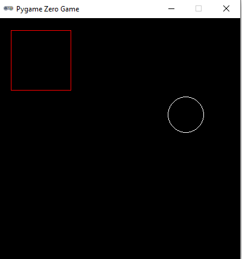


```
import pgzrun
import random

WIDTH = 400
HEIGHT = 400
STEP = 10
x = WIDTH/2
y = WIDTH/2

box = Rect((20,20),(100,100))

game_over = False


def update():
    global x, y, game_over
    if keyboard.LEFT:
        x -= STEP
    elif keyboard.RIGHT:
        x += STEP
    elif keyboard.UP:
        y -= STEP
    elif keyboard.DOWN:
        y += STEP

    if box.collidepoint((x,y)):
        game_over = True

def draw():
    screen.clear()
    pos = (x,y)
    radius = 30
    screen.draw.rect(box, color="red")
    screen.draw.circle(pos, radius, 'white')

    if game_over:
        screen.draw.text("GAME OVER", (50, 30), color="blue")
 
pgzrun.go()

```

## [DAY-63] Functions

Catch the snake

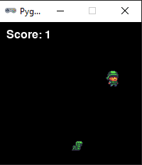

Make images/ folder and download the images from https://github.com/jackdoe/programming-for-kids. When you say `Actor("c1")` it will look for `c1.png` in images/ folder in the current directory.

```
import pgzrun
import random

HEIGHT = 200
WIDTH = 200

score = 0
speed = 1
elf = Actor("c1")
snake = Actor("snake")
elf.x = WIDTH/2
elf.y = HEIGHT/2
def place_snake():
    snake.x = random.randint(10,WIDTH-10)
    snake.y = random.randint(10,HEIGHT-10)

place_snake()

def update():
    global game_over, speed, score
    if keyboard.left:
        elf.x = elf.x-speed
    if keyboard.right:
        elf.x = elf.x+speed
    if keyboard.up:
        elf.y = elf.y-speed
    if keyboard.down:
        elf.y= elf.y+speed
    if keyboard.R:
        speed = 1
        score = 0

    if elf.colliderect(snake):
        score += 1
        speed += 1
        place_snake()

def draw():
    screen.fill('black')
    elf.draw()
    snake.draw()

    screen.draw.text("Score: "+ str(score), color="white", topleft=(10,10))                         
pgzrun.go()

```


## [DAY-64] Lists; Functions

Many Snakes

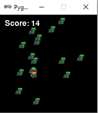

```
import pgzrun
import random

HEIGHT = 200
WIDTH = 200

score = 1
speed = 1
elf = Actor("c1")
snakes = []
elf.x = WIDTH/2
elf.y = HEIGHT/2
def place_snakes():
    global snakes
    snakes = []
    for i in range(score):
        snake = Actor("snake")
        snake.x = random.randint(10,WIDTH-10)
        snake.y = random.randint(10,HEIGHT-10)
        snakes.append(snake)

place_snakes()

def update():
    global game_over, speed, score, snakes
    if keyboard.left:
        elf.x = elf.x-speed
    if keyboard.right:
        elf.x = elf.x+speed
    if keyboard.up:
        elf.y = elf.y-speed
    if keyboard.down:
        elf.y= elf.y+speed
    if keyboard.R:
        speed = 1
        score = 0
        snakes = []
        place_snakes()
    for s in snakes:
        if elf.colliderect(s):
            score += 1
            speed += 1
            place_snakes()

def draw():
    screen.fill('black')
    elf.draw()
    for s in snakes:
        s.draw()

    screen.draw.text("Score: "+ str(score), color="white", topleft=(10,10))                         
pgzrun.go()
```
## [DAY-65] Functions; Collisions

```
import pgzrun
import random

HEIGHT = 200
WIDTH = 200

score = 0
speed = 1
game_over = False
elf = Actor("c1")
snake = Actor("snake")
elf.x = WIDTH/2
elf.y = HEIGHT/2
def place_snake():
    snake.x = random.randint(10,WIDTH-10)
    snake.y = random.randint(10,HEIGHT-10)

place_snake()

def update():
    global game_over, speed, score
    if keyboard.left:
        elf.x = elf.x-speed
    if keyboard.right:
        elf.x = elf.x+speed
    if keyboard.up:
        elf.y = elf.y-speed
    if keyboard.down:
        elf.y= elf.y+speed
    if keyboard.R:
        speed = 1
        score = 0

    if elf.colliderect(snake):
        score += 1
        speed += 1
        place_snake()

def draw():
    screen.fill('black')
    elf.draw()
    snake.draw()

    screen.draw.text("Score: "+ str(score), color="white", topleft=(10,10))                         
pgzrun.go()

```


## [DAY-66] Schedule; Callbacks; Functions

Catch as many snakes as you can in 5 seconds.

```
import pgzrun
import random

HEIGHT = 200
WIDTH = 200

game_over = False
score = 0
speed = 1
elf = Actor("c1")
snake = Actor("snake")
elf.x = WIDTH/2
elf.y = HEIGHT/2
def place_snake():
    snake.x = random.randint(10,WIDTH-10)
    snake.y = random.randint(10,HEIGHT-10)

place_snake()

def time_is_up():
    global game_over
    game_over = True

def update():
    global game_over, speed, score
    if keyboard.left:
        elf.x = elf.x-speed
    if keyboard.right:
        elf.x = elf.x+speed
    if keyboard.up:
        elf.y = elf.y-speed
    if keyboard.down:
        elf.y= elf.y+speed
    if keyboard.R:
        speed = 1
        score = 0

    if elf.colliderect(snake):
        score += 1
        speed += 1
        place_snake()

def draw():
    screen.fill('black')
    elf.draw()
    snake.draw()

    screen.draw.text("Score: "+ str(score), color="white", topleft=(10,10))

    if game_over:
        screen.fill('blue')
        screen.draw.text("GAME OVER, Score: "+ str(score), color="white", topleft=(10,10))

clock.schedule(time_is_up, 5)
pgzrun.go()
```


You see we just overwrite the screen with 'blue' and write another text, but you can still move in the back and the score will update if you catch a sneak.

If you want to stop the hero to move outside of the window, simply restrict elf.x and elf.y to be smaller than 0 or bigger than WIDTH and HEIGHT

Example:


```
def update():
    ...
    if keyboard.left:
        elf.x = elf.x-speed
        if elf.x > WIDTH:
            elf.x = WIDTH

```

## [DAY-67] Lists; Functions

Cross the road. Work with your parent to find images for the game, you need few cars, fox and a door. If not just use the existing assets from your images/ folder

```
import pgzrun
import random

HEIGHT = 1000
WIDTH = 1200

score = 0
step = 5
coin_speed = 1
fox = Actor("fox")
gate = Actor("door")
gate.y = HEIGHT - 50
gate.x = WIDTH/2 - 20
cars=[
    [Actor("car-2"),Actor("car-5"),Actor("car-3")],
    [Actor("car-1"),Actor("car-5")],
    [Actor("car-3"),Actor("car-4"),Actor("car-2")],
]

for a in cars:
    for (coin_index,f) in enumerate(a):
        f.x += coin_index * int(WIDTH/len(a)) + 30
def move_coins():
    for (index,a) in enumerate(cars):
        for (coin_index, f) in enumerate(a):
           
            f.y = (index * int(HEIGHT/len(cars))) + int(HEIGHT/len(cars))/2
            f.x += coin_speed
            if f.x > WIDTH:
                f.x = 0

game_over = False
move_coins()

def update():
    global score
    global step
    global game_over
    global coin_speed
    if keyboard.left:
        fox.x = fox.x-step
        if fox.x <0:
            fox.x=0
    if keyboard.right:
        fox.x = fox.x+step
        if fox.x >WIDTH:
            fox.x=WIDTH
    if keyboard.up:
        fox.y =fox.y-step
        if fox.y <0:
            fox.y=0
    if keyboard.down:
        fox.y= fox.y+step
        if fox.y >HEIGHT:
            fox.y=HEIGHT
    if keyboard.R:
        game_over = False
        score = 0
        fox.x = 0
        fox.y = 0
        coin_speed = 1
    for i in cars:
        for s in i:
            if fox.colliderect(s):
                game_over = 1 == 1

    if fox.colliderect(gate):
        fox.x = 0
        fox.y = 0
        score += 1
        coin_speed += 2
    move_coins()

def draw():
    screen.fill('black')
    fox.draw()
    gate.draw()

    for i in cars:
        for k in i:
            k.draw()
    screen.draw.text("Score: "+ str(score), color="white", topleft=(10,10))
    if game_over:
        screen.fill("blue")
        screen.draw.text("Final Score: "+ str(score), color="white", topleft=(10,10),fontsize=60)    
                         
pgzrun.go()
```

## [DAY-68] Lists; Functions

Shoot bullets and remove them from the list, play sound, and also level up after killing 3 snakes!


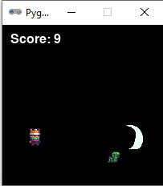

```
import pgzrun
import random

HEIGHT = 200
WIDTH = 200

score = 0
speed = 1
elf = Actor("c1")
snake = Actor("snake")
beep = tone.create('A3', 0.5)

elf.x = WIDTH/2
elf.y = HEIGHT/2
bullets = []

def place_snake():
    snake.x = random.randint(10,WIDTH-10)
    snake.y = random.randint(10,HEIGHT-10)

place_snake()

def bullet_out_of_screen():
    # just delete the first bullet
    bullets.pop(0)

def on_key_down(key):
    if key == keys.SPACE:
        b = Actor("bullet2")
        b.x = elf.x + 5
        b.y = elf.y
        animate(b, pos=(WIDTH + 100, elf.y), tween='accelerate', on_finished=bullet_out_of_screen)
        bullets.append(b)

def update():
    global game_over, speed, score, bullets
    if keyboard.left:
        elf.x = elf.x-speed
    if keyboard.right:
        elf.x = elf.x+speed
    if keyboard.up:
        elf.y = elf.y-speed
    if keyboard.down:
        elf.y= elf.y+speed
    if keyboard.R:
        speed = 1
        score = 0
        elf.image = "c1"
        bullets = []

    for b in bullets:
        if b.colliderect(snake):
            score += 1
            speed += 1
            if score == 3:
                elf.image = "c2"
            beep.play()
            place_snake()

def draw():
    screen.fill('black')
    elf.draw()
    snake.draw()
    for b in bullets:
        b.draw()

    screen.draw.text("Score: "+ str(score), color="white", topleft=(10,10))

pgzrun.go()
```

You see how we are adding, bullets to a list every time you press 'space'. Now the problem is we need to clean up that list at some point, otherwise it will grow a lot, and every time we do `for b in bullets` it will bet slower and slower. Computers can only do so many things per second.

So when the animation finishes, it will call `bullets_out_of_screen`, and from there we just say `bullets.pop(0)` which will remove the first element in the list of bullets, which is the oldest bullet. So if you press space 5 times, the list will have 5 items, and each of them will finish and will remove the first element.

Lets say you pressed space 3 times, and shot 3 bullets, so the list, and how the bullets are traveling kindof looks like this:

```
0 -> bbbbbbbbbbbbbb
1 -> bbbbbbb
2 -> bbbb
```

So you see when 0 finishes because it is the oldest, when it does bullets.pop(0), it will actually delete itself.

pretty cool!

## [DAY-69] Sockets; Functions; Callbacks

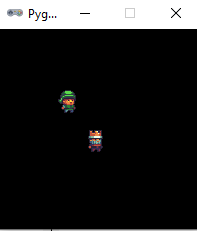

Multiplayer!

```
import pgzrun
import socket
import threading
import sys

HEIGHT = 200
WIDTH = 200
MULTIPLAYER_PORT = 5025
OTHER_COMPUTER_IP = "192.168.0.10"

speed = 4
me = Actor("c1")
other = Actor("c2")

me.x = WIDTH/2
me.y = HEIGHT/2

socket = socket.socket(socket.AF_INET, socket.SOCK_DGRAM)
socket.bind(("0.0.0.0", MULTIPLAYER_PORT))

data = None
def multiplayer():
    global data
    while True:
        data, addr = socket.recvfrom(1024)

def update():
    if data != None:
        message = data.decode("utf8")
        (x,y) = message.split(":")

        other.x = float(x)
        other.y = float(y)


def on_key_down(key):
    if key == keys.LEFT:
        me.x = me.x-speed
    if key == keys.RIGHT:
        me.x = me.x+speed
    if key == keys.UP:
        me.y = me.y-speed
    if key == keys.DOWN:
        me.y= me.y+speed

    if key == keys.Q:
        sys.exit(0)

    message = bytearray(str(me.x) + ':' + str(me.y),"utf8")
    socket.sendto(message, (OTHER_COMPUTER_IP, MULTIPLAYER_PORT))

def draw():
    screen.fill('black')
    me.draw()
    other.draw()


threading.Thread(target=multiplayer).start()

pgzrun.go()
```

There are two important parts here, first is the `socket` and then the `Thread`. For now we will leave them a mystery. But basically every time you press the UP/DOWN/LEFT/RIGHT key your computer sends a message "currentX:currentY" to the other computer, and when the other computer receives it, it stores it in the global `data` variable, then in the `update` function it splits the message by `:` and extract the `x` and `y` and sets it to the `other` actor.

The `multiplayer()` function runs in a separate thread, or you can think of a separate process, so we are doing two things in the same time, the game loop (which is one `while True`) and the multiplayer loop which is also `while True`.


## [DAY-70] Lists; Functions

print numbers in a list

```
data = [1,2,3,4,5]
for item in data:
    print(e)
```


```
list_of_lists = [[1,2,3,4,5], [1,2,3], [4,5,6]]
for l in list_of_lists:
    for item in l:
        print(item)
```


```
list_of_list_of_lists = [[[1,2,3,4,5], [1,2,3], [4,5,6]], [[1,2,3,4,5], [1,2,3], [4,5,6]]]
for list_of_lists in list_of_list_of_lists:
    for l in list_of_lists:
        for item in l:
            print(item)
```


```
list_of_list_of_list_of_lists = [
    [
        [
            [1,2,3,4,5],
            [1,2,3],
            [4,5,6]
        ],
        [
            [1,2,3,4,5],
            [1,2,3],
            [4,5,6]
        ]
    ],
    [
        [
            [1,2,3,4,5],
            [1,2,3],
            [4,5,6]
        ],
        [
            [1,2,3,4,5],
            [1,2,3],
            [4,5,6]
        ]
    ],
]

for list_of_list_of_lists in list_of_list_of_list_of_lists:
    for list_of_lists in list_of_list_of_lists:
        for l in list_of_lists:
            for item in l:
                print(item)
```


```
def sum(x):
    r = 0
    for item in x:
        r += item
    return r

data = [1,2,3,4,5]
print(sum(data))
```


```
def sum(x):
    r = 0
    for l in x:
        for item in l:
            r += item
    return r

data = [[1,2,3,4,5], [1,2,3,4,5]]
print(sum(data))
```

## [DAY-71] Strings; Integers; While; Functions
make a calculator

```
while True:
    n1 = int(input("number 1: "))
    n2 = int(input("number 2: "))
    op = input("operation +/-* : ")
    r = 0

    if op == "quit":
        break
    elif op == "+":
        r = n1 + n2
    elif op == "-":
        r = n1 - n2
    elif op == "*":
        r = n1 * n2
    else:
        print("i dont know " + op)
        continue

    print(n1, op, n2, '=',r)

```

sum numbers from input

```
def sum(x):
    r = 0
    for item in x:
        r += item
    return r

x = []
while True:
    k = input("enter number: ")
    x.append(int(k))
    print(x)
    print(sum(x))

```
## [DAY-72] Reading Code

Reading code is even more important than writing it, and it is more difficult than reading a book, because the story does not develop top to bottom. You have to see the important pieces, and how they are linked together. Where are things assigned and changed and how are those pieces related. For example in the touch typing program, you have a couple of functions, you can study them on their own, and know what they do, and then see how they are used and make sense of the whole program, without even running it.

We will go over a couple of programs we wrote before, the rock paper scissors game, the bullet shooting game, and one of the touch typing programs.

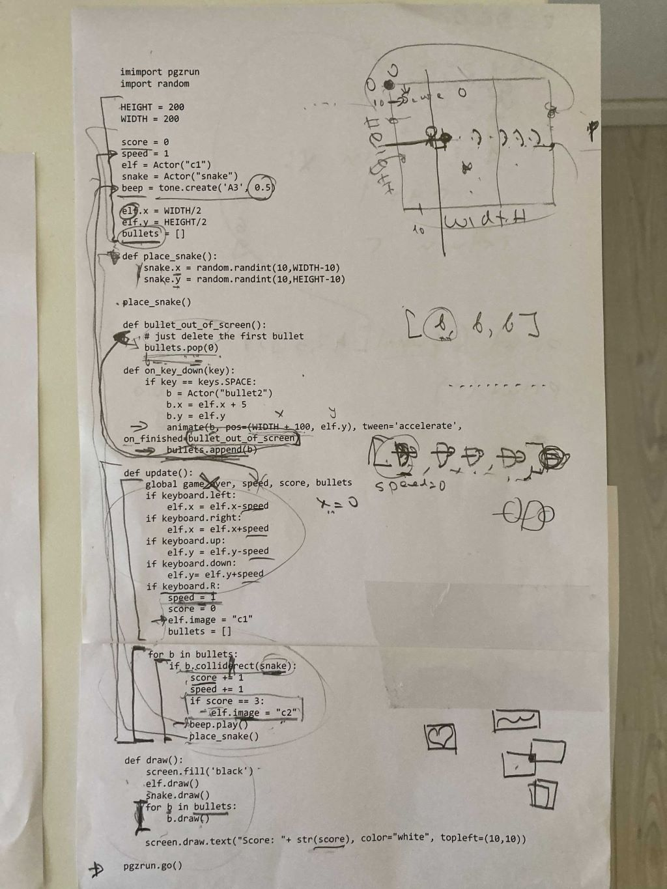

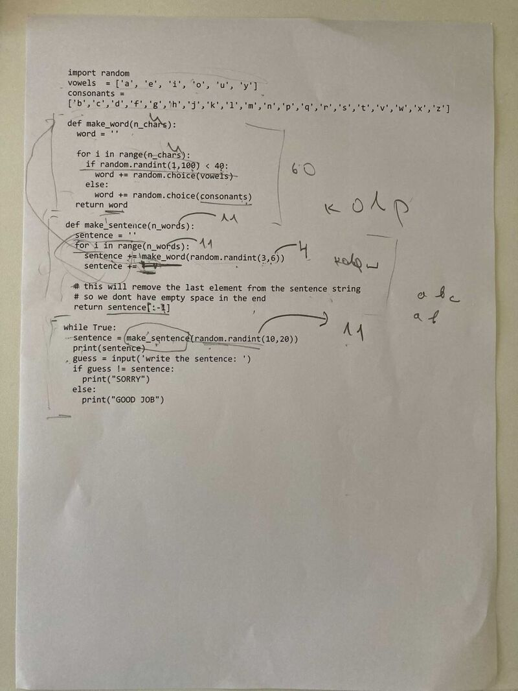

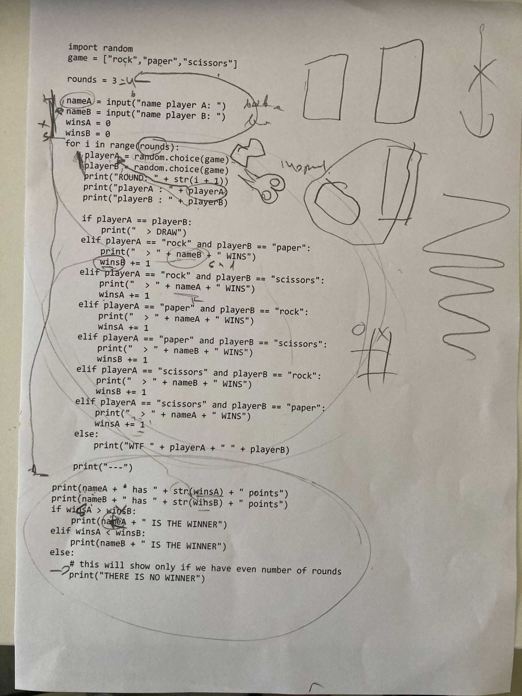


Those are just examples, you have to print the programs and go over them with your parent.

## [DAY-73] Reading Code

More reading today, those are a couple of examples from the earlier days, the love tester, the fight function from the text game, the hangman game and first touch typing program.


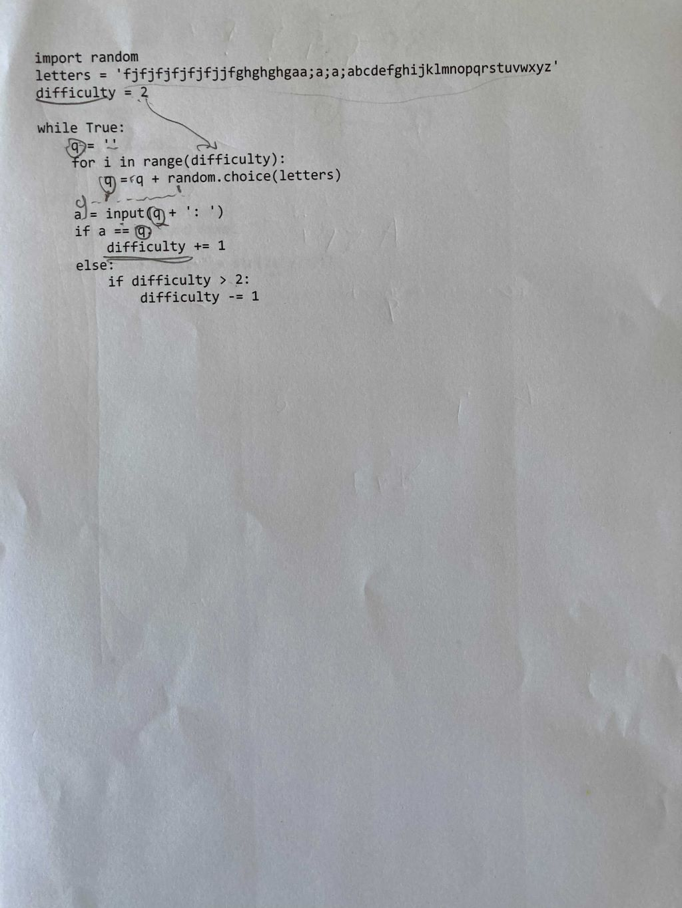

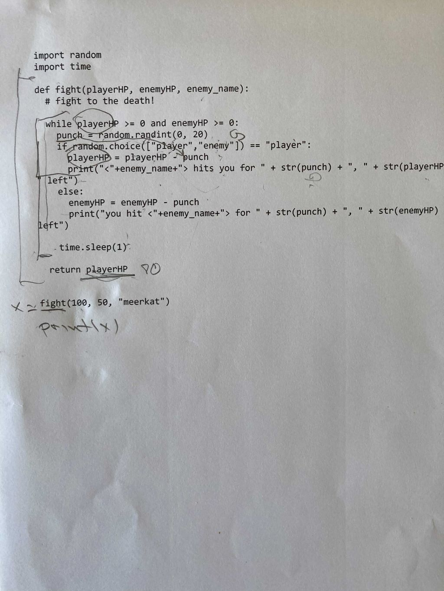

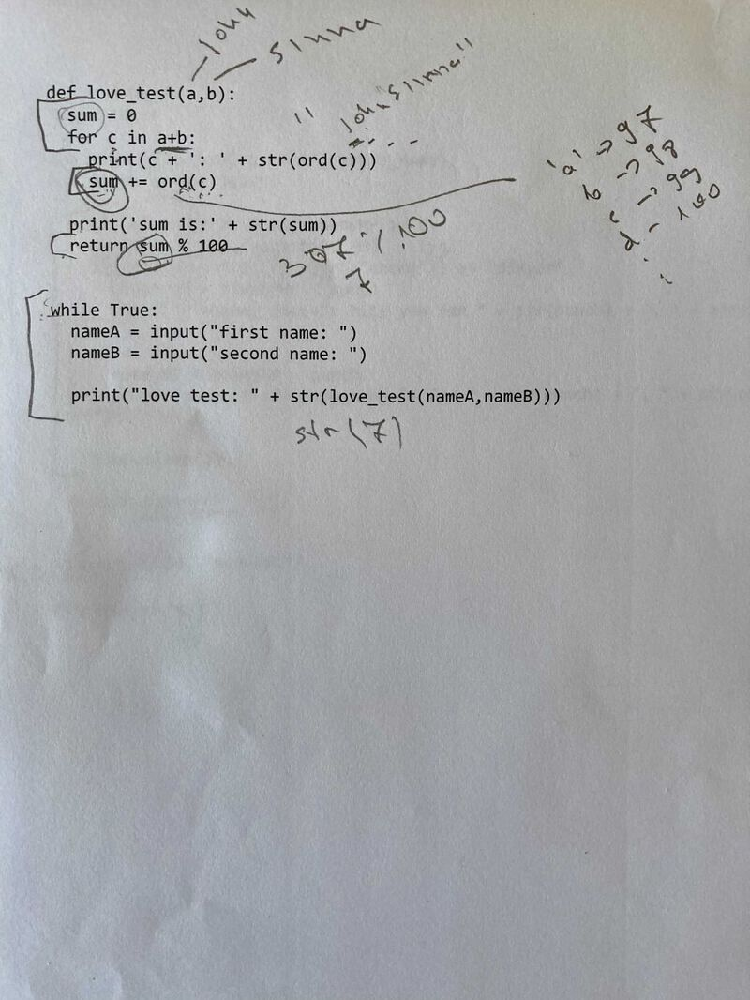

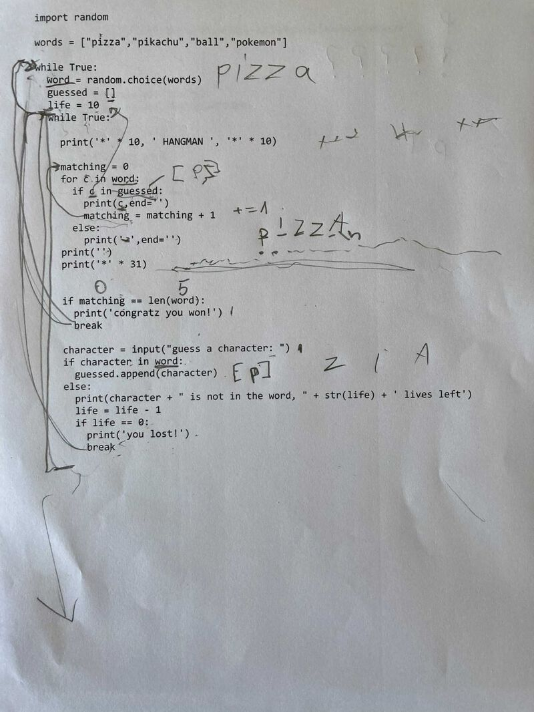

Again you can use something else as well, those are just the ones I picked. Be messy with the pencil, connect things together!

## [DAY-74] Strings; While; Lists

Today its up to you what to write, my kid came up with those programs:

1. Ask forever what your favorite sport is, if yours is not here use https://emojipedia.org/ to find good emojis.

```
while True:
    k = input('what is your favorite sport: ')

    if k == 'soccer':
        print('⚽')
    elif k ==  'hockey':
        print('🏑')
    elif k == 'tennis':
        print('🎾')
    elif k == 'volleyball':
        print('🏐')
    elif k == 'table tennis':
        print('🏓')
    elif k == 'baseball':
        print('⚾')
    elif k == 'basketball':
        print('🏀')
    elif k == 'golf':
        print('🏌️‍♂️')
    else:
        print('i dont now ' +k)
```

2. and one simple, append and pop from a list.

```
k = []
while True:
    s = input('What are you thinking of: ')
    if s == 'pop':
        k.pop(0)
    else:
        k.append(s)
    print(k)
```

## [DAY-75] Functions; Callbacks; Lists; Encoding

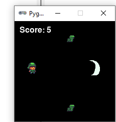


Enemies come to get you, and you shoot half moons at them. pretty cool.

```
import pgzrun
import random

HEIGHT = 200
WIDTH = 200

score = 0
speed = 1
elf = Actor("c1")

beep = tone.create('A3', 0.5)
elf.x = 10
elf.y = HEIGHT/2

game_over = False

bullets = []
enemies = []

def make_enemies():
    level = int(score / 5) + 1

    duration = (5 - level)
    if duration < 1:
        duration = 1

    for i in range(level):
        snake = Actor("snake")    
        snake.x = WIDTH-20
        snake.y = random.randint(10,HEIGHT-10)
        animate(snake, pos=(-100, snake.y), tween='accelerate', duration=duration)
        enemies.append(snake)

def bullet_out_of_screen():
    bullets.pop(0)

def on_key_down(key):
    if key == keys.SPACE:
        b = Actor("bullet2")
        b.x = elf.x + 5
        b.y = elf.y
        animate(b, pos=(WIDTH + 100, elf.y), tween='accelerate', on_finished=bullet_out_of_screen)
        bullets.append(b)

def update():
    global game_over, speed, score, bullets, enemies
    if keyboard.left:
        elf.x = elf.x-speed
    if keyboard.right:
        elf.x = elf.x+speed
    if keyboard.up:
        elf.y = elf.y-speed
    if keyboard.down:
        elf.y= elf.y+speed
    if keyboard.R:
        speed = 1
        score = 0
        bullets = []
        enemies = []
        game_over = False

    hit = []
    for b in bullets:
        for e in enemies:
            if b.colliderect(e):
                hit.append(e)

    if len(hit) > 0:
        score += len(hit)
        if speed < 4:
            speed += 1
        beep.play()
        for e in hit:
            enemies.remove(e)

    for e in enemies:
        if e.colliderect(elf):
            game_over = True

def draw():
    if game_over:
        screen.fill('black')
        screen.draw.text("GAME OVER", color="white", topleft=(10,10))
    else:
        screen.fill('black')
        elf.draw()

        for b in bullets:
            b.draw()

        for e in enemies:
            e.draw()

        screen.draw.text("Score: "+ str(score), color="white", topleft=(10,10))


make_enemies()
clock.schedule_interval(make_enemies, 2)

pgzrun.go()
```
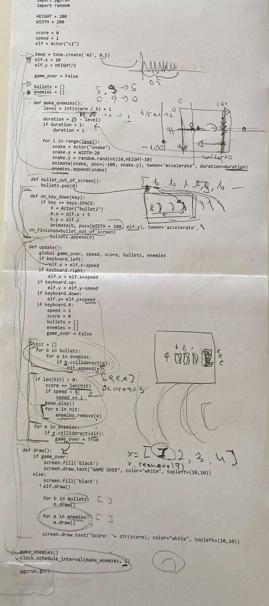


tic tac toe but with one character variable names

```
x = [
        #  0    1    2     3
        ['〰️','🅰️','🅱️','🅾️'], # 0 
        ['🥇','〰️','〰️','〰️'], # 1
        ['🥈','〰️','〰️','〰️'], # 2
        ['🥉','〰️','〰️','〰️'], # 3
        
    ]

k = '🛹'

while True:
    for i in x:
        for s in i:
            print(s,end=' ')
        print('')


    l = input(k + ": ")

    if l == 'a1':
        x[1][1]=k
    elif l == 'a2':
        x[2][1]=k
    elif l == 'a3':
        x[3][1]=k

    elif l == 'b1':
        x[1][2]=k
    elif l == 'b2':
        x[2][2]=k
    elif l == 'b3':
        x[3][2]=k

    elif l == 'o1':
        x[1][3]=k
    elif l == 'o2':
        x[2][3]=k
    elif l == 'o3':
        x[3][3]=k
    else:
        continue
    
    if k == '🛹':
        k = '⚽'
    else:
        k = '🛹'

```

30 and back

```
for i in range(1,31):
    print(i)
for i in range(1,31):
    print(30 - i)
```

football mania

```
d = 30
while True:
    for i in range(1,d):
        print('⚽' * i)
    for i in range(1,d):
        h = (d - i)
        print('⚽' * h)
```

## [DAY-76] Functions; Callbacks; Lists


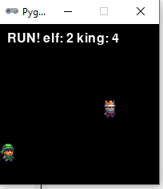

A game of tag! The elf is robin hood, running away from the king. The elf plays with WASD and the king plays with up/down/left/right.

```
import pgzrun
import random

HEIGHT = 200
WIDTH = 200

speedA = 3
speedB = 3

playerA = Actor("c1")
playerB = Actor("c2")

playerA.x = 10
playerA.y = HEIGHT - 40

playerB.x = 10
playerB.y = 40

game_over = False

def random_speed():
    global speedA, speedB
    speedA = random.randint(1,5)
    speedB = random.randint(1,5)

def on_key_down(key):
    global game_over

    # player A
    if key == keys.A:
        playerA.x -= speedA
    if key == keys.D:
        playerA.x += speedA
    if key == keys.W:
        playerA.y -= speedA
    if key == keys.S:
        playerA.y += speedA

    # player B
    if key == keys.LEFT:
        playerB.x -= speedB
    if key == keys.RIGHT:
        playerB.x += speedB
    if key == keys.UP:
        playerB.y -= speedB
    if key == keys.DOWN:
        playerB.y += speedB

def update():
    global game_over
    if playerA.colliderect(playerB):
        game_over = True
    
def draw():
    if game_over:
        screen.fill('black')
        screen.draw.text("GAME OVER", color="white", topleft=(10,10))
    else:
        screen.fill('black')
        screen.draw.text("RUN! elf: " + str(speedA) + " king: " + str(speedB) , color="white", topleft=(10,10))
        playerA.draw()
        playerB.draw()

clock.schedule_interval(random_speed, 2)

pgzrun.go()
```


Basic math quiz

```
import random
while True:
    k = random.randint(1,13)
    s = random.randint(1,13)
    r = k * s
    g = int(input('How much is '+str(k) +'*' +str(s) + ': '))
    if g == r:
        print('Wow nice job its CORRECT')
    else:
        print('wrong the answer was: ' + str(r))
```

7 days average

```
x = [1231,5123,6737,6725,6261,2664,62561]
n = len(x)

print(x)
print(n)

sum = 0
for i in x:
    sum += i

print('sum: ' + str(sum))
print('average: ' + str(sum/n))
```

## [DAY-77] Lists; Encode/Decode

morse code translator

```
alphabet = ['a','b','c','d','e','f','g','h','i','j','k','l','m','n','o','p','q','r','s','t','u','v','w','x','y','z',' ','.',',']
morse = ['.-','-...','-.-.','-..','.','..-.','--.','....','..','.---','-.-','.-..','--','-.','---','.--.','--.-','.-.','...','-','..-','...-','.--','-..-','-.--','--..','/','.-.-.-','--..--']

print(len(morse))
print(len(alphabet))

for i in range(len(alphabet)):
    print(alphabet[i] + " -> " + morse[i])

text = '.... . .-.. .-.. --- / .-- --- .-. .-.. -.. .-.-.- / - .... .. ... / .. ... / -- --- .-. ... . / -.-. --- -.. . .-.-.- / - .... . .-. . / .- .-. . / -- .- -. -.-- / -.-. --- -.. . ... --..-- / -... ..- - / - .... .. ... / --- -. . / .. ... / .--. .-. . - - -.-- / -.-. --- --- .-.. --..-- / --. --- --- -.. / .--- --- -... / - .-. .- -. ... .-.. .- - .. -. --. / .. - .-.-.-'.split(' ')
for word in text:
    found = False
    for i in range(len(morse)):
        x = morse[i]
        if x == word:
            print(alphabet[i], end = '')
            found = True
    if not found:
        print(word , end='')
```

## [DAY-78] Coordinates; Functions; Callbacks

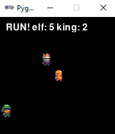

Small modifications to the previous game, gold in the middle moves the king away, randomize the elf position every 2 seconds

```
import pgzrun
import random

HEIGHT = 200
WIDTH = 200

speedE = 3
speedK = 3

elf = Actor("c1")
king = Actor("c2")
gold = Actor("c3")

gold.x = WIDTH/2
gold.y = HEIGHT/2
elf.x = 10
elf.y = HEIGHT - 40
king.x = 10
king.y = 40

game_over = False

def random_speed():
    global speedE, speedK
    speedE = random.randint(3,5)
    speedK = random.randint(2,5)

def random_place():
    elf.x = random.randint(0,WIDTH)
    elf.y = random.randint(0,HEIGHT)

def update():
    global game_over

    # elf
    if keyboard.A:
        elf.x -= speedE
    if keyboard.D:
        elf.x += speedE
    if keyboard.W:
        elf.y -= speedE
    if keyboard.S:
        elf.y += speedE

    # king
    if keyboard.left:
        king.x -= speedK
    if keyboard.right:
        king.x += speedK
    if keyboard.up:
        king.y -= speedK
    if keyboard.down:
        king.y += speedK

    if keyboard.SPACE:
        elf.image = 'snake'
        random_speed()

    if keyboard.R:
         game_over = 1==2
         elf.x = 10
         elf.y = HEIGHT - 40
         king.x = 10
         king.y = 40
         
    if elf.x < 0:
        elf.x = 0
    if elf.x > WIDTH:
        elf.x = WIDTH
    if elf.y < 0:
        elf.y = 0
    if elf.y > HEIGHT:
        elf.y = HEIGHT


    if king.x < 0: 
        king.x = 0
    if king.x > WIDTH:
        king.x = WIDTH
    if king.y < 0:
        king.y = 0
    if king.y > HEIGHT:
        king.y = HEIGHT

    if elf.colliderect(gold):
        king.x = WIDTH
        king.y = HEIGHT

    if king.colliderect(gold):
        game_over = True

    if elf.colliderect(king):
        game_over = True
    
def draw():
    if game_over:
        screen.fill('black')
        screen.draw.text("GAME OVER", color="white", topleft=(10,10))
    else:
        screen.fill('black')
        screen.draw.text("RUN! elf: " + str(speedE) + " king: " + str(speedK) , color="white", topleft=(10,10))
        elf.draw()
        king.draw()
        gold.draw()

clock.schedule_interval(random_speed, 2)
clock.schedule_interval(random_place, 5)

pgzrun.go()
```

Explanation about setting x and y to be random:

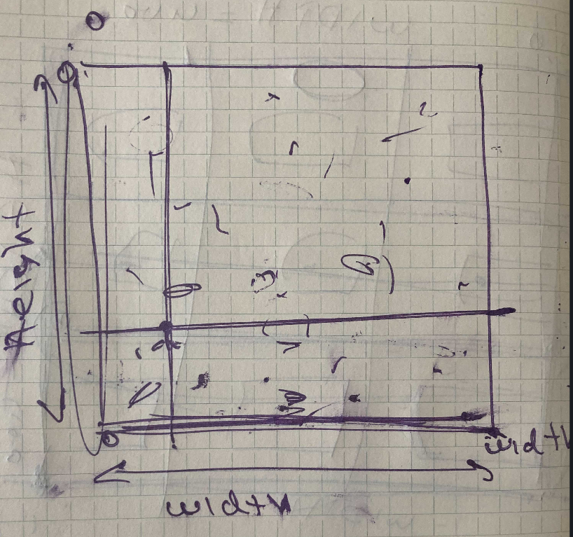

Write a program to compute the average of a list of numbers:

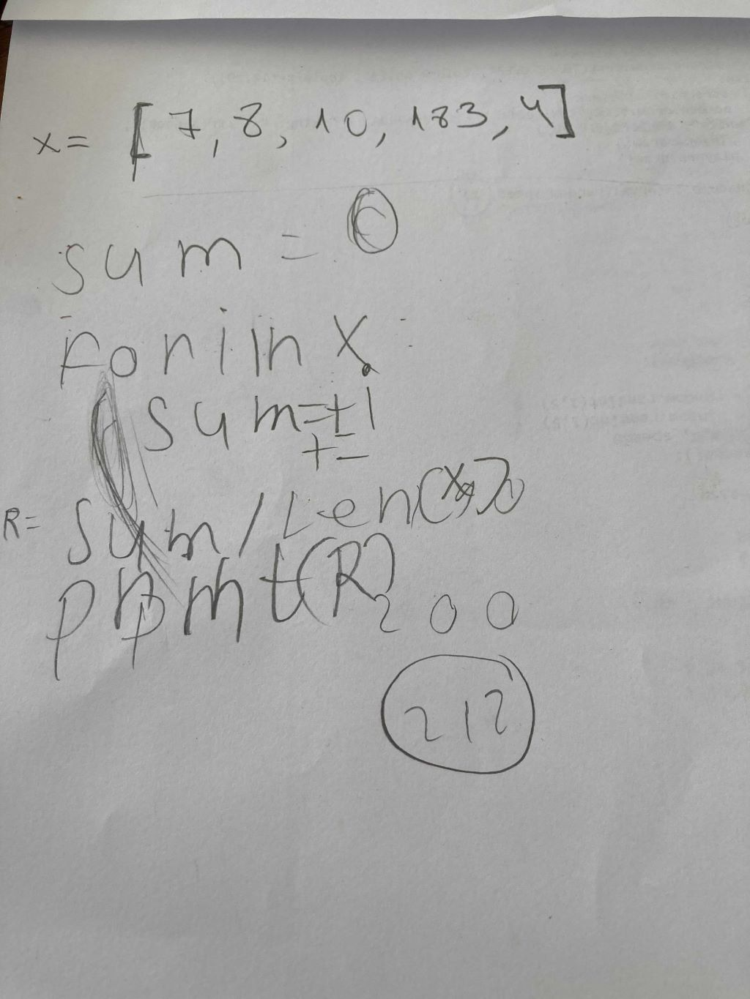

Decode morse code:

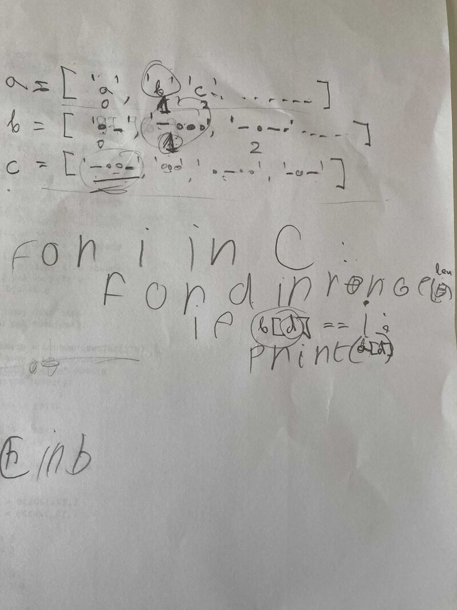


## [DAY-79] Lists; Encoding

morse code agian

```
alphabet = ['a','b','c','d','e']
morse = ['.-','-...','-.-.','...','.']


for i in range(len(alphabet)):
    print(alphabet[i])
    print(morse[i])

text = ['.-..','.','.-..','.-']

for word in text:
    for c in range(len(morse)):
        if word == morse[c]:
            print(alphabet[c])
```

## [DAY-80] Lists; Functions

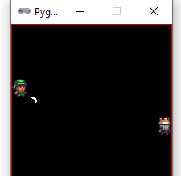


PONG (almost)

```
import pgzrun
import random

HEIGHT = 200
WIDTH = 200

left = Actor("c1")
left.x = 10
left.y = HEIGHT/2

right = Actor("c2")
right.x = WIDTH - 10
right.y = HEIGHT/2

ball = Actor("bullet")
ball.x = WIDTH/2
ball.y = HEIGHT/2

game_area = Rect((0, 0), (WIDTH, HEIGHT))

game_over = False

def send_ball_to(direction):
    duration = 3
    if direction == 'left':
        animate(ball, pos=(-100, random.randint(0,HEIGHT)), tween='linear', duration=duration)
    else:
        animate(ball, pos=(WIDTH + 100, random.randint(0,HEIGHT)), tween='linear', duration=duration)

def update():
    global game_over
    speed = 3

    if keyboard.R:
        ball.x = WIDTH/2
        ball.y = HEIGHT/2
        send_ball_to('left')
        game_over = False

    if keyboard.W:
        left.y -= speed
    if keyboard.S:
        left.y += speed

    if keyboard.up:
        right.y -= speed
    if keyboard.down:
        right.y += speed

    if left.colliderect(ball):
        send_ball_to('right')

    if right.colliderect(ball):
        send_ball_to('left')

    if not ball.colliderect(game_area):
        game_over = True

def draw():
    if game_over:
        screen.fill('black')
        screen.draw.text("GAME OVER", color="white", topleft=(10,10))
    else:
        screen.fill('black')
        left.draw()
        right.draw()
        ball.draw()
        screen.draw.rect(game_area, (200, 0, 0))

send_ball_to('left')

pgzrun.go()
```


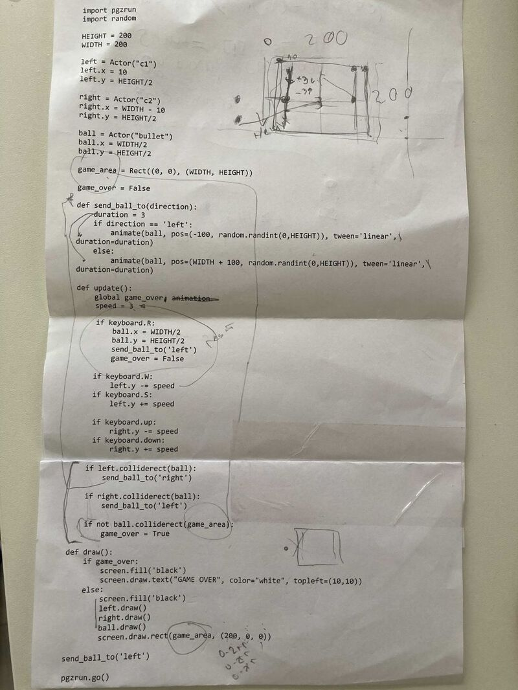

average of two lists

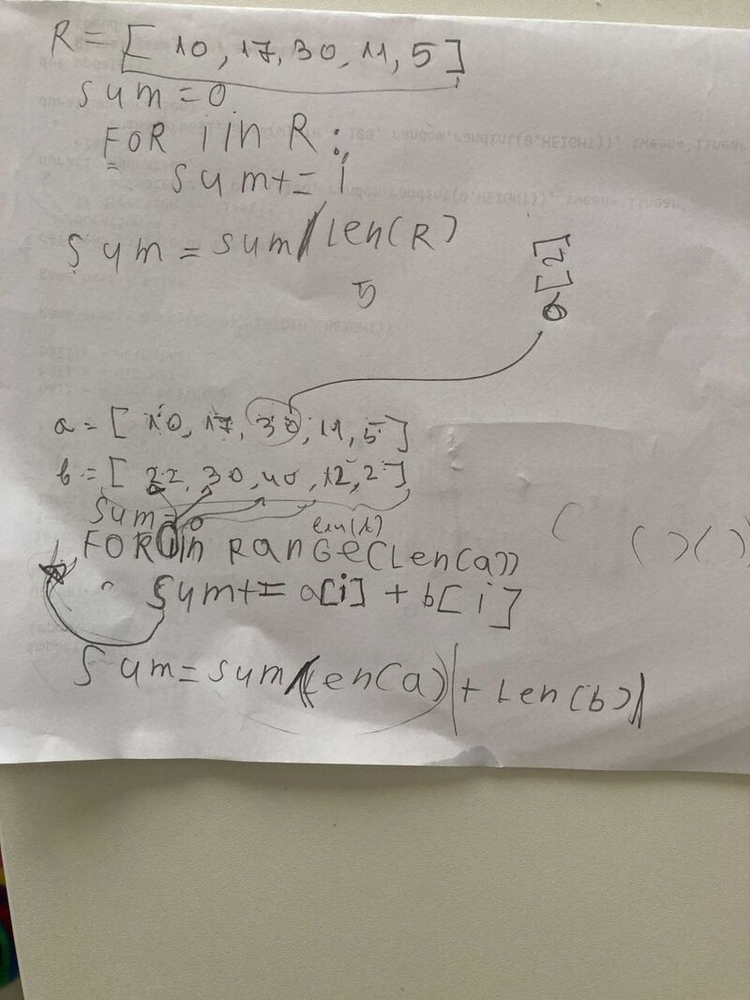


## [DAY-81] Lists; Encoding

First image

```
+-----+
| * * |
|  *  |
| * * |
+-----+
```


list of lists with pixels

```
image = [
    [1,3,3,3,3,3,1],
    [2,4,5,4,5,4,2],
    [2,4,4,5,4,4,2],
    [2,4,5,4,5,4,2],
    [1,3,3,3,3,3,1],
]

for row in image:
    for pixel in row:
        if pixel == 1:
            print('+', end='')
        elif pixel == 2:
            print('|', end='')
        elif pixel == 3:
            print('-', end='')
        elif pixel == 4:
            print(' ', end='')
        elif pixel == 5:
            print('*', end='')
        else:
            print("dont know what to do with: " + str(pixel))
    print('')
```

just a list of pixels

```
image = [
    1,3,3,3,3,3,1,
    2,4,5,4,5,4,2,
    2,4,4,5,4,4,2,
    2,4,5,4,5,4,2,
    1,3,3,3,3,3,1,
]

width = 7

for (index, pixel) in enumerate(image):
    if index > 0 and index % width == 0:
        print('')

    if pixel == 1:
        print('+', end='')
    elif pixel == 2:
        print('|', end='')
    elif pixel == 3:
        print('-', end='')
    elif pixel == 4:
        print(' ', end='')
    elif pixel == 5:
        print('*', end='')
    else:
        print("dont know what to do with: " + str(pixel))
```

some fun with lists
```
x = ['a','b','c','d']
m = ['w','x','y','z']
d = ['g','h','j','k']

# a -> 0
# b -> 1
# c -> 2

for i in range(len(x)):
    print(i,end=' ')
    print(x[i],end=' ')
    print(m[i],end=' ')
    print(d[i])
```

how similar are lists and strings

```
x = 'hello'

for i in range(len(x)):
    print(i,end=' ')
    print(x[i])
```

similar, but not quite, you cant change the inside of a string, but you can change the inside of a list.

```
x = ['h','e','l','l','o']
y = 'hello'

x[2] = 'm'
y = 'hemlo'

for i in range(len(x)):
    print(i,end=' ')
    print(x[i], end=' ')
    print(y[i])
```

sum many lists
```
a = [6,3,2]
b = [78,21,1]
c = [123,5,1]

sum = 0
for i in range(len(a)):
    sum += a[i] + b[i] + c[i]

print(sum)
```

another way to sum

```
a = [6,3,2]
b = [78,21,1]
c = [123,5,1]

sum = 0

for x in a:
    sum += x

for x in b:
    sum += x

for x in c:
    sum += x

print(sum)
```

## [DAY-82] Lists; Strings

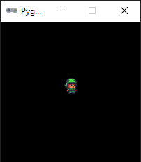

simple game with history, press S to save your position to a list of positions, and then B to go back in time

```
import pgzrun
import random

HEIGHT = 200
WIDTH = 200

player = Actor("c1")
player.x = WIDTH/2
player.y = HEIGHT/2

history = []

def on_key_down(key):
    speed = 3
    
    if key == keys.UP:
        player.y -= speed
    if key == keys.DOWN:
        player.y += speed
    if key == keys.LEFT:
        player.x -= speed
    if key == keys.RIGHT:
        player.x += speed

    if key == keys.S:
        position = [player.x, player.y]
        history.append(position)

        print('append', history)

    if key == keys.B and len(history) > 0:        
        last = history.pop()
        player.x = last[0]
        player.y = last[1]

        print('pop', history)


def draw():
    screen.fill('black')
    player.draw()

pgzrun.go()
```

Two players, and more positions

```
import pgzrun
import random

HEIGHT = 200
WIDTH = 200
player1 = Actor("c1")
player2 = Actor('c2')
history = []

def on_key_down(key):
    speed = 10
    if key == keys.W:
        player1.y-= speed
    if key == keys.A:
        player1.x-=speed
    if key == keys.S:
        player1.y += speed
    if key == keys.D:
        player1.x += speed


    if key == keys.UP:
        player2.y-= speed
    if key == keys.LEFT:
        player2.x-=speed
    if key == keys.DOWN:
        player2.y += speed
    if key == keys.RIGHT:
        player2.x += speed

        
    if key == keys.F:
        positions = [player1.x,player1.y,player2.x,player2.y]
        history.append(positions)
        print('push', history)
    if key == keys.G:
        if len(history) > 0:
            positions = history.pop()
            player1.x = positions[0]
            player1.y = positions[1]
            player2.x = positions[2]
            player2.y = positions[3]
            print('pop', history)
        
def draw():
    screen.fill('black')
    player1.draw()
    player2.draw()
pgzrun.go()
```

More lists

```
a = ['h','w','e']
b = ['e','o','a']
c = ['l','r','r']
d = ['l','l','t']
e = ['o','d','h']

sum1 = ''
sum2 = ''

sum1 = a[0] + b[0] + c[0] + d[0] + e[0]
sum2 = a[1] + b[1] + c[1] + d[1] + e[1]

print(sum1)
print(sum2)

sum = []
for i in range(len(a)):
    sum.append('')
    sum[i] = a[i] + b[i] + c[i] + d[i] + e[i]


print(sum)
```

sum from the input

```
list = []
while True:
    integer = int(input('enter a number: '))
    list.append(integer)
    sum = 0
    for i in list:
        sum += i
        
    print(list, sum)
```

## [DAY-83] Lists; Functions

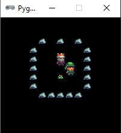


```
import pgzrun
import random

HEIGHT = 200
WIDTH = 200

player = Actor("c1")
player.x = WIDTH/2
player.y = HEIGHT/2

things = []

def on_key_down(key):
    speed = 10

    if key == keys.UP:
        player.y -= speed
    if key == keys.DOWN:
        player.y += speed
    if key == keys.LEFT:
        player.x -= speed
    if key == keys.RIGHT:
        player.x += speed

    if key == keys.F:
        thing = Actor("flower")
        thing.x = player.x
        thing.y = player.y

        things.append(thing)

    if key == keys.R:
        thing = Actor("rock")
        thing.x = player.x
        thing.y = player.y

        things.append(thing)


def draw():
    screen.fill('black')
    player.draw()
    for t in things:
        t.draw()

pgzrun.go()
```

With a function, so we can add more keys faster and we dont duplicate that much code

```
import pgzrun
import random

HEIGHT = 200
WIDTH = 200

player = Actor("c1")
player.x = WIDTH/2
player.y = HEIGHT/2

things = []
def place_thing(kind):
    thing = Actor(kind)
    thing.x = player.x
    thing.y = player.y

    things.append(thing)

def on_key_down(key):
    speed = 15
    
    if key == keys.UP:
        player.y -= speed
    if key == keys.DOWN:
        player.y += speed
    if key == keys.LEFT:
        player.x -= speed
    if key == keys.RIGHT:
        player.x += speed

    if key == keys.F:
        place_thing("flower")

    if key == keys.R:
        place_thing("rock")

    if key == keys.K:
        place_thing("c2")

def draw():
    screen.fill('black')
    player.draw()
    for t in things:
        t.draw()

pgzrun.go()
```

Now we can make a map, just add the kind of thing, its x and y position in a list and print it, after we are done building the map we can use it later

```
...
game_map = []
def place_thing(kind):
    thing = Actor(kind)
    thing.x = player.x
    thing.y = player.y

    things.append(thing)
    game_map.append([kind, thing.x, thing.y])
    print(game_map)
...    
```

use the map:

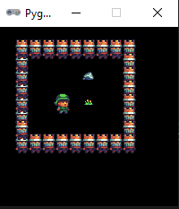

```
import pgzrun
import random

HEIGHT = 200
WIDTH = 200

player = Actor("c1")
player.x = WIDTH/2
player.y = HEIGHT/2

things = []
def place_thing(kind,x,y):
    thing = Actor(kind)
    thing.x = x
    thing.y = y
    things.append(thing)

def on_key_down(key):
    speed = 15
    
    if key == keys.UP:
        player.y -= speed
    if key == keys.DOWN:
        player.y += speed
    if key == keys.LEFT:
        player.x -= speed
    if key == keys.RIGHT:
        player.x += speed
def draw():
    screen.fill('black')
    player.draw()
    for t in things:
        t.draw()

game_map = [['rock', 100.0, 55.0], ['flower', 100.0, 85.0], ['c2', 100.0, 130.0], ['c2', 70.0, 130.0], ['c2', 55.0, 130.0], ['c2', 40.0, 130.0], ['c2', 25.0, 130.0], ['c2', 25.0, 100.0], ['c2', 25.0, 85.0], ['c2', 25.0, 70.0], ['c2', 25.0, 55.0], ['c2', 25.0, 40.0], ['c2', 25.0, 25.0], ['c2', 40.0, 25.0], ['c2', 55.0, 25.0], ['c2', 70.0, 25.0], ['c2', 85.0, 25.0], ['c2', 100.0, 25.0], ['c2', 115.0, 25.0], ['c2', 130.0, 25.0], ['c2', 145.0, 25.0], ['c2', 145.0, 40.0], ['c2', 145.0, 55.0], ['c2', 145.0, 70.0], ['c2', 145.0, 85.0], ['c2', 145.0, 100.0], ['c2', 145.0, 115.0], ['c2', 145.0, 130.0], ['c2', 130.0, 130.0], ['c2', 115.0, 130.0], ['c2', 100.0, 130.0], ['c2', 85.0, 130.0], ['c2', 25.0, 115.0]]
for g in game_map:
    place_thing(g[0],g[1],g[2])

pgzrun.go()
```


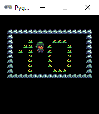
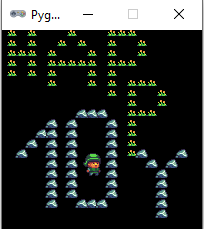

Another way to do it, press S to print the list of things, and then paste it in the game[] list to use it, D deletes things where you stand, and U removes the last thing

```
import pgzrun
import random

HEIGHT = 200
WIDTH = 200

player = Actor("c1")

things = []

game = []
for g in game:
    t = Actor(g[0])
    t.x = g[1]
    t.y = g[2]
    things.append(t)

def on_key_down(key):
    speed = 10

    if key == keys.UP:
        player.y -= speed
    if key == keys.DOWN:
        player.y += speed
    if key == keys.LEFT:
        player.x -= speed
    if key == keys.RIGHT:
        player.x += speed
        
    if key == keys.F:
        f = Actor("flower")
        f.x = player.x
        f.y = player.y
        things.append(f)
    if key == keys.R:
        f = Actor("rock")
        f.x = player.x
        f.y = player.y
        things.append(f)

    if key == keys.U:
         things.pop()

    if key == keys.D:
        collide = []
        for t in things:
            if player.colliderect(t):
                collide.append(t)

        for t in collide:
            things.remove(t)
    
    if key == keys.S:
        positions = []
        for t in things:
            positions.append([t.image,t.x,t.y])
        print(positions)

def draw():
    screen.fill('black')
    player.draw()
    for t in things:
        t.draw()

pgzrun.go()
```

## [DAY-84] Lists

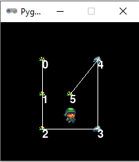

Lets visualize the list, try to delete from the middle, and see how the indexes change.


```
import pgzrun
import random

HEIGHT = 200
WIDTH = 200

player = Actor("c1")

things = []

def on_key_down(key):
    speed = 10

    if key == keys.UP:
        player.y -= speed
    if key == keys.DOWN:
        player.y += speed
    if key == keys.LEFT:
        player.x -= speed
    if key == keys.RIGHT:
        player.x += speed

    if key == keys.F:
        f = Actor("flower")
        f.x = player.x
        f.y = player.y
        things.append(f)
    if key == keys.R:
        f = Actor("rock")
        f.x = player.x
        f.y = player.y
        things.append(f)

    if key == keys.U:
         things.pop()

    if key == keys.D:
        collide = []
        for t in things:
            if player.colliderect(t):
                collide.append(t)

        for t in collide:
            things.remove(t)

def draw():
    screen.fill('black')
    player.draw()

    
    for i in range(len(things)):
        t = things[i]
        t.draw()
        screen.draw.text(str(i), color=(255,255,255), topleft=(t.x,t.y))
        if i > 0:
            p = things[i-1]
            screen.draw.line((p.x,p.y), (t.x,t.y), (255,255,255))
pgzrun.go()
```

spend more time thinking about connecting previous and current elements from a list, think about how to do it the other way around, from current element to next:

```
# change this to go from t to the next element of things, instead from t to previous
for i in range(len(things)):
    t = things[i]
    ...
    if i > 0:
        p = things[i-1]
        ...
```

## [DAY-85] List; Functions

This day is more about reading than writing, those are few different examples you can use

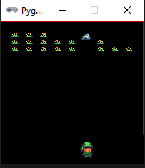


don't let the **zombie** flowers overrun you, smash them with rocks


```
import pgzrun
import random

HEIGHT = 200
WIDTH = 200

game_over = False

elf = Actor("c1")
elf.x = WIDTH/2
elf.y = HEIGHT-20
flowers = []
rocks = []

game_area = Rect((0, 0), (WIDTH, HEIGHT-40))

def add_one_row():
    lastY = 0
    if len(flowers) > 0:
        f = flowers[len(flowers)-1]
        lastY = f.y
    
    for i in range(20, WIDTH-10, 20):
        f = Actor("flower")
        f.x = i
        f.y = lastY + 10
        flowers.append(f)

def rock_out_of_screen():
    if len(rocks) > 0:
        rocks.pop(0)

def on_key_down(key):
    speed = 10
    if key == keys.LEFT:
        elf.x -= speed
    if key == keys.RIGHT:
        elf.x += speed
        
    if key == keys.SPACE:
        rock = Actor("rock")
        rock.x = elf.x
        rock.y = elf.y - 20
        animate(rock,pos=(rock.x, -100), on_finished=rock_out_of_screen)
        rocks.append(rock)

def update():
    global game_over
    hit = []
    for b in rocks:
        for f in flowers:
            if b.colliderect(f) and random.randint(0,10) > 7:
                hit.append(f)

    for h in hit:
        flowers.remove(h)

    for f in flowers:
        if not f.colliderect(game_area):
            game_over = True


def draw():
    if game_over:
        screen.draw.text("GAME OVER", color="white", topleft=(10,10))
    else:
        screen.fill('black')
        elf.draw()
        for f in flowers:
            f.draw()
        for r in rocks:
            r.draw()

        screen.draw.rect(game_area, (200, 0, 0))

add_one_row()
clock.schedule_interval(add_one_row, 5)

pgzrun.go()
```

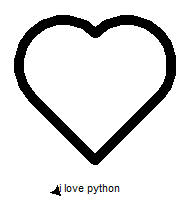

```
import turtle as t

size = 10

t.pensize(size)
t.left(45)
t.forward(90)
t.circle(45,extent=180)
t.right(90)
t.circle(45,extent=180)
t.forward(90)
t.penup()
t.goto(-35,-35)
t.pendown()
t.write('i love python')
t.penup()
```

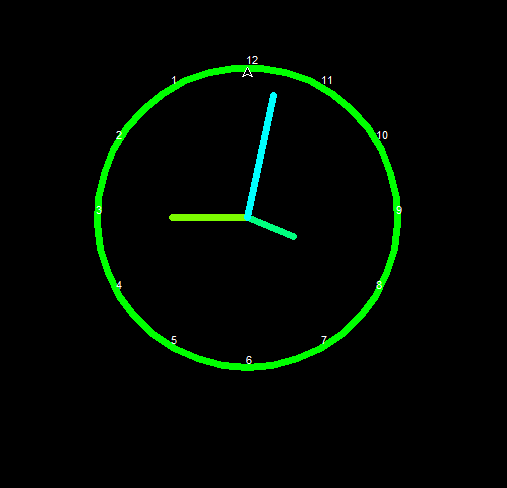


```
import  turtle as t
import datetime
import time
def deg(h,m,s):
	hDeg=(h*3600+m*60+s)/(3600*12)*360
	mDeg=(m*60+s)/3600*360
	sDeg=360/60*s
	
	return (90+hDeg,90+mDeg,90+sDeg)
	
	
def show(h, size):
	(hDeg,m,s) = deg(h,0,0)
	
	t.penup()
	t.goto(0, size)
	t.pencolor('white')
	t.setheading(hDeg)
	t.forward(size)
	t.write(str(h))
	
def klok(size, h, m, s):
	t.reset()
	(hDeg,mDeg,sDeg) = deg(h,m,s)
	
	t.pendown()
	t.pensize(7)
	t.bgcolor('black')
	t.pencolor('lime')
	
	t.circle(size)
	
	t.penup()
	t.goto(0, size)
	t.setheading(hDeg)
	t.pendown()
	t.pencolor('springgreen')
	t.forward(size/3)
	
	
	t.penup()
	t.goto(0, size)
	t.setheading(mDeg)
	t.pendown()
	t.pencolor('lawngreen')
	t.forward(size/2)
	t.penup()
	t.pencolor('cyan')
	t.goto(0, size)
	t.setheading(sDeg)
	t.pendown()
	t.forward(size-25)
	t.penup()
	
size = 150
while True:
	now = datetime.datetime.now()
	klok(size,now.hour, now.minute, now.second)

	for h in range(1, 13):
		show(h,size)
	time.sleep(10)
```

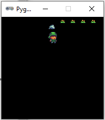

Just one rock that hits the zombies above you

```
import pgzrun
import random

HEIGHT = 200
WIDTH = 200

game_over = False

elf = Actor("c1")
elf.x = WIDTH/2
elf.y = HEIGHT-20
rock = Actor("rock")
rock.x = elf.x + 10
rock.y = elf.y - 20

flowers = []

def add_one_row():
    lastY = 0
    if len(flowers) > 0:
        f = flowers[len(flowers)-1]
        lastY = f.y
    
    for i in range(20, WIDTH-10, 20):
        f = Actor("flower")
        f.x = i
        f.y = lastY + 10
        flowers.append(f)

def on_key_down(key):
    speed = 10
    if key == keys.LEFT:
        elf.x -= speed
    if key == keys.RIGHT:
        elf.x += speed
    if key == keys.UP:
        elf.y -= speed
    if key == keys.DOWN:
        elf.y += speed
        

def update():
    global game_over
    hit = []
    for f in flowers:
        if rock.colliderect(f) and random.randint(0,10) > 7:
            hit.append(f)

    for h in hit:
        flowers.remove(h)

    rock.x -= 1
    if rock.x < elf.x - 10:
        rock.x = elf.x + 10

    rock.y = elf.y - 20


def draw():
    screen.fill('black')
    elf.draw()
    rock.draw()
    for f in flowers:
        f.draw()

add_one_row()
clock.schedule_interval(add_one_row, 5)

pgzrun.go()
```

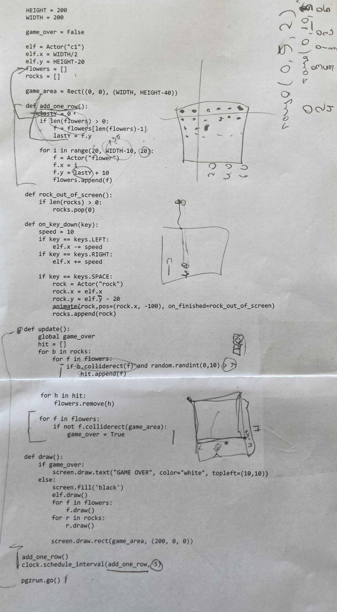


## [DAY-86] Lists


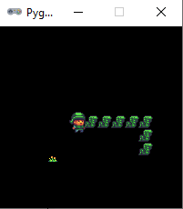

SNAKE

```
import pgzrun
import random

HEIGHT = 200
WIDTH = 200

snake = Actor("c1")
snake.x = WIDTH/2
snake.y = HEIGHT-20

apple = Actor("flower")
apple.x = WIDTH/2
apple.y = HEIGHT/2

snake_size = 20
snake_speed = 1
steps = []
direction = "up"
step_size = 1
game_over = False
game_area = Rect(0,0,WIDTH,HEIGHT)
def on_key_down(key):
    global direction

    if key == keys.LEFT:
        direction = "left"
    if key == keys.RIGHT:
        direction = "right"
    if key == keys.UP:
        direction = "up"
    if key == keys.DOWN:
        direction = "down"

def update():
    global snake_size, game_over, snake_speed, steps

    s = Actor("snake")
    s.x = snake.x
    s.y = snake.y
    steps.append(s)
    if len(steps) > snake_size:
        steps = steps[-snake_size:]

    if direction == "left":
        snake.x -= step_size
    if direction == "right":
        snake.x += step_size
    if direction == "up":
        snake.y -= step_size
    if direction == "down":
        snake.y += step_size
    
    if snake.colliderect(apple):
        apple.x = random.randint(0,WIDTH)
        apple.y = random.randint(0,HEIGHT)
        snake_size += step_size * 10

    if not snake.colliderect(game_area):
        game_over = True

def draw():
    screen.fill('black')

    if game_over:
        screen.draw.text("GAME OVER", color="white", topleft=(10,10))
    else:
        screen.draw.rect(game_area, (255,0,0))
        for s in steps:
            s.draw()
        snake.draw()
        apple.draw()

pgzrun.go()
```

There are few key moments to emphasize, but the most important one is `steps = steps[-snake_size:]`.

Try this in IDLE:

```
x = [1,2,3,4]
print(x[-1])
```

It will print '4', so in python you can get elements from the back of the list, just as easily as the front, try `x[-2]`, now try to get multiple elements from a list, `y = x[0:2]`, it will make new list `[1,2]`, it is a bit like this code:

```
x = [1,2,3,4]
y = []
for i in range(0,2):
    y.append(x[i])
```

Now you can also ask python to give you the first 2 elements by saying `x[0:2]` or you can ask it for the elements *after* the second one by doing `x[2:len(x)]`, you can omit 0 and `len(x)` so it is a bit shorter, `x[:2]` and `x[2:]`. Sometimes you want the last 2 elements, to do that just say `x[-2:len(x)]` or `x[-2:]` and that's how we are getting the last `snake_size` elements of the `steps` list.

Again, `x[-2:len(x)]` just means from -2 elements from the end if the list, until the end of the list. It looks scary though.

Similar to this code:

```
x = [1,2,3,4]
y = []
for i in range(len(x)-2,len(x)):
    y.append(x[i])
```

## [DAY-87] Read/Write Files

Its File time!

First lets make a new file, called day-87.txt and we will open it in "w" mode, which means "write", so once we do `f.write` it will start from the beginning of the file, we can use "a" (for append) mode as well that would continue appending to the end of the file

```
f = open("day-87.txt", "w")

while True:
    a = input("what do you want to write: ")
    if a == "quit":
        break
    f.write(a + "\n")

f.close()
```

Now you can open day-87.txt with Notepad or some other text editor and see what you wrote.

It is important to remember this pattern

1. Open
2. Read or Write
3. Read or Write
4. Read or Write
5. Read or Write
6. ...
7. Close

lets see how you read a file:

```
f = open("day-87.txt", "r")
data = f.read()
print(data)
```

Make a game that persists the player position.


```
import pgzrun
import random

HEIGHT = 200
WIDTH = 200

elf = Actor("c1")
elf.x = WIDTH/2
elf.y = HEIGHT-20

try:
    x = open("day-87-x.txt", "r")
    elf.x = float(x.read())
    x.close()
    
    y = open("day-87-y.txt", "r")
    elf.y = float(y.read())
    y.close()
except IOError:
    pass

def on_key_down(key):
    speed = 10
    if key == keys.LEFT:
        elf.x -= speed
    if key == keys.RIGHT:
        elf.x += speed
    if key == keys.UP:
        elf.y -= speed
    if key == keys.DOWN:
        elf.y += speed

    if key == keys.S:
        x = open("day-87-x.txt", "w")
        x.write(str(elf.x))
        x.close()

        y = open("day-87-y.txt", "w")
        y.write(str(elf.y))
        y.close()


def draw():
    screen.fill('black')
    elf.draw()

pgzrun.go()
```

open `day-87-x.txt` and `day-87-y.txt` to see the positions of X and Y of the elf after you press `S`.

One other patter you will see is:

```
try:
    try to do something
except some error:
    handle error
```

There are many many things that could go wrong when you write to or read a file, for example when you read the file might not be created, or you might have no access to read it, or when you write the disk might be full, and there is no more space.

In our example we don't check if our write fails, so if your disk is full the game will crash, but in the beginning we do check for IOError in case the reading fails, and it will if the files are not created yet the very first time you start the game and there is no save yet.


## [DAY-88] Flask

Reading exercise, a lot of unfamiliar code

```
from flask import Flask, redirect, request,make_response
import random
app = Flask(__name__)

tokens = {}

@app.route('/')
def index():
    token = request.cookies.get('token')
    if token in tokens:
        response = make_response("""
        welcome to the secure section of the website,
        <a href="/logout">click here to logout
        """)
        return response

    
    response = make_response("""
        <html>
        <form action="/login" method="post">
        user: <input name="user">
        pass: <input type="password" name="pass">
        <input type="submit">
        </form>
        </html>
        """)
    return response

@app.route('/logout')
def logout():
    token = request.cookies.get('token')
    try:
        del tokens[token]
    except KeyError:
        pass

    response = make_response(redirect('/'))
    response.set_cookie('token', '')
    return response

@app.route('/login', methods = ['POST'])
def login():
    user = request.form['user']
    password = request.form['pass']
    if user == "admin" and password == "123":
        token = str(random.randint(0,10000000))
        tokens[token] = "admin"

        response = make_response(redirect('/'))
        response.set_cookie('token', token)
        return response
    else:
        return "access denied"
    
if __name__ == "__main__":
    app.run(host="127.0.0.1",port=8000,debug=True)
```

start the script, see what it does, try to debug how `tokens` changes. Inspect your cookies, try to hack it, login from private mode and steal the cookie from the console.
## [DAY-89] Files; Strings; Lists

super simple text editor


Reading exercise, make a text editor, save with `ctrl+s` and quit with `ctrl+q`

```
import pgzrun
import random

HEIGHT = 480
WIDTH = 640
filename = "example.py"
lines = [[]]
cursor_row = 0
cursor_col = 0

try:
    x = open(filename, "r")
    for c in x.read():
        if c== '\n' or c == '\r':
            lines.append([])
            cursor_row += 1
            cursor_col = 0
        else:
            lines[cursor_row].append(c)
            cursor_col += 1

    x.close()
except IOError:
    pass

def lines_to_string():
    s = ''
    for r in lines:
        for c in r:
            s += c
        s += '\n'
    return s

def on_key_down(key, mod, unicode):
    global cursor_row, cursor_col

    if key == keys.Q and mod == keymods.LCTRL:
        exit()
    if key == keys.S and mod == keymods.LCTRL:
        x = open(filename, "w")
        s = lines_to_string()
        x.write(s)
        x.close()

    elif key == keys.LEFT:
        if cursor_col > 0:
            cursor_col -= 1
    elif key == keys.RIGHT:
        if cursor_col < len(lines[cursor_row]):
            cursor_col += 1
    elif key == keys.UP:
        if cursor_row > 0:
            cursor_row -= 1
            if cursor_col > len(lines[cursor_row]):
                cursor_col = len(lines[cursor_row])
    elif key == keys.DOWN:
        if cursor_row < len(lines) - 1:
            cursor_row += 1
            if cursor_col > len(lines[cursor_row]):
                cursor_col = len(lines[cursor_row])


    elif key == keys.BACKSPACE:
        if cursor_col == 0:
            if cursor_row >= 1:
                row = lines.pop(cursor_row)
                cursor_col = len(lines[cursor_row-1])
                for c in row:
                    lines[cursor_row-1].append(c)
                cursor_row -= 1
        else:
            row = lines[cursor_row]
            if len(row) > 0:
                cursor_col -= 1
                row.pop(cursor_col)


    elif key == keys.RETURN:
        # get the rest of the lines
        left = []
        right = []
        if cursor_col < len(lines[cursor_row]):
            # split the line if we are pressing enter in the middle
            row = lines[cursor_row]

            left = row[:cursor_col]
            right = row[cursor_col:]

            if cursor_row < len(lines):
                lines[cursor_row] = left

        cursor_col = 0
        cursor_row += 1
        lines.insert(cursor_row, right)

    elif len(unicode) > 0 and ord(unicode) >= 20 and ord(unicode) <= 125:
        lines[cursor_row].insert(cursor_col, unicode)
        cursor_col += 1

def draw():
    screen.fill('black')
    screen.draw.text(filename + ", " + str(cursor_row) + ":" + str(cursor_col), (0,0), fontsize=20,fontname="437-win", color="green")

    x = 0
    y = 30
    stepX = 10
    stepY = 22

    for (index_row, row) in enumerate(lines):
        for (index_col, c) in enumerate(row):
            screen.draw.text(c, (x,y), fontsize=20,fontname="437-win")
            x += stepX
        y += stepY
        x = 0

    cursorX = cursor_col * stepX
    cursorY = 30 + (cursor_row * stepY)

    screen.draw.rect(Rect((cursorX,cursorY,stepX,stepY)), (255,0,0))

pgzrun.go()
```

write some python, and then run it with `python3 example.py`


## [DAY-90] Strings

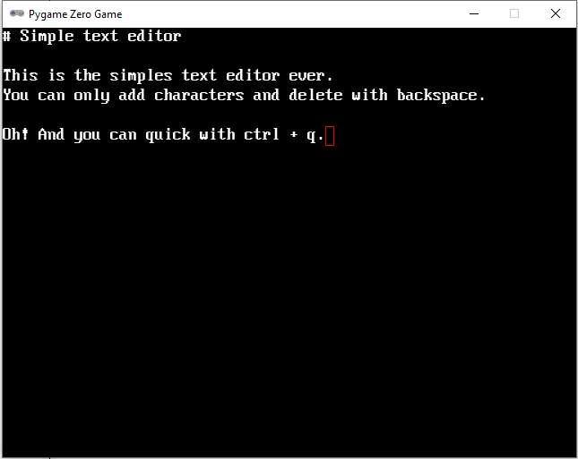

Write a super simple text editor. Start by thinking about the problem. How can you display a character on the screen? How can you get the input from the user? How are you going to deal with new lines?

```
import pgzrun

HEIGHT = 480
WIDTH = 640

text = ''

def on_key_down(key, mod, unicode):
    global text

    if key == keys.Q and mod == keymods.LCTRL:
        exit()


    elif key == keys.BACKSPACE:
        if len(text) > 0:
            text = text[:len(text)-1]

    elif key == keys.RETURN:
        text += '\n'

    elif len(unicode) > 0 and ord(unicode) >= 20 and ord(unicode) <= 125:
        text += unicode

def draw():
    screen.fill('black')
    x = 0
    y = 0
    stepX = 10
    stepY = 22

    for c in text:
        if c == '\n':
            y += stepY
            x = 0
        else:
            screen.draw.text(c, (x,y), fontsize=20,fontname="437-win")
            x += stepX

    screen.draw.rect(Rect((x,y,stepX,stepY)), (255,0,0))

pgzrun.go()
```

This is kind of what `screen.draw.text` does, you can of course just do `screen.draw.text(text, (0,0), fontsize=20,fontname="437-win")` and it will work fine, instead of displaying character by character and computing our own char spacing, but what is the fun in that? Also this way we are one step closer to be able to move the cursor left and right so we can edit in the middle of the text.

## [DAY-91] Lists

list your favorite games, and rank them

```
games = [
    ["mario smash bros", 3],
    ["mario party", 4],
    ["super mario", 2]
]

while True:
    for game in games:
        print(game[0])
    what = input("which game are you interested in: ")
    for game in games:
        if what in game[0]:
            print("i like " + game[0] + ", score: " + str(game[1]))
```

print the lyrics of songs:

```
songs = [
    ["wellerman", """There once was a ship that put to sea
The name of the ship was the Billy of Tea
The winds blew up, her bow dipped down
Oh blow, my bully boys, blow (huh)

Soon may the Wellerman come
To bring us sugar and tea and rum
One day, when the tonguing is done
We'll take our leave and go"""],
]

while True:
    what = input("which song are you interested in: ")
    for song in songs:
        if what in song[0]:
            print('-' * 40)
            print(song[1])
            print('-' * 40)
```
## [DAY-92] Command Line; Command Line Arguments; Files

Today is command line day.

> First quickly go back to the start and read about files and folders (directories).

The same way functions can get parameters, your program can get parameters as well, try this:

```
import sys
print(sys.argv)
```

save it as `a.py` and then run `python3 a.py hello those are paremeters` from the Terminal app, you will see `['a.py', 'hello', 'those', 'are', 'paremeters']`, sys.argv[0] is the name of the program, and then the parameters you gave it.

Now lets make few handy programs to help us with our command line:

---

xcat.py

```
import sys

x = open(sys.argv[1], "r")
data = x.read()
print(data)
```

---

xls.py
```
import os
import sys

files = os.listdir(sys.argv[1])
files.sort()

for f in files:
    if os.path.isdir(f):
        print(f + "/")
    else:
        print(f)
```

---

xed.py

```
import sys
import os

text = ''

filename = sys.argv[1]

try:
    f = open(filename, "r")
    text = f.read()
    f.close()
except IOError:
    pass

while True:
    what = input("> ")
    if what == '?':
        print("""
        * ? - help
        * p - print
        * s - save
        * d [n] - delete last N lines
        * a text - append text to the end
        """)
    elif what == 'q':
        sys.exit(0)
    elif what == 'p':
        print(text, end = '')
    elif what == 's':
        f = open(filename, "w")
        f.write(text)
        f.close()
    elif what[0] == 'a' and what[1] == ' ':
        text += what[2:] + '\n'
    elif what[0] == 'd':
        lines = text.split('\n')

        n = 1
        if len(what) > 2:
            n = int(what[2:])

        for i in range(0, n):
            lines.pop()

        text = "\n".join(lines)


    else:
        print("* use ? for help")
```

---

OK now we have a text editor, a program to list files, and a program to print the file's content, now we can use our programs to write more programs :)

try this:

```
$ python3 xed,py example.py
> a for i in range(100)
> a   print(i)
> p
> s

$ python3 xls.py .
$ python3 xcat.py example.py
$ python3 example.py
```

## [DAY-93] PyDoc

Reading docs. type this in the terminal: `pydoc3 open` `pydoc3 input` `pydoc3 print` and `pydoc3 pgzero.actor`.

Lets take `open` as an example.

```
Help on built-in function open in module io:

open(file, mode='r', buffering=-1, encoding=None, errors=None, newline=None, closefd=True, opener=None)
    Open file and return a stream.  Raise OSError upon failure.

    file is either a text or byte string giving the name (and the path
    if the file isn't in the current working directory) of the file to
    be opened or an integer file descriptor of the file to be
    wrapped. (If a file descriptor is given, it is closed when the
    returned I/O object is closed, unless closefd is set to False.)

    mode is an optional string that specifies the mode in which the file
    is opened. It defaults to 'r' which means open for reading in text
    mode.  Other common values are 'w' for writing (truncating the file if
    it already exists), 'x' for creating and writing to a new file, and
    'a' for appending (which on some Unix systems, means that all writes
    append to the end of the file regardless of the current seek position).
    In text mode, if encoding is not specified the encoding used is platform
    dependent: locale.getpreferredencoding(False) is called to get the
    current locale encoding. (For reading and writing raw bytes use binary
    mode and leave encoding unspecified.) The available modes are:

    ========= ===============================================================
    Character Meaning
    --------- ---------------------------------------------------------------
    'r'       open for reading (default)
    'w'       open for writing, truncating the file first
    'x'       create a new file and open it for writing
    'a'       open for writing, appending to the end of the file if it exists
    'b'       binary mode
    't'       text mode (default)
    '+'       open a disk file for updating (reading and writing)
    'U'       universal newline mode (deprecated)
    ========= ===============================================================

    The default mode is 'rt' (open for reading text). For binary random
    access, the mode 'w+b' opens and truncates the file to 0 bytes, while
    'r+b' opens the file without truncation. The 'x' mode implies 'w' and
    raises an `FileExistsError` if the file already exists.

    Python distinguishes between files opened in binary and text modes,
    even when the underlying operating system doesn't. Files opened in
    binary mode (appending 'b' to the mode argument) return contents as
    bytes objects without any decoding. In text mode (the default, or when
    't' is appended to the mode argument), the contents of the file are
    returned as strings, the bytes having been first decoded using a
    platform-dependent encoding or using the specified encoding if given.

    'U' mode is deprecated and will raise an exception in future versions
    of Python.  It has no effect in Python 3.  Use newline to control
    universal newlines mode.

    buffering is an optional integer used to set the buffering policy.
    Pass 0 to switch buffering off (only allowed in binary mode), 1 to select
    line buffering (only usable in text mode), and an integer > 1 to indicate
    the size of a fixed-size chunk buffer.  When no buffering argument is
    given, the default buffering policy works as follows:

    * Binary files are buffered in fixed-size chunks; the size of the buffer
      is chosen using a heuristic trying to determine the underlying device's
      "block size" and falling back on `io.DEFAULT_BUFFER_SIZE`.
      On many systems, the buffer will typically be 4096 or 8192 bytes long.

    * "Interactive" text files (files for which isatty() returns True)
      use line buffering.  Other text files use the policy described above
      for binary files.

    encoding is the name of the encoding used to decode or encode the
    file. This should only be used in text mode. The default encoding is
    platform dependent, but any encoding supported by Python can be
    passed.  See the codecs module for the list of supported encodings.

    errors is an optional string that specifies how encoding errors are to
    be handled---this argument should not be used in binary mode. Pass
    'strict' to raise a ValueError exception if there is an encoding error
    (the default of None has the same effect), or pass 'ignore' to ignore
    errors. (Note that ignoring encoding errors can lead to data loss.)
    See the documentation for codecs.register or run 'help(codecs.Codec)'
    for a list of the permitted encoding error strings.

    newline controls how universal newlines works (it only applies to text
    mode). It can be None, '', '\n', '\r', and '\r\n'.  It works as
    follows:

    * On input, if newline is None, universal newlines mode is
      enabled. Lines in the input can end in '\n', '\r', or '\r\n', and
      these are translated into '\n' before being returned to the
      caller. If it is '', universal newline mode is enabled, but line
      endings are returned to the caller untranslated. If it has any of
      the other legal values, input lines are only terminated by the given
      string, and the line ending is returned to the caller untranslated.

    * On output, if newline is None, any '\n' characters written are
      translated to the system default line separator, os.linesep. If
      newline is '' or '\n', no translation takes place. If newline is any
      of the other legal values, any '\n' characters written are translated
      to the given string.

    If closefd is False, the underlying file descriptor will be kept open
    when the file is closed. This does not work when a file name is given
    and must be True in that case.

    A custom opener can be used by passing a callable as *opener*. The
    underlying file descriptor for the file object is then obtained by
    calling *opener* with (*file*, *flags*). *opener* must return an open
    file descriptor (passing os.open as *opener* results in functionality
    similar to passing None).

    open() returns a file object whose type depends on the mode, and
    through which the standard file operations such as reading and writing
    are performed. When open() is used to open a file in a text mode ('w',
    'r', 'wt', 'rt', etc.), it returns a TextIOWrapper. When used to open
    a file in a binary mode, the returned class varies: in read binary
    mode, it returns a BufferedReader; in write binary and append binary
    modes, it returns a BufferedWriter, and in read/write mode, it returns
    a BufferedRandom.

    It is also possible to use a string or bytearray as a file for both
    reading and writing. For strings StringIO can be used like a file
    opened in a text mode, and for bytes a BytesIO can be used like a file
    opened in a binary mode.
```

It's a lot! But I guarantee you its the best way to learn about something, the people who wrote the `open` function, wrote text to help anyone who is going to use it, describging what it does and how it behaves. It is always worth reading the docs of functions you are going to use. Sometimes they are not very good, but it is worth checking it out.

The other way find things is to google `python3 open` and you will usually see stackoverflow answers and maybe some examples, in many cases they will be incomplete or wrong, or pure scam 'pay 10$ to buy our video to learn how to use python3 open'


You can also do pydoc3 on modules, e.g. `pydoc3 sys` or `pydoc3 sys.argv`. Sometimes it might look a bit intimidating, but its usually much better than using google.

Try also `pydoc3 pgzero`, `pydoc3 pygame` and `pydoc3 pygame.Rect`. There is also a way to find documentation for the command line programs, try `man python3`, `man` from `manual`, if you want to search for something use `man -k something` for example `man -k python`.

## [DAY-94] Editors - Ed/Nano/Vi/Emacs..

Command line editors:

* nano, pico

super easy to use, press ctrl+x to exit, ctrl+k to cut text, and ctrl+u to uncut (paste)

* vi

Type `vimtutor` to see how it works, to quit use `ESC` then type `:` and then `q!`

* emacs

emacs is my favorite editor, in in fact I am writing this book using it. type `ctrl+x ctrl+c` to quit, and `ctrl+x ctrl+s` to save.

* ed

ed is super old editor, it is somewhat similar to xed.py that you wrote, its called 'line editor'. To quit use `q` or `Q` if you want to quit without saving, to print the contents of the file use `1,$n` which prints the lines from 1 to $, or you can print specific line with `1n` or `2n` where 1 or 2 is the linue number.

try this:

```
$ ed zzz
a
for i in range(10);
  print(i)
.
w
31
1,$n
1	for i in range(10);
2	  print(i)
q
```

`a` will append to the file, `w` will save the file, `1,$n` will print the contents, and `q` will quit. Commands like `a,i,d` (append,insert,delete) take line numbers as parameters as well. Use `man ed` to see the docs.

I don't think anyone uses `ed` anymore, at least not as a text editor, but sometimes its handy to know how to use it.

---

There are many many text editors, and some are better for you than others, but to me I dont really care, I want to type in my program and save it.. its not the end of the world if I use one or another editor.

So use the one you like most, but sometimes you will go on another computer and they wont have your editor there, so be be sure to be 'ok' with vim, nano or emacs, because they are on virtually any system.

## [DAY-95] Memory; Virtual Computer; Instructions; Strings; Lists


Memory.


Lets make a huuuuuge list.

```
memory = []
for i in range(1000000):
    memory.append(0)

```

Our memory looks like this:

```
[0,0,0,..............0,0,0,0....0,0,0,0,0]
```

Now we can make variables in this list of numbers, by addressing each variable with its index in the list, for exampke `x` can be at index 1000 and `y` can be at position 1001.


```
def add(a_address,b_address):
    return memory[a_address] + memory[b_address]

x_address = 1000
y_address = 1001
memory[x_address] = 5
memory[y_address] = 10

r = add(x_address,y_address)

print(r)
```

This is cheating though, because python uses its own memory to store the result from x and y, lets fix that:

```
def add(a_address,b_address,r_address):
    memory[r_address] = memory[a_address] + memory[b_address]

x_address = 1000
memory[x_address] = 5

y_address = 1001
memory[y_address] = 10

r_address = 1002
add(x_address,y_address,r_address)

print(memory[r_address])
```

This is how our memory looks like
```
[....0,0,0,5,10,15,0,...]
           ^ ^  ^
           | |  |
           x |  |
             y  |
                r

x at index 1000
y at index 1001
r at index 1002
```

The code above translates roughly to:

```
x = 5
y = 10
r = x + y
print(r)
```

How about strings? We can store strings by just defining how big the string is, and then follow with the characters of the string. You see how it is continous piece of memory.
```

h_address = 2000
memory[h_address] = 5
memory[h_address+1] = ord('h')
memory[h_address+2] = ord('e')
memory[h_address+3] = ord('l')
memory[h_address+4] = ord('l')
memory[h_address+5] = ord('o')

def xprint(address):
    l = memory[address]
    for i in range(l):
        # +1 is because of the length
        c = memory[address + 1 + i]
        print(chr(c), end = '')
    print('')
```


Strings with without length. We can also just say 'the string ends with 0' so start reading and stop when you see 0.

```

n_address = 3000
memory[n_address+0] = ord('h')
memory[n_address+1] = ord('e')
memory[n_address+2] = ord('l')
memory[n_address+3] = ord('l')
memory[n_address+4] = ord('o')

def nprint(address):
    for addr in range(address, len(memory)):
        c = memory[addr]
        if c == 0:
            break
        print(chr(c), end = '')
    print('')

nprint(n_address)

```

Now lets add a funciton to add two strings:

```


a_address = 4000
memory[a_address] = 5
memory[a_address+1] = ord('h')
memory[a_address+2] = ord('e')
memory[a_address+3] = ord('l')
memory[a_address+4] = ord('l')
memory[a_address+5] = ord('o')

b_address = 4006
memory[b_address] = 5
memory[b_address+1] = ord('w')
memory[b_address+2] = ord('o')
memory[b_address+3] = ord('r')
memory[b_address+4] = ord('l')
memory[b_address+5] = ord('d')

c_address = 7000

def xadd(a,b,dst):
    len_a = memory[a]
    len_b = memory[b]
    memory[dst] = len_a + len_b
    for i in range(len_a):
        c = memory[a + 1 + i]
        memory[dst + 1 + i] = c

    for i in range(len_b):
        c = memory[b + 1 +i]
        memory[dst + 1 + len_a + i] = c

xadd(a_address, b_address, c_address)
xprint(c_address)
```

You see, the list is just a list with 1 million numbers, but we decide what those numbers mean, if we are reading a string, we *know* that the first number represents the length of the string, so its just an integer, but we know that the other numbers are actually characters.

```
i_address = 3996
memory[i_address] = 9999

[....9999,0,0,0,5,104,101,108,108,111,5,119,111,114,108,100....]
     ^          ^                     ^
     i          this is a             this is b
  idx: 3996     idx: 4000             idx: 4006

```

The memory doesnt care, string integers, characters,, its all the same. It doesn't know where one array ends or begins. You just read and write to specific address and thats all it cares about. *WHERE* to read and write.

Think about what it means to remove a character from our string, if its the last character we can sinply reduce the lengthm but lets say we want to remove 'o' from 'world', that would mean something like:

```
world

* reduce the length to 4
* move r to the left
* move l to the left
* move d to the left

```

You see we had to do 4 things to remove 1 character, and imagine if the string is 10000 chars long and we want to remove the first one, we wikl have to do 999 things, moving each character to the left.


In the same time, it is super easy to go to specific character, if I want to print the 3rd char, I can just do memory[address + 1 + 3] and thats it, add 1 because of the length and then add however many characters i want to skip.

There are different way to store collections of things, Linked Lists are one example

```

[0, value]            # w
 |
[next_address, value] # o
 |
[next_address, value] # r
 |
[next_address, value] # l
 |
[0, value ]           # d
```

Arrays and Lists are very differentm arrays are *always* continous, like strings, actually string is just an array of characters. Lists however can be on scattered amongst the memory, and each element can point to the next one.

So with a linked list it is hard to get to position 3 for example, because we have to start from the top, and go down until we see 3 elements, so we have to do 3 things to get to position 3, or 1000 things to get to position 1000. In the same time if we want to remove something, we can simply make it disappear, by making the previous element point to the next one, e.g. make `o` point to `l`, and then `r` will disappear.


Our format will be (next element from the list, value)

```
memory[20000] = 30000
memory[20001] = 1

memory[30000] = 30500
memory[30001] = 2

memory[30500] = 30605
memory[30501] = 3

memory[30605] = 0
memory[30606] = 4
```

the memory now looks like this:

```
[ ....30000, 1, .... 30500, 2, .... 30605, 3, .... 0, 4, ...]
      ^              ^              ^              ^
      first          second         third          forth element
```


This is an example function that will print all the values in a linked list, following the links.

```
def lprint(start_address):
    done = False
    while not done:
        # check if this is the last element of the list
        done = memory[start_address] == 0

        # print the value at address + 1
        print(memory[start_address+1])

        # go to the next element from the list
        start_address = memory[start_address]

lprint(20000)
```

You see, having a flat area of memory is so powerfull! it doesnt know anything about what we store in it, so of course we can store pointers to other parts of the memory, we can have lists of lists of lists of lists that just point around, and of course we can have infinite loops, imagine a linked list where one of the elements points to a previous elemnent.

Check this out:
```
memory[20000] = 30000
memory[20001] = 1

memory[30000] = 20000
memory[30001] = 2

lprint(20000)
```

Inifinite loop! How cool is that!

```
1
2
1
2
1
2
1
2
1
2
1
2
1
2
1
2
```


Lets make a computer, it needs Memory and CPU, the CPU will read instructions from memory and produce results back in memory.

```
memory = []
for i in range(1000000):
    memory.append(0)


memory[1000] = 5  # a
memory[1001] = 10 # b
memory[1002] = 0  # result

# lets multiply a * b
# the code looks like this
# counter = b
# while counter > 0:
#     r = r + a
#     counter -= 1
# print(r)

# counter = b
memory[1003] = memory[1001]

# jump to position 10 if counter is 0
memory[0] = 4
memory[1] = 1003
memory[2] = 13

# r = r + a
memory[3] = 1
memory[4] = 1002
memory[5] = 1000
memory[6] = 1002


# since our add operation adds two things in memory, we
# need to store the value -1 somewhere to subtract it from the counter
#
# counter -= 1
memory[9999] = -1
memory[7] = 1
memory[8] = 1003
memory[9] = 9999
memory[10] = 1003

# go back to the if counter == 0 instruction
memory[11] = 5
memory[12] = 0

# print(r)
memory[13] = 3
memory[14] = 1002

# stop the program
memory[15] = 0

position = 0
while True:
    instruction = memory[position]
    print('instruction',instruction, 'position',position)
    # quit if instruction is 0
    if instruction == 0:
        break

    # add position+1 and position+2 and write result in position+3
    elif instruction == 1:
        a_address = memory[position+1]
        b_address = memory[position+2]

        r_address = memory[position+3]

        memory[r_address] = memory[a_address] + memory[b_address]
        position += 4

    # print position + 1
    elif instruction == 3:
        address = memory[position+1]
        print(memory[address])
        position+=2

    # if memory[position+1] is 0 jump to positon+2, else continue to position+3
    elif instruction == 4:
        address = memory[position+1]
        if memory[address] == 0:
            position = memory[position+2]
        else:
            position += 3

    # jump to value of position+1
    elif instruction == 5:
        position = memory[position+1]
```


start the computer and see the result!

```
('instruction', 4, 'position', 0)
('instruction', 1, 'position', 3)
('instruction', 1, 'position', 7)
('instruction', 5, 'position', 11)
('instruction', 4, 'position', 0)
('instruction', 1, 'position', 3)
('instruction', 1, 'position', 7)
('instruction', 5, 'position', 11)
('instruction', 4, 'position', 0)
('instruction', 1, 'position', 3)
('instruction', 1, 'position', 7)
('instruction', 5, 'position', 11)
('instruction', 4, 'position', 0)
('instruction', 1, 'position', 3)
('instruction', 1, 'position', 7)
('instruction', 5, 'position', 11)
('instruction', 4, 'position', 0)
('instruction', 1, 'position', 3)
('instruction', 1, 'position', 7)
('instruction', 5, 'position', 11)
('instruction', 4, 'position', 0)
('instruction', 1, 'position', 3)
('instruction', 1, 'position', 7)
('instruction', 5, 'position', 11)
('instruction', 4, 'position', 0)
('instruction', 1, 'position', 3)
('instruction', 1, 'position', 7)
('instruction', 5, 'position', 11)
('instruction', 4, 'position', 0)
('instruction', 1, 'position', 3)
('instruction', 1, 'position', 7)
('instruction', 5, 'position', 11)
('instruction', 4, 'position', 0)
('instruction', 1, 'position', 3)
('instruction', 1, 'position', 7)
('instruction', 5, 'position', 11)
('instruction', 4, 'position', 0)
('instruction', 1, 'position', 3)
('instruction', 1, 'position', 7)
('instruction', 5, 'position', 11)
('instruction', 4, 'position', 0)
('instruction', 3, 'position', 13)
50
('instruction', 0, 'position', 15)
```

Now lets get into variables from first principles, they are nothing but handy pointers to memory, that you can name yourself, and then you can access this memory by the name you chose.

This is the same program, but we are gonna use A, B, R, COUNTER and MINUS_1 as names for the specific addressess, and you can immidiately see how much cleaner the program looks. We will also name our instructions ADD, JUMP_IF_ZERO (or JZ), PRINT and HALT

```
...

# instructions
HALT = 0
ADD = 1
PRINT = 3
JUMP_IF_ZERO = 4
JUMP = 5


# variabnles
A = 1000
B = 1001
R = 1002
MINUS_1 = 9999
COUNTER = 1003


# program
memory[A] = 5  # A = 5
memory[B] = 10 # B = 5
memory[R] = 0  # R = 0
memory[COUNTER] = memory[B]  # COUNTER = B

# jump to position 10 if counter is 0
memory[0] = JUMP_IF_ZERO
memory[1] = COUNTER
memory[2] = 13

# r = r + a
memory[3] = ADD
memory[4] = R
memory[5] = A
memory[6] = R


# counter -= 1
memory[MINUS_1] = -1
# counter = counter + minus_1
memory[7] = ADD
memory[8] = COUNTER
memory[9] = MINUS_1
memory[10] = COUNTER

# go back to the if counter == 0 instruction
memory[11] = JUMP
memory[12] = 0

# print(r)
memory[13] = PRINT
memory[14] = R

# stop the program
memory[15] = HALT
...

```

The whole program is actually quite small:

```
[4, 1003, 13, 1, 1000, 1002, 1002, 1, 1003, 9999, 1003, 5, 0, 3, 1002, 0]
 ^                                                      ^
 jump to 13 if memory[1003] is zero                     jump to 0
```

## [DAY-95] Memory; Machine Code; Virtual Computer

It will be super nice if our multiply program can be used from multiple places from a bigger program:

```
...
r = multiply(5, 10)
print(r)
...
```

We can kind of do that, by just using jump, and carefully writing the multiply function in such a way, that when it is done, to jump back to where we called it. We also have to give it some values to work with, in our case 5 and 10.

We will use a simple list to append the values and the return address, and then pop them out in the right order to use them. Our multiply function has to know how many values to read and it must know which one of them is the return address. `[5, 10, ZZZ]` imagine ZZZ is the address where we should return after we have computed the result. And then the function will just do POP, POP, POP and know, first POP will be ZZZ, second pop will be one parameter, third pop will be another parameter. Do what it does with the parameters, and then append its result into the stack, then the caller must know to POP it.

It is called a stack because it is like a stack of things on top of each other (cards for example), you can append(push) one to the top, or remove one from the top (pop). When we pop() we will remove the last thing we push()ed.

If I push 1,2,3 then if i pop 3 times I will print 3 2 1

```
stack = [1,2,3]

print(stack.pop())
print(stack.pop())
print(stack.pop())
```

Here is our updated program, and computer:

```
memory = []
for i in range(1000000):
    memory.append(0)

HALT         = 0
ADD          = 1
PRINT        = 3
JUMP_IF_ZERO = 4
JUMP         = 5
PUSH         = 8
POP          = 9
SET          = 10

JUMPV        = 11 # same as jump, but jumps to the
                  # value of the address instead of the address itself
                  # so jumpv 9, will jump to the value of memory[9]

PUSHV        = 12 # same as jumpv but for push


# just used for debug
instruction_lookup = dict([
    (HALT         , 'HALT'),
    (ADD          , 'ADD'),
    (PRINT        , 'PRINT'),
    (JUMP_IF_ZERO , 'JUMP_IF_ZERO'),
    (JUMP         , 'JUMP'),
    (PUSH         , 'PUSH'),
    (POP          , 'POP'),
    (SET          , 'SET'),
    (PUSHV        , 'PUSHV'),
    (JUMPV        , 'JUMPV')
])

                  # pushv 9, will push memory[9] instead of 9
# constants addressess
# there is no such thing as constants though, we just think of them as such
MINUS_1 = 9999

# set "global" variable MINUS_1 to -1
memory[MINUS_1] = -1 # minus_1 = -1

# MAIN FUNCTION

# main function has only one variable, the MULTIPLY_RESULT
MULTIPLY_RESULT = 1000

# MULTIPLY_RESULT = multiply (5, 10)
memory[0] = PUSH            # |  |
memory[1] = 5               # ^  |
memory[2] = PUSH            #    |
memory[3] = 10              # >--+
memory[4] = PUSH            # >-------------+
memory[5] = 8               #               | after the function is called
memory[6] = JUMP            #               | jump to get the value
memory[7] = 198             #               | from the stack
memory[8] = POP             # <-------------+
memory[9] = MULTIPLY_RESULT #
memory[10] = PRINT
memory[11] = MULTIPLY_RESULT


####### MULTIPLY FUNCTION ######
# get the value of A
A = 9000
B = 9001
COUNTER = 9003
R = 9004
BACK_TO_ADDRESS = 9005

# get the value for where to return to
memory[198] = POP
memory[199] = BACK_TO_ADDRESS

# get the value for A
memory[200] = POP
memory[201] = A

# get the value for B
memory[202] = POP
memory[203] = B

# COUNTER = B (which is counter = 0 ; counter = counter + b)
# COUNTER = 0
memory[204] = SET
memory[205] = COUNTER
memory[206] = 0

# COUNTER = COUNTER + B
memory[207] = ADD
memory[208] = COUNTER
memory[209] = B
memory[210] = COUNTER

# the actual loop
memory[211] = JUMP_IF_ZERO
memory[212] = COUNTER
memory[213] = 224

# r = r + a
memory[214] = ADD
memory[215] = A
memory[216] = R
memory[217] = R

# since our add operation adds two things in memory, we
# need to store the value -1 somewhere to subtract it from the counter
#
# counter -= 1
memory[218] = ADD
memory[219] = COUNTER
memory[220] = MINUS_1
memory[221] = COUNTER

# go back to the if counter == 0 instruction
memory[222] = JUMP
memory[223] = 211

# return(r)
memory[224] = PUSHV
memory[225] = R

memory[226] = JUMPV
memory[227] = BACK_TO_ADDRESS

# start the computer from position 80, we will use positions up-to 80 for our function call stack
position = 0
stack = []
while True:
    instruction = memory[position]

    print(instruction_lookup[instruction], 'position',position, 'stack', stack)

    # quit if instruction is 0
    if instruction == HALT:
        break

    # add position+1 and position+2 and write result in position+3
    elif instruction == ADD:
        a_address = memory[position+1]
        b_address = memory[position+2]

        r_address = memory[position+3]

        memory[r_address] = memory[a_address] + memory[b_address]
        position += 4

    # print position + 1
    elif instruction == PRINT:
        address = memory[position+1]
        print(memory[address])
        position+=2

    # if memory[position+1] is 0 jump to positon+2, else continue to position+3
    elif instruction == JUMP_IF_ZERO:
        address = memory[position+1]
        if memory[address] == 0:
            position = memory[position+2]
        else:
            position += 3

    # jump to value of position+1
    elif instruction == JUMP:
        position = memory[position+1]

    elif instruction == JUMPV:
        position = memory[memory[position+1]]

    elif instruction == PUSH:
        stack.append(memory[position+1])
        position += 2

    elif instruction == PUSHV:
        stack.append(memory[memory[position+1]])
        position += 2

    elif instruction == POP:
        memory[memory[position+1]] = stack.pop()
        position += 2

    elif instruction == SET:
        memory[position+1] = memory[position+2]
        position += 3
```

We cheated a bit by using python's lists instead of our own list to do the stack. We could reserve some memory (e.g. 100000 to 200000) and just push and pop the values there, memory[100000] will just say how many elements we have in the stack, and PUSH will do `memory[[memory[100000]] = value, memory[100000] += 1`, and pop will do `memory[100000] -= 1` and use `memory[memory[100000]]` as value.

You see how powerfull are continous pieces of memory? Arrays and Lists are how computers are built!

Look. In reallity more things happen, and actually normal machine code is easier than this, you can store values in temporary places called registers, and access them really fast and nobody actually writes code like that, we use languages such as Assembler to help us, and using assemblers we built other languages, such as C, and with C we built others, such as python, and then with python we build whole systems, like instagram or dropbox. You can of course build instagram with machine code if you want, it will just take incredible amount of time, and will be gazillion times more buggy. C is good at some things that python is not, and the other way around.

The one thing you have to remember, is whatever language you are using, whatever program you are looking at, it must have some memory, and some way of modifying that memory, and execute instructions over it.

There is no magic, it is all built on this. Built with few numbers in a block of memory.


Lets examine the output of the program, you see how the stack is empty, then we add 5, 10, and then 8 which will be used from the function to go back to us.

```
PUSH position 0 stack-before [] stack-after [5]
PUSH position 2 stack-before [5] stack-after [5, 10]
PUSH position 4 stack-before [5, 10] stack-after [5, 10, 8]
JUMP position 6 stack-before [5, 10, 8] stack-after [5, 10, 8]
POP position 198 stack-before [5, 10, 8] stack-after [5, 10]
POP position 200 stack-before [5, 10] stack-after [5]
POP position 202 stack-before [5] stack-after []
SET position 204 stack-before [] stack-after []
ADD position 207 stack-before [] stack-after []
JUMP_IF_ZERO position 211 stack-before [] stack-after []
ADD position 214 stack-before [] stack-after []
ADD position 218 stack-before [] stack-after []
JUMP position 222 stack-before [] stack-after []
JUMP_IF_ZERO position 211 stack-before [] stack-after []
ADD position 214 stack-before [] stack-after []
ADD position 218 stack-before [] stack-after []
JUMP position 222 stack-before [] stack-after []
JUMP_IF_ZERO position 211 stack-before [] stack-after []
ADD position 214 stack-before [] stack-after []
ADD position 218 stack-before [] stack-after []
JUMP position 222 stack-before [] stack-after []
JUMP_IF_ZERO position 211 stack-before [] stack-after []
ADD position 214 stack-before [] stack-after []
ADD position 218 stack-before [] stack-after []
JUMP position 222 stack-before [] stack-after []
JUMP_IF_ZERO position 211 stack-before [] stack-after []
ADD position 214 stack-before [] stack-after []
ADD position 218 stack-before [] stack-after []
JUMP position 222 stack-before [] stack-after []
JUMP_IF_ZERO position 211 stack-before [] stack-after []
PUSHV position 224 stack-before [] stack-after [50]
JUMPV position 226 stack-before [50] stack-after [50]
POP position 8 stack-before [50] stack-after []
PRINT position 10 stack-before [] stack-after []
50
HALT position 12 stack-before []
```


We could do it the other way, first push the address to go back to, and then the values, which will be the same, we just have to decide, this is called a 'calling convention', convention is just the usuall way to do things. So each program on your computer obeys the calling convention, otherwise a chaos will arrive, imagine multiplying the return address by first paremeter and then returning to some random position in memory.

By now you can see how fragile this is, if one mistake is made, you can corrupt rest of the program, we can easilly write something into where the next instruciton is read, and make the computer halt, or go into infinite loop.

Sometimes we can find bugs in a program that we can exploit, if we can simply control the corruption, we can make it jump to somewhere where we have our own code, and then we can control what the program does.

## [DAY-96] Binary; ASCII; Memory

Lets spend a day on bits and bytes.

One bit is the minimum amount of information you can hold, it is either 1 or 0, on or off. If we have a variable that has to store the heads or tails value of a coin, we can store it in 1 bit, lets say 1 is heads, 0 is tails. To store the values of two coins we can use 2 bits.

```
0 # tails
1 # heads
```
2 possible

```
0 0 # both coins are tails
0 1 # second coin is heads
1 0 # first coin is heads
1 1 # both coins are heads
```

2 * 2 possible

We have 4 distinct values, in 2 bits, lets try 3 coins

```
000
001
010
011
100
101
110
111
```
2 * 2 * 2 possible

we have 8 distinct values in 3 bits, and in 4 bits we have 16 distinct values

```
0000
0001
0010
0011
0100
0101
0110
0111
1000
1001
1010
1011
1100
1101
1110
1111
```

2 * 2 * 2 * 2 possible

in 32 bits we can store 4294967295 distinct values! and in 64 bits we can store 18446744073709551615.

But what about if we want to store the value of a dice? Possible values are 1 2 3 4 5 6. We can do that in just 3 bits.

8 bits make a byte. Usually we need 1 bit of information for the sign of the number, is it - or +, so sometimes you will hear "signed integer" or "unsigned integer", and the difference is the unsigned integers get one more bit to work with, which is a big deal, if the integer is 4 bytes, that is 32 bits, the maximum possible numbmer for signed integer is 2147483647, and the minimum is -2147483647, but unsigned one is from 0 to 4294967295.

The reason is 2 * 2 * 2 * 2 * 2 * 2... 31 times is twice smaller than 2 * 2 * 2 * 2 ... 32 times.

We can also count in this system (called binary system) to make it represent numbers.

try this:

```
for i in range(255):
    print(i, ' -> ', format(i, '08b'))
```

in python format can take a number and print it as binary number:

```
0   ->  00000000
1   ->  00000001
2   ->  00000010
3   ->  00000011
4   ->  00000100
5   ->  00000101
6   ->  00000110
7   ->  00000111
8   ->  00001000
9   ->  00001001
10  ->  00001010
11  ->  00001011
12  ->  00001100
13  ->  00001101
14  ->  00001110
15  ->  00001111
16  ->  00010000
...
```

the rules to count in the binary system are the same in the decimal system, when you go from 9 to 10 you increase the number of digits, but here.. you havbe to do it many more because you habe only 0 and 1.

so you start with 0, then 1, then you are out of numbers, so you add one more and then ext one is 1 0, then 1 1 and then you are out of space again, and go 1 0 0, 1 0 1, 1 1 0, 1 1 1 and so on.

So if you need to store the number `x = 47917437`, which in binary is 10110110110010100101111101, you will need 27 bits of space. However there are more limitations, you can usually store only 4 or 8 bytes (so 32 or 64 bits) because of the way the computer is made, so we will just pad it with zeros, and what will get stored on the memory chip is 0000010110110110010100101111101, and python will know the address of that, so when you say 'a = x + 1' it will go to the specific address, read the value, add one to it, and store it back.


example if we want to store `5, h e l l o`, the computer memory might look like this:
```
       5               h                 e              l                    l               o
       5              104               101            108                  108             111

0,0,0,0,0,1,0,1, 0,1,1,0,1,0,0,0, 0,1,1,0,0,1,0,1, 0,1,1,0,1,1,0,0, 0,1,1,0,1,1,0,0, 0,1,1,0,1,1,1,1
0,0,0,0,0,0,0,0, 0,0,0,0,0,0,0,0, 0,0,0,0,0,0,0,0, 0,0,0,0,0,0,0,0, 0,0,0,0,0,0,0,0, 0,0,0,0,0,0,0,0,
0,0,0,0,0,0,0,0, 0,0,0,0,0,0,0,0, 0,0,0,0,0,0,0,0, 0,0,0,0,0,0,0,0, 0,0,0,0,0,0,0,0, 0,0,0,0,0,0,0,0,
0,0,0,0,0,0,0,0, 0,0,0,0,0,0,0,0, 0,0,0,0,0,0,0,0, 0,0,0,0,0,0,0,0, 0,0,0,0,0,0,0,0, 0,0,0,0,0,0,0,0,
0,0,0,0,0,0,0,0, 0,0,0,0,0,0,0,0, 0,0,0,0,0,0,0,0, 0,0,0,0,0,0,0,0, 0,0,0,0,0,0,0,0, 0,0,0,0,0,0,0,0,
0,0,0,0,0,0,0,0, 0,0,0,0,0,0,0,0, 0,0,0,0,0,0,0,0, 0,0,0,0,0,0,0,0, 0,0,0,0,0,0,0,0, 0,0,0,0,0,0,0,0,
0,0,0,0,0,0,0,0, 0,0,0,0,0,0,0,0, 0,0,0,0,0,0,0,0, 0,0,0,0,0,0,0,0, 0,0,0,0,0,0,0,0, 0,0,0,0,0,0,0,0,
0,0,0,0,0,0,0,0, 0,0,0,0,0,0,0,0, 0,0,0,0,0,0,0,0, 0,0,0,0,0,0,0,0, 0,0,0,0,0,0,0,0, 0,0,0,0,0,0,0,0,
0,0,0,0,0,0,0,0, 0,0,0,0,0,0,0,0, 0,0,0,0,0,0,0,0, 0,0,0,0,0,0,0,0, 0,0,0,0,0,0,0,0, 0,0,0,0,0,0,0,0,
0,0,0,0,0,0,0,0, 0,0,0,0,0,0,0,0, 0,0,0,0,0,0,0,0, 0,0,0,0,0,0,0,0, 0,0,0,0,0,0,0,0, 0,0,0,0,0,0,0,0,
0,0,0,0,0,0,0,0, 0,0,0,0,0,0,0,0, 0,0,0,0,0,0,0,0, 0,0,0,0,0,0,0,0, 0,0,0,0,0,0,0,0, 0,0,0,0,0,0,0,0,
0,0,0,0,0,0,0,0, 0,0,0,0,0,0,0,0, 0,0,0,0,0,0,0,0, 0,0,0,0,0,0,0,0, 0,0,0,0,0,0,0,0, 0,0,0,0,0,0,0,0,
0,0,0,0,0,0,0,0, 0,0,0,0,0,0,0,0, 0,0,0,0,0,0,0,0, 0,0,0,0,0,0,0,0, 0,0,0,0,0,0,0,0, 0,0,0,0,0,0,0,0,
0,0,0,0,0,0,0,0, 0,0,0,0,0,0,0,0, 0,0,0,0,0,0,0,0, 0,0,0,0,0,0,0,0, 0,0,0,0,0,0,0,0, 0,0,0,0,0,0,0,0,
0,0,0,0,0,0,0,0, 0,0,0,0,0,0,0,0, 0,0,0,0,0,0,0,0, 0,0,0,0,0,0,0,0, 0,0,0,0,0,0,0,0, 0,0,0,0,0,0,0,0,
0,0,0,0,0,0,0,0, 0,0,0,0,0,0,0,0, 0,0,0,0,0,0,0,0, 0,0,0,0,0,0,0,0, 0,0,0,0,0,0,0,0, 0,0,0,0,0,0,0,0,
0,0,0,0,0,0,0,0, 0,0,0,0,0,0,0,0, 0,0,0,0,0,0,0,0, 0,0,0,0,0,0,0,0, 0,0,0,0,0,0,0,0, 0,0,0,0,0,0,0,0,
0,0,0,0,0,0,0,0, 0,0,0,0,0,0,0,0, 0,0,0,0,0,0,0,0, 0,0,0,0,0,0,0,0, 0,0,0,0,0,0,0,0, 0,0,0,0,0,0,0,0,
0,0,0,0,0,0,0,0, 0,0,0,0,0,0,0,0, 0,0,0,0,0,0,0,0, 0,0,0,0,0,0,0,0, 0,0,0,0,0,0,0,0, 0,0,0,0,0,0,0,0,
0,0,0,0,0,0,0,0, 0,0,0,0,0,0,0,0, 0,0,0,0,0,0,0,0, 0,0,0,0,0,0,0,0, 0,0,0,0,0,0,0,0, 0,0,0,0,0,0,0,0,
0,0,0,0,0,0,0,0, 0,0,0,0,0,0,0,0, 0,0,0,0,0,0,0,0, 0,0,0,0,0,0,0,0, 0,0,0,0,0,0,0,0, 0,0,0,0,0,0,0,0,
0,0,0,0,0,0,0,0, 0,0,0,0,0,0,0,0, 0,0,0,0,0,0,0,0, 0,0,0,0,0,0,0,0, 0,0,0,0,0,0,0,0, 0,0,0,0,0,0,0,0,
0,0,0,0,0,0,0,0, 0,0,0,0,0,0,0,0, 0,0,0,0,0,0,0,0, 0,0,0,0,0,0,0,0, 0,0,0,0,0,0,0,0, 0,0,0,0,0,0,0,0,
0,0,0,0,0,0,0,0, 0,0,0,0,0,0,0,0, 0,0,0,0,0,0,0,0, 0,0,0,0,0,0,0,0, 0,0,0,0,0,0,0,0, 0,0,0,0,0,0,0,0,
0,0,0,0,0,0,0,0, 0,0,0,0,0,0,0,0, 0,0,0,0,0,0,0,0, 0,0,0,0,0,0,0,0, 0,0,0,0,0,0,0,0, 0,0,0,0,0,0,0,0,
0,0,0,0,0,0,0,0, 0,0,0,0,0,0,0,0, 0,0,0,0,0,0,0,0, 0,0,0,0,0,0,0,0, 0,0,0,0,0,0,0,0, 0,0,0,0,0,0,0,0,
0,0,0,0,0,0,0,0, 0,0,0,0,0,0,0,0, 0,0,0,0,0,0,0,0, 0,0,0,0,0,0,0,0, 0,0,0,0,0,0,0,0, 0,0,0,0,0,0,0,0,
0,0,0,0,0,0,0,0, 0,0,0,0,0,0,0,0, 0,0,0,0,0,0,0,0, 0,0,0,0,0,0,0,0, 0,0,0,0,0,0,0,0, 0,0,0,0,0,0,0,0,
...
```

If we use 1 byte per character, ASCII actuaklly fitst in 7 bits (its called 7 bit ascii) as the maximum value is 127, but we store things aligned to 1 byte, the way processors are made, they have certain restrictions,m they cant just go and read/write at a specific bit position in the memory, so many times when we want to store 7 bits of data we need to use 8 bits, Unless we come with something to store in the extra bit, it will be just waste.

## [DAY-97] Lists; 

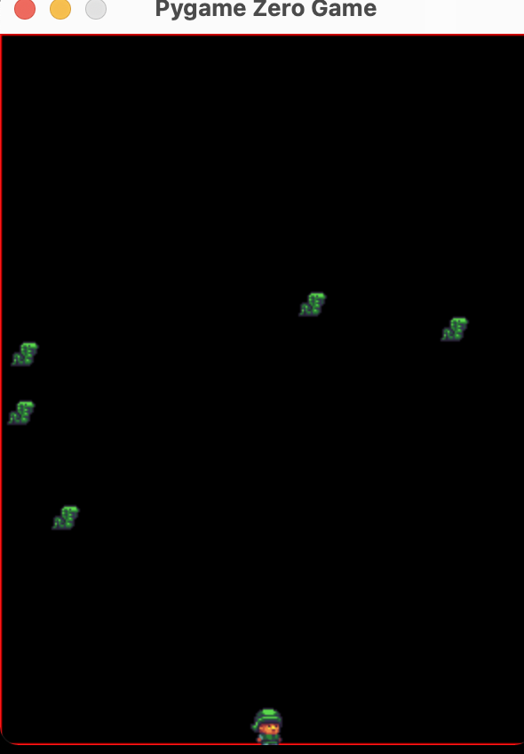

Catch all the falling snakes.

Take this skeleton, and fill in the blanks.

```
import pgzrun
import random

HEIGHT = 400
WIDTH = 300

falling = []
game_area = Rect(0,0,WIDTH,HEIGHT)
elf = Actor("c1")

elf.y = HEIGHT - 10
elf.x = WIDTH/2
game_over = False

def drop():
    f = Actor("snake")
    f.x = random.randint(0,WIDTH)
    f.y = random.randint(0, 150)
    falling.append(f)

def update():
    global game_over

    # move the elf left or right
    ...


    # detect the collisions between snakes and elf
    # and remove them if they collide
    ...


    # advance the snakes downwards
    ...


    # check if the snakes are outside of the game area, and set game over
    ...


    # add new snakes if there are less than 5 on the screen
    ...


def draw():
    if game_over:
        screen.fill('pink')
    else:
        screen.fill('black')
        for f in falling:
            f.draw()

        screen.draw.rect(game_area, (255,0,0))
        elf.draw()

pgzrun.go()

```

This is one example of implementing it, can you think of another?

```
import pgzrun
import random

HEIGHT = 400
WIDTH = 300

falling = []
game_area = Rect(0,0,WIDTH,HEIGHT)
elf = Actor("c1")

elf.y = HEIGHT - 10
elf.x = WIDTH/2
game_over = False

def drop():
    f = Actor("snake")
    f.x = random.randint(0,WIDTH)
    f.y = random.randint(0, 150)
    falling.append(f)

def update():
    global game_over

    # move the elf left or right
    if keyboard.left:
        elf.x = elf.x-5
    if keyboard.right:
        elf.x = elf.x+5


    # detect the collisions between snakes and elf
    # and remove them if they collide
    remove = []
    for f in falling:
        if f.colliderect(elf):
            remove.append(f)

    for r in remove:
        falling.remove(r)

    # advance the snakes downwards
    for f in falling:
        f.y += 1

    # check if the snakes are outside of the game area, and set game over
    for f in falling:
        if not f.colliderect(game_area):
            game_over = True

    # add new snakes if there are less than 5 on the screen
    if len(falling) < 5:
        drop()

def draw():
    if game_over:
        screen.fill('pink')
    else:
        screen.fill('black')
        for f in falling:
            f.draw()

        screen.draw.rect(game_area, (255,0,0))
        elf.draw()

pgzrun.go()
```

Another possible implementation, this one uses `list()` to make a copy of the falling list and also has score and lives.

```
import pgzrun
import random

HEIGHT = 400
WIDTH = 300

falling = []
game_area = Rect(0,0,WIDTH,HEIGHT)
elf = Actor("c1")

elf.y = HEIGHT - 10
elf.x = WIDTH/2
game_over = False
score = 0
lives = 5

def drop():
    f = Actor("snake")
    f.x = random.randint(0,WIDTH)
    f.y = random.randint(0, 150)
    falling.append(f)

def update():
    global game_over, score, lives


    if keyboard.A:
        elf.x -= 5
    if keyboard.D:
        elf.x += 5

    for i in falling:
        i.y += 1

    for i in list(falling):
        if not i.colliderect(game_area):
            falling.remove(i)
            lives -= 1

    game_over = lives <= 0

    if len(falling) < 5:
        drop()

    for i in list(falling):
        if i.colliderect(elf):
            falling.remove(i)
            score += 1

def draw():
    if game_over:
        screen.fill('pink')
    else:
        screen.fill('black')
        screen.draw.text("score: " + str(score) + " lives: " + str(lives), topleft=(10,10))

        for f in falling:
            f.draw()

        screen.draw.rect(game_area, (255,0,0))
        elf.draw()

pgzrun.go()
```


## [DAY-98] Lists; Read/Write File


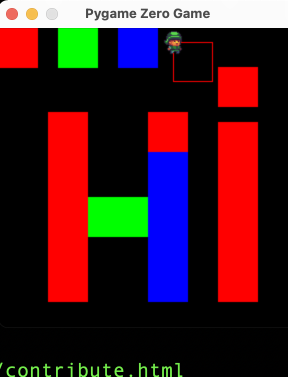

```
import pgzrun
import sys # for sys.exit()


HEIGHT = 300
WIDTH = 300

elf = Actor("c1")
colors = [
    [(255,0,0), Rect(0,0,40,40)],
    [(0,255,0), Rect(60,0,40,40)],
    [(0,0,255), Rect(120,0,40,40)],
]
color = None
pixels = []

def update():
    global color, pixels

    if keyboard.LEFT:
        elf.x -= 2
    if keyboard.RIGHT:
        elf.x += 2
    if keyboard.UP:
        elf.y -= 2
    if keyboard.DOWN:
        elf.y += 2

    if keyboard.Q:
        sys.exit(0)

    if keyboard.SPACE and color != None:
        pixels.append([
            color,
            Rect(elf.x,elf.y,40,40)
        ])

    if keyboard.C:
        pixels = []
        color = None

    if keyboard.D:
        drop = Rect(elf.x,elf.y,40,40)
        for p in list(pixels):
            if drop.colliderect(p[1]):
                pixels.remove(p)

    for c in colors:
        if elf.colliderect(c[1]):
            color = c[0]

def draw():
    screen.fill('black')

    for c in colors:
        screen.draw.filled_rect(c[1], c[0])

    for p in pixels:
        screen.draw.filled_rect(p[1], p[0])

    if color != None:
        screen.draw.rect(Rect(elf.x,elf.y,40,40), color)

    elf.draw()
    screen.draw.text(str(len(pixels)), topleft=(10,10))

pgzrun.go()
```

Simple catch the flower game

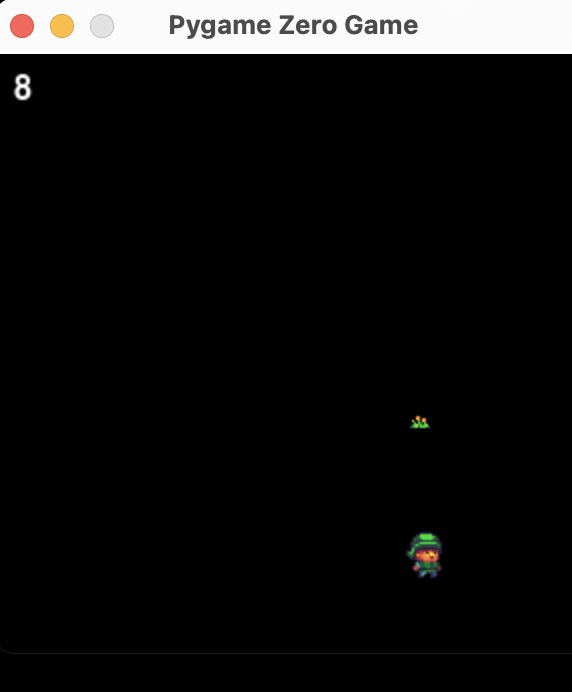

```
import pgzrun
import sys # for sys.exit()


HEIGHT = 300
WIDTH = 300

elf = Actor("c1")
flower = Actor("flower")

def update():
    if keyboard.LEFT:
        elf.x -= 5
    # add RIGHT/UP/DONW

    if keyboard.Q:
        sys.exit(0)

    # check if the elf collides the flower
    # and if it does, increment the score
    # and place the flower on some random place
    # ...

def draw():
    screen.fill('black')
    elf.draw()
    flower.draw()

    # show the score
    # ...
pgzrun.go()
```

Example implementation:

```
import pgzrun
import random
import sys # for sys.exit()


HEIGHT = 300
WIDTH = 300

elf = Actor("c1")
elf.x = WIDTH/2
elf.y = HEIGHT/2

flower = Actor("flower")
flower.x = 10
flower.y = 10
score = 0
def update():
    global score
    if keyboard.LEFT:
        elf.x -= 5
    if keyboard.RIGHT:
        elf.x += 5
    if keyboard.UP:
        elf.y -= 5
    if keyboard.DOWN:
        elf.y += 5

    if keyboard.Q:
        sys.exit(0)

    if elf.colliderect(flower):
        flower.x = random.randint(10,WIDTH-10)
        flower.y = random.randint(10,HEIGHT-10)
        score += 1

def draw():
    screen.fill('black')
    elf.draw()
    flower.draw()
    screen.draw.text(str(score), topleft=(10,10))

pgzrun.go()
```

Same program but with Load and Save

```
import pgzrun
import sys # for sys.exit()


HEIGHT = 300
WIDTH = 300

elf = Actor("c1")
colors = [
    [(255,0,0), Rect(0,0,40,40)],
    [(0,255,0), Rect(60,0,40,40)],
    [(0,0,255), Rect(120,0,40,40)],
]
color = None
pixels = []

def make_rect_around_actor(a):
    return Rect(a.x,a.y,40,40)
def update():
    global color, pixels

    if keyboard.LEFT:
        elf.x -= 2
    if keyboard.RIGHT:
        elf.x += 2
    if keyboard.UP:
        elf.y -= 2
    if keyboard.DOWN:
        elf.y += 2

    if keyboard.Q:
        sys.exit(0)

    if keyboard.SPACE and color != None:
        pixels.append([
            color,
            make_rect_around_actor(elf),
        ])

    if keyboard.C:
        pixels = []
        color = None

    if keyboard.S:
        f = open("save.txt", "w")
        for p in pixels:
            (red,green,blue) = p[0]
            f.write(str(red))
            f.write(",")
            f.write(str(green))
            f.write(",")
            f.write(str(blue))
            f.write(",")
            f.write(str(p[1].x))
            f.write(",")
            f.write(str(p[1].y))
            f.write(",")
            f.write(str(p[1].width))
            f.write(",")
            f.write(str(p[1].height))
            f.write("\n")
        f.close()

    if keyboard.L:
        pixels = []

        f = open("save.txt", "r")

        lines = f.readlines()
        for l in lines:
            (red,green,blue,x,y,w,h) = l.split(",")
            pixels.append([
                (float(red),float(green),float(blue)),
                Rect(float(x),float(y), float(w), float(h))
            ])

        f.close()

    if keyboard.D:
        drop = make_rect_around_actor(elf)
        for p in list(pixels):
            if drop.colliderect(p[1]):
                pixels.remove(p)

    for c in colors:
        if elf.colliderect(c[1]):
            color = c[0]

def draw():
    screen.fill('black')

    for c in colors:
        screen.draw.filled_rect(c[1], c[0])

    for p in pixels:
        screen.draw.filled_rect(p[1], p[0])

    if color != None:
        screen.draw.rect(make_rect_around_actor(elf), color)

    elf.draw()
    screen.draw.text(str(len(pixels)), topleft=(10,10))

pgzrun.go()
```
## [DAY-99] Classes; Lists; Functions; Cartesian Coordinates

Today we talk about classes and instances.

Classes are a bit like the houses you buy in roblox, its just a recepie for a house, and when you buy it you can customize it.

If two people have houses made from the same blueprint, we call them instances, they are seperate entities, you can lock one and that does not mean the other is locked. One can have a couch the other one doesn't.

The blueprint or recipe we call 'class' and the real thing that comes out of it we call 'instance'.

The class can define functions, and those functions will take a magic `self` parameter, where `self` will be the instance. For example in roblox, the house probably has a function 'lock()' that does something like `self.is_locked = True`.

Those functions are called 'methods' and the instance is also called an object. A method is supposed to be a bit like a message to the object, `p.colliderect(r)` for example you can look at sending the message `colliderect` to the object `p` with parameter `r`. Or you can look at it just as a function with hidden `self` parameter. In the following example you can see a method `def colliderect(self,r)` in the Point class, and also a standalone function `def collidepoint(rect, point)` that just expects a rect and a point objects.


```
class Point:
    x = 0
    y = 0
    def __init__(self, name):
        self.name = name

    def print(self):
        print('point',self.x,self.y,self.name)

    def colliderect(self,r):
        return self.x > r.x and self.x < r.x + r.w and self.y > r.y and self.y < r.y + r.h

class Rect:
    x = 0
    y = 0
    w = 0
    h = 0
    def print(self):
        print('rect',self.x,self.y,self.w,self.h)


#
# |-----------------------+
# |                       |
# 6  +-------+            |
# |  |       |            |
# 4--|---x   |            |
# |  |   |   |            |
# 2--+-------+            |
# |  |   |   |            |
# +--2---6---9------------+
# 0,0
def collidepoint(rect, point):
    if point.x > rect.x and point.x < rect.x + rect.w and point.y > rect.y and point.y < rect.y + rect.h:
        return True
    else:
        return False

p = Point("blue") # instance
p.x = 6
p.y = 4

r = Rect() # instance
r.x = 2
r.y = 2
r.w = 7
r.h = 4

if collidepoint(r,p):
    print("COLLIDES")
    r.print()
    p.print()

p2 = Point("red")
p2.x = 10
p2.y = 10
if not collidepoint(r,p2):
    print("NO COLLISION")
    r.print()
    p.print()


if p.colliderect(r):
    print("p collides")
```

```
import pgzrun
import sys # for sys.exit()
import random

HEIGHT = 600
WIDTH = 600

elf = Actor("c1")
speed = 3
back = []
def update():
    global score
    if keyboard.A:
        elf.x -= speed
    if keyboard.D:
        elf.x += speed
    if keyboard.W:
        elf.y -= speed
    if keyboard.S:
        elf.y += speed
    if keyboard.J:
        f = Actor('flower')
        f.x = elf.x
        f.y = elf.y
        back.append(f)

    if keyboard.M:
        f = open("save.txt", "w")
        for x in back:
            f.write(str(x.x))
            f.write(",")
            f.write(str(x.y))
            f.write("\n")
        f.close()
    if keyboard.L:
        f = open("save.txt", "r")
        for line in f.readlines():
            (x,y) = line.split(",") # 30,20
            a = Actor('flower')
            a.x = float(x)
            a.y = float(y)
            back.append(a)
        f.close()
    if keyboard.Q:
        sys.exit(0)

def draw():
    screen.fill('black')

    for i in back:
        i.draw()

    elf.draw()

pgzrun.go()
```


simpler painting game:

```
import pgzrun
import sys # for sys.exit()
import random

HEIGHT = 600
WIDTH = 600

elf = Actor("c1")
speed = 3
back = []
def update():
    global score
    if keyboard.A:
        elf.x -= speed
    if keyboard.D:
        elf.x += speed
    if keyboard.W:
        elf.y -= speed
    if keyboard.S:
        elf.y += speed
    if keyboard.J:
        f = Actor('flower')
        f.x = elf.x
        f.y = elf.y
        back.append(f)

    if keyboard.M:
        f = open("save.txt", "w")
        for x in back:
            f.write(str(x.x))
            f.write(",")
            f.write(str(x.y))
            f.write("\n")
        f.close()
    if keyboard.L:
        f = open("save.txt", "r")
        for line in f.readlines():
            (x,y) = line.split(",") # 30,20
            a = Actor('flower')
            a.x = float(x)
            a.y = float(y)
            back.append(a)
        f.close()
    if keyboard.Q:
        sys.exit(0)

def draw():
    screen.fill('black')

    for i in back:
        i.draw()

    elf.draw()

pgzrun.go()
```

## [DAY-100] Touch Typing; Lists

Day 100 party!

We will make another touch typing game

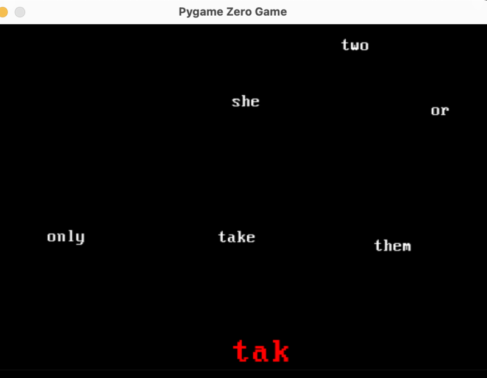

```
import pgzrun
import random

HEIGHT = 400
WIDTH = 600

words = []
text = ''
game_over = False
beep = tone.create('A3', 0.5)

def move():
    global game_over
    for w in words:
        w[1]+= random.randint(10,15)
        if w[1] > HEIGHT:
            game_over = True

def add_word():
    common = ['a','about','all','also','and','as','at','be','because','but','by','can','come','could','day',
              'do','even','find','first','for','from','get','give','go','have','he','her','here','him','his',
              'how','i','if','in','into','it','its','just','know','like','look','make','man','many','me',
              'more','my','new','no','not','now','of','on','one','only','or','other','our','out','people',
              'say','see','she','so','some','take','tell','than','that','the','their','them','then','there',
              'these','they','thing','think','this','those','time','to','two','up','use','very','want','way',
              'we','well','what','when','which','who','will','with','would','year','you','your',
    ]
    words.append([random.randint(10,WIDTH-50), random.randint(10,HEIGHT/2), random.choice(common)])

def on_key_down(key, mod, unicode):
    global text
    if key == keys.BACKSPACE:
        if len(text) > 0:
            text = text[:-1]
    elif len(unicode) > 0 and ord(unicode) >= 65 and ord(unicode) <= 125:
        text += unicode
        for w in list(words):
            if w[2] == text:
                words.remove(w)
                text = ''
                beep.play()


def draw():
    if game_over:
        screen.fill('pink')
    else:
        screen.fill('black')

        for w in words:
            screen.draw.text(w[2], (w[0],w[1]), fontsize=20,fontname="437-win")

        screen.draw.text(text, (WIDTH/2,HEIGHT - 40), color=(255,0,0), fontsize=40,fontname="437-win")

for i in range(5):
    add_word()

clock.schedule_interval(add_word, 2)
clock.schedule_interval(move, 1)
pgzrun.go()
```


ghost!

```
import random
score = 0
while True:
    ghost = random.randint(1,3)
    choice = input('Pick a door from 1,2, or 3: ')
    if choice == str(ghost):
        print ('there is a ghost :O GAME OVER !!!')
        break
    else:
        score += 1
        print('lucky no gosht')
print('your score is ' + str(score))

```


## [DAY-101] Functions; Strings

invert a list

```
def invert(l):
    #...

print(invert([1,2,3]))
```

invert a string

```
def invert(s):
    #...

print(invert("hello"))
```

invert a number

```
def invert(n):
    #...

print(invert(123456))
```

Check if a string is a palindrome, a palindrome is a string that you can read backwards and it sounds the same.

```
Anna
civic
kayak
level
madam
mom
noon
racecar
radar
redder
refer
repaper
rotator
rotor
sagas
solos
stats
tenet
wow
Never odd or even.
We panic in a pew.
Won’t lovers revolt now?
Don’t nod.
Sir, I demand, I am a maid named Iris.
Don't nod.
I did, did I?
Step on no pets.
Eva, can I see bees in a cave?
Was it a cat I saw?
```

example:

```
while True:
    n = input("which string you want to check: )
    if is_palindrome(n):
        print(n + " is a palindrome")
    else:
        print(n + " is not a palindrome")
```

# Chapter 14 - Week 14

```
day0: Basics of Basics
day1: Basics of Basics
day2: Basics of Basics
day3: Basics of Basics
day4: Basics of Basics
day5: Basics of Basics
day6: Basics of Basics
```

## [DAY-102] Touch Typing day
Whole day touch typing!

Modify the program to print some score and words per minute, and try to improve your score.

```
import pgzrun
import random
import time

HEIGHT = 800
WIDTH = 600

words = []
text = ''
game_over = False
beep = tone.create('A3', 0.5)
pause = False
score = 0
times = []
def words_per_minute():
    if len(times) < 2:
        return 0

    return int(len(times) / ((times[-1] - times[0]) / 60.0))

def move():
    global game_over
    if pause:
        return
    for w in words:
        w[1]+= random.randint(10,15)
        if w[1] > HEIGHT:
            game_over = True

def add_word():
    if pause:
        return
    common = ['a','about','all','also','and','as','at','be','because','but','by','can','come','could','day',
              'do','even','find','first','for','from','get','give','go','have','he','her','here','him','his',
              'how','i','if','in','into','it','its','just','know','like','look','make','man','many','me',
              'more','my','new','no','not','now','of','on','one','only','or','other','our','out','people',
              'say','see','she','so','some','take','tell','than','that','the','their','them','then','there',
              'these','they','thing','think','this','those','time','to','two','up','use','very','want','way',
              'we','well','what','when','which','who','will','with','would','year','you','your',
              'paper','game','remember','person','english','dutch','amsterdam','nothing','sleep','product','natural',
              'juice','orange','blue','green','together','friends','between','music','book','bookstore','fish','complete',
              'width','weight','height','length','string','python','unicode','backspace','random','choice','string','integer',
              'function','print','print','print','for','range','range',
    ]
    w = random.choice(common)
    words.append([random.randint(10,WIDTH-(len(w) * 15)), random.randint(10,int(HEIGHT/3)), w])

def on_key_down(key, mod, unicode):
    global text, pause, score_words, score
    if key == keys.BACKSPACE:
        if len(text) > 0:
            text = text[:-1]
    elif key == keys.SPACE:
        pause = not pause
    elif len(unicode) > 0 and ord(unicode) >= 65 and ord(unicode) <= 125:
        text += unicode
        for w in list(words):
            if w[2] == text:
                score += 1
                words.remove(w)
                if len(words) < 4:
                    add_word()

                text = ''
                beep.play()

                times.append(time.time())


def draw():
    if game_over:
        screen.fill('pink')
    elif pause:
        screen.fill('magenta')
    else:
        screen.fill('black')

        screen.draw.text("score: " + str(score) + " wpm: " + str(words_per_minute()), (10,10), color=(0,255,0), fontsize=15,fontname="437-win")

        for w in words:
            screen.draw.text(w[2], (w[0],w[1]), fontsize=20,fontname="437-win")

        screen.draw.text(text, (WIDTH/2,HEIGHT - 40), color=(255,0,0), fontsize=40,fontname="437-win")

for i in range(5):
    add_word()

clock.schedule_interval(add_word, 5)
clock.schedule_interval(move, 5)
pgzrun.go()
```


get more words with the characters you need to train from your dictionary file

use a simple program like this:

```
import sys
need = ['k','l','i','o']
for line in sys.stdin:
    missing = False
    s = line.rstrip()

    for n in need:
        if n not in s:
            missing = True

    if not missing and len(s) <= 7:
print(s)
```

and then get the list:

```
cat /usr/share/dict/words | python3 words.py | tr "[A-Z]" "[a-z]" | sort | uniq | sed -e "s/^/'/g" -e "s/$/',/g" | pbcopy
```
## [DAY-103] Read File; Command Line Arguments

Search all the books!

First download https://www.gutenberg.org/cache/epub/feeds/pg_catalog.csv.zip, this is a list of all the books available from the gutenberg project.

Oh! the gutenberg project is absolutely amazing, they have more than 60000 books that have expired copyright.

```
import csv
import sys
import argparse
parser = argparse.ArgumentParser()
parser.add_argument('--author', help='match author name')
parser.add_argument('--title', help='match title')
parser.add_argument('--subject', help='match subject')
args = parser.parse_args()

def show(id, title, authors, subjects, issued, language):
    print(">>> " + title + " <<<")
    print("    " + issued)
    print("    https://www.gutenberg.org/ebooks/" + id)

    print('')
    for a in authors:
        print("    Author: " + a)
    print('')
    for s in subjects:
        print("    Subject: " + s)
    print("    Language: " + language)
    print("-" * 40)

file = open('pg_catalog.csv')
reader = csv.reader(file)
for row in reader:
    # ['Text#', 'Type', 'Issued', 'Title', 'Language', 'Authors', 'Subjects', 'LoCC', 'Bookshelves']
    id = row[0]
    if id == "Text#":
        # skip the first row (header)
        continue

    issued = row[2]
    title = row[3].replace("\n","; ")
    language = row[4]
    authors = row[5].split("; ")
    subjects = row[6].split("; ")

    match = 0
    need = 0
    if args.title != None:
        need += 1
        if args.title in title:
            match += 1

    if args.subject != None:
        need += 1
        for s in subjects:
            if args.subject in s:
                match += 1
                break

    if args.author != None:
        need += 1
        for a in authors:
            if args.author in a:
                match += 1
                break

    if match == need:
        show(id,title,authors,subjects,issued,language)

file.close()
```

now try this:

```
python3 search.py --title Alice  --author Carroll | less
```

CSV stands for comma separated value, its a neat way to encode a table, each column is separated by a `,`. Python has csv module in its standard library, and its very easy to load and parse csv files.


## [DAY-104] Read File; Command Line Arguments; Dictionary

The previous approach can match only with substrings, for example we can not match "Lewis Carroll", because the author name is stored "Carroll, Lewis", in fact we can not even match on "Carroll Lewis" because we will be missing a comma.

Another way to search is if we actually split the strings, and then create an index of which word is contained in which books, very similar to whe you open the back of a book, you see a word(or a topic) and then pages at which it appears.

First just copy paste the program, and try to read it, we will go over it step by step later.

```
import sys
import re
import json

def show(book):
    id = book["id"]
    title = book["title"]
    authors = book["authors"]
    subjects = book["subjects"]
    issued = book["issued"]
    language = book["language"]

    print(">>> " + title + " <<<")
    print("    " + issued)
    print("    https://www.gutenberg.org/ebooks/" + str(id))

    print('')
    for a in authors:
        print("    Author: " + a)
    print('')
    for s in subjects:
        print("    Subject: " + s)
    print("    Language: " + language)
    print("-" * 40)

def parse(filename):
    file = open(filename)
    reader = csv.reader(file)
    books = []
    for row in reader:
        # ['Text#', 'Type', 'Issued', 'Title', 'Language', 'Authors', 'Subjects', 'LoCC', 'Bookshelves']
        if row[0] == "Text#":
        # skip the first row (header)
            continue

        id = int(row[0])
        issued = row[2]
        title = row[3].replace("\n","; ")
        language = row[4]
        authors = row[5].split("; ")
        subjects = row[6].split("; ")

        book = {
            "title": title,
            "language": language,
            "authors": authors,
            "subjects": subjects,
            "issued": issued,
            "id": id
        }
        books.append(book)

    file.close()
    return books


def normalize(s):
    # 'Alice's Adventures in Wonderland' -> 'alice's adventures in wonderland'
    return s.lower()

def tokenize(s):
    # 'alice's adventures in wonderland' -> ['alice','s','adventures','in','wonderland']
    return re.split("[^\w+]",s)

def build_search_index(books):
    index = {}

    for i,book in enumerate(books):
        tokens = set()
        for token in tokenize(normalize(book["title"])):
            k = "title:" + token
            tokens.add(k)

        for token in tokenize(normalize(book["language"])):
            k = "language:" + token
            tokens.add(k)

        for author in book["authors"]:
            for token in tokenize(normalize(author)):
                k = "author:" + token
                tokens.add(k)


        for subject in book["subjects"]:
            for token in tokenize(normalize(subject)):
                k = "subject:" + token
                tokens.add(k)

        for t in tokens:
            if not t in index:
                index[t] = []
            index[t].append(i)

    return index

def search(books, index, query):
    matching = None
    for q in query:
        if q in index:
            if matching == None:
                matching = set(index[q])
            else:
                matching.intersection_update(index[q])
        else:
            matching = set() # if one of the terms is not matching, return empty

    result = []
    if matching == None:
        return result

    for book_index in matching:
        book = books[book_index]
        result.append(book)
    return result

if len(sys.argv) == 1:
    print("usage:\n\t" + sys.argv[0] + " title:alice author:lewis")
    sys.exit(1)

data = None

try:
    f = open("search.json", mode="r")
    data = json.load(f)
    f.close()
except IOError:
    books = parse("pg_catalog.csv")
    search_index = build_search_index(books)

    data = {}
    data["search"] = search_index
    data["books"] = books

    f = open("search.json", mode="w")
    json.dump(data,f)
    f.close()

query = []
for arg in sys.argv[1:]:
    query.append(normalize(arg))

for book in search(data["books"], data["search"], query):
    show(book)
```


lets try it:

```
% python3 search.py title:Alice author:carroll author:lewis subject:children
>>> Alice's Adventures in Wonderland <<<
    2008-06-27
    https://www.gutenberg.org/ebooks/11

    Author: Carroll, Lewis, 1832-1898

    Subject: Fantasy fiction
    Subject: Children's stories
    Subject: Imaginary places -- Juvenile fiction
    Subject: Alice (Fictitious character from Carroll) -- Juvenile fiction
    Language: en

...
```

The first time you search it will be slower, but then we will persist the search index on disk, in the search.json file, and then the second time it will be significantly faster because we will not have to do the work of parsing and building the index again, but directly load the precomputed index.

So many new concepts here, but the biggest one are maps and sets.

A map is a data structure (list is a data structure as well), that allows you to find something by a key you store it with.

```
episodes = {}

episodes["naruto"] = 220
episodes["naruto shippuuden"] = 500
episodes["boruto"] = 215

print(episodes)
print(episodes["naruto"])

if "naruto" in episodes:
    print("naruto is in the map")

for k in episodes:
    print(k)

for k in episodes:
    print(k, episodes[k])
```

A set is a just a bag of things, for example when you put your toys in a bag, the bag is a set containing your toys. Lets make a set of flowers.

```
flowers = set()
flowers.add("rose")
flowers.add("camomile")
flowers.add("tulip")

if "tulip" in flowers:
    print("tulip is in the set")

for f in flowers:
    print(f)
```

You can `union` two sets of yoys by placing them into a new bag and this will contain both sets of toys, or you can `intersect` them by only taking toys that exist in both bags.

Both maps and sets are somewhat related, imagine a map that only contains keys.

This is very very shallow explanation, but will do for now, we will spend the next 3-4 months with sets and maps things will get clearer.

## [DAY-105] Basics of Basics

make the simple flower/rock drawing game by yourself

```
import pgzrun
import sys # for sys.exit()


HEIGHT = 300 
WIDTH = 300

elf = Actor("c1")
flowers = []
def update():
    if keyboard.A:
        elf.x -= 5
    if keyboard.D:
        elf.x += 5
    if keyboard.W:
        elf.y -= 5
    if keyboard.S:
        elf.y += 5
    if keyboard.F:
        flower = Actor("flower")
        flower.x = elf.x
        flower.y = elf.y
        flowers.append(flower)
    if keyboard.R:
        flower = Actor("rock")
        flower.x = elf.x
        flower.y = elf.y
        flowers.append(flower)
    if keyboard.Q:
        sys.exit(0)

    if elf.x < 0:
        elf.x = 10
    if elf.y < 0:
        elf.y = 10
    if elf.x > WIDTH:
        elf.x = WIDTH - 10
    if elf.y > HEIGHT:
        elf.y = HEIGHT - 10

def draw():
    screen.fill('black')
    elf.draw()
    for flower in flowers:
        flower.draw()
pgzrun.go()
```

## [DAY-106] Read/Write File; Lists

Have some fun drawing, add more colors, change the size, enjoy!

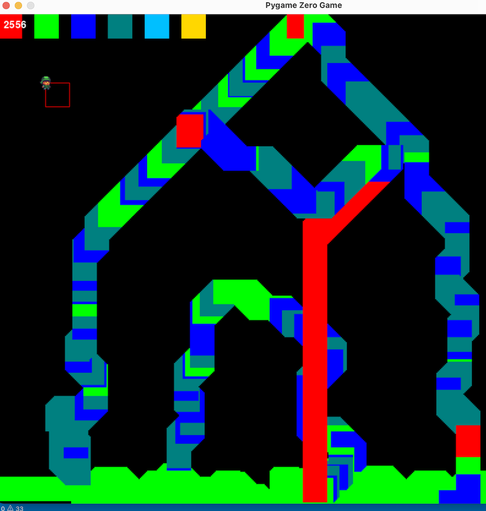


```
import pgzrun
import sys # for sys.exit()


HEIGHT = 800
WIDTH = 1000

elf = Actor("c1")
colors = [
    [(255,0,0), Rect(0,0,40,40)],
    [(0,255,0), Rect(60,0,40,40)],
    [(0,0,255), Rect(120,0,40,40)],
    [(0,128,128), Rect(180,0,40,40)],
    [(0,191,255), Rect(240,0,40,40)],
    [(255,215,0), Rect(300,0,40,40)],
]
color = None
pixels = []

size = 40

def make_rect_around_actor(a):
    return Rect(a.x,a.y,size,size)
def update():
    global color, pixels,size

    if keyboard.LEFT:
        elf.x -= 2
    if keyboard.RIGHT:
        elf.x += 2
    if keyboard.UP:
        elf.y -= 2
    if keyboard.DOWN:
        elf.y += 2

    if keyboard.MINUS:
        size -= 1
        if size < 1:
            size = 1
    if keyboard.EQUALS:
        size += 1
        
    if keyboard.Q:
        sys.exit(0)

    if keyboard.SPACE and color != None:
        pixels.append([
            color,
            make_rect_around_actor(elf),
        ])

    if keyboard.C:
        pixels = []
        color = None

    if keyboard.S:
        f = open("save.txt", "w")
        for p in pixels:
            (red,green,blue) = p[0]
            f.write(str(red))
            f.write(",")
            f.write(str(green))
            f.write(",")
            f.write(str(blue))
            f.write(",")
            f.write(str(p[1].x))
            f.write(",")
            f.write(str(p[1].y))
            f.write(",")
            f.write(str(p[1].width))
            f.write(",")
            f.write(str(p[1].height))
            f.write("\n")
        f.close()

    if keyboard.L:
        pixels = []

        f = open("save.txt", "r")

        lines = f.readlines()
        for l in lines:
            (red,green,blue,x,y,w,h) = l.split(",")
            pixels.append([
                (float(red),float(green),float(blue)),
                Rect(float(x),float(y), float(w), float(h))
            ])

        f.close()
    if keyboard.k_1:
        color = colors[0][0]
    if keyboard.k_2:
        color = colors[1][0]
    if keyboard.k_3:
        color = colors[2][0]
    if keyboard.k_4:
        color = colors[3][0]
    if keyboard.k_5:
        color = colors[4][0]
    if keyboard.k_6:
        color = colors[5][0]
               
    if keyboard.D:
        drop = make_rect_around_actor(elf)
        for p in list(pixels):
            if drop.colliderect(p[1]):
                pixels.remove(p)

    for c in colors:
        if elf.colliderect(c[1]):
            color = c[0]

def draw():
    screen.fill('black')

    for c in colors:
        screen.draw.filled_rect(c[1], c[0])

    for p in pixels:
        screen.draw.filled_rect(p[1], p[0])

    if color != None:
        screen.draw.rect(make_rect_around_actor(elf), color)

    elf.draw()
    screen.draw.text(str(len(pixels)), topleft=(10,10))

pgzrun.go()
```
## [DAY-107] Lists; Dictionaries

count the words in a file

```
f = open("week-015.md","r")
count = []

for line in f.readlines():
    for word in line.rstrip().split(" "):
        found = False
        for counted in count:
            if counted[0] == word:
                counted[1]+= 1
                found = True
                break
        if not found:
            count.append([word, 1])

f.close()

print(count)
```

use a dictionary

```
f = open("week-015.md","r")
count = {}

for line in f.readlines():
    for word in line.rstrip().split(" "):
        if word in count:
            count[word] += 1
        else:
            count[word] = 1

f.close()

for k in count:
    print(count[k], k)
```

get the unique words in a file

```

f = open("week-015.md","r")
unique = set()

for line in f.readlines():
    for word in line.rstrip().split(" "):
        unique.add(word)

f.close()

print(unique)

```

lets read the file 1 byte at a time:

```
f = open("week-015.md","r")
word = ''
count = {}
while True:
    byte = f.read(1)
    if not byte:
        break
    if byte == ' ' or byte == '\n':
        if word in count:
            count[word] += 1
        else:
            count[word] = 1
        word = ''
    else:
        word += byte
f.close()

for k in count:
    print(count[k], k)
```

use sys.stdin to read the standard input

```
import sys
count = {}

for line in sys.stdin.readlines():
    for word in line.rstrip().split(" "):
        if word in count:
            count[word] += 1
        else:
            count[word] = 1

for k in count:
    print(count[k], k)
```
then try use the output of `cat` to print the contents of week-015.md and then `|` pipe it to your word counting program

```
$ cat week-015.md | python3 count.py
```

if you want to sort by most common words:

```
cat week-015.md | python3 count.py | sort -n
```

## [DAY-108] Dictionaries

count how many times each character appears in a string

```
line = "A quick brown fox jumps over the lazy dog"
count = {}
for s in line:
    if s not in count:
        count[s] = 1
    else:
        count[s] += 1

for s in count:
    print(count[s], s)
```

check if all characters from an alphabet are in a string

```
alphabet = {
    'a': True,
    'b': True,
    'c': True,
    'd': True,
    'e': True,
    'f': True,
    'g': True,
    'h': True,
    'i': True,
    'j': True,
    'k': True,
    'l': True,
    'm': True,
    'n': True,
    'o': True,
    'p': True,
    'q': True,
    'r': True,
    's': True,
    't': True,
    'u': True,
    'v': True,
    'w': True,
    'x': True,
    'y': True,
    'z': True,
    ' ': True,
}
line = "A quick brown fox jumps over the lazy dog"

for s in line:
    lower_case = s.lower()
    if lower_case not in alphabet:
        print(lower_case + " is not in the alphabet")
        break
```

are two strings equal

```
def equal(a,b):
    if len(a) != len(b):
        return False
    for i in range(len(a)):
        if a[i] != b[i]:
            return False
    return True

print(equal("hello","world"))
print(equal("hello","hello"))
print(equal("hello","roblox"))
```

are two lists of integers equal:

```
def equal(a,b):
    if len(a) != len(b):
        return False
    for i in range(len(a)):
        if a[i] != b[i]:
            return False
    return True

print(equal([1,2,3],[1,2,3,4]))
print(equal([1,2,3],[1,2,3]))
```

are two dictionaries equal

```
def equal(a,b):

    for k in a:
        if k not in b:
            return False
        if a[k] != b[k]:
            return False

    for k in b:
        if k not in a:
            return False
        if b[k] != a[k]:
            return False

    return True

print(equal({'a':'hello','b':'world'},{'a':'hello','b':'world'}))
print(equal({'a':'hello','b':'world'},{'a':'hello','b':'earth'}))
print(equal({'a':'hello','roblox': True},{'a':'hello', 'roblox': False}))
print(equal({'a':'hello','b':'world','roblox': True},{'a':'hello','b':'world'}))
```
## [DAY-109] Touch Typing Day

Touchtyping day!

## [DAY-110] Find Code on TikTok


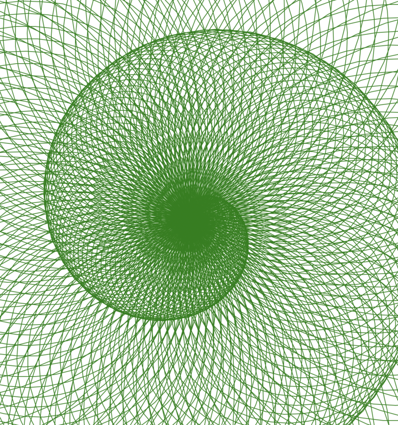

follow zippycode on tiktok https://www.tiktok.com/@zippycode
try some of their ideas, like:

```
from turtle import *
bgcolor('black')
n = 0
colormode(255)
while n < 200:
    right(n)
    forward(n*3)
    color(n,255-n,n%30*8)
    n+=1
```


```
from turtle import *
color('green')
speed(11)
i = 0
while True:
    circle(i*1.5)
    right(4)
    i+=1
```

## [DAY-111] Lists; Random
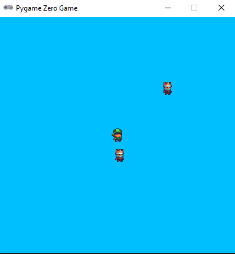

```
import pgzrun
import random

WIDTH = 400
HEIGHT = 400
fox = Actor("c1")
fox.x = WIDTH/2
fox.y =HEIGHT/2

other = [
    Actor("c2", pos=(100,100)),
    Actor("c2", pos=(100,300)),
    Actor("c2",pos=(300,300)),
    Actor("c2",pos=(300,100))
]


def update():
    if keyboard.left:
        for o in other:
            o.x += 5
    if keyboard.right:
        for o in other:
            o.x -= 5
    if keyboard.up:
        for o in other:
            o.y += 5
    if keyboard.down:
        for o in other:
            o.y -= 5

    for o in list(other):
        if o.colliderect(fox):
            other.remove(o)
    if len(other) < 4:
        other.append(Actor("c2",pos=(random.randint(10,WIDTH-10), random.randint(10,HEIGHT-10))))

    for o in other:
        o.y -=1

def draw():
    screen.clear()
    screen.fill("deepskyblue")
    fox.draw()
    for o in other:
        o.draw()
pgzrun.go()
```

## [DAY-112] Use Simple Dictionary

Count the words in a song

```
song = """There once was a ship that put to sea
The name of the ship was the Billy of Tea
The winds blew up, her bow dipped down
O blow, my bully boys, blow (huh)
She had not been two weeks from shore
When down on her a right whale bore
The captain called all hands and swore
He'd take that whale in tow (huh)
Soon may the Wellerman come
To bring us sugar and tea and rum (hey)
One day, when the tonguin' is done
We'll take our leave and go
Take our leave and go
Soon may the Wellerman come
To bring us sugar and tea and rum
One day, when the tonguin' is done
We'll take our leave and go
Before the boat had hit the water
The whale's tail came up and caught her
All hands to the side harpooned and fought her
When she dived down below (huh)
She had not been two weeks from shore
When down on her a right whale bore
The captain called all hands and swore
He'd take that whale in tow (huh)
Soon may the Wellerman come
To bring us sugar and tea and rum (hey)
One day, when the tonguin' is done
We'll take our leave and go
Take our leave and go
Soon may the Wellerman come
To bring us sugar and tea and rum
One day, when the tonguin' is done
We'll take our leave and go
Soon may the Wellerman come
To bring us sugar and tea and rum (hey)
One day, when the tonguin' is done
We'll take our leave and go
Take our leave and go
Take our leave and go
"""

words = {}
word = ''
for c in song:
    if c == ' ' or c == '\n':
        if word not in words:
            words[word] = 1
        else:
            words[word] += 1
        word = ''
    else:
        word += c

for word in words:
    print(words[word],word)
```

This program has a bug, if the file does not end with empty line, it wont count the last word.

Print the length:

```
...
l = 0
for c in song:
    l += 1
print(l)
print(len(song))
```

## [DAY-113] Discover Pythontutor

use https://pythontutor.com/visualize.html with the folloowing code:

```
song = """Soon may the Wellerman come
To bring us sugar and tea and rum (hey)
One day, when the tonguin' is done
We'll take our leave and go
Take our leave and go
Soon may the Wellerman come
To bring us sugar and tea and rum (hey)
One day, when the tonguin' is done
"""

words = {}
word = ''
for c in song:
    if c == ' ' or c == '\n':
        if word not in words:
            words[word] = 1
        else:
            words[word] += 1
        word = ''
    else:
        word += c

for word in words:
    print(words[word],word)

```


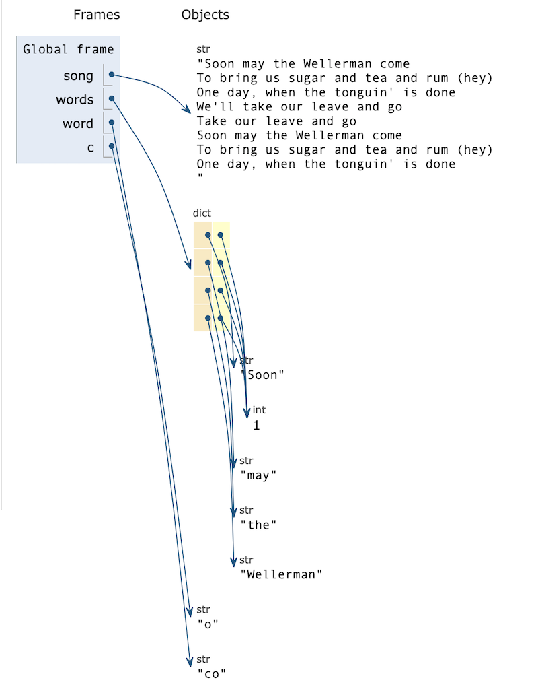
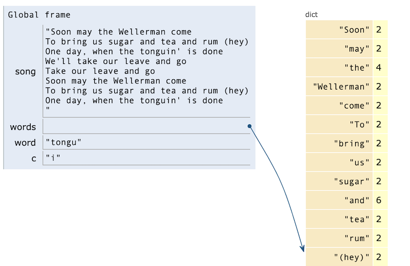

try it with other programs as well.

## [DAY-114] Simple Turtle
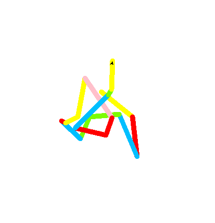

random walk

```
from turtle import *
from random import randint,choice

colors = ['red','deepskyblue','lawngreen']

screen = Screen()
width, height = screen.window_width(), screen.window_height()

pensize(5)
speed(20)

while True:
    pencolor(choice(colors))
    setheading(randint(0,360))
    forward(randint(1,100))
    (x,y) = pos()
    if x > width/2 or y > height/2 or x < -width/2 or y < -height/2:
        setpos(0,0)

```

## [DAY-115] Practical Coding, Control Roblox with python

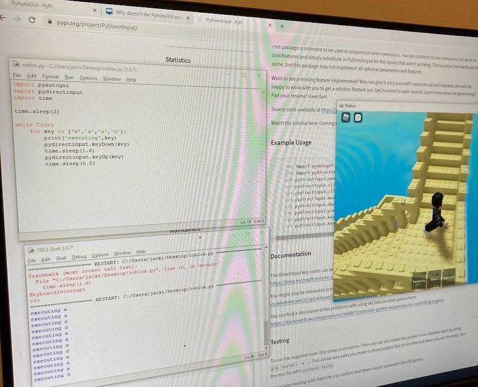

Control Roblox with python

NB: That might be considered cheating, even though its just for fun, so be ready to get your account banned.

First `pip install pyautogui` and `pip install pydirectinput`.

```
import pyautogui
import pydirectinput
import time

time.sleep(2)

while True:
    for key in ['w','a','s','d']:
        print('executing',key)
        pydirectinput.keyDown(key)
        time.sleep(1.6)
        pydirectinput.keyUp(key)
        time.sleep(0.5)
```

This is a simple program that presses w a s d, each for 1.6 seconds and then waits 0.5 seconds for the next one.

After you start the program, you have 2 seconds to click on Roblox otherwise the sequence will be wrong


## [DAY-116] Many Turtles

Many Turtles.

The ideas are borrowed from [Redisovering Logo with Bob the Turtle](https://notes.ayushsharma.in/2019/06/rediscovering-logo-with-bob-the-turtle), Ayush Sharma's amazing blog post!


```
import turtle

turtle.setup(width=800, height=800)

bob = turtle.Turtle(shape='turtle')
bob.color('orange')
bob.speed(3000)

alice = turtle.Turtle(shape='turtle')
alice.color('lawngreen')
alice.speed(3000)

for i in range(500):

    bob.forward(i)
    bob.left(91)

    alice.backward(i)
    alice.right(91)

turtle.exitonclick()
```

even more turtles

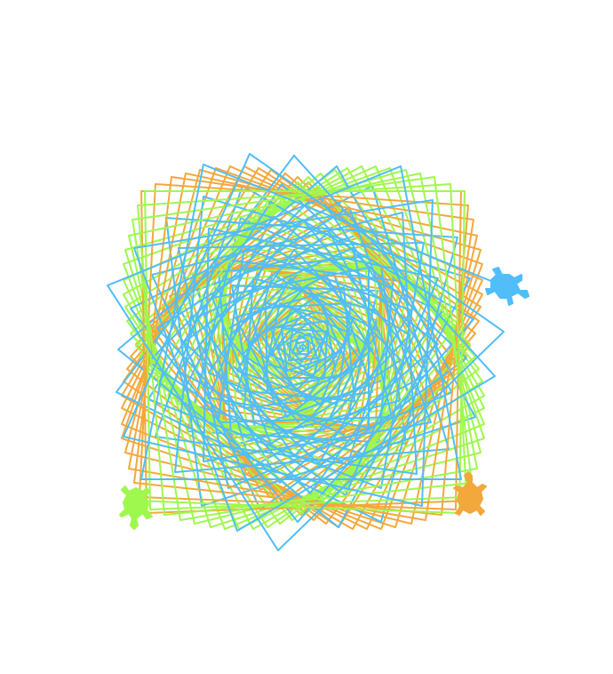


```
import turtle

turtle.setup(width=800, height=800)

bob = turtle.Turtle(shape='turtle')
bob.color('orange')
bob.speed(3000)

alice = turtle.Turtle(shape='turtle')
alice.color('lawngreen')
alice.speed(3000)


charlie = turtle.Turtle(shape='turtle')
charlie.color('deepskyblue')
charlie.speed(3000)

for i in range(500):

    bob.forward(i)
    bob.left(91)

    alice.backward(i)
    alice.right(91)

    charlie.forward(i)
    charlie.right(101)

turtle.exitonclick()
```

```
import turtle
turtle.setup(width=800, height=800)

bob = turtle.Turtle(shape='turtle')
bob.color('orange')

alice = turtle.Turtle(shape='turtle')
alice.color('lawngreen')
angle = 10
while True:
    alice.backward(20)
    bob.forward(20)
    alice.right(angle)
    bob.left(angle)
    angle += 1
```

Again this is the same as in roblox's houses, you have the blueprint of the house, and you can create an instance of it, and then you can modify it. so `turtle.Turtle()` creates an instance, and then you see, bob, alice and charlie have their own changes. In the same time they have the same functionality, like `forward` `up` and etc coming from the blueprint and each of those methods work on the instance itself.

## [DAY-117] Another Text Editor

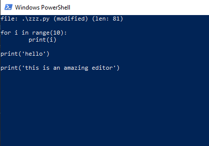

And lets discuss another text editor.

(if you are on windows make sure you `pip3 install windows-curses`)

Start super simple, what do we need to make a text editor? first we need to show the text being edited, and second we need to capture user input and modify this text.

First show some text:

```
import curses
import time

screen = curses.initscr()
screen.addstr(0, 0, "hello world",curses.A_NORMAL)
screen.refresh()

time.sleep(2)
```

Capture input and modify the text:

```
import curses

screen = curses.initscr()
text = ''
while True:
    screen.addstr(0, 0, text,curses.A_NORMAL)
    screen.refresh()

    c = screen.getch()
    text += chr(c)
```

In order to Read and Write the file we are editing, we need to have some control keys, like Ctrl+S to save, and Ctrl+C to quit without saving. Also we need to add support for backspace to be able to delete from the text string.

Hint: use `text += str(c)` to actually see the codes you need.

```
import curses
import sys

screen = curses.initscr()
curses.curs_set(2)

if len(sys.argv) != 2:
    print("usage:")
    print(sys.argv[0] + " filename")
    sys.exit(1)


text = ''
try:
    file = open(sys.argv[1],"r")
    text = file.read()
    file.close()
except:
    pass

status = 'file: ' + sys.argv[1]
while True:
    screen.clear()
    screen.addstr(0, 0, status + ' (len: ' + str(len(text)) + ')',curses.A_NORMAL)
    screen.addstr(2, 0, text,curses.A_NORMAL)
    screen.refresh()

    c = screen.getch()
    if c == 3:
        # quit Ctrl+C
        break

    if c == 19:
        # save Ctrl+S
        file = open(sys.argv[1],"w")
        file.write(text)
        file.close()
        status = 'file: ' + sys.argv[1]
        screen.addstr(0, 0, text,curses.A_NORMAL)
        continue
    if c == 8:
        # backspace
        if len(text) > 0:
            text = text[:len(text)-1]
        continue
    if (c < 127 and c > 30) or c == 10:
        text += chr(c)
        status = 'file: ' + sys.argv[1] + " (modified)"

```

## [DAY-118] Search Lyrics

Search for your favorite lyrics, dont forget to `pip3 install lyricsgenius`

```
import lyricsgenius
genius = lyricsgenius.Genius('get api key from genius.com')
genius.verbose = False
while True:
    artist = input("🔥 Artist: ")
    song_name = input("🔥 Song: ")
    song = genius.search_song(song_name, artist)
    if song == None:
        print(song_name + " / " + artist + " not found")
    else:
        print('-'  * 40)
        print(song.lyrics)
        print('-'  * 40)
```


## [DAY-119] Facial Recognition; Move 78

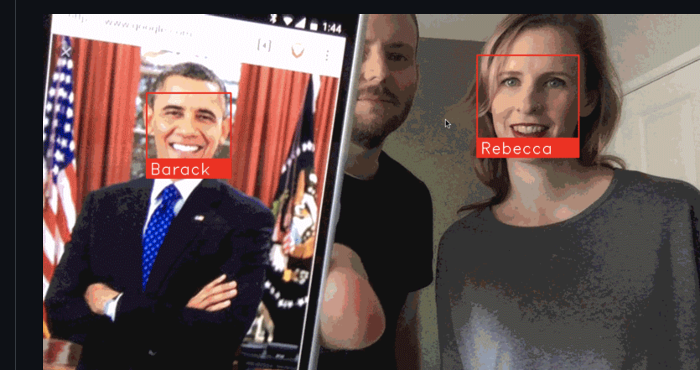

Use https://github.com/ageitgey/face_recognition to see how easy it is to track people through a video stream only using 1 picture from them.

Recognize that if it is cheap and easy, it is done to you.

It will be done in the mall, to show you personalized ads, it will be done on the street to track where you go so they can sell you better things on tiktok.

They only need 1 picture.

If you are not paying, you are the product.

It is also not very easy to be tricked with mascara.


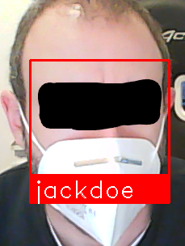


even thought it was easy in 2014, https://www.theatlantic.com/technology/archive/2014/07/makeup/374929/


## [DAY-120] Program on your own form a book

Today you are on your own. We start with: https://www.amazon.de/-/en/DK/dp/1465461884 chapter 2, read it for 1 hour and make the programs and exercieses.

Write down your experience and what you struggle with.

Simple ping pong game

```
import pgzrun
import random

HEIGHT = 600
WIDTH = 600

elf = Actor('c1')
king = Actor('c2')
ball = Actor('bullet')

king.y = HEIGHT/2
elf.y = HEIGHT/2
elf.x = WIDTH-10
ball.x = WIDTH/2
ball.y = HEIGHT/2
d = 1
game_over = False
speed = 1
def update():
    global d,game_over,speed
    if keyboard.up:
            elf.y -= 5
    if keyboard.down:
            elf.y += 5
    if keyboard.S:
            king.y += 5
    if keyboard.W:
            king.y -= 5

    if ball.x < 0 or ball.x > WIDTH:
        game_over = True

    if d == 1:
        ball.x += speed
    else:
        ball.x -= speed

    if elf.colliderect(ball):
        d = 0
        ball.y = random.randint(10,HEIGHT-10)
        speed += 1
    if king.colliderect(ball):
        d = 1
        ball.y = random.randint(10,HEIGHT-10)
        speed += 1

def draw():
    screen.clear()
    screen.fill("deepskyblue")

    elf.draw()
    king.draw()
    ball.draw()

    if game_over:
        screen.fill('red')

pgzrun.go()
```

## [DAY-121] Scam Check List

Scams.. Scams everywhere.

Our phone numbers, names, address are everywhere we have registered to buy something, be it bol.com, amazon, some random website we bought fidgets from, etc. So people can find out your number and name also by stealing your friends's contact list, Overall you must assume the bad guys have your information, so when you receive a call or email or even people talk to you on the street, always think sus.

Follow this list:

* Always Think Sus
* Call your parents
* If you cant reach your parents, call adult you know
* If you cant reach adult you know, go and find a mother with a child, they are the safest to talk to.
* If you can not find any adult to help hang up.
* If you think it is serious and you must act, hang up, and *you* call wherever they claim to be calling from. For example if they say they are from your bank, or from roblox, or fortnite, you google and find a contact for your bank/fortnite and *you* call them and ask what is going on.

The scammers are very smart, and have a lot of experience to trick you into doing what they want, sometimes they will call claiming your parents are in trouble and you have to give them a credit card number, sometimes they will call to tell you you win the new iPhone if you just give them a credit card number. They are very inventive as well, so the best thing is just think sus.


## [DAY-122] Lists; Random; Mutate

Hide and Seek

Ask someone to count to 10, then you hide, and ask him to find you

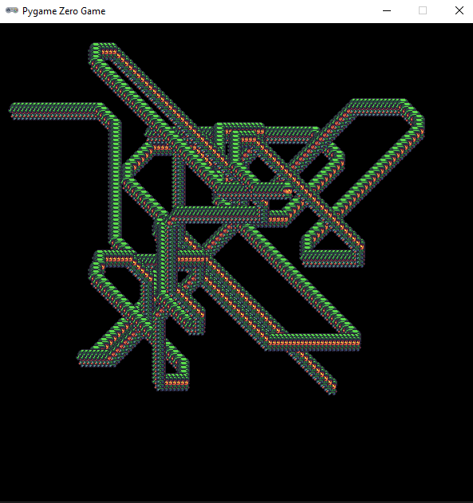


```
import pgzrun
import random
HEIGHT = 600
WIDTH = 600

elf = Actor('c1')
elf.x = 20
elf.y = random.randint(0,HEIGHT)

def update():
    if keyboard.UP:
        elf.y -= 5
    if keyboard.DOWN:
        elf.y += 5
    if keyboard.RIGHT:
        elf.x += 5
    if keyboard.LEFT:
        elf.x -= 5

def draw():
    elf.draw()

pgzrun.go()

```

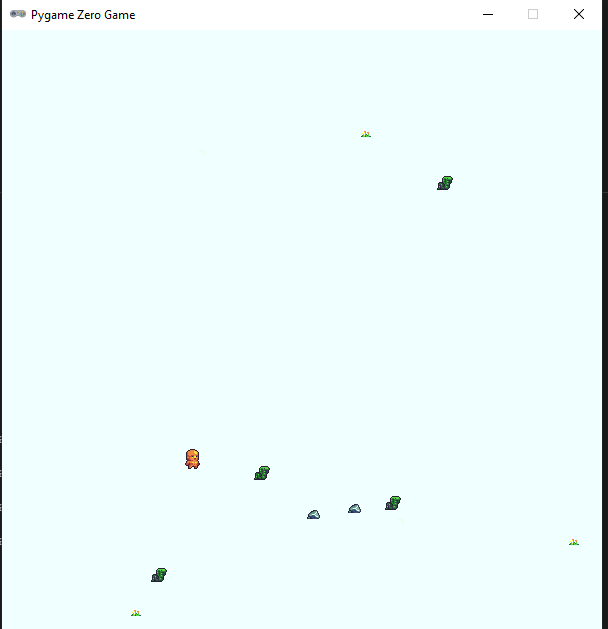

Practice walking over a list with `for i in range(len(x))` and `for item in x`.

```
import pgzrun
import random
HEIGHT = 600
WIDTH = 600

elf = Actor('c1')
king = Actor('c2')
elf.x = 20
elf.y = random.randint(0,HEIGHT)
king.y = random.randint(0,HEIGHT)
king.x = WIDTH-20

things = []

def add_new_obsticle(l):
    image = random.choice(["snake","bullet","flower","rock"])
    x = Actor(image)
    x.x = random.randint(0,WIDTH)
    x.y = random.randint(0,HEIGHT)
    l.append(x)

for i in range(10):
    add_new_obsticle(things)

def update():
    if keyboard.UP:
        elf.y -= 5
    if keyboard.DOWN:
        elf.y += 5
    if keyboard.RIGHT:
        elf.x += 5
    if keyboard.LEFT:
        elf.x -= 5

    if keyboard.W:
        king.y -= 5
    if keyboard.S:
        king.y += 5
    if keyboard.D:
        king.x += 5
    if keyboard.A:
        king.x -= 5

    for s in range(len(things)):
        if things[s].colliderect(elf):
            elf.image = things[s].image

    if king.colliderect(elf):
        king.image = "c3"
def draw():
    screen.fill('azure')
    king.draw()
    elf.draw()
    for thing in things:
        thing.draw()

pgzrun.go()
```


## [DAY-123] Lists; Callbacks

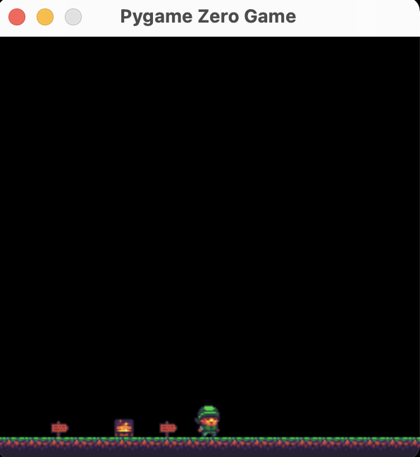

a bit more complicated game

```
import pgzrun
import random
from itertools import cycle
WIDTH = 300
HEIGHT = 300
game_over = False
player = Actor("c1", pos=((WIDTH/2), (HEIGHT-16)), anchor=("center","bottom"))
obsticles = []

def jump_up(jumper):
    sounds.jump.play()
    animate(jumper, tween='decelerate', duration=0.3, pos=(jumper.x, jumper.y - 16),on_finished=lambda: jump_down(jumper))

def jump_down(jumper):
    animate(jumper, tween='accelerate', duration=0.3, pos=(jumper.x, HEIGHT-16))

def on_key_down(key):
    if key == keys.SPACE:
        jump_up(player)

def make_obsticles():
     for i in range(0, 5 - len(obsticles)):
        # check if colliding, add random + 20 to it
        actor = Actor(random.choice(["o1","o2","o3","o4","o5","o6","o7","o8","o9","o10","o11"]), anchor=("center","bottom"))
        actor.x = WIDTH + 40 + random.randint(10, WIDTH*2)
        actor.y = HEIGHT - 16
        while True:
            actor.x += random.randint(30, 50)
            conflict = False
            for o in obsticles:
                if o.colliderect(actor):
                    conflict = True
            if not conflict:
                break

        obsticles.append(actor)

def update():
    global game_over

    if len(obsticles) < 5:
        make_obsticles()

    for o in list(obsticles):
        # shrink the collision rects so the game is more fun to play
        if o.inflate(-4,-4).colliderect(player.inflate(-16,-16)):
            game_over = True

        # remove the obsticles out of screen
        o.x -= 2
        if o.x < -10:
            obsticles.remove(o)


# player animation
# we just change the image of the actor every 0.4 seconds
poses = cycle(["player/tiles-46","player/tiles-47","player/tiles-48","player/tiles-49","player/tiles-50","player/tiles-51"])
def make_actor_move():
    player.image = next(poses)
clock.schedule_interval(make_actor_move, 0.4)

def draw():
    screen.fill("black")
    player.draw()
    for o in obsticles:
        o.draw()

    for i in range(100):
        screen.blit('floor',(i * 16, HEIGHT - 16))

    if game_over:
        screen.fill("red")

pgzrun.go()

```
## [DAY-124] BMP format, Images; Encoding/Decoding

Images

The way we store image is very similar to the way we store text. It is just a bunch of bytes, but when we read them we decide to interpret them differently.

Open images/joshi-100.bmp and you will see: 

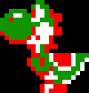 

Now lets just read the bytes, and just show the numbers, starting at position 54, when we print new line every 106, and also we are gonna print every 4th byte.

first just print the bytes:


```
file = open("images/joshi-100.bmp","rb")
data = file.read()
file.close()

for b in data:
    print("%3d" % b,end='')
```

now lets print them in specific order:

```
file = open("images/joshi-100.bmp","rb")
data = file.read()
file.close()

width = 100
height = 106
offset = 54

for y in range(width):
    for x in range(height):
        off = offset + ((y * width + x) * 4)
        print("%3d" % data[off+2],end='')
    print()
```

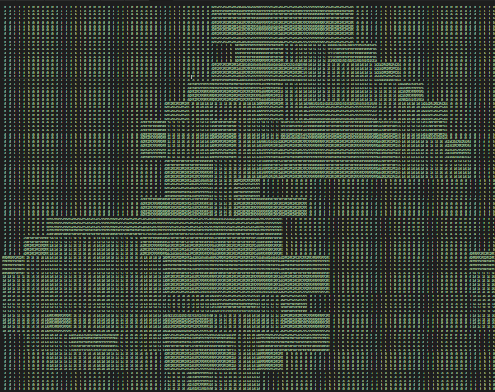


looks familiar!

The image itself actually contains information about how big it is, and where the data starts, it is specified in the bitmap format itself.


Here is the bitmap header information, copied from: http://www.ece.ualberta.ca/~elliott/ee552/studentAppNotes/2003_w/misc/bmp_file_format/bmp_file_format.htm

| Name | Size | Offset | Description |
| - | - | - | - |
| **Header** | 14 bytes | | Windows Structure: BITMAPFILEHEADER |
| Signature | 2 bytes | 0000h | 'BM' |
| FileSize | 4 bytes | 0002h | File size in bytes |
| reserved | 4 bytes | 0006h | unused (=0) |
| DataOffset | 4 bytes | 000Ah | Offset from beginning of file to the beginning of the bitmap data |
| **InfoHeader** | 40 bytes | | Windows Structure: BITMAPINFOHEADER |
| Size | 4 bytes | 000Eh | Size of InfoHeader =40 |
| Width | 4 bytes | 0012h | Horizontal width of bitmap in pixels |
| Height | 4 bytes | 0016h | Vertical height of bitmap in pixels |
| Planes | 2 bytes | 001Ah | Number of Planes (=1) |
| Bits Per Pixel | 2 bytes | 001Ch | Bits per Pixel used to store palette entry information. This also identifies in an indirect way the number of possible colors. Possible values are:<br>1 = monochrome palette. NumColors = 1 <br>4 = 4bit palletized. NumColors = 16 <br>8 = 8bit palletized. NumColors = 256 <br>16 = 16bit RGB. NumColors = 65536<br>24 = 24bit RGB. NumColors = 16M |
| Compression | 4 bytes | 001Eh | Type of Compression <br>0 = BI\_RGB no compression <br>1 = BI\_RLE8 8bit RLE encoding <br>2 = BI\_RLE4 4bit RLE encoding |
| ImageSize | 4 bytes | 0022h | (compressed) Size of Image <br>It is valid to set this =0 if Compression = 0 |
| XpixelsPerM | 4 bytes | 0026h | horizontal resolution: Pixels/meter |
| YpixelsPerM | 4 bytes | 002Ah | vertical resolution: Pixels/meter |
| Colors Used | 4 bytes | 002Eh | Number of actually used colors. For a 8-bit / pixel bitmap this will be 100h or 256. |
| Important Colors | 4 bytes | 0032h | Number of important colors <br>0 = all |
| **ColorTable** | 4 \* NumColors bytes | 0036h | present only if Info.BitsPerPixel less than 8 <br>colors should be ordered by importance |
| Red | 1 byte | | Red intensity |
| Green | 1 byte | | Green intensity |
| Blue | 1 byte | | Blue intensity |
| reserved | 1 byte | | unused (=0) |
| repeated NumColors times |
| **Pixel Data** | InfoHeader.ImageSize bytes | | The image data

Now using the header information, we can get the width, height and data offset directly from there:

```
file = open("images/joshi-100.bmp","rb")
data = file.read()
file.close()

offset = int.from_bytes(data[10:14], byteorder='little')
width = int.from_bytes(data[18:22], byteorder='little')
height = int.from_bytes(data[22:26], byteorder='little')

for y in range(width):
    for x in range(height):
        off = offset + ((y * width + x) * 4)
        print("%3d" % data[off+2],end='')
    print()
```

You see when we read `data[10:14]` we want to skip `signature` (2 bytes), `file size` (4 bytes) and `reserved` (4 bytes) and read exactly 4 bytes after that.
And we can make 4 bytes into a integer with `int.from_bytes`. We will get into that later. For now the important thing to focus on is the format itself.

It has a header, followed up by data. This is very common method and you will see it in all kinds of places. Even in our virtual computer when we were storing the strings we used a similar method, the first byte was always the length of the string.


## [DAY-125] Lists; Dictionaries

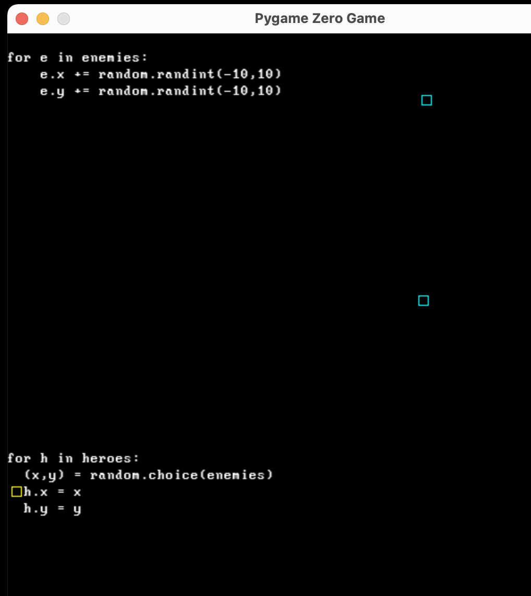
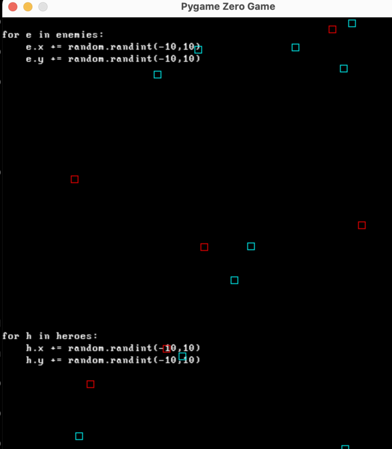
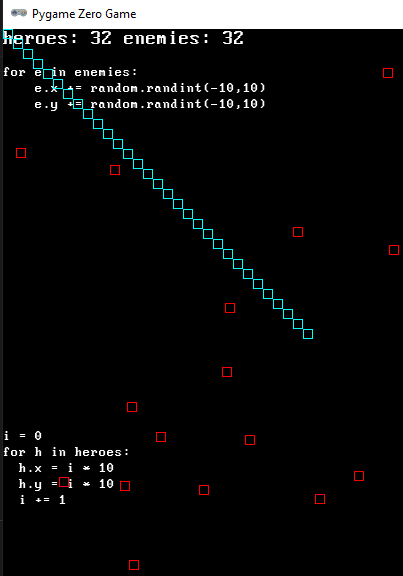
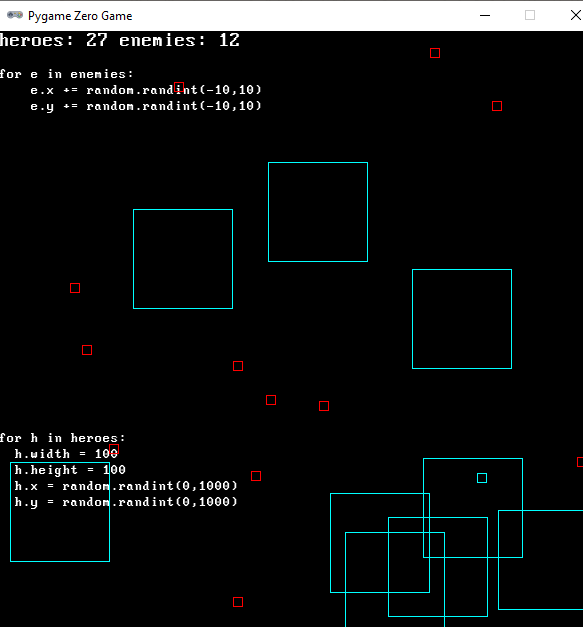

Write code to destroy your enemies!

You have access to your `heroes` and `enemies` positions. When you collide you destroy each other.

```
import pgzrun
import random
from itertools import cycle

WIDTH=600
HEIGHT=600

enemies = []
heroes = []

text = """
for h in heroes:
    h.x += random.randint(-10,10)
    h.y += random.randint(-10,10)
"""

enemy_programs = cycle([
"""
i = 0
for e in enemies:
    e.x = i * 10
    e.y = i * 10
    i += 1
""",
"""
for e in enemies:
    e.x += random.randint(-10,10)
    e.y += random.randint(-10,10)
""",
"""
for e in enemies:
    (x,y) = random.choice(heroes)
    e.x = x
    e.y = y
"""
])

enemy_code = None

def reset():
    global heroes, enemies, enemy_code
    enemy_code = next(enemy_programs)
    enemies = []
    heroes = []
    for i in range(20):
        enemies.append(Rect(random.randint(0,WIDTH),random.randint(0,HEIGHT), 10, 10))
        heroes.append(Rect(random.randint(0,WIDTH),random.randint(0,HEIGHT), 10, 10))


def on_key_down(key, mod, unicode):
    global text, pause, score_words, score
    if key == keys.BACKSPACE:
        if mod == 1024 or mod == 256:
            text = ''
        if len(text) > 0:
            text = text[:-1]
    elif key == keys.SPACE:
        text += ' '
    elif key == keys.TAB:
        text += '  '        
    elif key == keys.RETURN:
        text += '\n'        
    elif len(unicode) > 0 and ord(unicode) >= 34 and ord(unicode) <= 126:
        text += unicode

def run_code():
    try:
        enemy_positions = []
        for e in enemies:
            enemy_positions.append((e.x, e.y))
        hero_positions = []
        for h in heroes:
            hero_positions.append((e.x, e.y))            
        exec(text, {"heroes": heroes,"random":random, "enemies": enemy_positions})
        exec(enemy_code, {"enemies": enemies, "random":random, "heroes": hero_positions})

        for h in list(heroes):
            collided = False
            for e in list(enemies):
                if e.colliderect(h):
                    enemies.remove(e)
            if collided:
                heroes.remove(h)                    
        if len(enemies) < 50:
            enemies.append(Rect(random.randint(0,WIDTH),random.randint(0,HEIGHT), 10, 10))

        heroes.append(Rect(random.randint(0,WIDTH),random.randint(0,HEIGHT), 10, 10))
        if len(enemies) < 5:
            reset()

    except Exception as err:
        print(err)
        pass

reset()

clock.schedule_interval(run_code, 1)
def draw():
    screen.fill("black")

    screen.draw.text("heroes: " + str(len(heroes)) + " enemies: " + str(len(enemies)), (0, 0), align='left',fontname="437-win", fontsize=20)
    for (i,l) in enumerate(enemy_code.split('\n')):
        screen.draw.text(l, (0, (20 + (i * 16))), align='left',fontname="437-win", fontsize=14)


    for (i,l) in enumerate(text.split('\n')):
        screen.draw.text(l, (0, (HEIGHT - 200 + (i * 16))), align='left',fontname="437-win", fontsize=14)

    for e in enemies:
        screen.draw.rect(e, (255,0,0))
    for h in heroes:
        screen.draw.rect(h, (0,255,255))

pgzrun.go()
```

## [DAY-126] Read/Write File

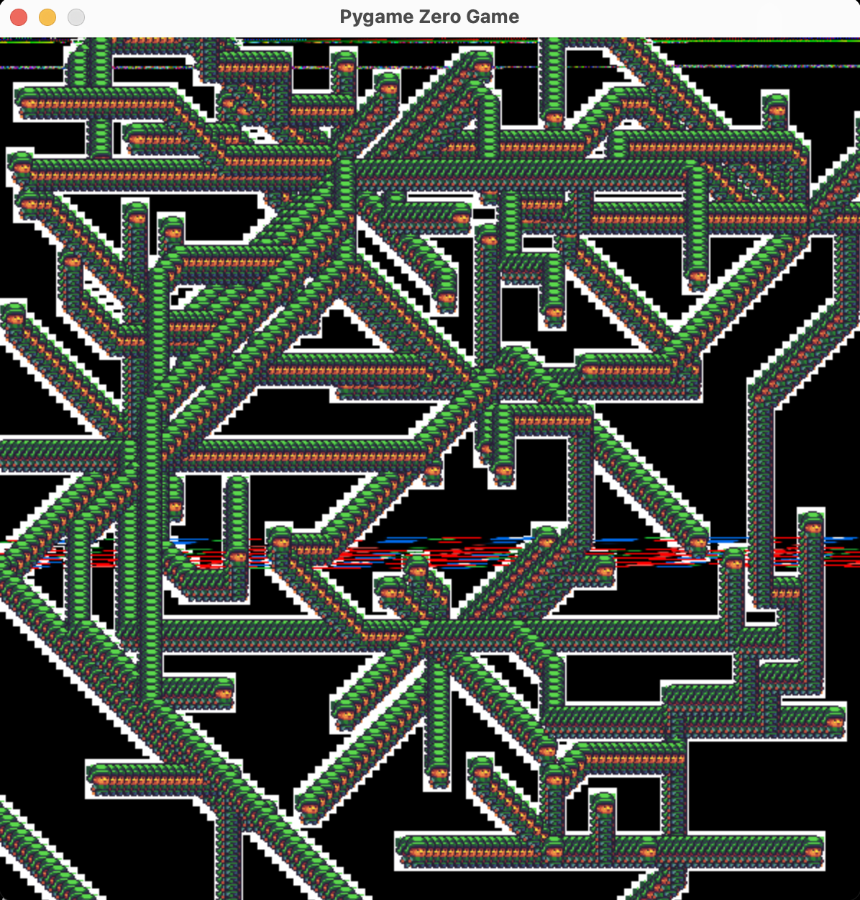


Save and load the position of the elf

Play hide and seek after that!


```
import pgzrun

HEIGHT = 600
WIDTH = 600

elf = Actor('c1')
elf.x = WIDTH/2
elf.y = HEIGHT/2

def update():
    if keyboard.UP:
        elf.y -= 5
    if keyboard.LEFT:
        elf.x -= 5
    if keyboard.RIGHT:
        elf.x += 5
    if keyboard.DOWN:
        elf.y += 5
    if keyboard.S:
        f = open('save','w')
        f.write('MAGIC HEADER\n' + str(elf.x) + '\n' + str(elf.y) + '\n')
        f.close()
    if keyboard.B:
        f = open("save","r")
        lines = f.readlines()
        if (lines[0].startswith('MAGIC HEADER')):
            elf.x = float(lines[1])
            elf.y = float(lines[2])
        f.close()

       
def draw():
    elf.draw()
pgzrun.go()
```
## [DAY-127] Callbacks; Schedule Interval

super short, make the actor walk

```
from itertools import cycle
import pgzrun

WIDTH=200
HEIGHT=200

elf = Actor("c1")
elf.x = WIDTH/2
elf.y = HEIGHT/2

poses = cycle(["player/tiles-46","player/tiles-47","player/tiles-48","player/tiles-49","player/tiles-50","player/tiles-51"])

def make_actor_move():
    elf.image = next(poses)
clock.schedule_interval(make_actor_move, 0.4)

def draw():
    screen.fill("black")
    elf.draw()

pgzrun.go()

```

## [DAY-128] Lists; CPU usage; Resources


See how slow you can make your computer, by making it draw 100 000 actors 60 times per second.

See how slow it moves, open the activity monitor or the task manager to see how it eats all your resources.

After that chabnge it to 100 actors and see the difference.


```
import random
import pgzrun

WIDTH = 800
HEIGHT = 800

actors = []
for i in range(0, 100000):
    elf = Actor("c1")
    elf.x = WIDTH/2
    elf.y = HEIGHT/2
    actors.append(elf)


def update():
    if keyboard.UP:
        for i in range(0, len(actors)):
            a = actors[i]
            a.y -= i
    if keyboard.DOWN:
        for i in range(0, len(actors)):
            a = actors[i]
            a.y += i
    if keyboard.LEFT:
        for i in range(0, len(actors)):
            a = actors[i]
            a.x -= i
    if keyboard.RIGHT:
        for i in range(0, len(actors)):
            a = actors[i]
            a.x += i


def draw():
    screen.fill("black")
    for a in actors:
        a.draw()


pgzrun.go()
```
## [DAY-129] Eat your computer; Memory; CPU

consume one CPU on your computer

```
while True:
    x = 1
```

Open activity monitor/task manager and see how it will consume 100% of one CPU, your computer has more than one CPU, this code will totally consume one, and in a bit you will see the computer will get hot, and the fans will start spinning. This is because each cycle of the CPU requires energy. So when you consume 100% of the CPU it will consume the maximum possible energy, and every time you use energy something is lost, and the loss is radiated as heat, even when you run, and you sweat you can see heat coming out of you.

It might seem like `x = 1` is doing nothing, but it actually has to go to the memory address of the variable x and set it to value 1


Now, lets consume all the memory.

```
a = []
for i in range(10000000000):
    a.append(i)
```

This will create a list with 10000000000 items in it, in python the size of an integer is a bit bigger than you think, usually numbers are stored in 4 byte or 8 byte memory slots; so 10000000000 * 4 is approximately 40 gigabytes of memory, your computer has 16 or 32 gigabytes. If you let the program run long enough you will see how it grows, and it consumes more and more memory.

Now you might be surprised when it reaches your computer's max memory and it keeps going, and this is because your operating system will start taking memory out and writing it to your hard disk, this is called swapping. You will see your swap grow. If you wait long enough your computer will become slower and slower, and at some point it will be unusable.

## [DAY-130] turtle; lists; classes

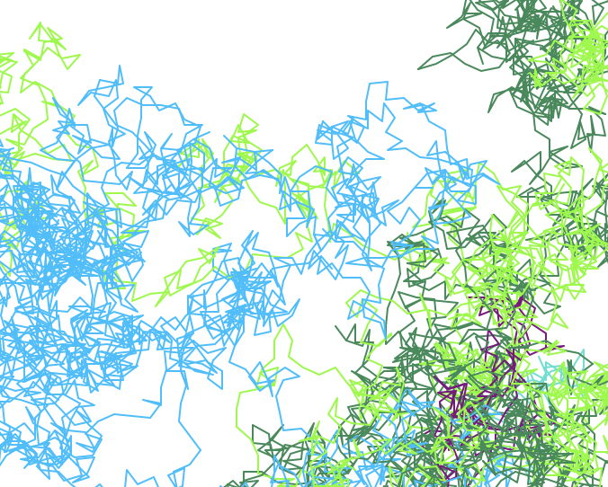

many turtles

```
import turtle
import random
colors = ['violet', 'turquoise', 'black', 
          'deepskyblue','lawngreen', 'seagreen ', 
          'royalblue', 'purple', 'red','orange']

turtles = []
for i in range(10):
    t = turtle.Turtle()
    t.color(random.choice(colors))
    t.speed(9000)
    turtles.append(t)


while True:
    for i in range(len(turtles)):
        t = turtles[i]
        t.setheading(random.randint(0,360))
        t.forward(10)
```

Lets practice making a new class, you see when we say Turtle() or Actor() we make a new instance of the class Turtle and the class Actor

The Class itself is like a blueprint of how to make a new instance of itself, for example lets make a class Point that has two properties, `x` and `y`

```
class Point:
    x = 0
    y = 0

points = []
for i in range(10):
    p = Point()
    p.x = i * 20
    p.y = i * 20
    points.append(p)

for p in points:
    print(p, p.x, p.y)
```

When you define a function in a class, you have access to special parameter, `self` which is the instance on which this function is called:

```
class Dog:
    name = ''
    def bark(self):
        print(self.name+' woof woof woof')

max = Dog()
max.name = 'Maxie'
max.bark()

rocky = Dog()
rocky.name = "Rocky"
rocky.bark()

```

There is also a special `__init__` function, called constructor that lets you pass parameters directly when you create the instance.

```
class Point:
    x = 0
    y = 0

    def __init__(self, x,y):
        self.x = x
        self.y = y

points = []
for i in range(10):
    p = Point(i * 10, i * 20)
    points.append(p)

for p in points:
    print(p, p.x, p.y)

```


## [DAY-131] Lists; Files; Dictionaries

Example dictionary, List and String

```
words = {}

words["some long key"] = True
words["x"] = 10

for k in words:
    print(k)
    print(words[k])


list_of_characters = ['a','b','c']

for i in range(len(list_of_characters)):
    print(i)
    print(list_of_characters[i])


s = "hello"
for i in range(len(s)):
    print(i)
    print(s[i])

```

You see how in the list and string we can address individual element or character by its index? In the dictionary we address things by their key, for example if i want to see the value of `some long key` I do `print(words["some long key"])`.

Now unrelated, but lets practice printing the first 100 numbers from a list.

```
a = []

for i in range(100):
    a.append(i)

for i in range(100):
    print(a[i])
```

Append to file, whatever command line agurments 1 and 2 are

```
import sys
f = open("account.txt", "a")

f.write(sys.argv[1] + " " + sys.argv[2] + "\n")

f.close()
```


## [DAY-132] Lists; Classes


a tower defense game


```
import pgzrun
import random

WIDTH=1024
HEIGHT=576

towers = []
enemies = []
bullets = []
game_over = False
background = Actor("grass_template2", pos=(0,0), anchor=(0,0))

player = Actor("c1", pos=(WIDTH/2, HEIGHT/2), anchor=('center','bottom'))
lives = 100
cash = 100
current_wave = 1

class Tower:
    def __init__(self, image, x,y, size):
        self.actor = Actor(image, pos=(x,y), )
        self.rect = Rect((x-size/2,y-size/2), (size,size))
        self.color =  (random.randint(100,250),random.randint(100,250),random.randint(100,250))
    def shoot(self):
        for e in enemies:
            if e.colliderect(self.rect):
                b = Actor("bullet3")
                b.x = self.actor.x
                b.y = self.actor.y
                b.hit = False
                animate(b, pos=(e.x,e.y), tween='accelerate', on_finished=lambda: bullets.remove(b))
                bullets.append(b)
                break

    def colliderect(self,other):
        return self.actor.colliderect(other)
    def draw(self):
        self.actor.draw()
        #screen.draw.rect(self.rect,self.color)

def shoot():
    global cash
    for t in towers:
        t.shoot()
    for e in list(enemies):
        if e.image == 'exploded':
            enemies.remove(e)
            cash+=1

def new_wave():
    global current_wave
    for i in range(current_wave * 10):
        e = Actor("c3")
        e.y = HEIGHT
        e.x = random.randint(int(WIDTH/3), int(WIDTH-WIDTH/3))
        enemies.append(e)
    current_wave += 1

def on_key_down(key):
    global cash
    if key == keys.K_1:
        if cash >= 10:
            conflict = False
            for t in towers:
                if t.colliderect(player):
                    conflict = True

            if not conflict:
                t = Tower("tower_grass",player.x, player.y, 150)
                towers.append(t)
                cash -= 10

def update():
    global game_over
    if keyboard.UP:
        player.y -= 5
    if keyboard.DOWN:
        player.y += 5
    if keyboard.LEFT:
        player.x -= 5
    if keyboard.RIGHT:
        player.x += 5

    for e in enemies:
        if e.image != 'exploded':
            e.y -= random.randint(-1,2)
        for b in bullets:
            if b.colliderect(e):
                e.image = 'exploded'
                b.hit = True
                break
        if not background.colliderect(e):
            game_over = True
    pass


clock.schedule_interval(shoot, 1)
clock.schedule_interval(new_wave, 10)

new_wave()

def draw():
    screen.clear()
    if game_over:
        screen.fill('blue')
    else:
        background.draw()
        screen.draw.text("current_wave: " + str(current_wave) + ", cash: " + str(cash) + ", lives: " + str(lives), (5,0),fontname="437-win")   

        for b in bullets:
            if not b.hit:
                b.draw()

        for e in enemies:
            e.draw()

        for t in towers:
            t.draw()

        player.draw()

pgzrun.go()
```


## [DAY-133] Touch Typing; Lists

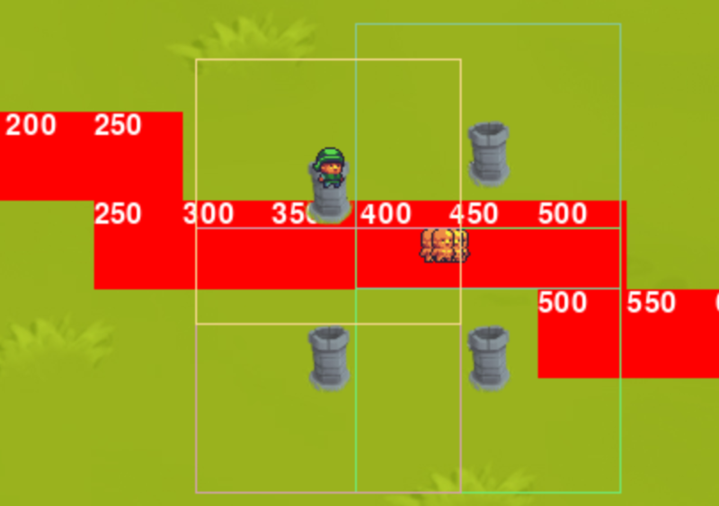

Spend 15 minutes touch typing.

Add a path for the enemies to walk on.

The most important part is to think about, how would you follow a path, in this example we will follow a path by picking a next element to walk towards.

This is the most important part of the change, it is an what is called an algorithm, it is a sequence of steps to solve a problem. We can describe it in words: **find the current square you are colliding it, find which square is next in the list, start walking towards it**. Now lets write it down:

```

[...]

path = [
    Rect(0, HEIGHT/2, 50, 50),
    Rect(50, HEIGHT/2, 50, 50),

[...]

def update():

[...]

    for e in enemies:
        if e.image != 'exploded':
            destination = None
            for (i, p) in enumerate(path):
                if e.colliderect(p) and i < len(path) - 1:
                    destination = path[i+1]
                    break

            if destination != None:
                center_x = destination.x + 25
                center_y = destination.y + 25
                if e.x < center_x:
                    e.x += random.randint(0, 2)
                if e.x > center_x:
                    e.x -= random.randint(0, 2)
                if e.y > center_y:
                    e.y -= random.randint(0, 2)
                if e.y < center_y:
                    e.y += random.randint(0, 2)

[...]

```

```
import pgzrun
import random

WIDTH = 1024
HEIGHT = 576

towers = []
enemies = []
bullets = []
game_over = False
background = Actor("grass_template2", pos=(0, 0), anchor=(0, 0))


path_size = 50
path = [
    Rect(0, HEIGHT/2, 50, 50),
    Rect(50, HEIGHT/2, 50, 50),
    Rect(50, HEIGHT/2 + 50, 50, 50),
    Rect(100, HEIGHT/2 + 50, 50, 50),
    Rect(150, HEIGHT/2 + 50, 50, 50),
    Rect(200, HEIGHT/2 + 50, 50, 50),
    Rect(250, HEIGHT/2 + 50, 50, 50),
    Rect(250, HEIGHT/2 + 100, 50, 50),
    Rect(300, HEIGHT/2 + 100, 50, 50),
    Rect(350, HEIGHT/2 + 100, 50, 50),
    Rect(400, HEIGHT/2 + 100, 50, 50),
    Rect(450, HEIGHT/2 + 100, 50, 50),
    Rect(500, HEIGHT/2 + 100, 50, 50),
    Rect(500, HEIGHT/2 + 150, 50, 50),
    Rect(550, HEIGHT/2 + 150, 50, 50),
    Rect(600, HEIGHT/2 + 150, 50, 50),
    Rect(650, HEIGHT/2 + 150, 50, 50),
    Rect(650, HEIGHT/2 + 200, 50, 50),
    Rect(700, HEIGHT/2 + 200, 50, 50),
    Rect(750, HEIGHT/2 + 200, 50, 50),
    Rect(800, HEIGHT/2 + 200, 50, 50),
    Rect(850, HEIGHT/2 + 200, 50, 50),
    Rect(850, HEIGHT/2 + 150, 50, 50),
    Rect(850, HEIGHT/2 + 100, 50, 50),
    Rect(850, HEIGHT/2 + 50, 50, 50),
    Rect(850, HEIGHT/2 + 0, 50, 50),
    Rect(850, HEIGHT/2 - 50, 50, 50),
    Rect(850, HEIGHT/2 - 100, 50, 50),
    Rect(900, HEIGHT/2 - 100, 50, 50),
    Rect(950, HEIGHT/2 - 100, 50, 50),
    Rect(1000, HEIGHT/2 - 100, 50, 50),
    Rect(1050, HEIGHT/2 - 100, 50, 50),
    Rect(1100, HEIGHT/2 - 100, 50, 50),
]


player = Actor("c1", pos=(WIDTH/2, HEIGHT/2), anchor=('center', 'bottom'))
lives = 100
cash = 100
current_wave = 1


class Tower:
    def __init__(self, image, x, y, size):
        self.actor = Actor(image, pos=(x, y), )
        self.rect = Rect((x-size/2, y-size/2), (size, size))
        self.color = (random.randint(100, 250), random.randint(
            100, 250), random.randint(100, 250))

    def shoot(self):
        for e in enemies:
            if e.colliderect(self.rect):
                b = Actor("bullet3")
                b.x = self.actor.x
                b.y = self.actor.y
                b.hit = False
                animate(b, pos=(e.x, e.y), tween='accelerate',
                        on_finished=lambda: bullets.remove(b))
                bullets.append(b)
                break

    def colliderect(self, other):
        return self.actor.colliderect(other)

    def draw(self):
        self.actor.draw()
        screen.draw.rect(self.rect,self.color)


def shoot():
    global cash
    for t in towers:
        t.shoot()
    for e in list(enemies):
        if e.image == 'exploded':
            enemies.remove(e)
            cash += 1


def new_wave():
    global current_wave
    for i in range(10 + (current_wave * 2)):
        e = Actor("c3")
        e.y = HEIGHT/2+10
        e.x = 0
        enemies.append(e)
    current_wave += 1


def on_key_down(key):
    global cash
    if key == keys.K_1:
        if cash >= 10:
            conflict = False
            for t in towers:
                if t.colliderect(player):
                    conflict = True

            for p in path:
                if player.colliderect(p):
                    conflict = True

            if not conflict:
                t = Tower("tower_grass", player.x, player.y, 150)
                towers.append(t)
                cash -= 10


def update():
    global game_over
    if keyboard.UP:
        player.y -= 5
    if keyboard.DOWN:
        player.y += 5
    if keyboard.LEFT:
        player.x -= 5
    if keyboard.RIGHT:
        player.x += 5

    for e in enemies:
        if e.image != 'exploded':
            destination = None
            for (i, p) in enumerate(path):
                if e.colliderect(p) and i < len(path) - 1:
                    destination = path[i+1]
                    break

            if destination != None:
                center_x = destination.x + 25
                center_y = destination.y + 25
                if e.x < center_x:
                    e.x += random.randint(0, 2)
                if e.x > center_x:
                    e.x -= random.randint(0, 2)
                if e.y > center_y:
                    e.y -= random.randint(0, 2)
                if e.y < center_y:
                    e.y += random.randint(0, 2)

        for b in bullets:
            if b.colliderect(e):
                e.image = 'exploded'
                b.hit = True
                break
        if not background.colliderect(e):
            game_over = True
    pass


clock.schedule_interval(shoot, 1)
clock.schedule_interval(new_wave, 10)

new_wave()


def draw():
    screen.clear()
    if game_over:
        screen.fill('blue')
    else:
        background.draw()

        screen.draw.text("current_wave: " + str(current_wave) + ", cash: " +
                         str(cash) + ", lives: " + str(lives), (5, 0), fontname="437-win")

        for i in range(len(path)):
            p = path[i]
            screen.draw.filled_rect(p,(255,0,0))
            screen.draw.text(str(p.x), (p.x,p.y))
        for b in bullets:
            if not b.hit:
                b.draw()

        for e in enemies:
            e.draw()

        for t in towers:
            t.draw()

        player.draw()


pgzrun.go()
```


## [DAY-134] Lists; Methods

Upgrade our tower game, make it possible to:

* delete towers and get some money back
* be able to upgrade the tower's range

First we will store original `x`,`y` and `size` in the tower's instance, and then use it to increase its range.

Again pay attention when deleting from a list we are walking on (iterating on), we actually make a clone of the list and iterate over the clone, but remove items from the original list by value.

```
[...]

class Tower:
[...]
    def __init__(self, image, x, y, size):
        self.size = size
        self.x = x
        self.y = y
        self.actor = Actor(image, pos=(x, y))
        self.rect = Rect((x-size/2, y-size/2), (size, size))
        self.color = (random.randint(100, 250), random.randint(100, 250), random.randint(100, 250))

    def resize(self, bump):
        new_size = self.size + bump
        self.size = new_size
        self.rect = Rect((self.x-new_size/2, self.y-new_size/2), (new_size, new_size))
[...]

def on_key_down(key):
    global cash
    if key == keys.K_2:
        for t in towers:
            if t.colliderect(player):
                t.resize(5)
                cash -= 10
        
    if key == keys.D:
        for t in list(towers):
            if t.colliderect(player):
                cash += 15
                towers.remove(t)
[...]

```


## [DAY-134] If

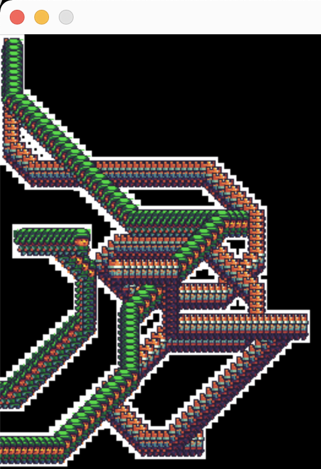

Relax day.

Make super simple game to draw with two players, because we dont clear the screen.

```
import pgzrun

HEIGHT = 800
WIDTH = 800

elf = Actor('c1')
king = Actor('c2')

def update():
    if keyboard.W:
        elf.y -= 5
    if keyboard.S:
        elf.y += 5
    if keyboard.A:
        elf.x -= 5
    if keyboard.D:
        elf.x += 5
    if keyboard.UP:
        king.y -= 5
    if keyboard.DOWN:
        king.y += 5
    if keyboard.LEFT:
        king.x -= 5
    if keyboard.RIGHT:
        king.x += 5


def draw():
    elf.draw()
    king.draw()

pgzrun.go()
```

## [DAY-135] Dictionary; For

[game-135](screenshots/game-135.mp3)


Make a morse code machine!

```
import pgzrun
import time

short = tone.create('A3', 0.3)
long = tone.create('D3', 0.7)

morse = {
    'a': [short, long],
    'b': [long, short, short, short],
    'c': [long, short, long, short],
    'd': [long, short, short],
    'e': [short],
    'f': [short, short, long, short],
    'g': [long, long, short],
    'h': [short, short, short, short],
    'i': [short, short],
    'j': [short, long, long, long],
    'k': [long, short, long],
    'l': [short, long, short, short],
    'm': [long, long],
    'n': [long, short],
    'o': [long, long, long],
    'p': [short, long, long, short],
    'q': [long, long, short, long],
    'r': [short, long, short],
    's': [short, short, short],
    't': [long],
    'u': [short, short, long],
    'v': [short, short, short, long],
    'w': [short, long, long],
    'x': [long, short, short, long],
    'y': [long, short, long, long],
    'z': [long, long, short, short]
}


def play(key):
    for t in morse[key]:
        t.play()
        time.sleep(1)
    time.sleep(1)


def on_key_down(key):
    if key == keys.A:
        play('a')
    if key == keys.B:
        play('b')
    if key == keys.C:
        play('c')
    if key == keys.D:
        play('d')
    if key == keys.E:
        play('e')
    if key == keys.F:
        play('f')
    if key == keys.G:
        play('g')
    if key == keys.H:
        play('h')
    if key == keys.I:
        play('i')
    if key == keys.J:
        play('j')
    if key == keys.K:
        play('k')
    if key == keys.L:
        play('l')
    if key == keys.M:
        play('m')
    if key == keys.N:
        play('n')
    if key == keys.O:
        play('o')
    if key == keys.P:
        play('p')
    if key == keys.Q:
        play('q')
    if key == keys.R:
        play('r')
    if key == keys.S:
        play('s')
    if key == keys.T:
        play('t')
    if key == keys.U:
        play('u')
    if key == keys.V:
        play('v')
    if key == keys.W:
        play('w')
    if key == keys.X:
        play('x')
    if key == keys.Y:
        play('y')
    if key == keys.Z:
        play('z')


def update():
    pass


def draw():
    pass


pgzrun.go()
```
## [DAY-136] For; Arrays; Memory

Lets make a super simple C program

Just to get familiar witht he syntax, it does not use indentation to group code, but {}, and also each variable has to have known type (size), e.g we have to tell the C compiler (compiler is a program that takes the text code and transforms it into machine code) that  `i` is of type `int` which on our computer is exactly 4 bytes long.

```
#include <stdio.h>
int main() {
    int sum = 0;
    for (int i = 0; i < 100; i++) {
        sum += 10;
    }

    printf("%d\n", sum);
}
```

When you execute `gcc -o foo foo.c` (if you save the program in foo.c), it will make the binary `foo`, do `cat foo` to see the actual binary made from the compiler. If you run `objdump -D foo` you will see the assembly code and the machine code corresponding to it.

`cat foo`:
```
????X? H__PAGEZERO?__TEXT@@__text__TEXT0?X0??__stubs__TEXT????__stub_helper__TEXT?????__cstring__TEXT????__unwind_info__TEXT??H???__DATA_CONST@@@@__got__DATA_CONST@?__DATA?@?@__la_symbol_ptr__DATA?__data__DA?H__LINKEDIT?@?"?? ?0?0h???H
                               P?? 
                                   /usr/lib/dyld9??
                                                   f:^?[c?υ02 

                                                              ?*(?0?
                                                                    8d
                                                                      /usr/lib/libSystem.B.dylib&`)h?UH??H???E??E??E??}?d??E???
?E??E???E???????u?H?=2??	?E?H??]??%r@L?q@AS?%a?h?????%d
0?44??4
       ??#Q@dyld_stub_binderQr?s@_printf?__mh_execute_header!main%?~??0?$ __mh_execute_header_main_printfdyld_stub_binder__dyld_privat
```

Because its a binary file, most of the bytes are not actually printable ASCII characters, you can use `hexdump` to see the byte's values:

`hexdump -C foo`

```
00000000  cf fa ed fe 07 00 00 01  03 00 00 00 02 00 00 00  |................|
00000010  10 00 00 00 58 05 00 00  85 00 20 00 00 00 00 00  |....X..... .....|
00000020  19 00 00 00 48 00 00 00  5f 5f 50 41 47 45 5a 45  |....H...__PAGEZE|
00000030  52 4f 00 00 00 00 00 00  00 00 00 00 00 00 00 00  |RO..............|
00000040  00 00 00 00 01 00 00 00  00 00 00 00 00 00 00 00  |................|
00000050  00 00 00 00 00 00 00 00  00 00 00 00 00 00 00 00  |................|
00000060  00 00 00 00 00 00 00 00  19 00 00 00 d8 01 00 00  |................|
00000070  5f 5f 54 45 58 54 00 00  00 00 00 00 00 00 00 00  |__TEXT..........|
00000080  00 00 00 00 01 00 00 00  00 40 00 00 00 00 00 00  |.........@......|
00000090  00 00 00 00 00 00 00 00  00 40 00 00 00 00 00 00  |.........@......|
000000a0  05 00 00 00 05 00 00 00  05 00 00 00 00 00 00 00  |................|
000000b0  5f 5f 74 65 78 74 00 00  00 00 00 00 00 00 00 00  |__text..........|
000000c0  5f 5f 54 45 58 54 00 00  00 00 00 00 00 00 00 00  |__TEXT..........|
000000d0  30 3f 00 00 01 00 00 00  58 00 00 00 00 00 00 00  |0?......X.......|
000000e0  30 3f 00 00 04 00 00 00  00 00 00 00 00 00 00 00  |0?..............|
000000f0  00 04 00 80 00 00 00 00  00 00 00 00 00 00 00 00  |................|
00000100  5f 5f 73 74 75 62 73 00  00 00 00 00 00 00 00 00  |__stubs.........|
00000110  5f 5f 54 45 58 54 00 00  00 00 00 00 00 00 00 00  |__TEXT..........|
00000120  88 3f 00 00 01 00 00 00  06 00 00 00 00 00 00 00  |.?..............|
00000130  88 3f 00 00 01 00 00 00  00 00 00 00 00 00 00 00  |.?..............|
00000140  08 04 00 80 00 00 00 00  06 00 00 00 00 00 00 00  |................|

[...]

```

`objdump -D foo`
```
[...]
100003f30: 55                           pushq   %rbp
100003f31: 48 89 e5                     movq    %rsp, %rbp
100003f34: 48 83 ec 10                  subq    $16, %rsp
100003f38: c7 45 fc 00 00 00 00         movl    $0, -4(%rbp)
100003f3f: c7 45 f8 00 00 00 00         movl    $0, -8(%rbp)
100003f46: c7 45 f4 00 00 00 00         movl    $0, -12(%rbp)
100003f4d: 83 7d f4 64                  cmpl    $100, -12(%rbp)
100003f51: 0f 8d 17 00 00 00            jge     0x100003f6e <_main+0x3e>
100003f57: 8b 45 f8                     movl    -8(%rbp), %eax
100003f5a: 83 c0 0a                     addl    $10, %eax
100003f5d: 89 45 f8                     movl    %eax, -8(%rbp)
100003f60: 8b 45 f4                     movl    -12(%rbp), %eax
100003f63: 83 c0 01                     addl    $1, %eax
100003f66: 89 45 f4                     movl    %eax, -12(%rbp)
100003f69: e9 df ff ff ff               jmp     0x100003f4d <_main+0x1d>
[...]
```

`addl` meand `add`, `jmp` means jump and so forth. This is not important for now, the point is that `gcc` which is a popular C compiler, will take your code and make it into machine code.

Lets have another example:


FizzBuzz

```
#include <stdio.h>
int main() {
    for (int i = 0; i < 100; i++) {
        if (i % 15 == 0) {
            printf("fizzbuzz\n");
        } else if (i % 5 == 0) {
            printf("buzz\n");
        } else if (i % 3 == 0) {
            printf("fizz\n");
        } else {
            printf("%d\n",i);
        }
    }
}
```

What is your name?

```
#include <stdio.h>
int main() {
    char input[20] = {0};
    while(1) {
        printf("What is your name: ");
        scanf("%s",input);
        printf("\nHello %s\n",input);
    }
}
```

You see how we say `char input[20]` which means we habe 20 elements of type `char` pointed by the input variable, it is literally just a pointer to some memory, and we can use `input[1]` to go to the address `input` plus 1 byte. Same with `int x[10]`, if we do x[3], it will go to the address pointed by `x` and add 3 * 4 to it.

We can make interesting bugs like that, because nobody will check if we go and read somewhere outside of the defined array:


```
#include <stdio.h>
int main() {
    char input[20] = {0};
    int b = 5;
    while(1) {
        printf("What is your name: ");
        scanf("%s",input);
        printf("\nHello %s\n",input);

        for (int i = 0; i < 40; i++) {
            printf("  %d -> %d -> %c\n", i, input[i],input[i]);
        }
    }
}

```

You will see some garbage from element 20 to 39, because it will actually go and read beyond the input bounderioes.


## [DAY-137] For; File; If

Play with [words.txt](words.txt)

Open the file and print all the lines:

```
f = open("words.txt")
for line in f:
    print(line)
```

Remove the newline:

```
f = open("words.txt")
for line in f:
    word = line.strip()
    print(word)
```

Print only words with more than 10 characters:

```
f = open("words.txt")
for line in f:
    word = line.strip()
    if len(word) > 10:
        print(word)
```

Print only words starting with 'ab':

```
f = open("words.txt")
for line in f:
    word = line.strip()
    if word[0] == 'a' and word[1] == 'b':
        print(word)
```

Print words not containing a character

```
f = open("words.txt")
for line in f:
    word = line.strip()
    if 'e' not in word:
        print(word)
```

Avoid words containing multiple characters

```
f = open("words.txt")
def avoid(word, characters):
    for c in characters:
        for w in word:
            if w == c:
                return False
    return True

for line in f:
    word = line.strip()
    if avoid(word, ['a','b','c']):
        print(word)
```

Another implementation using 'char' in 'string':

```
f = open("words.txt")

def avoid(word, characters):
    for c in characters:
        for c in word:
            return False
    return True

for line in f:
    word = line.strip()
    if avoid(word, ['a','b','c']):
        print(word)
```

Spinning turtle

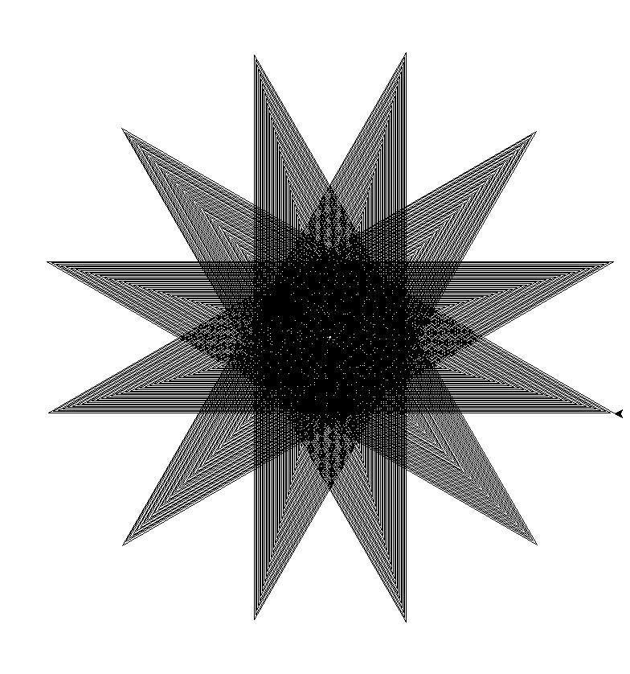


```
import turtle as t
size = 10
t.speed(10000)
while True:
    t.right(150)
    t.forward(size)
    size += 1
```

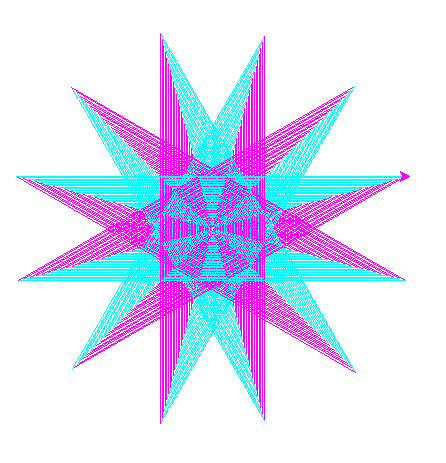

```
import turtle as t
size = 10
t.speed(10000)
while True:
    t.right(150)
    t.forward(size)
    if size % 2 == 0:
        t.color('cyan')
    else:
        t.color('magenta')
    size += 1

```

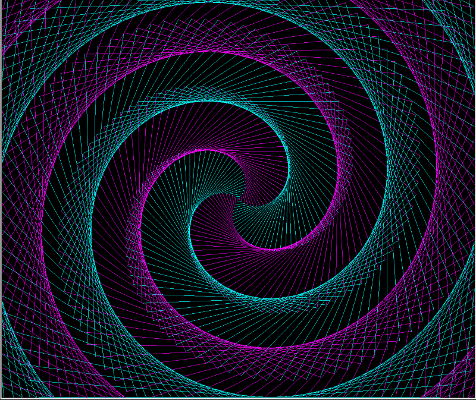

```
import turtle as t
size = 1
t.speed(100000)
t.bgcolor('black')
t.hideturtle()
i = 0
while True:
    if i % 2 == 0:
        t.color('cyan')
    else:
        t.color('magenta')
    t.forward(i*3)
    t.left(91)
    i+=1
```


```
from turtle import *
begin_fill()
color('red')
pensize(3)
left(48)
forward(133)
circle(50,200)
right(140)
circle(50,200)
forward(133)
end_fill()
done()
```

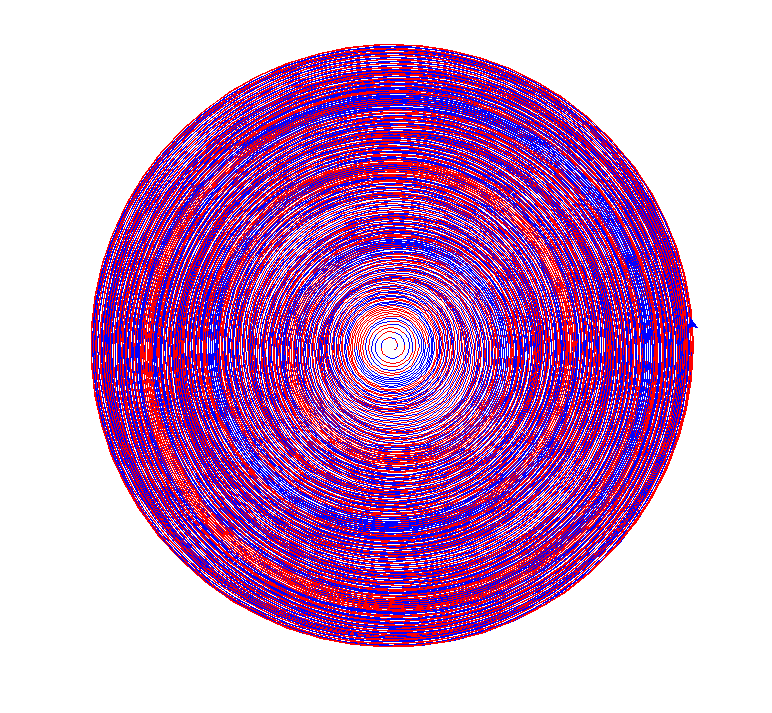


```
from turtle import *
size = 1
speed(10000)
while True:
    if size % 2 == 0:
        color('blue')
    else:
        color('red')

    circle(size, size * 5)
    size += 1
```


## [DAY-138] For; File; If

Take it easy.

Count how many lines have exactly 5 characters

```
fi = open('words.txt')
n = 0
for line in fi:
    w = line.strip()
    if len(w) == 5:
        n += 1
print(n)
```

How many words have 7 and how many 5 characters?

```
fi = open('words.txt')
n = 0
x = 0
for line in fi:
    w = line.strip()
    if len(w) == 5:
        n += 1
    if len(w) == 7:
        x += 1 
print(n)
print(x)
```
## [DAY-139] While; List; Counter

First touchtype for 20 minutes.

Then do some chill turtle shapes.

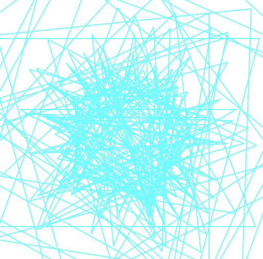

```
from turtle import *

speed(100000)
pencolor('cyan')
size = 66
while True:
    forward(size)
    left(size)
    size += 1
```

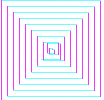

```
from turtle import *

c = ['cyan','magenta']
dist = 20

hideturtle()
speed(11)

while True:
    color(c[dist%2])
    forward(dist)
    left(90)
    dist = dist-3
```


## [DAY-140] While; Turtle; Strings

Read the strings chapter in the Thinking Python book.

Then do some chill turtle shapes.

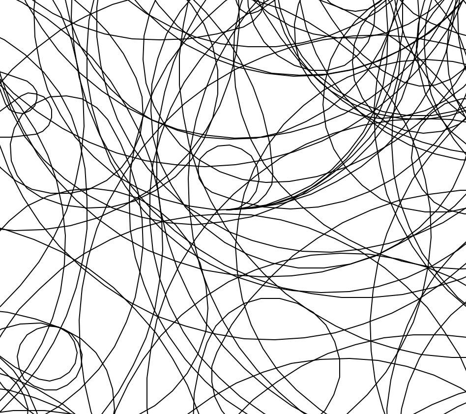

```
import turtle
import random
turtles = []
for i in range(5):
    a = turtle.Turtle()
    a.speed(10000)
    a.hideturtle()
    turtles.append(a)

while True:
    for x in turtles:
        size = random.randint(10,300)
        extent = random.randint(0, 360)
        x.circle(size, extent=extent)

```


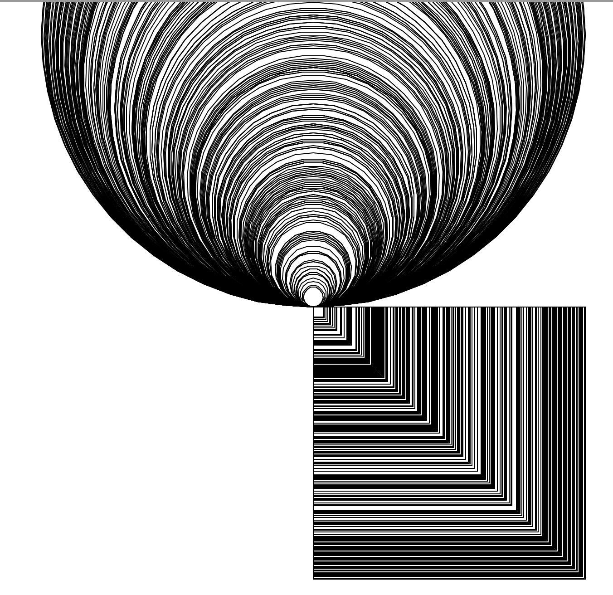

```
import turtle
import random
turtles = []
for i in range(5):
    a = turtle.Turtle()
    a.speed(10000)
    a.hideturtle()
    turtles.append(a)


while True:
    for x in turtles:
        size = random.randint(10,300)
        for i in range(4):
            x.forward(size)
            x.right(90)

        x.circle(size)
```


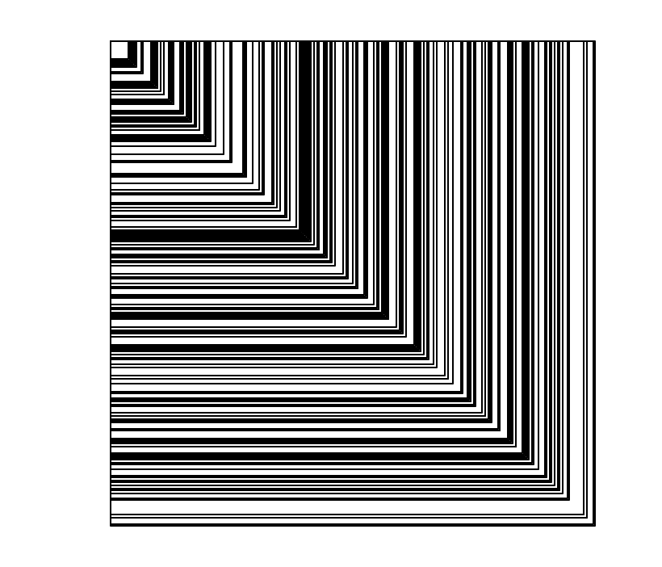

```
import turtle
import random
turtles = []
for i in range(5):
    a = turtle.Turtle()
    a.speed(10000)
    a.hideturtle()
    turtles.append(a)


while True:
    for x in turtles:
        size = random.randint(10,300)
        for i in range(4):
            x.forward(size)
            x.right(90)
```


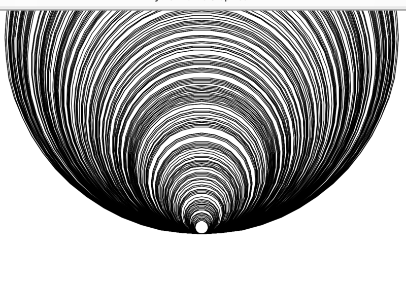

```
import turtle
import random
turtles = []
for i in range(5):
    a = turtle.Turtle()
    a.speed(10000)
    a.hideturtle()
    turtles.append(a)


while True:
    for x in turtles:
        size = random.randint(10,300)
        x.circle(size)
```


## [DAY-141] Wiki; API

Today we are going to make a small app that uses wikipedia. First install the wikipedia package:
```
pip3 install wikipedia
```

```
import wikipedia as wiki

while True:
    what = input("search> ")
    summary = wiki.summary(what)
    print(summary)
    print('*' * 40)
```

Will search wikipeadia the string you input, like this:

```
search> leonadro da vinci
Leonardo da Vinci (15 April 1452 – 2 May 1519) was an Italian polymath of...
[...]
search>
```

Lets do the same but with pygame:

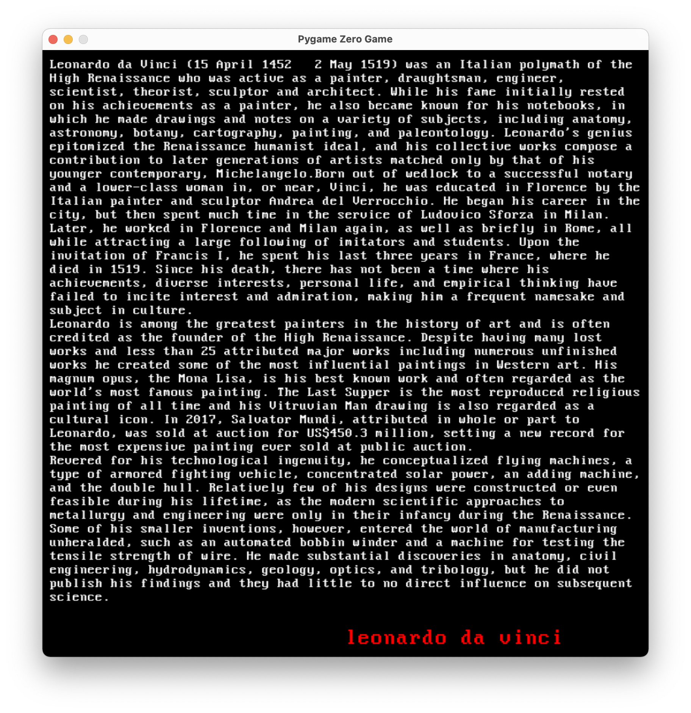

```
import wikipedia as wiki
import pgzrun

HEIGHT = 800
WIDTH = 800
text = ''
info = ''
def on_key_down(key, mod, unicode):
    global text, info
    if key == keys.BACKSPACE:
        if len(text) > 0:
            text = text[:-1]
    elif key == keys.RETURN:
        info = wiki.summary(text)
        text = ''

    elif len(unicode) > 0 and ord(unicode) >= 32 and ord(unicode) <= 126:
        text += unicode


def draw():
    screen.clear()
    screen.draw.text(info, (10,10), fontsize=18,fontname="437-win", width=WIDTH-20)
    screen.draw.text(text, (WIDTH/2,HEIGHT - 40), color=(255,0,0), fontsize=30,fontname="437-win")

pgzrun.go()
```

What does this do actually? How does the wikipedia module work? First thing you want to check is the documentation page, https://pypi.org/project/wikipedia/ and then you can also check the source code: https://github.com/goldsmith/Wikipedia

Next you would like to think, how would this python module download the data from wikipedia.

What it actually does, is it opens a web page, just a page that is specifically made to be easier to be read with programs, try to open: https://en.wikipedia.org/w/api.php?action=query&prop=extracts&format=json&explaintext=&titles=Dog which will be the page for `Dog`, you will see:

```
{"batchcomplete":"","query":{"pages":{"4269567":{"pageid":4269567,"ns":0,"title":"Dog","extract":"The dog or domestic dog
[...]
an end to the dinosaurs and the appearance of the first carnivoran...
[...]
Their personality traits include hypersocial behavior, boldnes
[...]
```

You can see the equivalent HTML page at https://en.wikipedia.org/wiki/Dog, The other page, which had structured data easier to read by python and any other programming language, is called API, Application Proggramming Interface. It just means that someone thought explicitly that their output will be read by programs and not people, and so they designed the interface that way. In the wikipedia example they return JSON.

JSON is data serialization format, its goal is to make it easy for programs to exchange data, for example I can have an array, or dictionary, and I want to make it easy for some other program to read it, so I use JSON to make it into text with special rules, and they can use their JSON decoder to make it into data.

```
>>> import json
>>> a = {"a":"b","c":3}
>>>
>>> print(json.dumps([1,2,a]))
[1, 2, {"a": "b", "c": 3}]
>>>
>>> d = json.loads('[1, 2, {"a": "b", "c": 3}]')
>>> d
[1, 2, {'a': 'b', 'c': 3}]
```


You see how it looks similar to the wikipedia API output, we will go in depth in the JSON format some times later, the point now is to just recognize that there is a whole world of APIs that are gluing the programs on your computer, and even the internet together so they can communicate. JSON is one of the most common serialization protocol, but there are many many more.


## [DAY-142] While


today is again, chill turtle art

ever growing circle

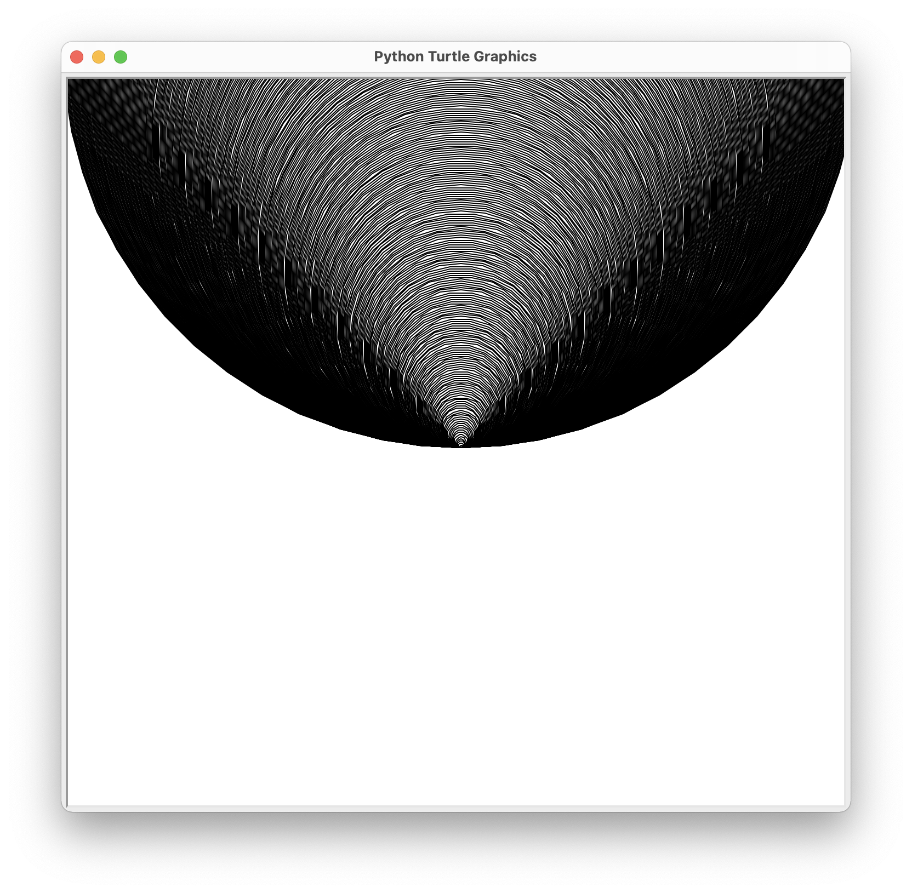

```
from turtle import *
speed(0)
size = 0
hideturtle()
while True:
    size += 1
    circle(size)
```


evergrowing circle and also go into negative radius

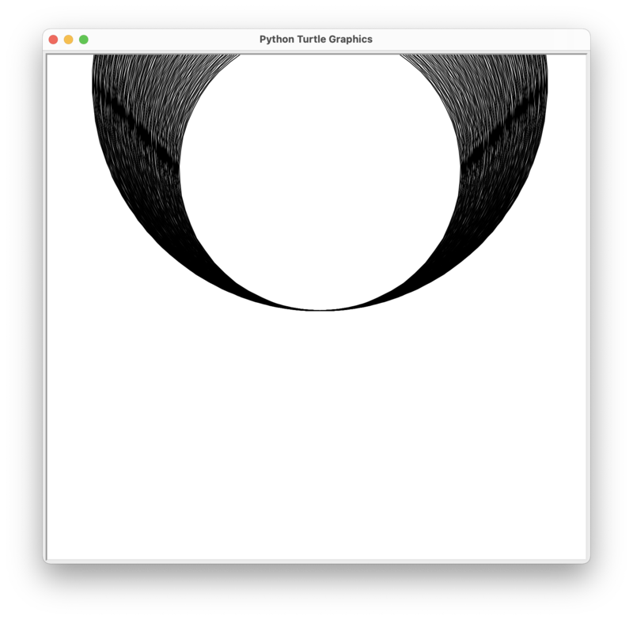


```
from turtle import *
speed(0)
size = 300
hideturtle()
while True:
    size -= 1
    circle(size)
```


stop when the bottom circle is the same as the top one

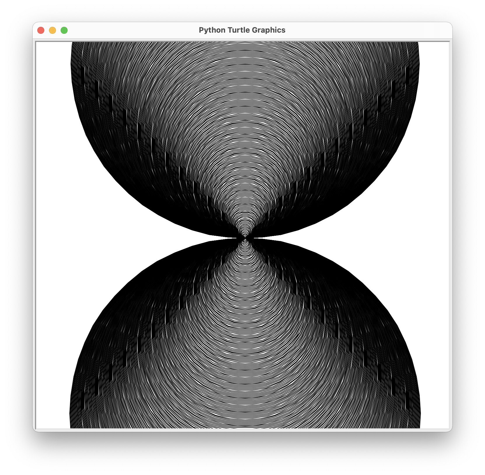


```
from turtle import *
speed(0)
size = 300
hideturtle()
while True:
    size -= 1
    circle(size)
    if size < -300:
        break
done()
```

make the circles more edgy

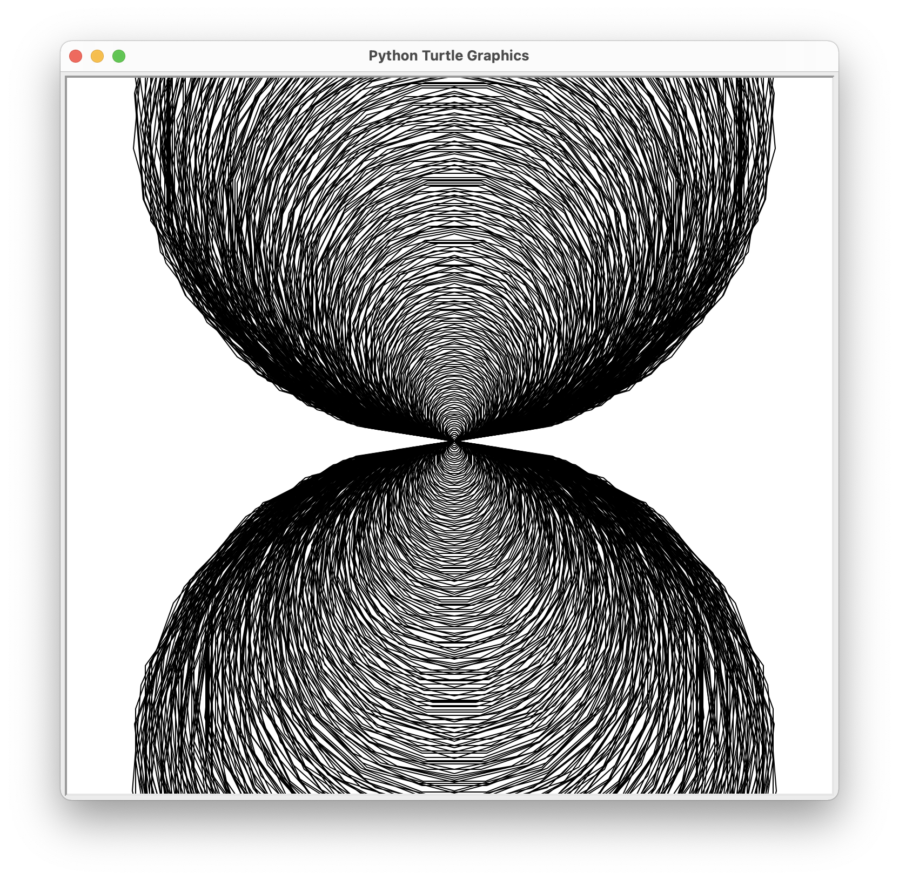


```
from turtle import *
import random
speed(0)
size = 300
hideturtle()
while True:
    #size -= 1
    circle(size, steps=random.randint(10,20))
    if size < -300:
        break
done()
```
## [DAY-143] Strings

Print the characters of a string one by one:

```
a = 'hello'
for i in a:
    print(i)
```

Print the characters and their index:

```
a = 'hello'
for i in range(0,len(a)):
    print(i, a[i])
```

Reverse the characters:

```
a = 'hey'
rev = ''
for i in range(0,len(a)):
    # i = 0
    # a[2 - 0] -> a[2] -> y
    # i = 1
    # a[2 - 1] -> a[1] -> e
    # i = 2
    # a[2 - 2] -> a[0] -> h
    print(i,a[len(a)-1-i])
    rev +=a[len(a)-1-i]
print(rev)
```

Google 'how to reverse a string in python'

```
a = 'hello'
b = a[len(a)::-1]
print(b)
```

check out the stackoverflow explanation at https://stackoverflow.com/questions/509211


Answer by Greg Hewgill, https://stackoverflow.com/users/893/greg-hewgill
```

It's pretty simple really:

a[start:stop]  # items start through stop-1
a[start:]      # items start through the rest of the array
a[:stop]       # items from the beginning through stop-1
a[:]           # a copy of the whole array
There is also the step value, which can be used with any of the above:

a[start:stop:step] # start through not past stop, by step
The key point to remember is that the :stop value represents the first value that
 is not in the selected slice. So, the difference between stop and start is the 
 number of elements selected (if step is 1, the default).

The other feature is that start or stop may be a negative number, which means it 
counts from the end of the array instead of the beginning. So:

a[-1]    # last item in the array
a[-2:]   # last two items in the array
a[:-2]   # everything except the last two items
Similarly, step may be a negative number:

a[::-1]    # all items in the array, reversed
a[1::-1]   # the first two items, reversed
a[:-3:-1]  # the last two items, reversed
a[-3::-1]  # everything except the last two items, reversed

Python is kind to the programmer if there are fewer items than you ask for. For example, 
if you ask for a[:-2] and a only contains one element, you get an empty list instead of 
an error. Sometimes you would prefer the error, so you have to be aware that this may happen.

Relation to slice() object
The slicing operator [] is actually being used in the above code with a slice() object 
using the : notation (which is only valid within []), i.e.:

a[start:stop:step]
is equivalent to:

a[slice(start, stop, step)]

Slice objects also behave slightly differently depending on the number of arguments, 
similarly to range(), i.e. both slice(stop) and slice(start, stop[, step]) are 
supported. To skip specifying a given argument, one might use None, so that e.g. 
a[start:] is equivalent to a[slice(start, None)] or a[::-1] is equivalent to 
a[slice(None, None, -1)].

While the :-based notation is very helpful for simple slicing, the explicit use of 
slice() objects simplifies the programmatic generation of slicing.
```

## [DAY-144] Strings; Lists

Sum the ascii of the elements of a list.

```
a = ['h','e','l','l','o']
sum = 0
for i in a:
    sum += ord(a)

print(sum)
```

Print its index, and the letter with the corresponding ascii

```
a = ['h','e','l','l','o']
sum = 0
for i in range(len(a)):
    m = ord(a[i])
    print('index: ', i, a[i], '=', m)
    sum += m

print(sum)
```

Now do the same with a string

```
a = 'hello'
sum = 0
for i in range(len(a)):
    m = ord(a[i])
    print('index: ', i, a[i], '=', m)
    sum += m

print(sum)
```

See how lists and strings both have len() and are indexable, meaning you can go to a specific index a[i] and do something.

You can mutate (change) the list, meaning you can change its content

```
a = ['h','e','l','o']
a[2] = 'b'
print(a)
```

But you can not change a string inplace:

```
a = 'hello'
a[2] = 'b'
print(a)
```

You will get `TypeError: 'str' object does not support item assignment`. If you want to change a string, you have to make a new one and reasign the variable to point to the new string.

```
a = 'hello'

a = a[0:2] + 'b' + a[3:5]
```

See how we make completely new string, made up from the parts of the old string, and also the letter 'b' in the middle, and we make the variable `a` point to the new string.


## [DAY-145] While

More turtle

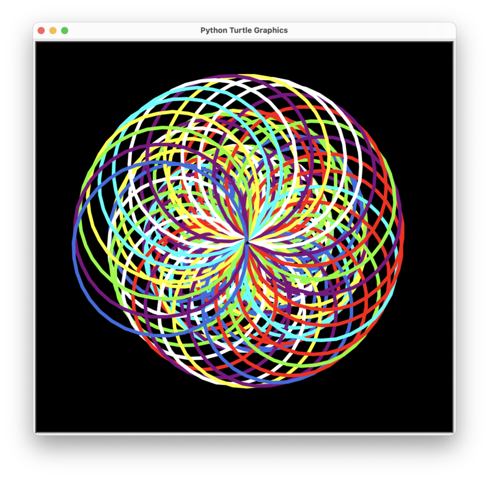


```
import turtle as t
import random

t.bgcolor('black')
t.pensize(6)
t.speed(0)

size = 20
colors =['cyan','royalblue','lawngreen','red','purple','white','yellow']

while True:
    t.pencolor(random.choice(colors))
    t.circle(size)
    t.left(12)

    size += 1
```

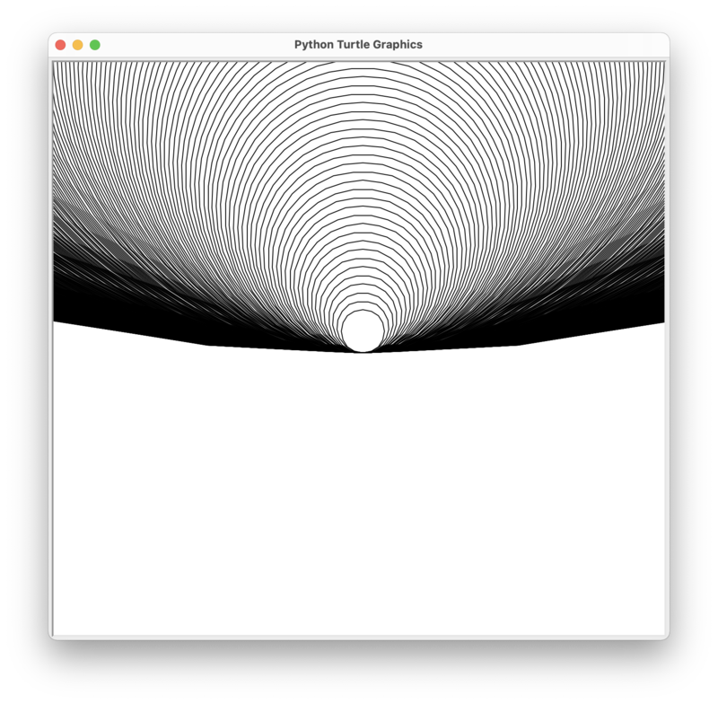


```
from turtle import *

size = 20
speed(0)
hideturtle()

while True:
    size += 5

    circle(size)
```

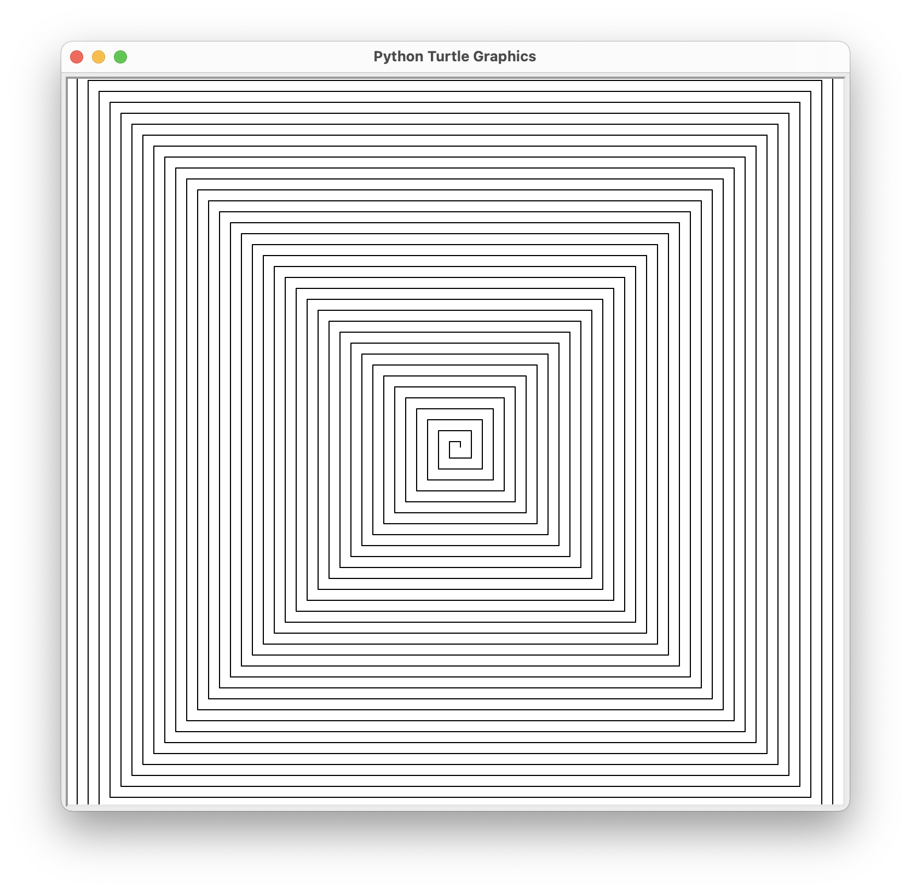

```
import turtle as t 

size = 0
t.speed(0)

while True:
    t.forward(size)
    t.left(90)

    size += 1
```


Lets talk again about Memory.

```
a = 'hello'
print(len(a))
a += 'b'
print(len(a))
print(a[2])
```

First lets imagine a simplified representation of the string 'hello' in memory. 

Lets imagine the computer memory as a long line of numbered boxes, so we can go directly to specific box

```
[-------------------------------------------------------------------------]
 0                                                                       1024
```

Each of the boxes can contain value between 0 and 255, so in order to store our string, we need at least 5 boxes, one for each letter, the memory does not understand such thing as character, only numnbers between 0 and 255, that is why we have the ASCII table, to have a standard how to represent characters as numbers in a common way. So we will store `h` which is 104 and, `e` which is 101, etc

Lets say that python finds out some free memory at address 555, and we just store 104,101,108,108,111, The problem with that is that we dont know when the string actually ends, so either we have to read to the first `0`, or we have to store the length of the string, and usually you store the length. So we will store the number 5, which we know is the length, and then the ASCII characters.

```
[--------------5 104 101 108 108 111----------------------------------------------]
 0             ^                                                                 1024
               555
```

Now the variable `a` just points to box 555, when we do `len(a)` we can just read the number stored at this address, and when we do `a[1]` we can read the value at address `555 + 1 + 1` which will give us (101)


What happens now when we do `a += 'b'`, this is the same as `a = a + 'b'`, which means ok, lets make a new string, with size `6` copy the original string there, and then add `b` (which is 98 in ascii) to the end. So python will try to find a space in memory for at least 7 bytes (6 for the string, and one for the lenth), and do the copy.

```
[--------------5 104 101 108 108 111------6 104 101 108 108 111 98----------------]
 0             ^                          ^                                      1024
             555                         763  
```


Imagine the next free space in memory is on address 763, it will copy the data from address 556 to 560 to address 764 to 769, it will put `98` on address 770 and of course it will place the number `7` (the length of the new string), on address 763. And now we have a new string, it will just re-assign the variable `a` to point to 763 instead of 555. Now the string on address 555 is not referenecd by any variable, and if it is not used by anything else (e.g. a list that also points to it), it can be garbage collected, and memory can be marked as free.


Lets talk about this code:

```
a = 'he'
b = 'lo'
c = 6
d = [a,b,c]
print(d[1])
```

One way python could represent a list is very similar to a string, you have length, and just addressess of the elements


```
[---3 555 763 847-----------2 104 101 ----------------2 108 111 ------6-----------]
 0  ^                       ^                         ^               ^          1024
    125                    555                       763             847 
```


The variable d will point to address `125`, from there you have first element on address 555, second on 763 and third on 847, to do `print(d[1]`) means go to 125 + 1 + 1, and follow the pointer, so go to 555 ... and so on.

See there is a small problem because now python does not know if certain address contains a string, number or a list, so usually you need one more byte of information for the type of the object. Imagine 1 is for integer, 2 for string and 3 for list.

```
[---3 2 555 763 847-------2 2 104 101 --------------2 2 108 111 -----1 6----------]
 0  ^                     ^                         ^                ^           1024
    125                  555                       763               847 
```

ok now its eaier :) we know when we go to certain address of some data what to expect, so we know if we should print ascii or the number itself, or follow the reference to wherever it goes.   

## [DAY-146] While; Classes

Circles And Squares.

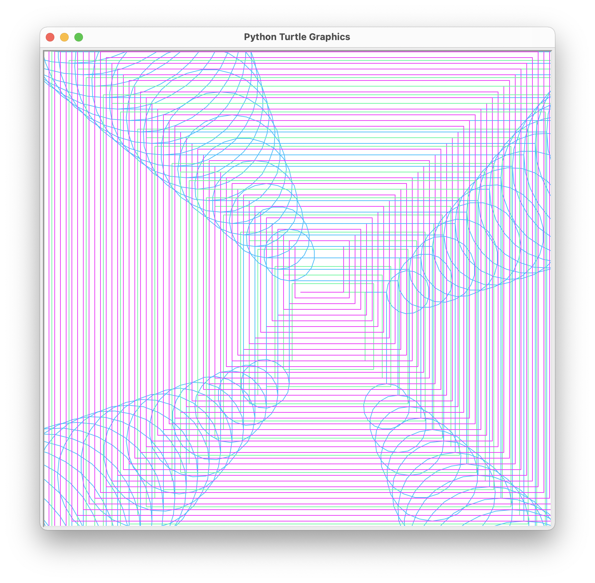


```
import turtle as t

a = t.Turtle()
a.speed(0)
a.pencolor('fuchsia')

b = t.Turtle()
b.speed(0)
b.pencolor('mediumspringgreen')


c = t.Turtle()
c.speed(0)
c.pencolor('deepskyblue')

size = 30

while True:
    a.forward(size*2)
    a.left(90)
    b.forward(size*3)
    b.right(90)
    c.forward(size*4)
    c.right(90)
    c.circle(size+1)

    size += 2
```


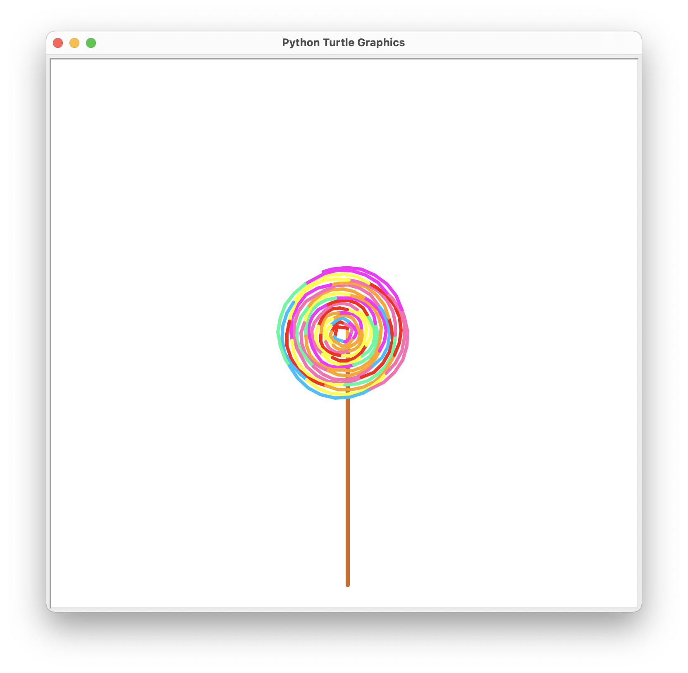


```
import turtle as t
import random

a = t.Turtle()
a.speed(0)

b = t.Turtle()
b.speed(0)

b.hideturtle()
a.hideturtle()

b.pensize(5)
a.pensize(4)

b.pencolor('chocolate')

b.right(90)
b.forward(300)

size = 0
for i in range(70):
    a.pencolor(random.choice(['red','orange','yellow','hotpink','magenta','deepskyblue','mediumspringgreen']))
    b.right(180)
    a.circle(size,extent=90)
    a.forward(10)
    a.right(5)
    size += 1
t.done()
```


## [DAY-147] While

Another flower

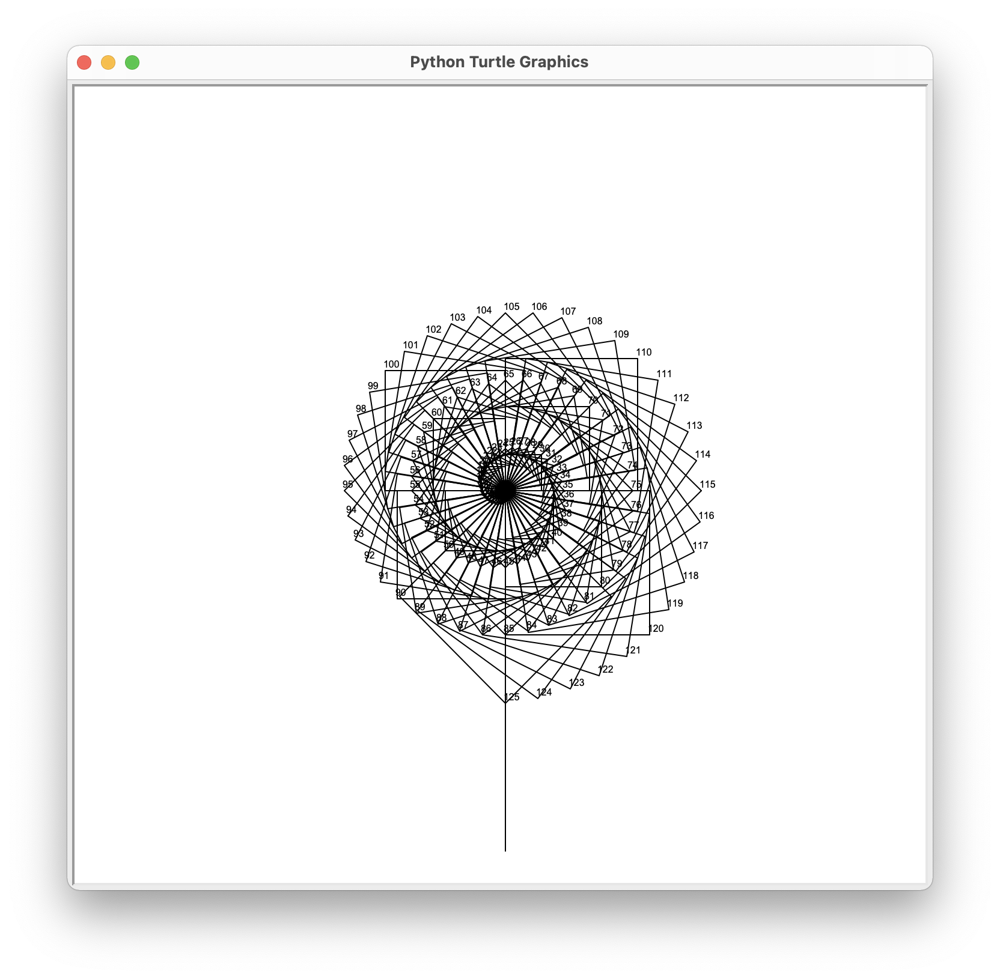


```
import turtle as t

a = t.Turtle()
a.speed(0)
a.right(90)
a.forward(300)
a.hideturtle()

b = t.Turtle()
b.speed(0)
b.hideturtle()

def square(charlie, size):
    for i in range(4):
        charlie.forward(size)
        if i == 1:
            charlie.write(str(size))
        charlie.right(90)

size = 0
while True:
    square(b,size)
    b.right(9)
    size += 1
    if size > 125:
        break

t.done()
```

## [DAY-148] Money

Every time you use something, ask yourself how does the company that made it make money. How can it be so expensive or so cheap, or worse, how can it be free.


Most of the things you own and use are made by for-profit companies, for-profit means that the company tries to maximize its revenue and profit. This is in contrast with non-profit organizations, which does not try to make more money than it needs in order to function. For example Wikipedia is run by Wikimedia Foundation, which is a non profit organization.

Revenue means how much money comes in the company by selling its products, and profit means the revenue minus the expenses it has to produce the product. For example, if we have a company to make video games, and we pay ourselves 1000 euro in salary, and we sell each video game for 2 euro, then if we sell 600 video games, we will have 1200 euro in revenue, and 200 euro in profit: `1200 revenue - 1000 expense = 200 profit`.

The profit also taxed, so we have to pay some percent from the profit to the government, lets say its 10%, so from 200 euro profit, we will pay 20 euro to the government, it will use those money to pay its employees, and pay for health insurance, social insurance, build infrastructure, and maybe small percent of those will go to research and development projects, such as CERN (a huge 30 kilometer underground tunnel with magnets, that smashes protons together to see what happens when they collide with speeds closer to the speed of light) or the international space station.

After all that, we will be left with 180 euro profit. Almost every for-profit organization will try to maximize this number, for example one way we can increase this is if we try to reduce the expenses, imagine we pay less for the developers and we pay them 800 euro instead of 1000, then it seems we will get 400 euro in profit (or 360 after tax), but maybe those developers will make a worse game, so we wont eb able to sell 600 copies, and we sell 450, and then instead of getting 400 profit we get `900 revenue - 800 expense = 100 profit`, or 90 after tax.


Now think about what it means for something to be free, like Fortnite, or Roblox, or TikTok or Instagram, or when something is sold below its production cost, like the PlayStation 3.

Lets take the PlayStation as an example, they were selling the console for 600$, but it cost them 840$ to produce, why would they do that? First think how Sony makes money, each game you buy for 60$ Sony gets 30%, so 18$ goes to sony, when you buy 20 games through the year, which is what an average person spends on video games, they get 360$ profit, so in one year they will break even after 1 year, but people use the same video console for multiple years, so every consecutive year they get more and more profit.

So on the surface it might seem like Sony is making money on the console itself, but this is actually not true.

Lets go over Roblox, how do they make money? Every developer that makes a game there is taking a cut from all the robux spent by players, and Roblox is taking 75.5% of each transaction, so when you buy something for 10$ roblox gets 7.5$ and the developer gets 2.5$. Roblox is distributed through Apple's app store, how does Apple make money? they take 30% of all payments made oh the platform, so apple will take 30% as well, so the 10$ you pay, 3$ go to Apple, 5.3$ goes to roblox and 1.7$ goes to the developers.


Now there are other companies, such as Facebook, where they actually do not sell you anything, but they sell you to their customers. They are selling the fact that they can make you do something you did not intend to do, like buy a skateboard or buy karaoke machine, so they use that to sell it to for-profit corporations who make skateboards and karaoke machines.

In order for them to do that, they need to be very very precise with their predictions, what exactly they can make you do and when. That requires immense amount of data, so they have to track every possible thing. For example when you are walking, your phone has an accelerometer that can see how is the phone oriented in space (x,y,z) so just by that they can see when you are walking to somebody, or when you are in the same mall with somebody, or are you in school? which people are in the same school because the basket you put your phones in is the same for all students in your class, etc. They must record every time you scroll a video, or you hesitate to scroll.

Facebook makes about 30 euros per month for each user they are selling.

Homework:

* Why do you think whatsapp is free?
* Why is google translate free?
* Why is google maps free?
* Why is google search free?
* Why is fortnite free?
* Why is youtube free?
* How is tocaboca making money?
* How are the youtube content creators making money?
* How does H&M make money?

A good thing to think about is also why are some things so expensive, how can we have smartphones for 50$ and for 2000$, what is the difference, Apple's hardware is surely expensive but is the difference between 32G phone ans 128G phone really that much? Why are the airpods 200$ when there are better headphones for 100$. Apple's physical product is not just the product you are buying, you are also buying the apple brand, which is valued very highly by the people. So even if somebody makes "better" product physically, it is not better overall, and many people still prefer Apple.

It is important to think about the product sa s combination of things, the physical/virtual product, the experience, the story, the brand, the scarcity, the timing.. everything is important.

Interestingly Apple first makes money by selling you the devices, and secondly they make money from each in-app purchase you do on those devices (e.g. robux or fortnite money). Apple made 33 billion dollars from the app store alone.

How much can a company optimize its profits? Some companies are abusing humans in the other end of the world so the product is cheaper and more competitive. The moment one company does that, all other companies have no option but to do the same thing so they are competitive. Imagine H&M or C&A, how come a jacket costs 20$? and it comes in all the way from China, it is made, loaded on a ship, sailed for 1 month and came to Rotterdam, where it was put on a truck and then an employee unloaded it and put it on display in the Mall, where they have to pay at least 20000$ per month rent. How much does the cotton cost? How much it costs to be picked from the plants, and then made into fabric, sewed and packed? How can the jacket be 20$?

This is called 'race to the bottom', when one company discovers a way to make their products cheaper, the other companies have to immidiately adapt otherwise they will lose their customers. Imagine tomorrow a new company comes and starts selling jackets for 15$, then H&M has to figure out how to make them for 15$ instead of 20$. Maybe H&M will make a contract with Apple and put 'APPLE IS THE BEST' on their jackets and then reduce the cost to 15$, or it will find a way to reduce the amount of cotton it uses, or will come up with more innovative technology to make the sewing cheaper, or it will hire cheaper labor. Sometimes they will say, oh lets sell online so we dont have to pay 20000$ per month for rent in the mall.

The 'race to the bottom' is very interesting, because it seems its making things cheaper and faster, but it is also decreasing the salaries as much as it possibly can, the salaries of the very same people who are also buying products. So they actually have less money to buy products, which makes it even more important to build cheaper products. But there are certain minimums, like raw resources needed, for example how much ground you have to grow cotton on is fixed.

Another thing that H&M can do, is simply talk with C&A and agree that they wont sell jackets below 20$, regardless how much it costs them to make, so if someone finds a way to make them for 15$ they will just make 5$ more profit, because the consumers can only chose between 20$ jackets. Or they can buy all other manufacturers of jackets and start selling jackets for 60$ instead of 20, purely because they can. The government has rules about how companies can merge together, and is trying to protect its citizens from situations like that, but it is very very difficult thing to regulate.

A lot of people in the world work as much as it is required so they do not get fired, and their employers pay them the minimum so they dont quit. The relationship between worked and employer is very complicated. You will see when you grow up, you will have jobs that you hate, and jobs that you love. Be especially carefull with the jobs that you love. They say 'do what you love and never work a day in your life', but what they dont say, is that you are consuming that love, little by little, like an artist who is paid to draw something he thinks is ugly, they will need the money, and the real price the artist will pay is love. The love for your craft is not infinite. It is ok to hate your job, it is also ok to love your job. You must never judge anyone's job, as all jobs have a cost that you do not understand, some pay with love, some with hate, some with time, and all people live a life you do not understand, just as they can not understand your life.

You will study a lot of theories when you grow up, about how money flows, or how the free market works, or how the capitalist or socialist system is flawed, the most important thig to remember is to go back to first principles: `how is something made, who makes it and who profits from it`, and profit does not have to be money, could be anything that people value such as: comfort, status, fame, pride, etc.
