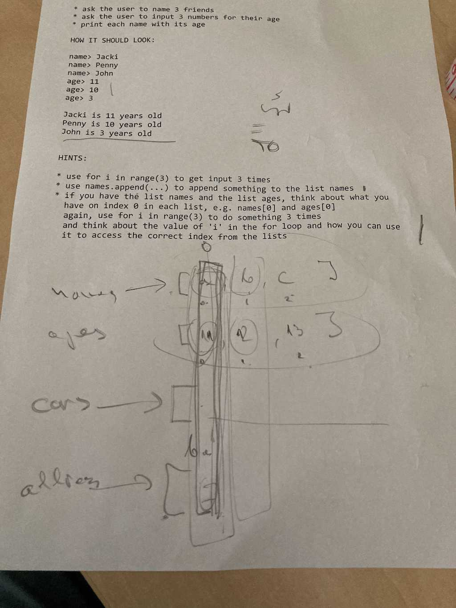
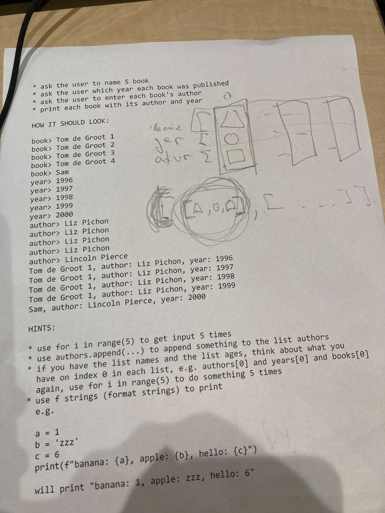

## [DAY-246] strings

```
# make a function to count how many times a given character
# appears in a string

def count(c, s):
    # .. count how many times `c` appears in `s`
    # example string s "hello"
    # example character c "l"
    return 0


n = count("l","hello")
print(f"character l appears {n} times")

# what would happen if we do: n = count(1, [1,2,3,4,1,5])

```


## [DAY-247] lists



```
* ask the user to name 3 friends
* ask the user to input 3 numbers for their age
* print each name with its age

HOW IT SHOULD LOOK:

name> Jacki
name> Penny
name> John
age> 11
age> 10
age> 3

Jacki is 11 years old
Penny is 10 years old
John is 3 years old


HINTS:

* use for i in range(3) to get input 3 times
* use names.append(...) to append something to the list names
* if you have the list names and the list ages, think about what you
  have on index 0 in each list, e.g. names[0] and ages[0]
  again, use for i in range(3) to do something 3 times
  and think about the value of 'i' in the for loop and how you can use
  it to access the correct index from the lists
```

## [DAY-248] lists



```
* ask the user to name 5 book
* ask the user which year each book was published
* ask the user to enter each book's author
* print each book with its author and year

HOW IT SHOULD LOOK:

book> Tom de Groot 1
book> Tom de Groot 2
book> Tom de Groot 3
book> Tom de Groot 4
book> Sam
year> 1996
year> 1997
year> 1998
year> 1999
year> 2000
author> Liz Pichon
author> Liz Pichon
author> Liz Pichon
author> Liz Pichon
author> Lincoln Pierce


Tom de Groot 1, author: Liz Pichon, year: 1996
Tom de Groot 1, author: Liz Pichon, year: 1997
Tom de Groot 1, author: Liz Pichon, year: 1998
Tom de Groot 1, author: Liz Pichon, year: 1999
Sam, author: Lincoln Pierce, year: 2000


HINTS:

* use for i in range(5) to get input 5 times
* use authors.append(...) to append something to the list authors
* if you have the list names and the list ages, think about what you
  have on index 0 in each list, e.g. authors[0] and years[0] and books[0]
  again, use for i in range(5) to do something 5 times
* use f strings (format strings) to print
  e.g.
  
  a = 1
  b = 'zzz'
  c = 6
  print(f"banana: {a}, apple: {b}, hello: {c}")

  will print "banana: 1, apple: zzz, hello: 6"
```

## [DAY-249] lists

```
* ask the user for 5 books:
  book's title
  book's author
  book's year


HOW IT SHOUDL LOOK:

title> Tom de Groot 1
author> Liz Pichon
year> 1996
---------------
title> Tom de Groot 2
author> Liz Pichon
year> 1997
---------------
title> Tom de Groot 3
author> Liz Pichon
year> 1998
---------------
title> Tom de Groot 4
author> Liz Pichon
year> 1998
---------------
title> Sam
author> Lincoln Pierce
year> 200
---------------
Tom de Groot 1, author: Liz Pichon, year: 1996
Tom de Groot 1, author: Liz Pichon, year: 1997
Tom de Groot 1, author: Liz Pichon, year: 1998
Tom de Groot 1, author: Liz Pichon, year: 1999
Sam, author: Lincoln Pierce, year: 2000


HINTS:

* use 1 list of 3 elements to represent a book
  [title, author, year]
  append this small list to a big list of books
  
```
