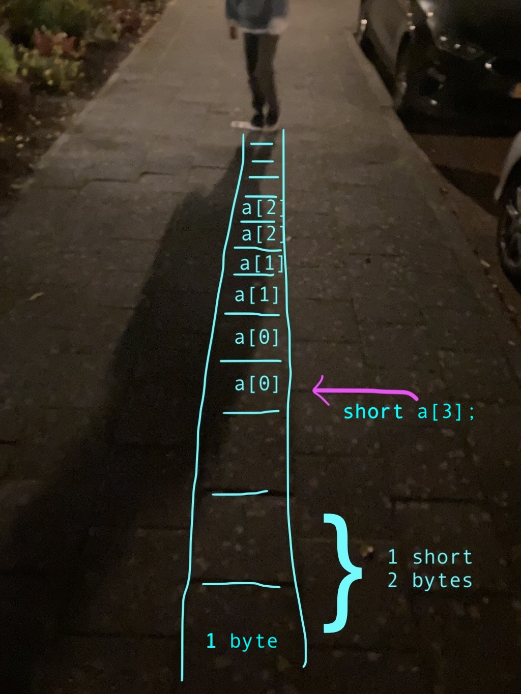
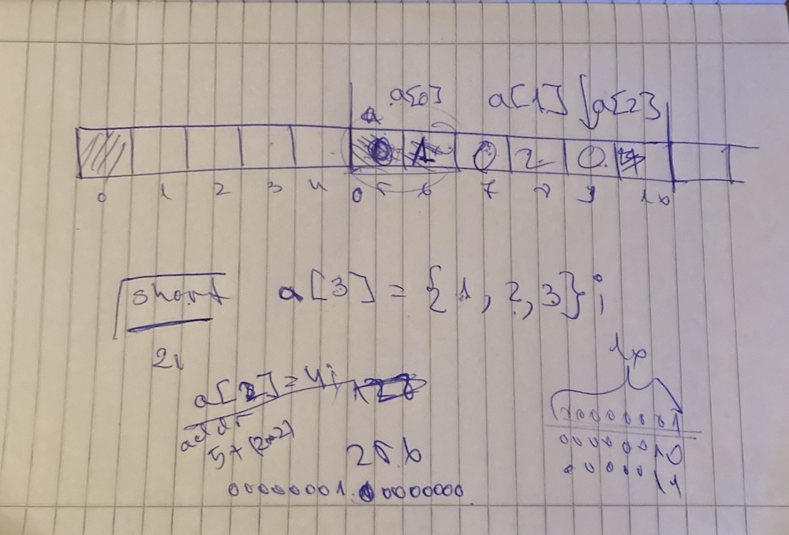

## [DAY-253] dictionaries

```
* COUNT

write a function to count how many times elements appear in a list

def count(a):
    b = {}
    # ....
    return b

print(count([1,2,1,1,"aaa","bbb",1,1,2,2,1,"aaa",1,1,1,3,4]))

# should print
# {1: 9, 2: 3, 'aaa': 2, 'bbb': 1, 3: 1, 4: 1}

HINTS:

to check if a key is in a dictionary use 'in':

d = {}
k = "hello"
if k in d:
    print("YES")
else:
    print("NO")


think about a dictionary table that looks like this:

key   | value
------+------
"aaa" | 2
1     | 9
...
```


## [DAY-254] memory

> The goal of today was to understand deeply what 'equals' means and what variables mean, we discussed the following code:

```
x = 3
y = 4

y = x
x = 6
print(y)
```

```
x = [1,2]
y = [3,4]

y = x
x.append(6)
print(y)
```

```
x = [1,[3,4]]
y = x[1][1]

x[1][1] = 6
print(y)
```

```
x = "abc"
y = x[1]

x = "def"
print(y)
```


Assuming very very simplfied memory model, but discussing the difference about value and pointer, and how pointers are just numbers of the address of the thing they point to. We used pen and paper, and I will attach the notes as we were talking through it, but you will have come up with your own way to explain it and use whatever you think is needed, e.g. you can use an array of cards to represent memory, or use minecraft to build a long line of blocks, or whatever works for you. We also spent fair bit of time on talking how the code is also in memory and it is not different than any value you store in memory. 


The main focus was on `x = 3` means: python will find some space in memory, lets say on address 13, and will put the value 3 there, later when I do `y = 4` it will do the same, find some empty place e.g. address 17, and put the value 4 there. So when I do `y = x`, it will actually load the value of address 13 in some register, and then put it on address 17, the processor does not know about x or y, it just knows addresses and what to do with them (load/store etc).

Now the big difference is when we do `x = [1,2]`, then first we need to put the list somewhere in memory, e.g. addr 20, and the value of x is actually the address of that list, so lets say x is on address 5, then the value on address 5 is actually 20, so when we do `y = x` it will just go to address 5, load the value in register, and then store it at wherever y is (e.g. address 15). So now both x and y point to address 20.

> at this point you have to listen and look at the body language and take your time, I also discussed how does it know if a value is a regular or an address, the difference between how python and C does it and other things, we also spent some time on the binary numbers and why a byte, or 8 bits, has 256 values.


## [DAY-255] memory





As we were walking to the store, I used the pavement blocks to talk about arrays and how you get to specific index in an array, how arrays blocks have the same size, and the difference between lists and arrays, and why lists need pointers.

When we got home, I challenged her to open her computer and name all the components.


## [DAY-256] prank

Today we didnt have a lesson, but I started and minimized the following program on her computer:

```
import pyautogui
import random
import time

while True:
    pyautogui.write(' ')
    time.sleep(random.randint(10,20))
```

which randomly pressess the space bar every 10-20 seconds :D


## [DAY-257] arrays



Today's lesson was only 5 minutes, going again over how you access array of shorts.


## [DAY-258] lists

Using only Notepad and CMD, write a small program that prints a list with the numbers from 300 to 999. Make a function that takes a range and returns a list with the numbers from A to B.

```
def numbers(a,b):
	x = []
	for i in range(a,b):
		x.append(i)
	return x
 	
a = numbers(300,1000)
print(a)
```

Write the code only in notepad, then run the python program from your command prompt.

> we also discussed scope, how the `a` in the parameters is not the same `a` used to print.


## [DAY-259] lists

Using only Notepad and CMD write a program to make a list of the even numbers from 0 to 100 and then print the list


```
a = []
for i in range(100):
    if i % 2 == 0:
        a.append(i)
print(a)
```
