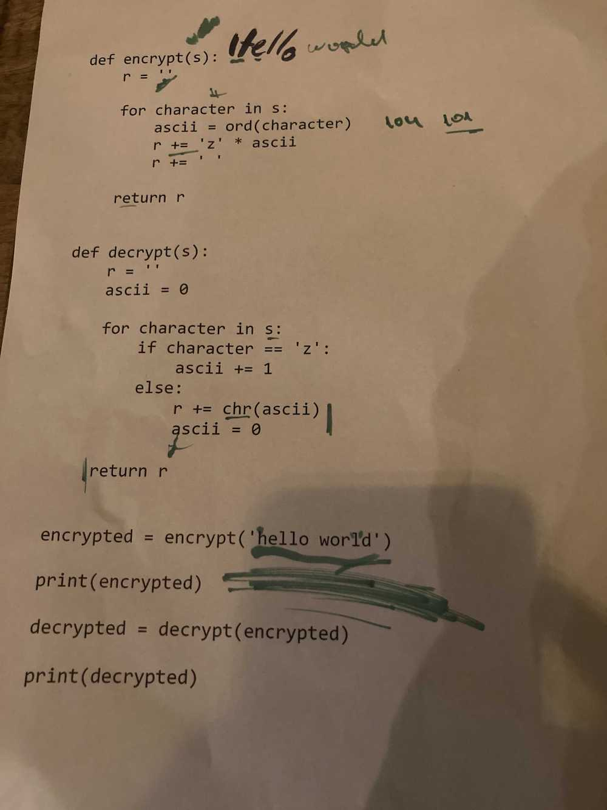
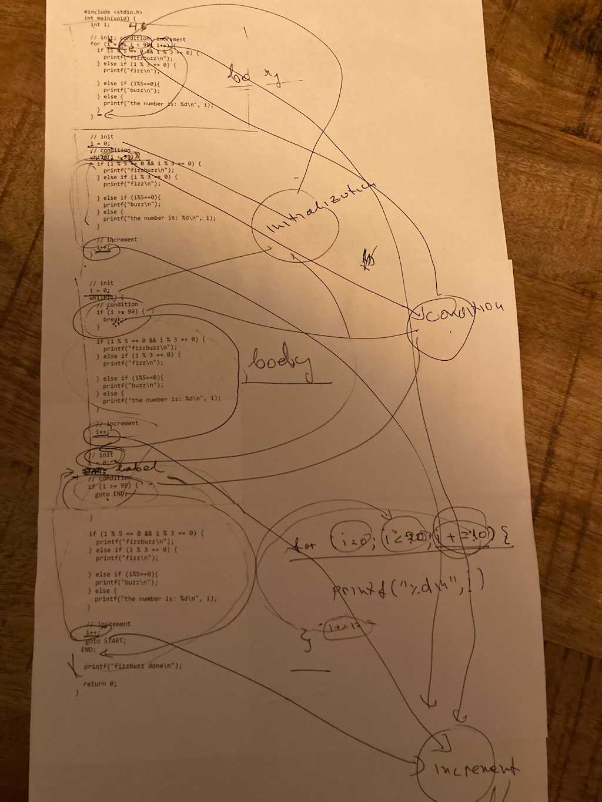
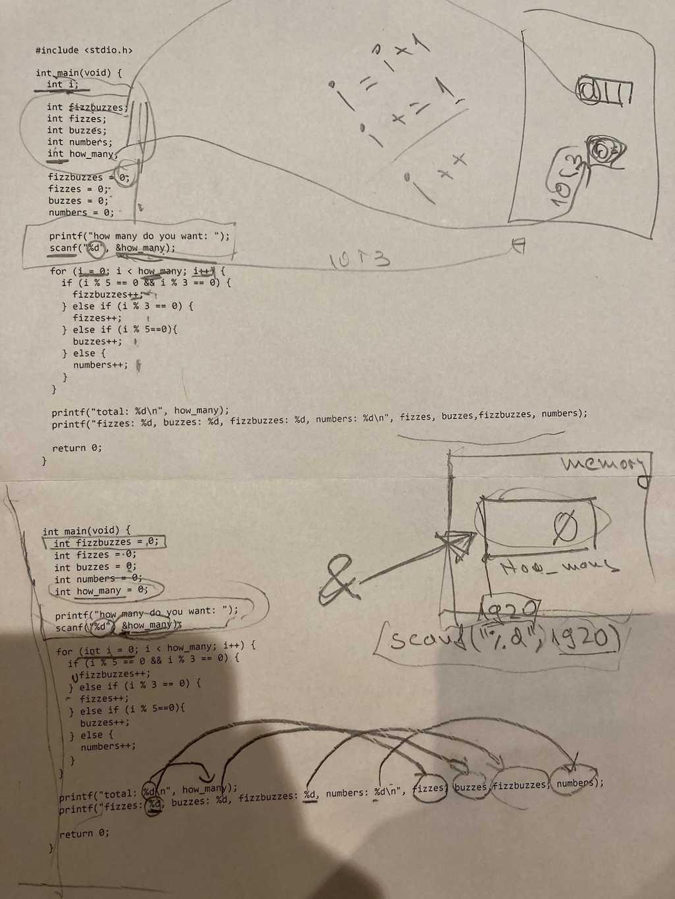
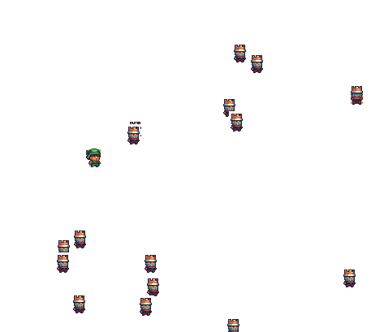
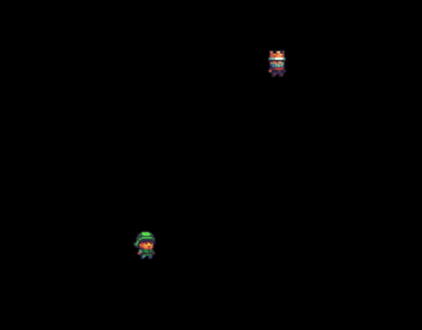
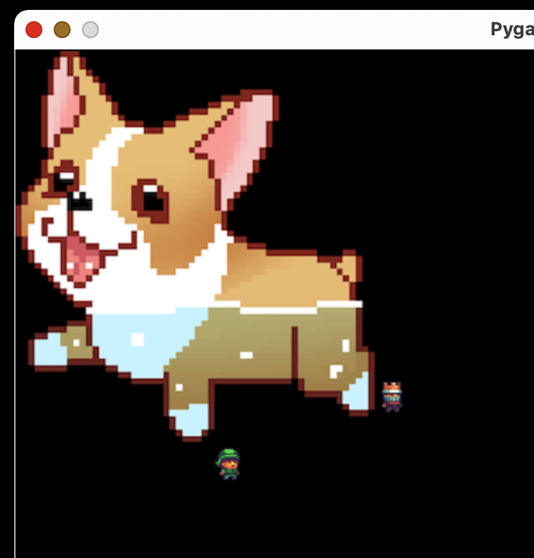
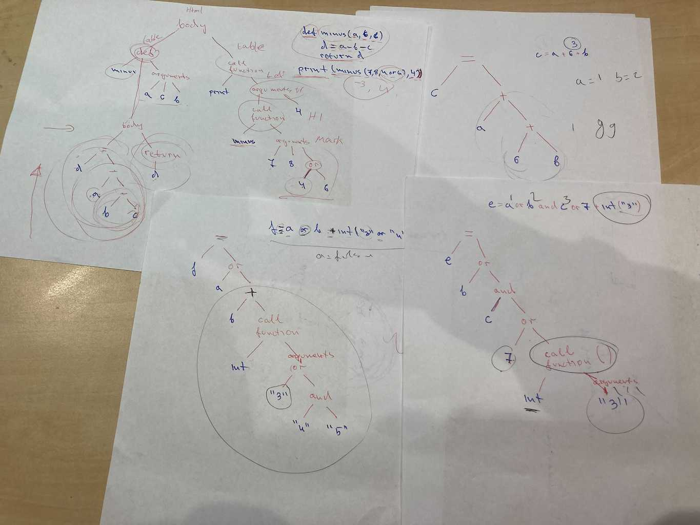

## [DAY-260] strings

Write (in notepad), run (from cmd) and explain(on paper) the following code:
```
def encrypt(s):
    r = ''

    for character in s:
        ascii = ord(character)
        r += 'z' * ascii
        r += ' '

    return r


def decrypt(s):
    r = ''
    ascii = 0

    for character in s:
        if character == 'z':
            ascii += 1
        else:
            r += chr(ascii)
            ascii = 0

    return r


encrypted = encrypt('hello world')
print(encrypted)
print(decrypt(encrypted))
```




> walk through the code, explaining each line, and trying it with sample values


## [DAY-261] lists

Find and fix the bug in the following program:

```
# [2,2,2,2,2,2,2,2,3] should become [8, 2, 1, 3]
def rle(x):
  r = []
  for v in x:
    if len(r) == 0 or r[-1] != v:
      r.append(0)
      r.append(v)
    if v == r[-1]:
      r[-2] += 1
  return r

# [8, 2, 1, 3] should become [2,2,2,2,2,2,2,2,3]
def rld(x):
  r = []

  for i in range(0, len(x), 2):
    for k in range(x[i]):
      r.append(x[i+1])

  return r


a = rle([1,1,1,1,1,1,1])
print(a)
b = rld(a)
print(b)
```

> Spend some time stepping through or print debugging, I chose to use print debugging to emphasize on "what should this code do, and how do you make sure it does what it says", but I think proper debugging can be introduced at this point, in the same time I dont want to introduce new concepts yet. Learning programming takes time, you can not rush it.


## [DAY-262] lists

Find and fix the bug in the following program (using only notepad and cmd):

```
def avg(x):
    n = 0
    sum = 0
    for i in range(1, len(x)):
        sum += x[i]
        n += 1

    return sum / n


print(avg([7,3,5]))
```


## [DAY-263] lists

find the bug in the following code (using notepad and cmd):


```
def uniq(data):
    result = []
    for inputNumber in data:
        seen = False
        for resultNumber in result:
            if inputNumber != resultNumber:
                seen = True
        if not seen:
            result.append(inputNumber)

    return result

# should print [1,2,3]
print(uniq([1, 2, 1, 1, 1, 3, 1]))
```


## [DAY-264] design

Today we will do a basic design and 3d print it, first make an account on https://www.tinkercad.com/ and then build something there (use W to attach workarea to a surface so you can easilly put one thing on top or on the side of another).

Grab a masuring tool and get any object that you see and measure it and build it inside tinkercad.

> She did some great designs, but they are somewhat personal and I wont show them in the book. Also she was the one who found out about the W key doing temporary workarea, which makes the whole tinkercad propgram 10000 times better, and before this I was doing designs super slow and was very annoyed :)

## [DAY-265] c; if

Examine the following program, type it in notepad and compile it with gcc, then examine the output binary.

```
// comments in C
// save the file as hello.c
// use gcc -o hello hello.c to compile the program
#include <stdio.h>

int fizzbuzz(int n) {
	int fizbuzzes = 0;
	for (int i = 1; i < n; i++) {
		if (i % 3 == 0 && i % 5 == 0) {
			printf("fizzbuzz\n");
			fizbuzzes += 1;
		} else if (i % 3 == 0) {
			printf("fizz\n");
		} else if (i % 5 == 0) {
			printf("buzz\n");
		} else {
			printf("%d\n", i);
		}
	}
	return fizbuzzes;
}

int main(void) {
	while(1) {
		printf("hello, press q to stop\n");
		char c = getchar();
		getchar();
		if (c == 81 || c == 113) {
			break;
		} else if (c == 97) {
			int n = fizzbuzz(20);
			printf("amount of fizbuzzes: %d\n",n);
		} else if (c == 'A') {
			int n = fizzbuzz(50);
			printf("amount of fizbuzzes: %d\n",n);
		}
	}
	return 0;
}
```


## [DAY-266] lists

Maka e program to add a bunch of inputs to a list and pick a random item from it:

> thats what she wrote, I explained about the random.seed

```
import random
import time
random.seed(time.time())
a = ["Rumble","Fortnite","Call of Duty","Bedwars"]
print(a)
while True:
    b= input('add anything you want: ')
    if b == "quit":
        break
    a.append(b)

print("this is what you got in here: ",a)
print(random.choice(a))
```

## [DAY-267] lists

Make a program to sum a list of lists of numbers `x = [[1,2,3],[1,4],[6]]`

```
def sum(list_of_lists):
    s = 0
    for l in list_of_lists:
        for element in l:
            s += element
    return s
```

make a program to return a copy of the list without the first and last element (using `pop()`)

```
def middle(x):
    copy = []
    for e in x:
        copy.append(e)

    copy.pop(len(x)-1)
    if len(copy) > 0:
        copy.pop(0)

    return e
```


## [DAY-268] lists

make fizbuzz

```
for i in range(50):
	if i%5==0 and i%3 ==0:
		print("fizzzz buzz")
	elif i%3==0:
		print("buxx")
	elif i %5==0:
		print("fizzzz")
	else:
		print(i)
```

add all the non fizz,buzz,fizbuzz numbers to a list and print it

```
a=[]
for i in range(50):
	if i%5==0 and i%3 ==0:
		print("fizzzz buzz")
	elif i%3==0:
		print("buxx")
	elif i %5==0:
		print("fizzzz")
	else:
		print(i)
		a.append(i)
print(a)
```


## [DAY-269] fizzbuzz; c; goto

write fizzbuzz in C

```
#include <stdio.h>
int main(void) {
  int i;

  // init; condition; increment
  for (i = 0; i < 99; i++) {
    if (i % 5 == 0 && i % 3 == 0) {
      printf("fizzbuzz\n");
    } else if (i % 3 == 0) {
      printf("fizz\n");

    } else if (i%5==0){
      printf("buzz\n");
    } else {
      printf("the number is: %d\n", i);
    }
  }


  // init
  i = 0;
  // condition
  while(i < 99) {
    if (i % 5 == 0 && i % 3 == 0) {
      printf("fizzbuzz\n");
    } else if (i % 3 == 0) {
      printf("fizz\n");

    } else if (i%5==0){
      printf("buzz\n");
    } else {
      printf("the number is: %d\n", i);
    }

    // increment
    i++;
  }


  // init
  i = 0;
  while(1) {
    // condition
    if (i >= 99) {
      break;
    }

    if (i % 5 == 0 && i % 3 == 0) {
      printf("fizzbuzz\n");
    } else if (i % 3 == 0) {
      printf("fizz\n");

    } else if (i%5==0){
      printf("buzz\n");
    } else {
      printf("the number is: %d\n", i);
    }

    // increment
    i++;
  }

  // init
  i = 0;
 START:
  // condition
  if (i >= 99) {
    goto END;
  }

  if (i % 5 == 0 && i % 3 == 0) {
    printf("fizzbuzz\n");
  } else if (i % 3 == 0) {
    printf("fizz\n");

  } else if (i%5==0){
    printf("buzz\n");
  } else {
    printf("the number is: %d\n", i);
  }

  // increment
  i++;
  goto START;
 END:

  printf("fizzbuzz done\n");

  return 0;
}
```




> using a for loop, a while loop and goto, explain how each of them actually works


## [DAY-270] fizzbuzz; c

Count the amount of fizzes, buzzes, numbers and fizzbuzzes, and also ask the user to enter the number for how many numbers to check.

```
#include <stdio.h>

int main(void) {
  int i;

  int fizzbuzzes;
  int fizzes;
  int buzzes;
  int numbers;
  int how_many;

  fizzbuzzes = 0;
  fizzes = 0;
  buzzes = 0;
  numbers = 0;

  printf("how many do you want: ");
  scanf("%d", &how_many);

  for (i = 0; i < how_many; i++) {
    if (i % 5 == 0 && i % 3 == 0) {
      fizzbuzzes++;
    } else if (i % 3 == 0) {
      fizzes++;
    } else if (i % 5==0){
      buzzes++;
    } else {
      numbers++;
    }
  }

  printf("total: %d, fizzes: %d, buzzes: %d, fizzbuzzes: %d, numbers: %d\n", how_many, fizzes, buzzes,fizzbuzzes, numbers);

  return 0;
}

int main(void) {
  int fizzbuzzes = 0;
  int fizzes = 0;
  int buzzes = 0;
  int numbers = 0;
  int how_many = 0;

  printf("how many do you want: ");
  scanf("%d", &how_many);

  for (int i = 0; i < 99; i++) {
    if (i % 5 == 0 && i % 3 == 0) {
      fizzbuzzes++;
    } else if (i % 3 == 0) {
      fizzes++;
    } else if (i % 5==0){
      buzzes++;
    } else {
      numbers++;
    }
  }

  printf("total: %d, fizzes: %d, buzzes: %d, fizzbuzzes: %d, numbers: %d\n", how_many, fizzes, buzzes,fizzbuzzes, numbers);

  return 0;
}

```



> explain initialization of variables, and printf parameters, also focus on how scanf gets a pointer to the how_many variable


## [DAY-271] fizzbuzz; c

Write fizbuzz on your own starting with the following code:

```
#include <stdio.h>


int main(void) {
  int how_many;

  printf("how many do you want: ");
  scanf("%d", &how_many);

  ....
  ....
  ....
  ....


  return 0;
}
```


## [DAY-272] fizzbuzz; c

Print how many fuzzes, buzzes, fizbuzzes and numbers you are printing.

> thats what she wrote:

```
#include <stdio.h>

int main(void) {
  int how_many;
  int counternum = 0;
  int fizzbuzz = 0;
  int buzz = 0;
  int fizzz = 0;

  printf("how many do you want: ");
  scanf("%d", &how_many);

  for (int a = 0; a < how_many; a++) {
    if (a % 15 == 0) {
      printf("FIZZBUZZZZZZZZZZZZZ\n");
      fizzbuzz++;
    } else if (a % 5 == 0) {
      printf("FIZZzzz\n");
      fizzz++;
    } else if (a % 3 == 0) {
      printf("BUZZZZZZZZZZZZZ\n");
      buzz++;
    } else {
      printf("%d\n", a);
      counternum++;
    }
  }
  printf("%d %d %d %d\n", counternum, fizzbuzz, buzz, fizzz);
  return 0;
}
```

> change the ints to `unsigned char` and then to `unsigned short` and discuss integer overflow


## [DAY-273] fizzbuzz; c; struct

You can group a bunch of variables together in a custom type. In the fizzbuzz case, you might want to group all the counters together:

```
struct counter {
  int numbers;
  int fizzbuzz;
  int fizz;
  int buzz;
};

```

This is how we would use it, we would define the struct type `counter`, and then we will make a function that counts them and returns a counter value:

```
#include <stdio.h>

struct counter {
  int numbers;
  int fizzbuzz;
  int fizz;
  int buzz;
};

struct counter fizzy(int n) {
  struct counter ret = {0};

  for (int a = 0; a < n; a++) {
    if (a % 15 == 0) {
      ret.fizzbuzz++;
    } else if (a % 5 == 0) {
      ret.fizz++;
    } else if (a % 3 == 0) {
      ret.buzz++;
    } else {
      ret.numbers++;
    }
  }

  return ret;
}

int main(void) {
  int how_many;

  printf("how many do you want: ");
  scanf("%d", &how_many);

  struct counter f = fizzy(how_many);
  printf("%d %d %d %d\n", f.numbers, f.fizzbuzz, f.buzz, f.fizz);

  return 0;
}

```

You can see that you can access the inner methods of the struct using `.` (dot), by saying `ret.fizzbuzz = 6' it gets translated to put 6 where the member fizzbuzz is in the block of memory used by the `ret` structure.


Lets say you want to build a chess game, you might want to have a struct for the piece, for example:

```
struct chess_piece {
    uint8_t kind; // what kind of piece it is, 0: pawn, 1: bishop ...
    uint8_t x;    // board column
    uint8_t y;    // board row
    int used;     // how many time the piece was used
};

```

Or you are making a platformer game, you might want to have a struct for the player:

```
struct player {
    unsigned short health;
    int x;
    int y;
};
```

You can also embed structs in structs:

```
struct point {
    int x;
    int y;
};

struct player {
    unsigned short health; // health points left, 0 means game over
    struct point pos; // player's position
};
```


For now we will just do basics with structs to get used with them. How to pass them around in our program, giving them as parameters to functions, or returning them, or having poitners to them.


## [DAY-274] c; struct

Continue pratciting structs, write the following code and complete the exercice by writing your own version of what happens when the player meets the horse.

```
#include <stdio.h>

struct point {
  int x;
  int y;
};

struct player {
  struct point position;
  int hp;
};

int main(void) {
  struct player p = {0};
  p.hp = 100;

  for (;;) {
    if (p.position.x == 0 && p.position.y == 0) {
      printf("You are back to where you started.\n");
      printf("At the start of the world\n");
      printf("You see a crossroad\n");
      printf(" Looking north you see a house with smoke coming out of it.\n");
      printf(" Looking soutn you see a dark forest.\n");
      printf(" Looking west you see a village.\n");
      printf(" Looking east you see a horse walking on the road.\n");
    }

    //
    // Write the code for whe the player goes one position to the east
    // and meets the horse, the horse should bite his leg and remove 50 health points
    // if (p.position..
    //
    
    if (p.hp <= 0) {
      printf("GAME OVER\n");
      break;
    }

    printf("where do you want to go?\n");
    printf("  0: north\n");
    printf("  1: south\n");
    printf("  2: west\n");
    printf("  3: east\n");
    printf("[x:%d, y:%d, hp:%d]> ", p.position.x, p.position.y, p.hp);

    int direction;
    scanf("%d", &direction);
    if (direction == 0) {
      p.position.y++;
    } else if (direction == 1) {
      p.position.y--;
    } else if (direction == 2) {
      p.position.x--;
    } else if (direction == 3) {
      p.position.x++;
    }
  }

  return 0;
}

```

## [DAY-274] waldo

Using pygame make where is waldo jumpscare game, print a bunch of actors and one of them is waldo, when you find him show some scary image and play a scary sound.

Look for inspiration in your previous code, you have done both where is waldo and jumpscare games.




I used an example from [Casey Muratori's Handmade Hero series](https://handmadehero.org/) where in the beginning he shows how to draw pixels on the screen on windows, and I modified the example to make it more like pygame so it is more familiar. We will be using this base to build more games in the future. You can check out the actual code [projects/zerod/pygame.cpp](projects/zerod/pygame.cpp)

This is the example jumpscare game in C, dont read too much into it, just check chill and check it out, try to read it on your own.

```

#include "pygame.cpp"

struct bitmap_image elf = bitmap_read_file("c1.bmp");
struct bitmap_image kings[30];
struct bitmap_image waldo = bitmap_read_file("c2-back.bmp");
struct bitmap_image naruto = bitmap_read_file("naruto.bmp");
int game_over = 0;

void update(struct keyboard* kbd) {
    int diff = 10;
    if (kbd->A)
        elf.r.x += diff;
    if (kbd->D)
        elf.r.x -= diff;
    if (kbd->S)
        elf.r.y += diff;
    if (kbd->W)
        elf.r.y -= diff;

    for (int i = 0; i < 30; i++) {
        if (collide(elf.r, kings[i].r)) {
            play("a.wav");
        }
    }

    if (collide(waldo.r, elf.r)) {
        game_over = 1;
        play("b.wav");
    }
}

void draw(struct screen_buffer* screen) {
    screen_clear(screen, 255 << 16 | 255 << 8 | 255);

    for (int i = 0; i < 30; i++) {
        bitmap_draw(kings[i], screen);
    }

    bitmap_draw(waldo, screen);
    bitmap_draw(elf, screen);

    if (game_over) {
        screen_clear(screen, 0);
        bitmap_draw(naruto, screen);
    }
}

int CALLBACK WinMain(HINSTANCE Instance,
                     HINSTANCE PrevInstance,
                     LPSTR CmdLine,
                     int ShowCmd) {
    srand(time(NULL));

    for (int i = 0; i < 30; i++) {
        kings[i] = bitmap_read_file("c2.bmp");
        kings[i].r.x = 100 + rand() % 600;
        kings[i].r.y = 100 + rand() % 600;
    }
    waldo.r.x = 100 + rand() % 600;
    waldo.r.y = 100 + rand() % 600;

    initialize(Instance, "zero", update, draw);

    return 0;
}

```

In the future we will improve the base to be better at audio playback and support PNG images and etc, but for now it is good enough.

PS: On windows you can use build.bat to build it or just `gcc -o game game.cpp -lgdi32 -lwinmm` (display library and sound library)


## [DAY-275] for


Make fizzbuzz in python and then in C,

```
#include <stdio.h>


void fizz(int n) {
    for (int i = 0; i < n; i++) {
        if (i % 15 == 0) {
            printf("fizzbuzz");
        } else if (i%5 == 0) {
            printf("fizzz");
        } else if (i%3 == 0) {
            printf("fizzz");
        } else{
            printf("%d",i);
        }
    }
}

int main(void) {
    for i in range(100):
        fiz(i)
     for (int i = 0; i < 100; i++) {
        fizz(i);
     }
}
```

make a function that prints n stars and use it to print a triangle

```
#include <stdio.h>
void line(int n) {
    for (int i = 0; i < n; i++) {
        printf("*");
    }
    printf("\n");
}

int main(void) {
   for (;;) {
        for (int i=0; i<5; i++){
            line(i);
        }
        for (int i=5; i>0; i--){
            line(i);
        }
    }
    return 0;
}

```


## [DAY-276] pygame


Make a game of an elf and king that when they hit each other they get teleported to random direction



```
import pgzrun
import random

elf = Actor("c1")
king = Actor("c2")
WIDTH = 800
HEIGHT = 800


def update():
    if keyboard.W:
        elf.y -= 5
    if keyboard.S:
        elf.y += 5
    if keyboard.D:
        elf.x += 5
    if keyboard.A:
        elf.x -= 5
    if keyboard.UP:
        king.y -= 5
    if keyboard.DOWN:
        king.y += 5
    if keyboard.RIGHT:
        king.x += 5
    if keyboard.LEFT:
        king.x -= 5

    if elf.colliderect(king):
        elf.x = random.randint(10, 780)
        elf.y = random.randint(10, 780)
        king.x = random.randint(10, 780)
        king.y = random.randint(10, 780)


def draw():
    screen.clear()
    elf.draw()
    king.draw()


pgzrun.go()

```


## [DAY-277] variables

Add a fox to the game, but the king and elf cant walk through it (use the corgi image for the fox)




> thats what she wrote, using a,b,c,d as variables to remember the old x and y

```
import pgzrun
import random

elf = Actor("c1")
king = Actor("c2")
fox = Actor("corgi-256")

WIDTH = 800
HEIGHT = 800


def update():
    a = elf.x
    b = elf.y
    c = king.x
    d = king.y
    if keyboard.W:
        elf.y -= 5
    if keyboard.S:
        elf.y += 5
    if keyboard.D:
        elf.x += 5
    if keyboard.A:
        elf.x -= 5
    if keyboard.UP:
        king.y -= 5
    if keyboard.DOWN:
        king.y += 5
    if keyboard.RIGHT:
        king.x += 5
    if keyboard.LEFT:
        king.x -= 5

    if elf.colliderect(fox):
        elf.x = a
        elf.y = b

    if king.colliderect(fox):
        king.x = c
        king.y = d
        
    if elf.colliderect(king):
        elf.x = random.randint(10, 780)
        elf.y = random.randint(10, 780)
        king.x = random.randint(10, 780)
        king.y = random.randint(10, 780)

def draw():
    screen.clear()
    elf.draw()
    king.draw()
    fox.draw()

pgzrun.go()

```


## [DAY-278] ast





The way python (or almost any language) reads a program is left to right word by word, symbol by symbol, and it builds a tree, similar to the HTML tree we discussed a year ago, each operation is a tree and its parameters are its children, for example `a = b or c + 4` will build the following tree:

```
    =
   / \
  a  or
    /  \
   b   +
      /  \
     c    4
```

So the value of `a` will be the result of the `or` operation, which has left and right branches, it will evaluate the left one first, if it is not false it will use it, otherwise it will evaluate the right branch, so in this case a will be equal to b, and c+4 will **never** be executed, in contrast `and` has to evaluate both the left and the right branch.


Practice looking ad your old programs and try to make out how the tree looks, use https://astexplorer.net/ or https://python-ast-explorer.com/ to browse the tree.
