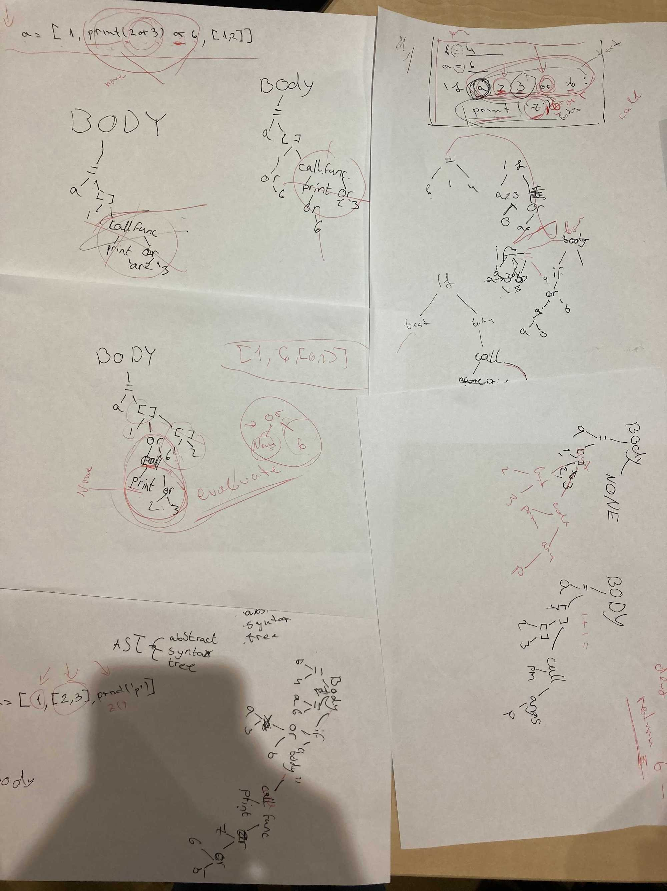

## [DAY-274] c; struct

Continue pratciting structs, write the following code and complete the exercice by writing your own version of what happens when the player meets the horse.

```
#include <stdio.h>

struct point {
  int x;
  int y;
};

struct player {
  struct point position;
  int hp;
};

int main(void) {
  struct player p = {0};
  p.hp = 100;

  for (;;) {
    if (p.position.x == 0 && p.position.y == 0) {
      printf("You are back to where you started.\n");
      printf("At the start of the world\n");
      printf("You see a crossroad\n");
      printf(" Looking north you see a house with smoke coming out of it.\n");
      printf(" Looking soutn you see a dark forest.\n");
      printf(" Looking west you see a village.\n");
      printf(" Looking east you see a horse walking on the road.\n");
    }

    //
    // Write the code for whe the player goes one position to the east
    // and meets the horse, the horse should bite his leg and remove 50 health points
    // if (p.position..
    //
    
    if (p.hp <= 0) {
      printf("GAME OVER\n");
      break;
    }

    printf("where do you want to go?\n");
    printf("  0: north\n");
    printf("  1: south\n");
    printf("  2: west\n");
    printf("  3: east\n");
    printf("[x:%d, y:%d, hp:%d]> ", p.position.x, p.position.y, p.hp);

    int direction;
    scanf("%d", &direction);
    if (direction == 0) {
      p.position.y++;
    } else if (direction == 1) {
      p.position.y--;
    } else if (direction == 2) {
      p.position.x--;
    } else if (direction == 3) {
      p.position.x++;
    }
  }

  return 0;
}

```

## [DAY-274] waldo

Using pygame make where is waldo jumpscare game, print a bunch of actors and one of them is waldo, when you find him show some scary image and play a scary sound.

Look for inspiration in your previous code, you have done both where is waldo and jumpscare games.


I used an example from [Casey Muratori's Handmade Hero series](https://handmadehero.org/) where in the beginning he shows how to draw pixels on the screen on windows, and I modified the example to make it more like pygame so it is more familiar. We will be using this base to build more games in the future. You can check out the actual code [projects/zerod/pygame.cpp](projects/zerod/pygame.cpp)

This is the example jumpscare game in C, dont read too much into it, just check chill and check it out, try to read it on your own.

```

#include "pygame.cpp"

struct bitmap_image elf = bitmap_read_file("c1.bmp");
struct bitmap_image kings[30];
struct bitmap_image waldo = bitmap_read_file("c2-back.bmp");
struct bitmap_image naruto = bitmap_read_file("naruto.bmp");
int game_over = 0;

void update(struct keyboard* kbd) {
    int diff = 10;
    if (kbd->A)
        elf.r.x += diff;
    if (kbd->D)
        elf.r.x -= diff;
    if (kbd->S)
        elf.r.y += diff;
    if (kbd->W)
        elf.r.y -= diff;

    for (int i = 0; i < 30; i++) {
        if (collide(elf.r, kings[i].r)) {
            play("a.wav");
        }
    }

    if (collide(waldo.r, elf.r)) {
        game_over = 1;
        play("b.wav");
    }
}

void draw(struct screen_buffer* screen) {
    screen_clear(screen, 255 << 16 | 255 << 8 | 255);

    for (int i = 0; i < 30; i++) {
        bitmap_draw(kings[i], screen);
    }

    bitmap_draw(waldo, screen);
    bitmap_draw(elf, screen);

    if (game_over) {
        screen_clear(screen, 0);
        bitmap_draw(naruto, screen);
    }
}

int CALLBACK WinMain(HINSTANCE Instance,
                     HINSTANCE PrevInstance,
                     LPSTR CmdLine,
                     int ShowCmd) {
    srand(time(NULL));

    for (int i = 0; i < 30; i++) {
        kings[i] = bitmap_read_file("c2.bmp");
        kings[i].r.x = 100 + rand() % 600;
        kings[i].r.y = 100 + rand() % 600;
    }
    waldo.r.x = 100 + rand() % 600;
    waldo.r.y = 100 + rand() % 600;

    initialize(Instance, "zero", update, draw);

    return 0;
}

```

In the future we will improve the base to be better at audio playback and support PNG images and etc, but for now it is good enough.

PS: On windows you can use build.bat to build it or just `gcc -o game game.cpp -lgdi32 -lwinmm` (display library and sound library)


## [DAY-275] for


Make fizzbuzz in python and then in C,

```
#include <stdio.h>


void fizz(int n) {
    for (int i = 0; i < n; i++) {
        if (i % 15 == 0) {
            printf("fizzbuzz");
        } else if (i%5 == 0) {
            printf("fizzz");
        } else if (i%3 == 0) {
            printf("fizzz");
        } else{
            printf("%d",i);
        }
    }
}

int main(void) {
    for i in range(100):
        fiz(i)
     for (int i = 0; i < 100; i++) {
        fizz(i);
     }
}
```

make a function that prints n stars and use it to print a triangle

```
#include <stdio.h>
void line(int n) {
    for (int i = 0; i < n; i++) {
        printf("*");
    }
    printf("\n");
}

int main(void) {
   for (;;) {
        for (int i=0; i<5; i++){
            line(i);
        }
        for (int i=5; i>0; i--){
            line(i);
        }
    }
    return 0;
}

```


## [DAY-276] pygame


Make a game of an elf and king that when they hit each other they get teleported to random direction


```
import pgzrun
import random

elf = Actor("c1")
king = Actor("c2")
WIDTH = 800
HEIGHT = 800


def update():
    if keyboard.W:
        elf.y -= 5
    if keyboard.S:
        elf.y += 5
    if keyboard.D:
        elf.x += 5
    if keyboard.A:
        elf.x -= 5
    if keyboard.UP:
        king.y -= 5
    if keyboard.DOWN:
        king.y += 5
    if keyboard.RIGHT:
        king.x += 5
    if keyboard.LEFT:
        king.x -= 5

    if elf.colliderect(king):
        elf.x = random.randint(10, 780)
        elf.y = random.randint(10, 780)
        king.x = random.randint(10, 780)
        king.y = random.randint(10, 780)


def draw():
    screen.clear()
    elf.draw()
    king.draw()


pgzrun.go()

```


## [DAY-277] variables

Add a fox to the game, but the king and elf cant walk through it (use the corgi image for the fox)


> thats what she wrote, using a,b,c,d as variables to remember the old x and y

```
import pgzrun
import random

elf = Actor("c1")
king = Actor("c2")
fox = Actor("corgi-256")

WIDTH = 800
HEIGHT = 800


def update():
    a = elf.x
    b = elf.y
    c = king.x
    d = king.y
    if keyboard.W:
        elf.y -= 5
    if keyboard.S:
        elf.y += 5
    if keyboard.D:
        elf.x += 5
    if keyboard.A:
        elf.x -= 5
    if keyboard.UP:
        king.y -= 5
    if keyboard.DOWN:
        king.y += 5
    if keyboard.RIGHT:
        king.x += 5
    if keyboard.LEFT:
        king.x -= 5

    if elf.colliderect(fox):
        elf.x = a
        elf.y = b

    if king.colliderect(fox):
        king.x = c
        king.y = d
        
    if elf.colliderect(king):
        elf.x = random.randint(10, 780)
        elf.y = random.randint(10, 780)
        king.x = random.randint(10, 780)
        king.y = random.randint(10, 780)

def draw():
    screen.clear()
    elf.draw()
    king.draw()
    fox.draw()

pgzrun.go()

```


## [DAY-278] ast


The way python (or almost any language) reads a program is left to right word by word, symbol by symbol, and it builds a tree, similar to the HTML tree we discussed a year ago, each operation is a tree and its parameters are its children, for example `a = b or c + 4` will build the following tree:

```
    =
   / \
  a  or
    /  \
   b   +
      /  \
     c    4
```

So the value of `a` will be the result of the `or` operation, which has left and right branches, it will evaluate the left one first, if it is not false it will use it, otherwise it will evaluate the right branch, so in this case a will be equal to b, and c+4 will **never** be executed, in contrast `and` has to evaluate both the left and the right branch.


Practice looking ad your old programs and try to make out how the tree looks, use https://astexplorer.net/ or https://python-ast-explorer.com/ to browse the tree.

## [DAY-279] ast




> we spent today exercising more AST examples and talking about how evaulation actually happens
