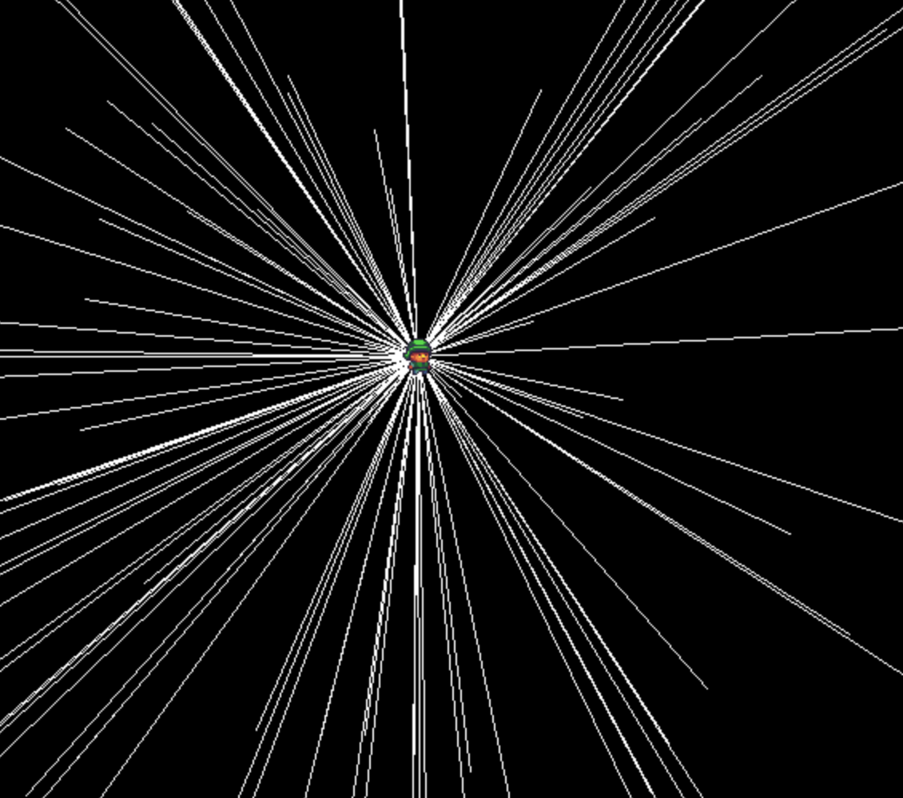
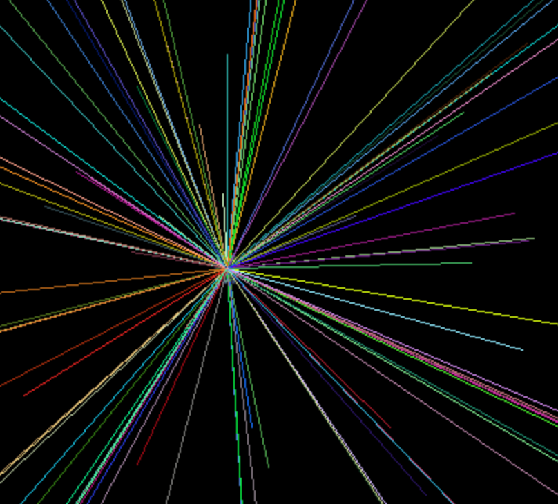
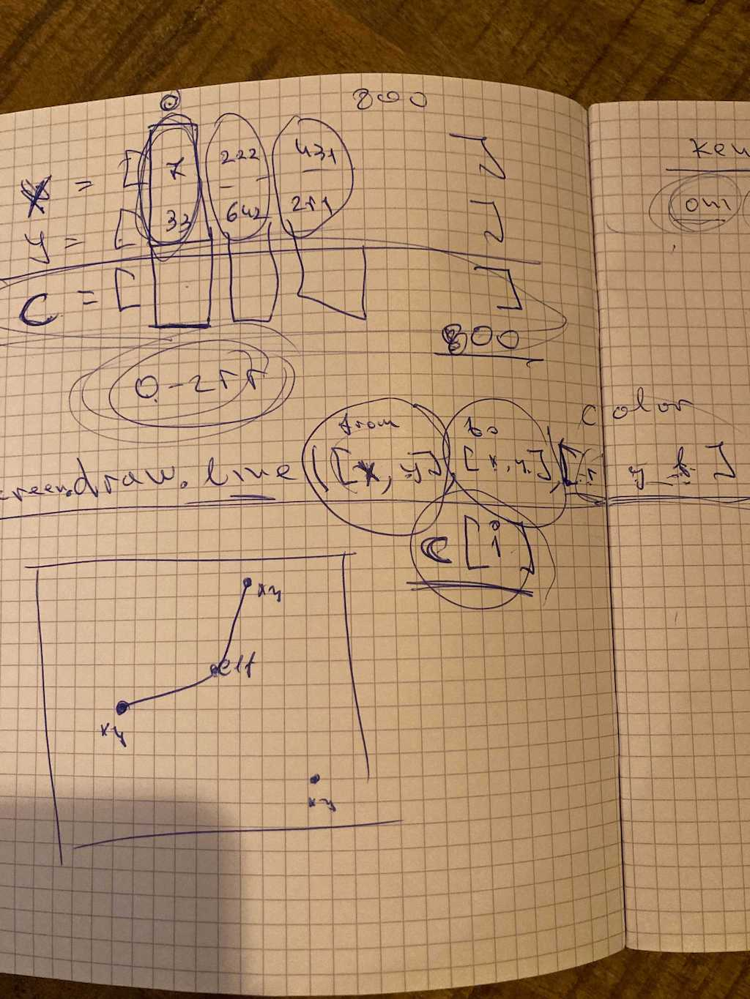
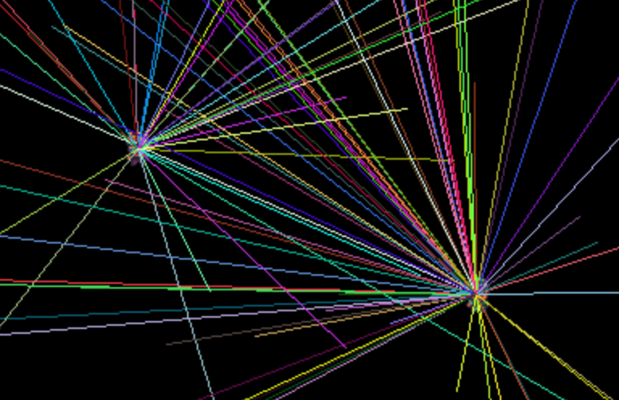
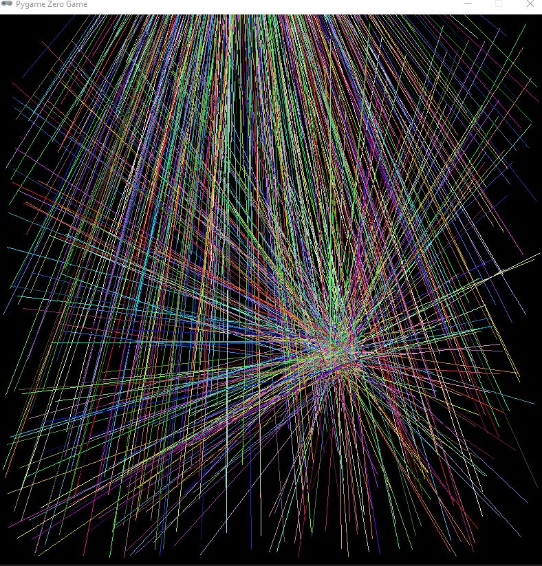

## [DAY-294] tutorials

Continue watching BroCode's [C tutorial for beginners](https://www.youtube.com/watch?v=nrbBmoINqtk&list=PLZPZq0r_RZOOzY_vR4zJM32SqsSInGMwe)


## [DAY-295] tutorials

Finish watching BroCode's [C tutorial for beginners](https://www.youtube.com/watch?v=nrbBmoINqtk&list=PLZPZq0r_RZOOzY_vR4zJM32SqsSInGMwe)


## [DAY-296] lists

Make 800 lines between random points and the elf, using two lists, one for the X of the lines and one for the Y of the lines.



```
import pgzrun
import random

WIDTH = 800
HEIGHT = 800

elf = Actor('c1')
elf.x = 500
elf.y = 500

lines_x=[]
lines_y=[]

for i in range(800):
    lines_x.append(random.randint(10,790))
    lines_y.append(random.randint(10,790))

def update():
    if keyboard.W:
        elf.y-=5
    if keyboard.S:
        elf.y += 5
    if keyboard.A:
        elf.x-=5
    if keyboard.D:
        elf.x+=5

def draw():
    screen.fill('black')
    elf.draw()
    for i in range(100):
        screen.draw.line([lines_x[i],lines_y[i]],
                         [elf.x,elf.y],
                         [255,255,255)

pgzrun.go()
```


## [DAY-297] lists

Make the lines have different colors, using 3 more lists one for red, one for green and one for blue.






```
import pgzrun
import random

WIDTH = 800
HEIGHT = 800

elf = Actor('c1')
elf.x = 500
elf.y = 500

lines_x=[]
lines_y=[]
lines_red=[]
lines_green=[]
lines_blue=[]

for i in range(800):
    lines_x.append(random.randint(10,790))
    lines_y.append(random.randint(10,790))
    lines_red.append(random.randint(0,255))
    lines_green.append(random.randint(0,255))
    lines_blue.append(random.randint(0,255))

def update():
    if keyboard.W:
        elf.y-=5
    if keyboard.S:
        elf.y += 5
    if keyboard.A:
        elf.x-=5
    if keyboard.D:
        elf.x+=5

def draw():
    screen.fill('black')
    elf.draw()
    for i in range(100):
        screen.draw.line([lines_x[i],lines_y[i]],
                         [elf.x,elf.y],
                         [lines_red[i],lines_green[i],lines_blue[i]])

pgzrun.go()

```


## [DAY-298] lists

Make the lines go either to the elf or to the king.





```
import pgzrun
import random

WIDTH = 800
HEIGHT = 800

elf = Actor('c1')
elf.x = 500
elf.y = 500

king = Actor('c2')
king.x = 500
king.y = 500

lines_x=[]
lines_y=[]
lines_red=[]
lines_green=[]
lines_blue=[]
lines_to=[]

for i in range(800):
    lines_x.append(random.randint(10,790))
    lines_y.append(random.randint(10,790))
    lines_red.append(random.randint(0,255))
    lines_green.append(random.randint(0,255))
    lines_blue.append(random.randint(0,255))
    lines_to.append(random.choice(['king','elf']))


def update():
    if keyboard.W:
        elf.y-=5
    if keyboard.S:
        elf.y += 5
    if keyboard.A:
        elf.x-=5
    if keyboard.D:
        elf.x+=5

    if keyboard.UP:
        king.y-=5
    if keyboard.DOWN:
        king.y += 5
    if keyboard.LEFT:
        king.x-=5
    if keyboard.RIGHT:
        king.x+=5

def draw():
    screen.fill('black')
    elf.draw()
    king.draw()
    for i in range(100):
        if lines_to[i] == 'king':
            screen.draw.line([lines_x[i],lines_y[i]],
                             [king.x,king.y],
                             [lines_red[i],lines_green[i],lines_blue[i]])
        else:
            screen.draw.line([lines_x[i],lines_y[i]],
                             [elf.x,elf.y],
                             [lines_red[i],lines_green[i],lines_blue[i]])


pgzrun.go()
```


## [DAY-299] lists

Make the lines be not to the center of the elf/king but a bit on the side.




```
import pgzrun
import random

WIDTH = 800
HEIGHT = 800

elf = Actor('c1')
elf.x = 500
elf.y = 500

king = Actor('c2')
king.x = 200
king.y = 200

lines_start_x=[]
lines_start_y=[]
lines_red=[]
lines_green=[]
lines_blue=[]
lines_to=[]
lines_xdiffs=[]
lines_ydiffs=[]

for i in range(800):
    lines_start_x.append(random.randint(10,790))
    lines_start_y.append(random.randint(10,790))
    lines_red.append(random.randint(0,255))
    lines_green.append(random.randint(0,255))
    lines_blue.append(random.randint(0,255))
    lines_ydiffs.append(random.randint(0,50))
    lines_xdiffs.append(random.randint(0,50))
    lines_to.append(random.choice(["king","elf"]))

def update():
    if keyboard.W:s
        elf.y-=5
    if keyboard.S:
        elf.y += 5
    if keyboard.A:
        elf.x-=5
    if keyboard.D:
        elf.x+=5

    if keyboard.UP:
        king.y-=5
    if keyboard.DOWN:
        king.y += 5
    if keyboard.LEFT:
        king.x-=5
    if keyboard.RIGHT:
        king.x+=5


def draw():
    screen.fill('black')
    elf.draw()
    king.draw()
    for i in range(800):
        if lines_to[i] == "king":
            screen.draw.line([lines_start_x[i],lines_start_y[i]],
                             [king.x - lines_xdiffs[i] ,king.y - lines_ydiffs[i]],
                             [lines_red[i],lines_green[i],lines_blue[i]])
        else:
            screen.draw.line([lines_start_x[i],lines_start_y[i]],
                             [elf.x - lines_xdiffs[i],elf.y - lines_ydiffs[i]],
                             [lines_red[i],lines_green[i],lines_blue[i]])

pgzrun.go()
```


## [DAY-300] lists

Now instead of using 8 lists to spread the information about each line, use 1 list with 8 elements

```
import pgzrun
import random

WIDTH = 800
HEIGHT = 800

elf = Actor('c1')
elf.x = 500
elf.y = 500

king = Actor('c2')
king.x = 200
king.y = 200

lines = []

for i in range(800):
    a = [0] * 8
    a[0] = random.randint(10,790) #x
    a[1] = random.randint(10,790) #y
    a[2] = random.randint(0,255)  #red
    a[3] = random.randint(0,255)  #green
    a[4] = random.randint(0,255)  #blue
    a[5] = random.choice(["king","elf"]) #to
    a[6] = random.randint(0,50)   #xdiff
    a[7] = random.randint(0,50)   #ydiff

    # add it to the list of lines
    lines.append(a)


def update():
    if keyboard.W:
        elf.y-=5
    if keyboard.S:
        elf.y += 5
    if keyboard.A:
        elf.x-=5
    if keyboard.D:
        elf.x+=5

    if keyboard.UP:
        king.y-=5
    if keyboard.DOWN:
        king.y += 5
    if keyboard.LEFT:
        king.x-=5
    if keyboard.RIGHT:
        king.x+=5


def draw():
    screen.fill('black')
    elf.draw()
    king.draw()

    for line in lines:

        x = line[0]
        y = line[1]
        red = line[2]
        green = line[3]
        blue = line[4]
        to = line[5]
        xdiff = line[6]
        ydiff = line[7]

        if to == "king":
            screen.draw.line([x,y],[king.x - xdiff ,king.y - ydiff],[red,green,blue])
        else:
            screen.draw.line([x,y],[elf.x - xdiff ,elf.y - ydiff],[red,green,blue])


pgzrun.go()
```


## [DAY-301] dictionaries

Use a dictionary instead of a list to define the information needed for a line.

Watch BroCode's dictionary video: https://www.youtube.com/watch?v=wa1XcMSBWdA

```
import pgzrun
import random

WIDTH = 800
HEIGHT = 800

elf = Actor('c1')
elf.x = 500
elf.y = 500

king = Actor('c2')
king.x = 200
king.y = 200


lines = []

for i in range(800):
    a = {}
    a["x"] = random.randint(10,790)
    a["y"] = random.randint(10,790)
    a["red"] = random.randint(0,255)
    a["blue"] = random.randint(0,255)
    a["green"] = random.randint(0,255)
    a["to"]=random.choice(["elf","king"])
    a["xdiff"]=random.randint(0,50)
    a["ydiff"]=random.randint(0,50)

    lines.append(a)


def update():
    if keyboard.W:
        elf.y-=5
    if keyboard.S:
        elf.y += 5
    if keyboard.A:
        elf.x-=5
    if keyboard.D:
        elf.x+=5 

    if keyboard.UP:
        king.y-=5
    if keyboard.DOWN:
        king.y += 5
    if keyboard.LEFT:
        king.x-=5
    if keyboard.RIGHT:
        king.x+=5 


def draw():
    screen.fill('black')
    elf.draw()
    king.draw()

    for a in lines:
        if a["to"] == "king":
            screen.draw.line([a["x"],a["y"]],[king.x - a["xdiff"] ,king.y - a["ydiff"]],[a["red"],a["green"],a["blue"]])
        else:
            screen.draw.line([a["x"],a["y"]],[elf.x - a["xdiff"] ,elf.y - a["ydiff"]],[a["red"],a["green"],a["blue"]])


pgzrun.go()
```
