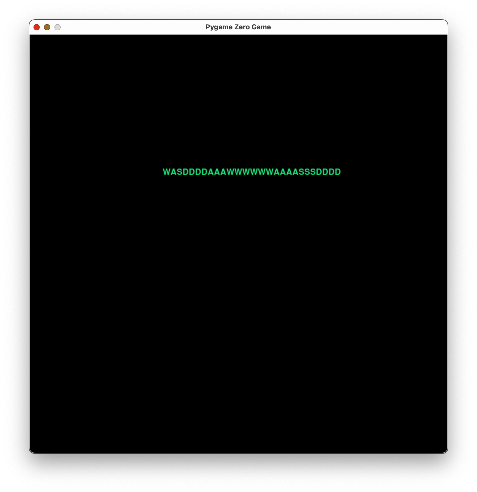
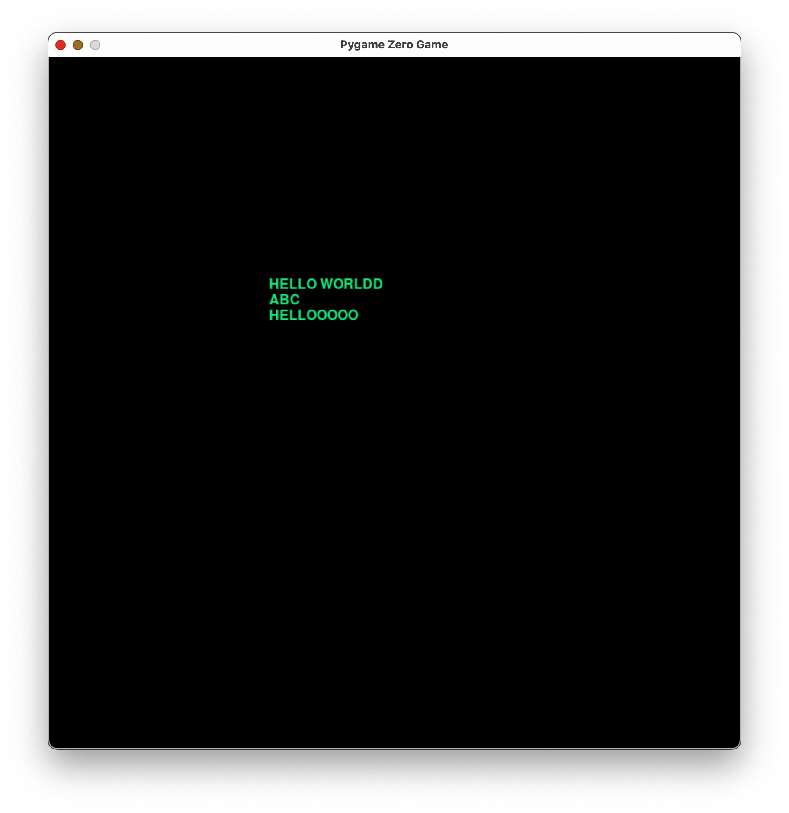
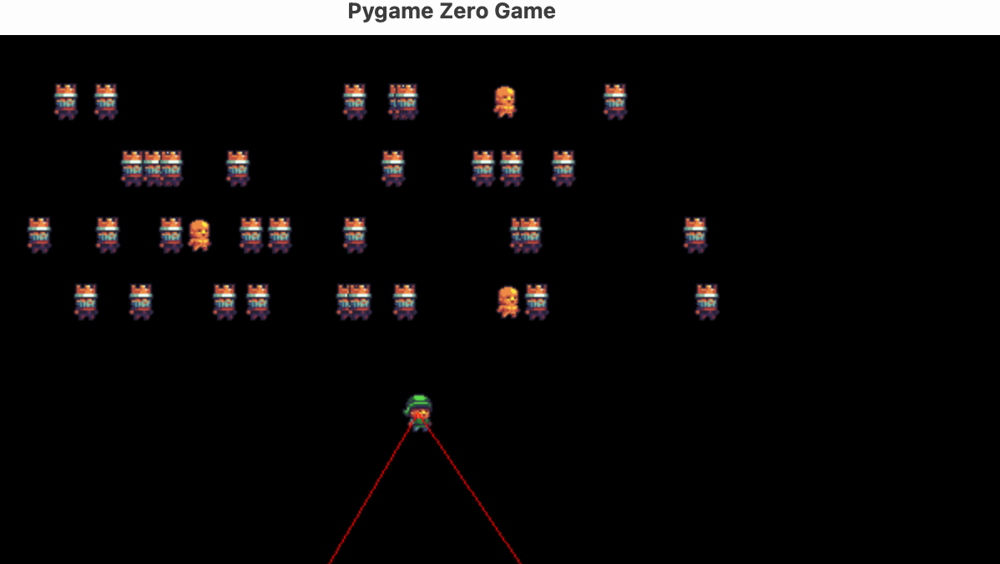
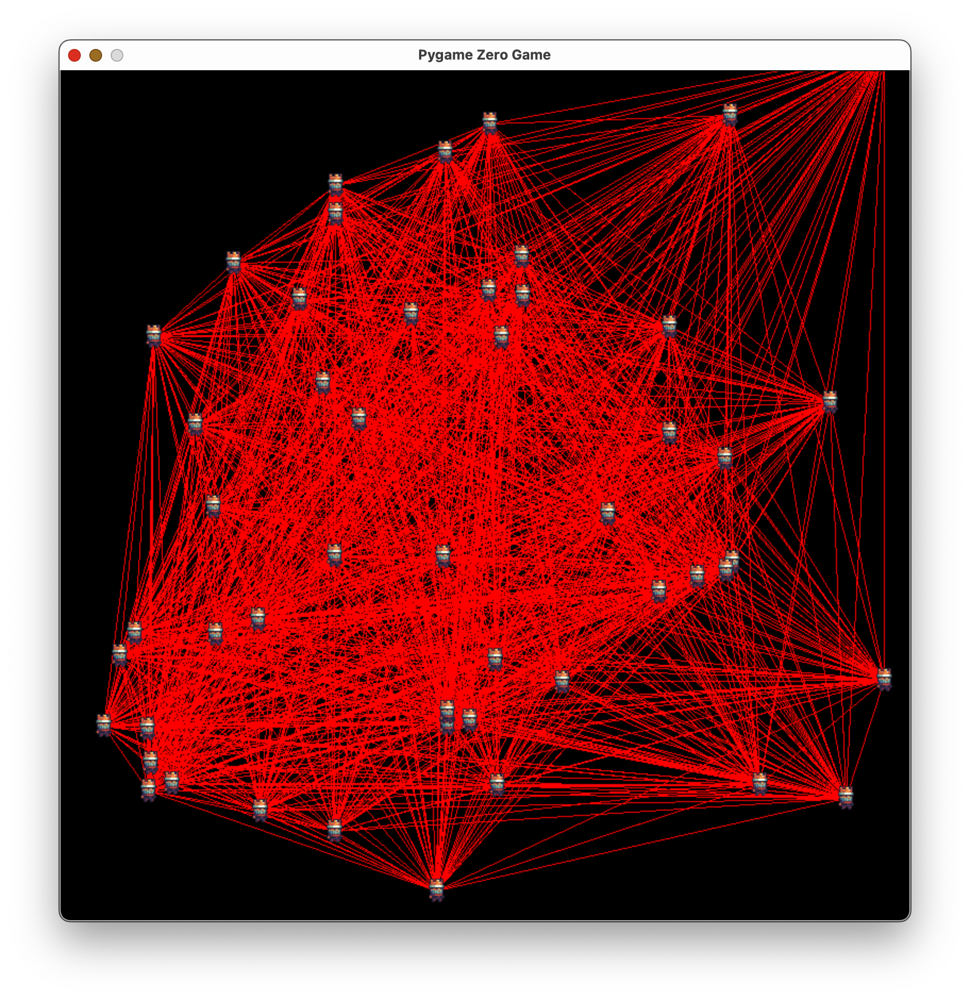
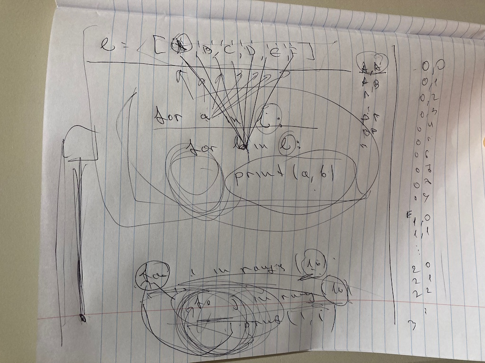
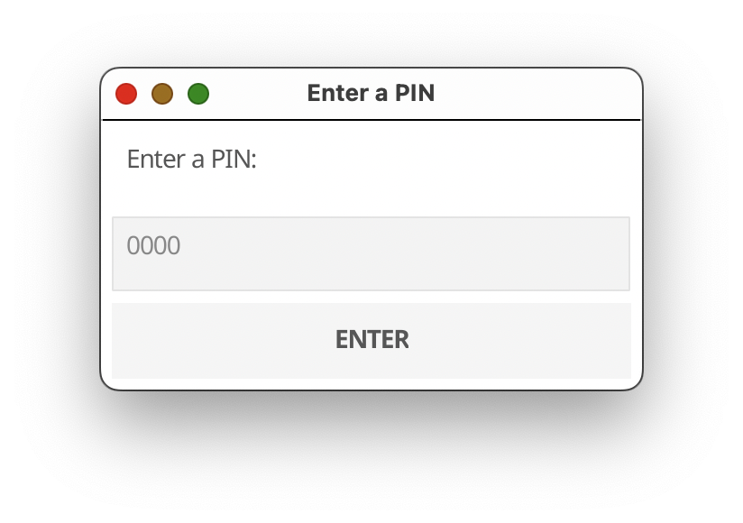
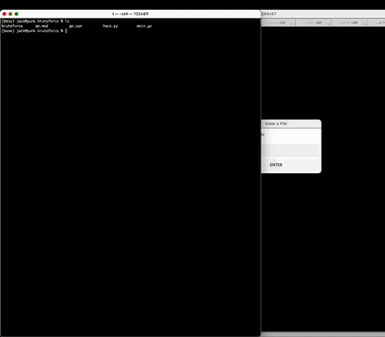

## [DAY-302] classes

Watch Bro Code's Python Object Oriented Programming in 10 minutes video: https://www.youtube.com/watch?v=q2SGW2VgwAM , then make a class Line that has all the properties, and also has a method draw that draws the line to the screen, having a dynamic end point.

```
import pgzrun
import random

WIDTH = 800
HEIGHT = 800

elf = Actor('c1')
elf.x = 500
elf.y = 500

king = Actor('c2')
king.x = 200
king.y = 200

class Line:
    def __init__(self):
        self.x = random.randint(10,790)
        self.y = random.randint(10,790)
        self.r = random.randint(0,255)
        self.g = random.randint(0,255)
        self.b = random.randint(0,255)
        self.to = random.choice(["king","elf"])
        self.xd = random.randint(0,50)
        self.yd = random.randint(0,50)

    def draw(self,to_x,to_y):
        screen.draw.line([self.x,self.y],
                         [to_x - self.xd ,to_y - self.yd],
                         [self.r,self.g,self.b])

lines = []
for i in range(800):
    l = Line()
    lines.append(l)

def update():
    if keyboard.W:
        elf.y-=5
    if keyboard.S:
        elf.y += 5
    if keyboard.A:
        elf.x-=5
    if keyboard.D:
        elf.x+=5

    if keyboard.UP:
        king.y-=5
    if keyboard.DOWN:
        king.y += 5
    if keyboard.LEFT:
        king.x+=5
    if keyboard.RIGHT:
        king.x-=5


def draw():
    screen.fill('black')
    elf.draw()
    king.draw()

    for line in lines:
        if line.to == "king":
            line.draw(king.x,king.y)
        else:
            line.draw(elf.x,elf.y)

pgzrun.go()
```

## [DAY-303] lists

Record the wasd key pressess and show them on the screen:



```
import pgzrun

WIDTH = 800
HEIGHT = 800

lines = []
def on_key_down(key,mod):
    if key == keys.W:
        lines.append("W")
    if key == keys.S:
        lines.append("S")
    if key == keys.A:
        lines.append("A")
    if key == keys.D:
        lines.append("D")

def update():
    pass

def draw():
    screen.clear()
    screen.draw.text(''.join(lines), (255,255),color=(23,233,123))


pgzrun.go()
```

This is the first step towards making an editor.


## [DAY-304] lists

Add more keys to your editor.



```
import pgzrun
import random

WIDTH = 800
HEIGHT = 800

lines = []
def on_key_down(key,mod):
    if key == keys.W:
       lines.append("W")
    if key == keys.S:
        lines.append("S")
    if key == keys.A:
        lines.append("A")
    if key == keys.D:
        lines.append("D")
    if key == keys.B:
        lines.append("B")
    if key == keys.C:
        lines.append("C")
    if key == keys.SPACE:
        lines.append(" ")
    if key == keys.RETURN:
        lines.append("\n")
    if key == keys.D:
        lines.append("D")
    if key == keys.E:
        lines.append("E")
    if key == keys.F:
        lines.append("F")
    if key == keys.G:
        lines.append("G")
    if key == keys.H:
        lines.append("H")
    if key == keys.I:
        lines.append("I")
    if key == keys.J:
        lines.append("J")
    if key == keys.K:
        lines.append("K")
    if key == keys.L:
        lines.append("L")
    if key == keys.M:
        lines.append("M")
    if key == keys.N:
        lines.append("N")
    if key == keys.O:
        lines.append("O")
    if key == keys.P:
        lines.append("P")
    if key == keys.Q:
        lines.append("Q")
    if key == keys.R:
        lines.append("R")
    if key == keys.T:
        lines.append("T")
    if key == keys.U:
        lines.append("U")
    if key == keys.V:
        lines.append("V")
    if key == keys.X:
        lines.append("X")
    if key == keys.Y:
        lines.append("Y")
    if key == keys.Z:
        lines.append("Z")

def update():
    pass

def draw():
    screen.clear()
    screen.draw.text(''.join(lines), (255,255),color=(23,233,123))

pgzrun.go()
```

Given the `is_shift` function, add support for lower and upper characters:

```
def is_shift(mod):
    return mod & keymods.LSHIFT > 0
```

example:


```
   if key == keys.W:
        if is_shift(mod):
            lines.append("W")
        else:
            lines.append("w")
```


## [DAY-305] lists



Print and think about what each component of the following code does:

```
import pgzrun
import random

WIDTH = 800
HEIGHT = 800

elf = Actor('c1')
elf.x = 500
elf.y = 500

enemies = []
game_over = False
game_win = False

def add_row(y):
    has_gold = False
    for x in range(10):
        kind = 'c2'
        # we want at most one golden king on a random position
        if not has_gold and random.randint(0,10) < 3:
            kind = 'c3'
            has_gold = True
            
        e = Actor(kind)
        e.x = 100 + (x * 30)
        e.y = y
        enemies.append(e)

    enemies.append(e)
    

def increase_dificulty():
    max_y = 0
    for e in enemies:
        if e.y > max_y:
            max_y = e.y

    add_row(max_y + 40)

def on_mouse_down(pos):
    global game_over, game_win
    for e in list(enemies):
        if elf.colliderect(e):
            if e.image == 'c3':
                game_over = True
                break
            enemies.remove(e)
            break

    # check how many kings we have not counting the golden kings
    n_enemies = 0
    for e in enemies:
        if e.image == 'c2':
            n_enemies += 1
    # if there are no kings left, then we win the game
    if n_enemies == 0:
        game_win = True

def on_mouse_move(pos):
    elf.x = pos[0]
    elf.y = pos[1]


def update():
    for e in enemies:
        e.x += random.randint(-1,3)
        if e.x > 700:
            e.x = 100


increase_dificulty()
clock.schedule_interval(increase_dificulty, 10)

def draw():
    screen.fill('black')
    elf.draw()
    screen.draw.line([100,700], [elf.x,elf.y], [255,0,0])
    screen.draw.line([700,700], [elf.x,elf.y], [255,0,0])
    
    for e in enemies:
        e.draw()

    if game_over:
        screen.fill('red')
    elif game_win:
        screen.fill('blue')

pgzrun.go()
```


## [DAY-306] lists



Make a program with 50 enemies, and make a line from each enemy to each other enemy

```
import pgzrun
import random

WIDTH = 800
HEIGHT = 800

enemies = []
# make 50 enemies
for i in range(50):
    e = Actor("c2")
    e.x = random.randint(10, 790)
    e.y = random.randint(10, 790)
    enemies.append(e)

def update():
    # move them randomly left and right
    for e in enemies:
        e.x += random.randint(-5,5)
        e.y += random.randint(-5,5)

def draw():
    screen.fill('black')

    # make a line from each enemy to each other enemey
    for from_enemy in enemies:
        for to_enemy in enemies:
            if from_enemy != to_enemy:
                screen.draw.line([from_enemy.x,from_enemy.y], [to_enemy.x,to_enemy.y], [255,0,0])
    
    for e in enemies:
        e.draw()

pgzrun.go()
```

experiment with for in for, for example:

```
for i in range(10):
    for j in range(10):
        print(i,j)

```

```
l = ['a','b','c']
for a in l:
    for b in l:
        print(a,b)
```




## [DAY-307] for


make the following python program in c:

```
for i in range(10):
  for j in range(12):
    for k in range(14):
      print(i,j,k)
```

becomes:

```
#include <stdio.h>
int main(void){
    for(int i=0; i < 10; i++){
        for(int j=0; j < 12; j++){
            for(int k=0; k < 14; k++){
                printf("%d %d %d\n",i,j,k);
            }
        }
    }
    return 0;
}
```


## [DAY-308] brute force

Compile the program in [projects/bruteforce](projects/bruteforce), you need to install golang from https://go.dev and then do `go get && go build`.

After you run the executable, it will show a window that asks for a PIN number.





Write a pyautogui script to bruteforce the pin number:




First find the x,y coordinates you need to click by writing a small script that uses pyautogui.position(), then write the script to start typing all the numbers from 0000 to 9999

```
import pyautogui
import time
time.sleep(5)

for i in range(10):
  for j in range(10):
    for k in range(10):
      for m in range(10):
        s = f"{i}{j}{k}{m}"

        pyautogui.click(853,483)
        pyautogui.write(s)
        pyautogui.click(848,544)
```

## [DAY-309] the windows registry

In windows there is database (you can think of it as a file) that stores all kinds of settings for the windows operating system and also most of the programs you have installed (from roblox to minecraft).

Once you login it will start the explorer shell, which is what you are used to, the task bar, the systems tray the start menu and etc.

This is defined in a specific registry key: `HKEY_LOCAL_MACHINE\SOFTWARE\Microsoft\Windows NT\CurrentVersion\Winlogon\Shell`, the default value there is: `explorer.exe`.

Change this to 'cmd.exe' and restart your computer. You will see when you log in that it will just start cmd and nothing else.

Try to start chrome (usually at C:\Program Files\Google\Chrome\Application\chrome.exe), or start Visual Studio Code, or try to start some of your games directly from the command prompt.

To switch back to the original shell, change the key's value to `explorer.exe` using the `regedit` command, and then restart the computer by typing `shutdown /r` into the command prompt.


## [DAY-310] for

> today I actually set her `HKEY_LOCAL_MACHINE\SOFTWARE\Microsoft\Windows NT\CurrentVersion\Winlogon\Shell` to cmd.exe before she came back from school, and she had to turn it back to explorer.exe

Write fizzbuzz in C:

```
#include <stdio.h>

int main(void) {
    for (int i = 0; i < 100; i++) {
        if (i%15 == 0) {
            printf("fizzbuzz\n");
        } else if (i%5 == 0) {
            printf("buzz\n");
        } else if (i%3 == 0) {
            printf("fizz\n");
        } else {
            printf("%d\n",i);
        }
    }
    return 0;
}
```

## [DAY-311] for

Write a program that takes an array of integers and returns the sum of all positive even numbers and multiplied by all negative odd numbers in the list.

```
#include <stdio.h>

int main(void) {
  int data[10] = {-1,4,2,22,-3,-4,-6,-7,5,10};
  int pos = 0;
  int neg = 0;
  for (int i = 0; i < 10; i++) {
    int v = data[i];
      if (v < 0 && v % 2 != 0) {
        neg += v;
      } else if (v > 0 && v % 2 == 0) {
        pos += v;
      }
  }
  int sum = neg * pos;
  printf("%d\n",sum);
  return 0;
}

```


## [DAY-312] lists

Given the following list of buses, print the one that will come next:

```
buses = [
  {
    "number": 183,
    "arrive_in_minutes": 5,
  },
  {
    "number": 499,
    "arrive_in_minutes": 3,
  },
  {
    "number": 372,
    "arrive_in_minutes": 1,
  },
  {
    "number": 572,
    "arrive_in_minutes": 5,
  },
]
```

One way to do it is with two variables:

```

min_arrival = 999
next_bus = None

for b in buses:
    if b["arrive_in_minutes"] < min_arrival:
        min_arrival = b["arrive_in_minutes"]
        next_bus = b

print(next_bus)

```

or we can just use one variable, here we check if we dont have a next bus, or its arrive time is smaller than the one we have in our current "next bus"

```

next_bus = None

for b in buses:
    if next_bus == None or b["arrive_in_minutes"] < next_bus["arrive_in_minutes"]:
        next_bus = b

print(next_bus)

```


## [DAY-313] if

Make a robot playing the dinosaur game using arduino nano and a photoresistor.

[](https://youtube.com/shorts/EVXavpNGYEc "robot")

Google how to read the photoresistor and how to connect the servo motor, this is the code we used, the servo control was on d7 and the photoresistor was on a5.

```
#include <Servo.h>

Servo arm;
void setup()
{
  Serial.begin(9600);
  arm.attach(7);
  arm.write(30);
}

void loop()
{
  int  v = analogRead(A5);
  Serial.println(v);

  if (v < 420) {
    arm.write(90);
    delay(100);
    arm.write(30);
    delay(100);
  }

} 
```


## [DAY-314] lists

Given this list of items for an online store, print the total price of the whole 

```
items = [
  {
    "name": "T-shirt",
    "quantity": 2,
    "price": 30.0
  },
  {
    "name": "Jeans",
    "quantity": 1,
    "price": 39.99
  },
  {
    "name": "Socks",
    "quantity": 1,
    "price": 4.99
  },
  {
    "name": "Coffee Maker",
    "quantity": 1,
    "price": 59.99
  },
  {
    "name": "Bluetooth Speaker",
    "quantity": 2,
    "price": 89.99
  },
  {
    "name": "Kindle",
    "quantity": 1,
    "price": 119.99
  },
  {
    "name": "Running Shoes",
    "quantity": 1,
    "price": 79.99
  },
  {
    "name": "Hiking Backpack",
    "quantity": 1,
    "price": 129.99
  },
  {
    "name": "Smart Watch",
    "quantity": 1,
    "price": 199.99
  },
  {
    "name": "Air Fryer",
    "quantity": 1,
    "price": 69.99
  },
  {
    "name": "Wireless Headphones",
    "quantity": 1,
    "price": 149.99
  }
]

s = 0
for item in items:
    s += item["price"] * item["quantity"]
print(s)
```


## [DAY-315] lists

> used chatgpt to come up with a question similar to the previous one but a bit more difficult

You are given a list of products with their prices and the inventory available in two stores. The goal is to calculate the total value of each store's inventory and find the most valuable item in each store. Finally, print the total value of both stores' inventory and the most valuable item in each store.

Here's the list of products and their inventory in each store:

```
products = [
  {
    "name": "Laptop",
    "price": 1000,
    "inventory_store1": 5,
    "inventory_store2": 3
  },
  {
    "name": "Smartphone",
    "price": 800,
    "inventory_store1": 10,
    "inventory_store2": 15
  },
  {
    "name": "Tablet",
    "price": 600,
    "inventory_store1": 8,
    "inventory_store2": 6
  },
  {
    "name": "Smart Watch",
    "price": 300,
    "inventory_store1": 20,
    "inventory_store2": 10
  },
  {
    "name": "Headphones",
    "price": 150,
    "inventory_store1": 50,
    "inventory_store2": 35
  }
]
```


Follow these steps:

* Calculate the total value of the inventory in each store.
* Find the most valuable item (in terms of total value) in each store.
* Print the total value of the inventory in both stores and the most valuable item in each store.

Remember to use for loops, lists, and dictionaries to complete this task. Good luck!


> the code she wrote

```

name1 = ""
name2 = ""
big1=0
big2=0
sum2=0
sum1=0
for i in products:
    inv1 = i["inventory_store1"]
    inv2  = i["inventory_store2"]
    price = i["price"]

    total_price1 = price * inv1
    sum1 += total_price1
    if total_price1 > big1:
        name1 = i["name"]
        big1 = total_price1

    total_price2 = price * inv2
    sum2 += total_price2
    if total_price2 > big2:
        name2 = i["name"]
        big2 = total_price2

    
print(sum1,sum2)
print(big1,name1)
print(big2,name2)
```


## [DAY-316] lists; dictionaries

```
products = [
  {
    "name": "Laptop",
    "price": 1000,
    "inventory": {"store1": 5, "store2": 3, "store3": 7}
  },
  {
    "name": "Smartphone",
    "price": 800,
    "inventory": {"store1": 10, "store2": 15, "store3": 20}
  },
  {
    "name": "Tablet",
    "price": 600,
    "inventory": {"store1": 8, "store2": 6, "store3": 9}
  },
  {
    "name": "Smart Watch",
    "price": 300,
    "inventory": {"store1": 20, "store2": 10, "store3": 15}
  },
  {
    "name": "Headphones",
    "price": 150,
    "inventory": {"store1": 50, "store2": 35, "store3": 40}
  }
]
```


* Calculate the total value of the inventory in each store.
* Print the total value of the inventory in both stores and the most valuable item in each store.


