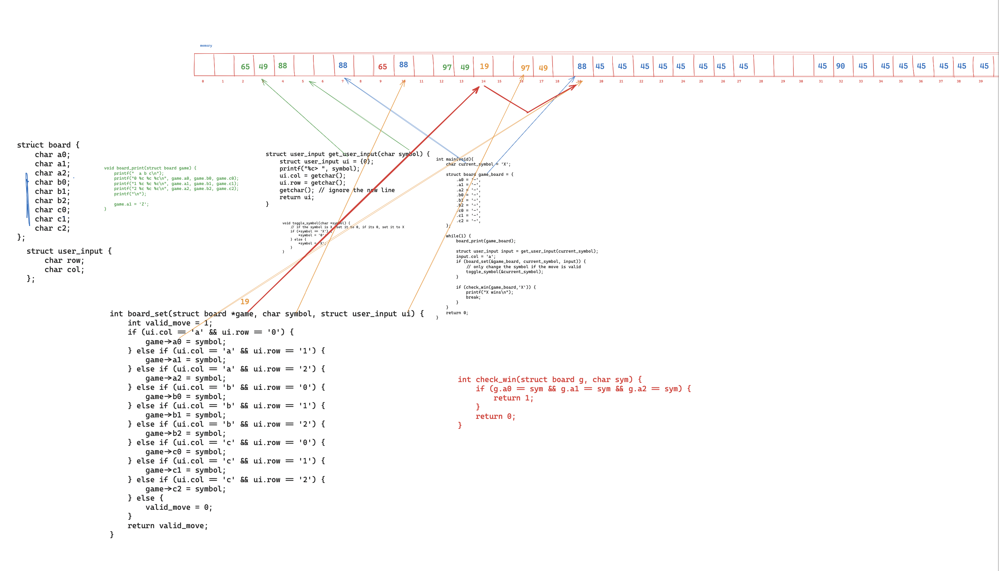
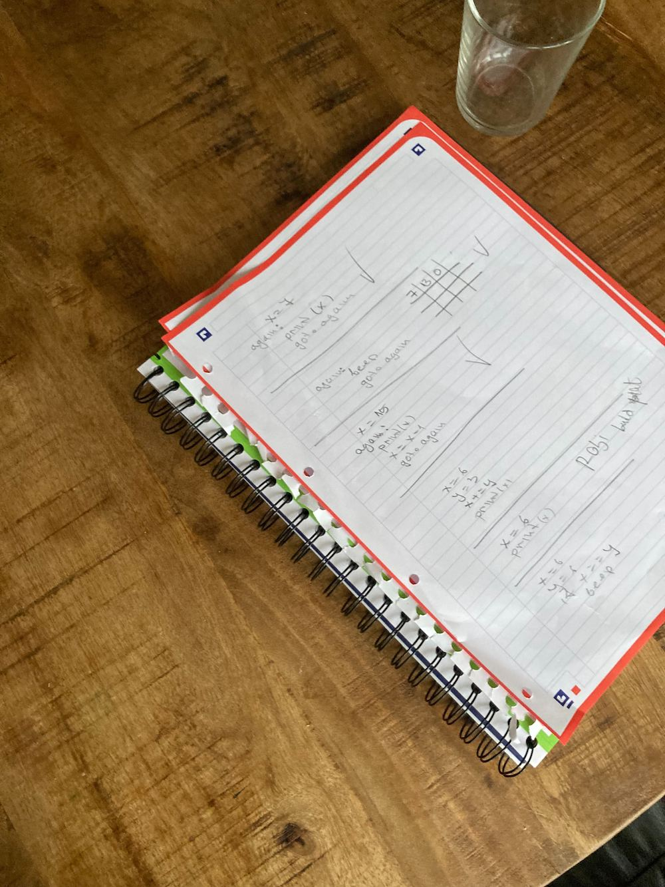
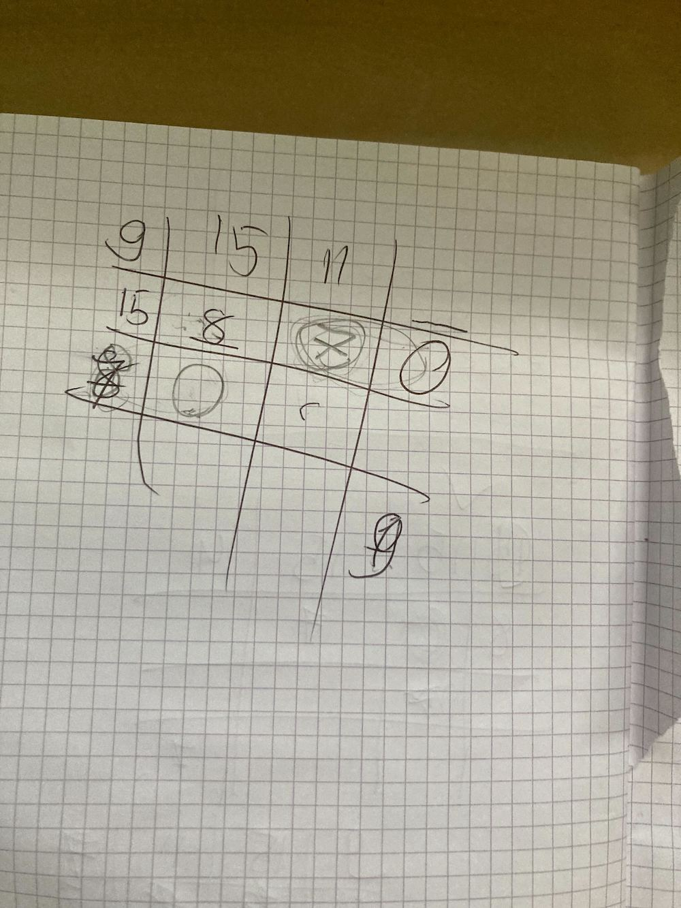
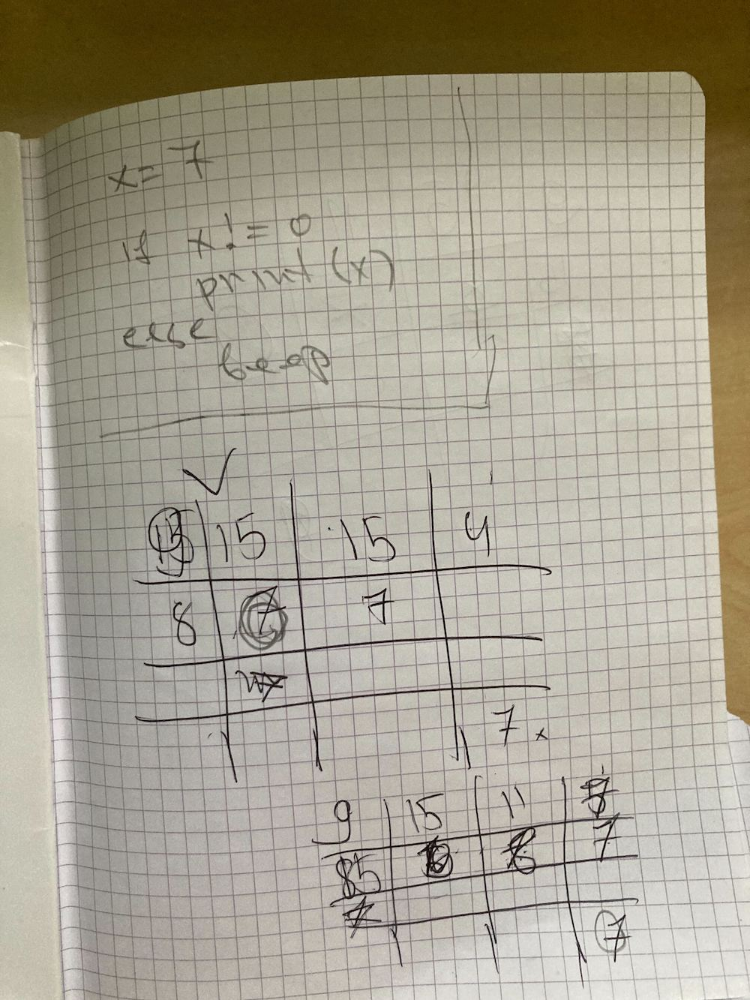
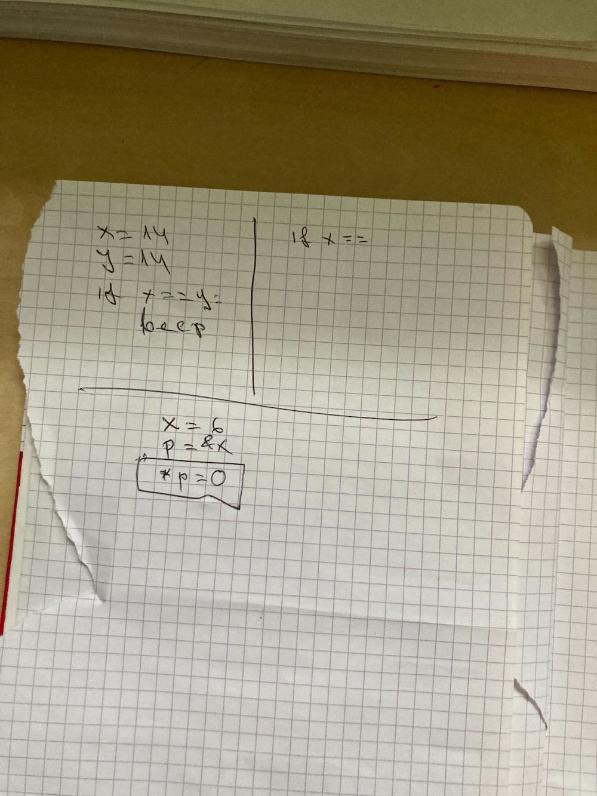
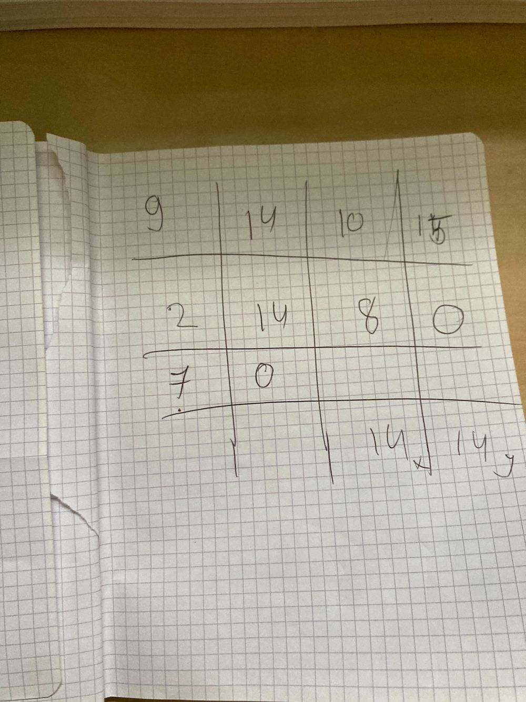
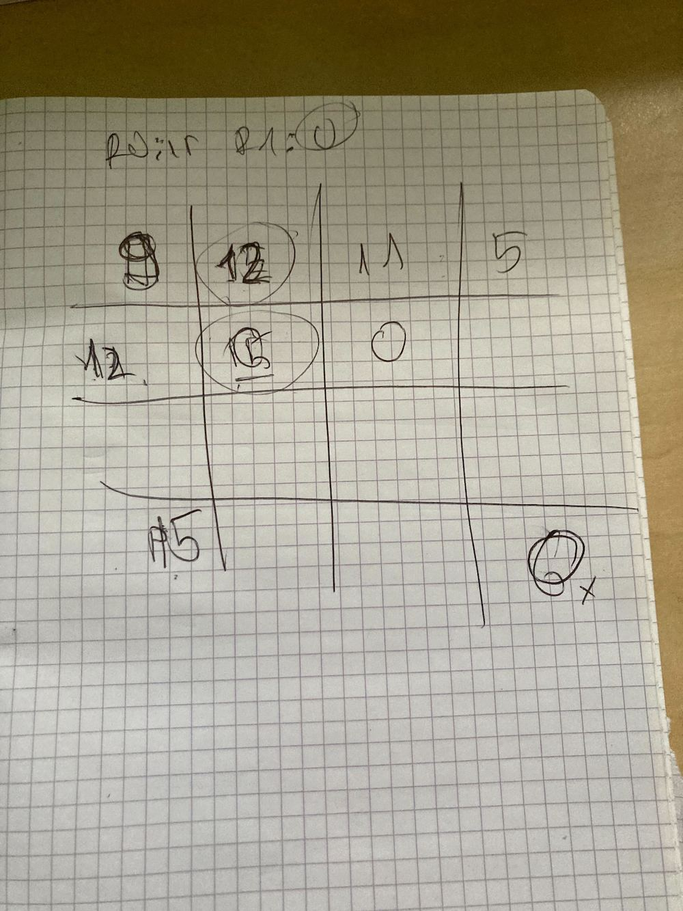
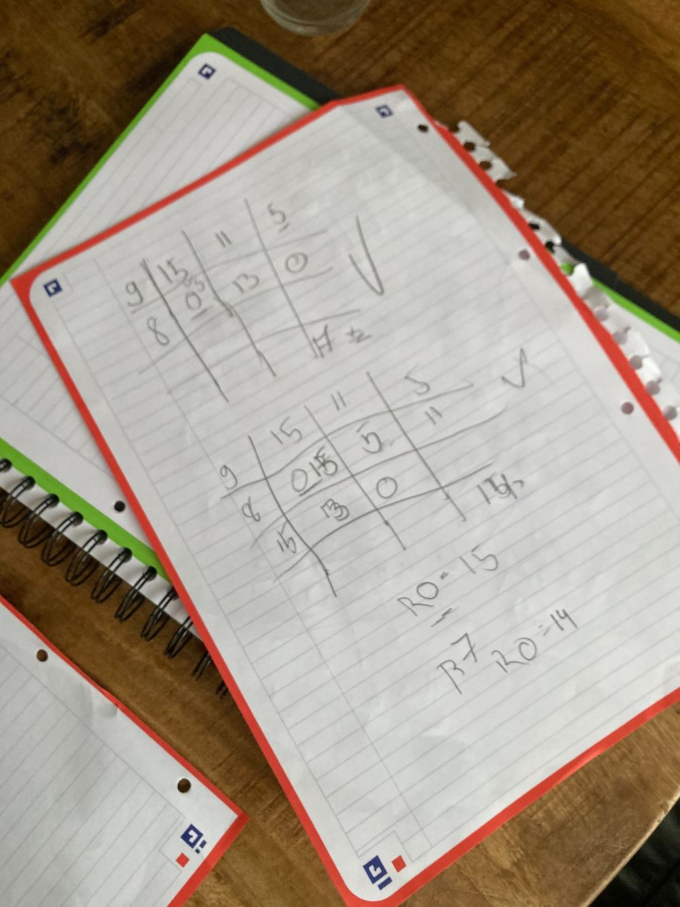
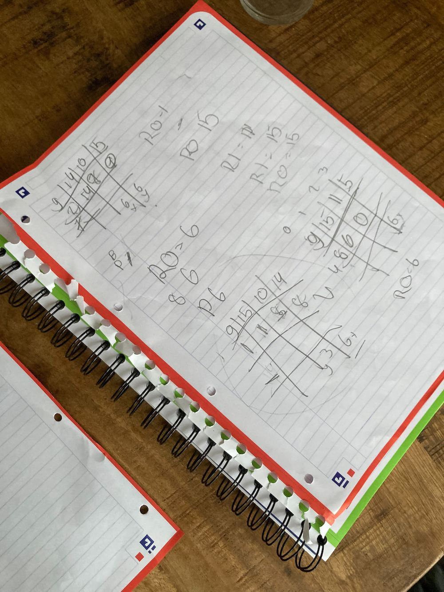

## [DAY-344] pointers

Add check_win function to the following tic tac toe game:

```
#include <stdio.h>
struct board {
    char a0;
    char a1;
    char a2;
    char b0;
    char b1;
    char b2;
    char c0;
    char c1;
    char c2;
};

struct user_input {
    char row;
    char col;
};

void board_print(struct board game) {
    printf("  a b c\n");
    printf("0 %c %c %c\n", game.a0, game.b0, game.c0);
    printf("1 %c %c %c\n", game.a1, game.b1, game.c1);
    printf("2 %c %c %c\n", game.a2, game.b2, game.c2);
    printf("\n");
}

int board_set(struct board *game, char symbol, struct user_input ui) {
    int valid_move = 1;
    if (ui.col == 'a' && ui.row == '0') {
        game->a0 = symbol;
    } else if (ui.col == 'a' && ui.row == '1') {
        game->a1 = symbol;
    } else if (ui.col == 'a' && ui.row == '2') {
        game->a2 = symbol;
    } else if (ui.col == 'b' && ui.row == '0') {
        game->b0 = symbol;
    } else if (ui.col == 'b' && ui.row == '1') {
        game->b1 = symbol;
    } else if (ui.col == 'b' && ui.row == '2') {
        game->b2 = symbol;
    } else if (ui.col == 'c' && ui.row == '0') {
        game->c0 = symbol;
    } else if (ui.col == 'c' && ui.row == '1') {
        game->c1 = symbol;
    } else if (ui.col == 'c' && ui.row == '2') {
        game->c2 = symbol;
    } else {
        valid_move = 0;
    }
    return valid_move;
}

struct user_input get_user_input(char symbol) {
    struct user_input ui = {0};
    printf("%c> ", symbol);
    ui.col = getchar();
    ui.row = getchar();
    getchar(); // ignore the new line
    return ui;
}

void toggle_symbol(char *symbol) {
    // if the symbol is X, set it to 0, if its 0, set it to X
    if (*symbol == 'X') {
        *symbol = '0';
    } else {
        *symbol = 'X';
    }
}

int main(void){
    char current_symbol = 'X';
    struct board game_board = {
        .a0 = '-',
        .a1 = '-',
        .a2 = '-',
        .b0 = '-',
        .b1 = '-',
        .b2 = '-',
        .c0 = '-',
        .c1 = '-',
        .c2 = '-',
    }; 

    while(1) {
        board_print(game_board);
        struct user_input input = get_user_input(current_symbol);
        if (board_set(&game_board, current_symbol, input)) {
            // only change the symbol if the move is valid
            toggle_symbol(&current_symbol);
        }
        // HOMEWORK:
        // write check_win(game_board) function that checks if there is a winner
        // if there is a winner print "X WIN!" if X wins or "0 WIN" if 0 wins, and break to exit the while loop
        // check the board_set function for inspiration
        /*
            example breaking out of a loop:
            while (1) {
                if (something) {
                    break;
                }
            }
        */
    }
}
```

> We spent 1 hour or so discussing pointers and disecting the code




## [DAY-345] pointers

Write the hit() function in the following example:

```
#include <stdio.h>
#include <unistd.h>


struct alive {
    int life;
    int speed;
    int attack_power;
    int shield;
};

// FIXME: write the function body
void hit(struct alive *a, struct alive *b){
...
}

int main(void) {
    struct alive npc = {0};

    npc.life = 1000;
    npc.speed = 17;
    npc.attack_power = 10;
    npc.shield = 50;

    struct alive player = {0};
    player.life = 100;
    player.speed = 10;
    player.attack_power = 117;
    player.shield = 30;

    while(1) {
        hit(&npc, &player);
        hit(&player, &npc);

        printf("player: %d, npc: %d\n", player.life,npc.life);
        sleep(1);
    }

    return 0;
}
```

Example:

```
void hit(struct alive *a, struct alive *b){
    if (b->shield > 0) {
        b->shield -= a->attack_power;
    } else{
        b->life -= a->attack_power;
    }
}
```


## [DAY-346] machine code

> for few days we were playing the 4719 game https://punkx.org/4917/ every day we did a couple of cards, disassembling them and then assembling them and running them on paper


## [DAY-347] machine code; pointers


I made a lot of examples using the 27th card, and then also showed examples in C, and made some other cards on paper about dereferencing pointers

```
#    0 halt
#    1 add R0 = R0 + R1, 2 subtract R0 = R0 - R1
#    3 inc R0, 4 inc R1
#    5 dec R0, 6 dec R1
#    7 ring bell
#  8 X print X
#  9 X R0 = mem[X]
# 10 X R1 = mem[X]
# 11 X mem[X] = R0
# 12 X mem[X] = R1
# 13 X jump to address X
# 14 X jump to address X if R0 == 0
# 15 X jump to address X if R0 != 0
#
# *p++
┌────────┐ ┌────────┐
│ IP:  0 │ │ IS:  0 │
└────────┘ └────────┘
┌────────┐ ┌────────┐
│ R0:  0 │ │ R1:  0 │
└────────┘ └────────┘

┌────┬────┬────┬────┐
│  9 │ 12 │ 11 │  7 │
├────┼────┼────┼────┤
│ 11 │ 10 │  9 │  0 │
├────┼────┼────┼────┤
│  3 │ 11 │  0 │  0 │
├────┼────┼────┼────┤
│ 15 │  0 │  0 │  6 │
└────┴────┴────┴────┘
```

examples:

```
#include <stdio.h>
int main(void) {
  int x = 7;
  int* p = &x;
  *p++;

  printf("%d\n",x)
  
  return 0;
}

#include <stdio.h>
int main(void) {
  int x = 7;
  int* p = &x;
  *p = 3;

  printf("%d\n",x)
  
  return 0;
}

#include <stdio.h>
int main(void) {
  int x = 7;
  
  scanf("%d",&x);

  printf("%d\n",x);
  
  return 0;
}
```


## [DAY-348] machine code; variables

Write the machine code for the following pseudo code:

Given this instruction set:
```
   0 halt
   1 add R0 = R0 + R1, 2 subtract R0 = R0 - R1
   3 inc R0, 4 inc R1
   5 dec R0, 6 dec R1
   7 ring bell
 8 X print X
 9 X R0 = mem[X]
10 X R1 = mem[X]
11 X mem[X] = R0
12 X mem[X] = R1
13 X jump to address X
14 X jump to address X if R0 == 0
15 X jump to address X if R0 != 0
```

```
x = 7
x += 1


assume x is on address 15:
┌────┬────┬────┬────┐
│  0 │  0 │  0 │  0 │
├────┼────┼────┼────┤
│  0 │  0 │  0 │  0 │
├────┼────┼────┼────┤
│  0 │  0 │  0 │  0 │
├────┼────┼────┼────┤
│  0 │  0 │  0 │  7 │
└────┴────┴────┴────┘

```

```
x = 7
y = 8
x = x + y

assume x is on address 15, and y is on addr 14:
┌────┬────┬────┬────┐
│  0 │  0 │  0 │  0 │
├────┼────┼────┼────┤
│  0 │  0 │  0 │  0 │
├────┼────┼────┼────┤
│  0 │  0 │  0 │  0 │
├────┼────┼────┼────┤
│  0 │  0 │  8 │  7 │
└────┴────┴────┴────┘

```

```
x = 7
print(x)

assume x is on address 15:
┌────┬────┬────┬────┐
│  0 │  0 │  0 │  0 │
├────┼────┼────┼────┤
│  0 │  0 │  0 │  0 │
├────┼────┼────┼────┤
│  0 │  0 │  0 │  0 │
├────┼────┼────┼────┤
│  0 │  0 │  0 │  7 │
└────┴────┴────┴────┘
```


## [DAY-349] machine code; variables

> we did more examples









