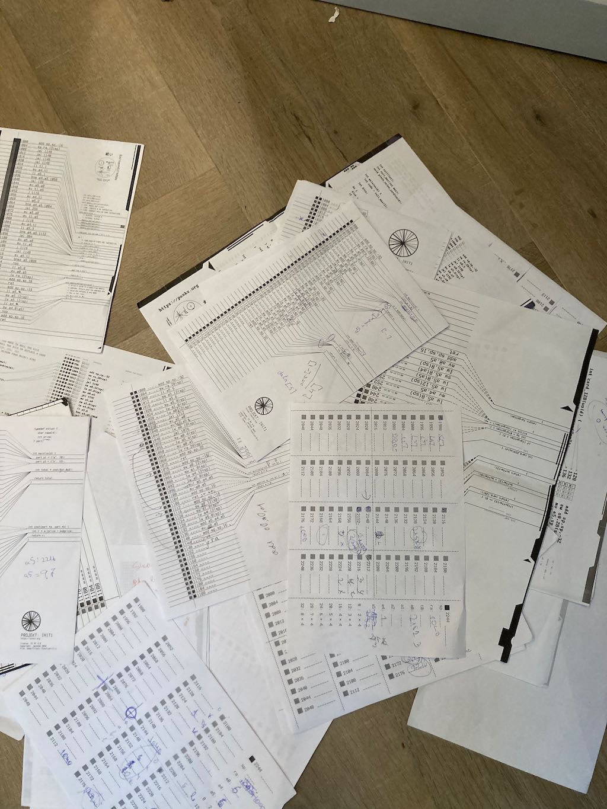
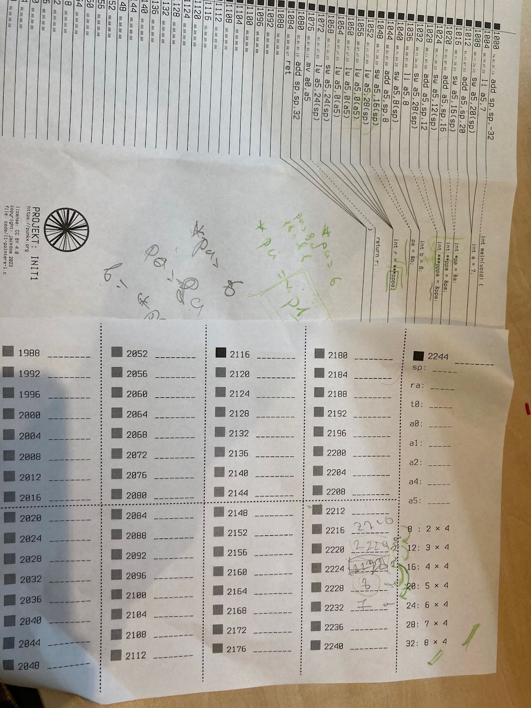
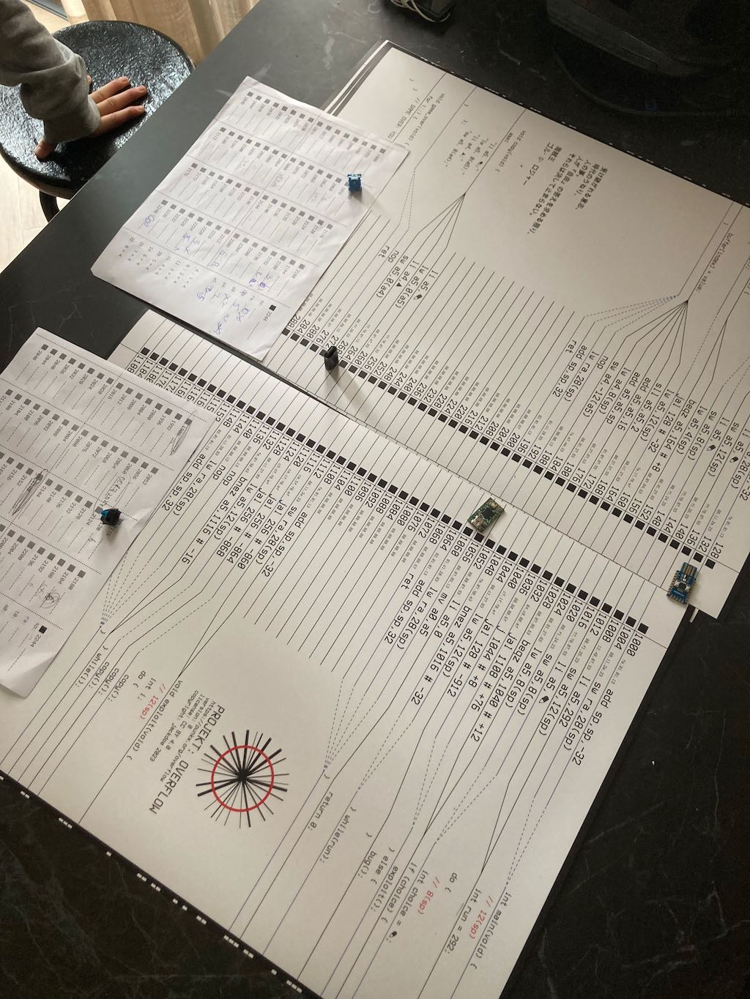

## [DAY-355] riscv assembler

Tle last month or so we spent learning RISCV assembler while making a board game: [PROJEKT:OVERFLOW](https://punkx.org/overflow/)

Each day I made an exercise and then we wrote (either together or her own) the execution of the program, you can see most of the examples at https://punkx.org/overflow/#assembly

I am attaching the photos of some of the work just for the record:




## [DAY-356] pointers



## [DAY-357] buffer overflow

Play a round of easy mode projekt:overflow https://punkx.org/overflow



## [DAY-358] buffer overflow

Play a round of easy mode projekt:overflow https://punkx.org/overflow


## [DAY-359] scanf; printf

Get 4 numbers from the user and print them.

```
#include <stdio.h>
int main(void){
    int number1, number2, number3, number4;
    printf("Choose 4 numbers: ");
    scanf("%d %d %d %d",&number1,&number2,&number3,&number4);
    printf("You chose: %d %d %d %d\n",number1,number2,number3,number4);
    return 0;
}

```

## [DAY-360] fscanf

Read all lines from a file, each containing 4 numbers, and print the numbers

file numbers.txt:
```
1 2 3 54
1.2 3 4 6
0 1 2 3
```


```
#include <stdio.h>
int main(void){
    int number1, number2, number3, number4;
    FILE *fp;
    fp = open("numbers.txt","r");
    while(1)
        int r = fscanf(fp,"%d %d %d %d",&number1,&number2,&number3,&number4);
        if (r == EOF) {
            break;
        }
        printf("numbers: %d %d %d %d\n",number1,number2,number3,number4);
    }
    return 0;
}

```


## [DAY-361] files


write multipe lines in a file using python

```
fout = open('output.txt', 'w')
line1 = "This here\'s the wattle,\n"
fout.write(line1)
line2 = "the emblem of our land.\n"
fout.write(line2)
fout.close()
```

then use `ls` and `cat` to see the files and to print the contents of the file.


## [DAY-362] files

save and load the tictactoe state

```
symbol = 'X'
bord = ["-", "-", "-","-", "-", "-","-", "-", "-"]
ask = ''
while True:
    print(bord[0], bord[1], bord[2])
    print(bord[3], bord[4], bord[5])
    print(bord[6], bord[7], bord[8])
    ask = input(f"{symbol} where do u want to play: ")
    if ask == 'save':
        f = open('board.txt',"w")

        for i in range(9):
            f.write(bord[i])
        f.write(symbol)
        f.close()
        quit()
    
    elif ask== 'load':
        f=open('board.txt','r')
        data = f.read()
        for i in range(9):
            bord[i] = data[i]
        symbol = data[9]
        f.close()
        continue
    else:
        if ask== 'a1':
            bord[0] = symbol
        if ask== 'a2':
            bord[1] = symbol
        if ask== 'a3':
            bord[2] = symbol
        if ask== 'b1':
            bord[3] = symbol
        if ask== 'b2':
            bord[4] = symbol
        if ask== 'b3':
            bord[5] = symbol
        if ask== 'c1':
            bord[6] = symbol
        if ask== 'c2':
            bord[7] = symbol
        if ask== 'c3':
            bord[8] = symbol
    win = False
    if bord[0] != '-' and (bord[0]==bord[1] and bord[1] == bord[2]):
        win = True

    if bord[3] != '-' and (bord[3]==bord[4] and bord[4] == bord[5]):
        win = True
    if bord[6] != '-' and (bord[6]==bord[7] and bord[7] == bord[8]):
        win = True
    if bord[0] != '-' and (bord[0]==bord[3] and bord[3] == bord[6]):
        win = True
    if bord[1] != '-' and (bord[1]==bord[4] and bord[4] == bord[7]):
        win = True
    if bord[2] != '-' and (bord[2]==bord[5] and bord[5] == bord[8]):
        win = True
    if bord[0] != '-' and (bord[0]==bord[4] and bord[4] == bord[8]):
        win = True
    if bord[2] != '-' and (bord[2]==bord[4] and bord[4] == bord[6]):
        win = True
    
    if win == True:
        print(symbol, "WINS")
        quit()
    
    if symbol =='X':
        symbol = '0'
    else:
        symbol = 'X'


```


## [DAY-363] files

play with files, and experimenting with seek()

```
while True:
    ask=input('What do u want to add on your duolingo file: ')
    if ask == 'lessons':
        f=open('duocount.txt','a')
        f.write(ask)
        f.write('\n')
        ques=input('How many lesssons did you do: ')
        f.write(ques)
    if ask == 'placement':
        t=open('duocout.txt','a')
        t.write(ask)
        t.write('\n')
        question=input('which placement are your now: ')
        t.write(question)
    if ask == 'read':
        d=open('duocount.txt','r')
        d.seek(5)
        print(d.read())
    if ask == 'quit':
        break
        
```


## [DAY-364] misc

write few small programs, calculate area/circumference of a circle, volume and area of a rectangle, make a tiny chatgpt client, practice dictionary by making hiragana/eng and katakana/eng tabels


hiragana:

```
hiragana_dict = {
  'a': 'あ',
  'i': 'い',
  'u': 'う',
  'e': 'え',
  'o': 'お',
  'ka': 'か',
  'ki': 'き',
  'ku': 'く',
  'ke': 'け',
  'ko': 'こ',
  'sa': 'さ',
  'shi': 'し',
  'su': 'す',
  'se': 'せ',
  'so': 'そ',
  'ta': 'た',
  'chi': 'ち',
  'tsu': 'つ',
  'te': 'て',
  'to': 'と',
  'na': 'な',
  'ni': 'に',
  'nu': 'ぬ',
  'ne': 'ね',
  'no': 'の',
  'ha': 'は',
  'hi': 'ひ',
  'fu': 'ふ',
  'he': 'へ',
  'ho': 'ほ',
  'ma': 'ま',
  'mi': 'み',
  'mu': 'む',
  'me': 'め',
  'mo': 'も',
  'ya': 'や',
  'yu': 'ゆ',
  'yo': 'よ',
  'ra': 'ら',
  'ri': 'り',
  'ru': 'る',
  're': 'れ',
  'ro': 'ろ',
  'wa': 'わ',
  'wo': 'を',
  'n': 'ん',
}
while True:
    eng = input("which letter do u want to translate: ")
    actual = hiragana_dict[eng]
    print(actual)
```

katakana:

```
japanese={    
    "a": "ア",
    "i": "イ",
    "u": "ウ",
    "e": "エ",
    "o": "オ",
    "ka": "カ",
    "ki": "キ",
    "ku": "ク",
    "ke": "ケ",
    "ko": "コ",
    "sa": "サ",
    "shi": "シ",
    "su": "ス",
    "se": "セ",
    "so": "ソ",
    "ta": "タ",
    "chi": "チ",
    "tsu": "ツ",
    "te": "テ",
    "to": "ト",
    "na": "ナ",
    "ni": "ニ",
    "nu": "ヌ",
    "ne": "ネ",
    "no": "ノ",
    "ha": "ハ",
    "hi": "ヒ",
    "fu": "フ",
    "he": "ヘ",
    "ho": "ホ",
    "ma": "マ",
    "mi": "ミ",
    "mu": "ム",
    "me": "メ",
    "mo": "モ",
    "ya": "ヤ",
    "yu": "ユ",
    "yo": "ヨ",
    "ra": "ラ",
    "ri": "リ",
    "ru": "ル",
    "re": "レ",
    "ro": "ロ",
    "wa": "ワ",
    "wo": "ヲ",
    "n": "ン",
    "ga": "ガ",
    "gi": "ギ",
    "gu": "グ",
    "ge": "ゲ",
    "go": "ゴ",
    "za": "ザ",
    "ji": "ジ",
    "zu": "ズ",
    "ze": "ゼ",
    "zo": "ゾ",
    "da": "ダ",
    "di": "ヂ",
    "du": "ヅ",
    "de": "デ",
    "do": "ド",
    "ba": "バ",
    "bi": "ビ",
    "bu": "ブ",
    "be": "ベ",
    "bo": "ボ",
    "pa": "パ",
    "pi": "ピ",
    "pu": "プ",
    "pe": "ペ",
    "po": "ポ",
    "ā": "ーア",
    "ē": "ーエ",
    "ō": "ーオ",
    "kā": "ーカ",
    "kī": "ーキ",
    "kū": "ーク",
    "kē": "ーケ",
    "kō": "ーコ",
    "sā": "ーサ",
    "shī": "ーシ",
    "sū": "ース",
    "sē": "ーセ",
    "sō": "ーソ",
    "tā": "ータ",
    "chī": "ーチ",
    "tsū": "ーツ",
    "tē": "ーテ",
    "tō": "ート",
    "nā": "ーナ",
    "nī": "ーニ",
    "nū": "ーヌ",
    "nē": "ーネ",
    "nō": "ーノ",
    "hā": "ーハ",
    "hī": "ーヒ",
    "fū": "ーフ",
    "hē": "ーヘ",
    "hō": "ーホ",
    "mā": "ーマ",
    "mī": "ーミ",
    "mū": "ーム",
    "mē": "ーメ",
    "mō": "ーモ",
    "yā": "ーヤ",
    "yū": "ーユ",
    "yō": "ーヨ",
    "rā": "ーラ",
    "rī": "ーリ",
    "rū": "ール",
    "rē": "ーレ",
    "rō": "ーロ",
    "wā": "ーワ",
    "wō": "ーヲ",
    "vū": "ーヴ",
    "n": "ーン",
    "ga": "ガ",
    "gi": "ギ",
    "gu": "グ",
    "ge": "ゲ",
    "go": "ゴ",
    "za": "ザ",
    "ji": "ジ",
    "zu": "ズ",
    "ze": "ゼ",
    "zo": "ゾ",
    "da": "ダ",
    "ji": "ヂ",
    "zu": "ヅ",
    "de": "デ",
    "do": "ド",
    "ba": "バ",
    "bi": "ビ",
    "bu": "ブ",
    "be": "ベ",
    "bo": "ボ",
    "pa": "パ",
    "pi": "ピ",
    "pu": "プ",
    "pe": "ペ",
    "po": "ポ",
    "ya": "ャ",
    "yu": "ュ",
    "yo": "ョ",
    "tsu": "ッ",
    "a": "ァ",
    "i": "ィ",
    "u": "ゥ",
    "e": "ェ",
    "o": "ォ",
    "wa": "ヮ",
    "wi": "ヰ",
    "we": "ヱ",
    "vu": "ヴ",
}
while True:
    eng = input("which letter do u want to translate: ")
    actual = japanese[eng]
    print(actual)

```

french counting:

```
FrenchCounting={
    "one":"un",
    "two":"deux",
    "three":"trois",
    "four":"quatre",
    "five":"cinq",
    "six":"six",
}
score = 0
while True:
    eng = input("which number: ")
    fre = input("what is the french version: ")

    actual = FrenchCounting[eng]
    if actual == fre:
        print("success")
        score +=1
        print(score)
    else:
        print("wrong")
```


openai client:

```
import openai
openai.api_key = 'sk-..'
messages = [{"role": "system", "content": "You are a japanesec techer, and your student is asking you the following quesiton, answer with the right response."}]
while True:
    question = input("what is your question: ")
    messages.append({"role": "user", "content": question})

    response = openai.ChatCompletion.create(
        model="gpt-3.5-turbo",
        messages=messages
    )
    content = response["choices"][0]["message"]["content"]

    print('-' * 20)
    print(content)

    messages.append({"role":"assistant", "content": content})
    print('-' * 20)
    #print(messages)
```


area and volume of an parallelepiped:

```
H = float(input("what is the height: "))
W = float(input("what is the width: "))
D = float(input("what is the depth: "))

V = H*W*D
A = H*W*2 + H*D*2 + W*D*2
print("The Volume is: "+str(V))
print("The Area is: "+str(A))
```

area and circumference of a circle:

```
ask = input("How big is the radius: ")
r=float(ask)
pi = 3.1415926
C =2*pi*r
A =pi*r*r
print("the Area of your circle is: "+str(A))
print("the Circumference is: "+str(C))
```


## [DAY-365] area

Write a program to calculate the area of triangle, and write another one that asks what kind of area you want to calculate and can do circle, rectangle and triangle


> those are the programs she wrote

```
ask = input("what height of the triangle: ")
quest = input("what is the base of the triangle: ")
height = int(ask)
base = int(quest)
Area = height * base /2
print("the area of your triangle is:" +str(Area))
```

and the one with menu:

```
print("1 = circle, 2=rectangle, 3 = triangle:")
ask = input("what do u want to do? ")
if ask == '1':
    r = input('what is the radius: ')
    result = float(r) * float(r) * 3.14
    print(result)
elif ask == '2':
    Lenght=input('what is the length: ')
    Height=input('what is the height')
    result = int(Lenght) * int(Height)
    print(result)
elif ask == '3':
    h=input("what is the height: ")
    l=input("what is the length: ")
    result = int(l) * int(h) /2
    print(result)
```

