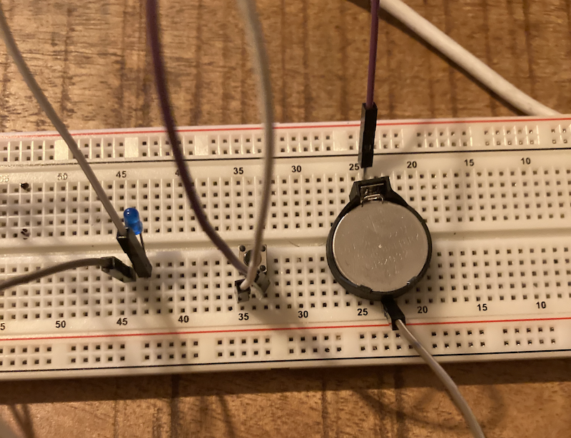
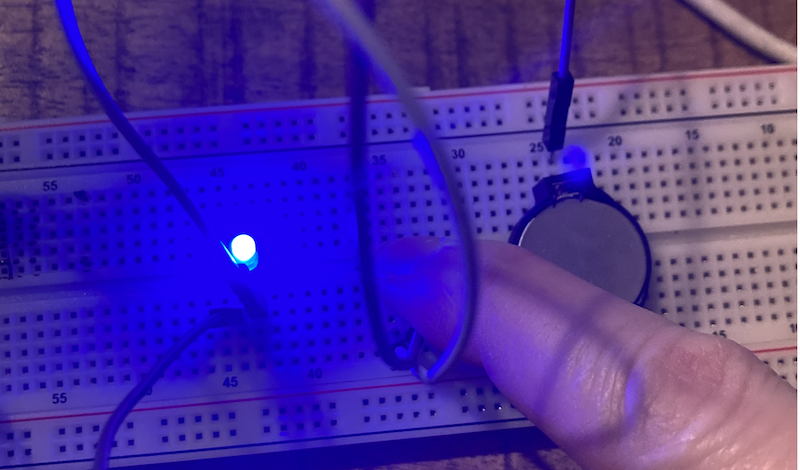
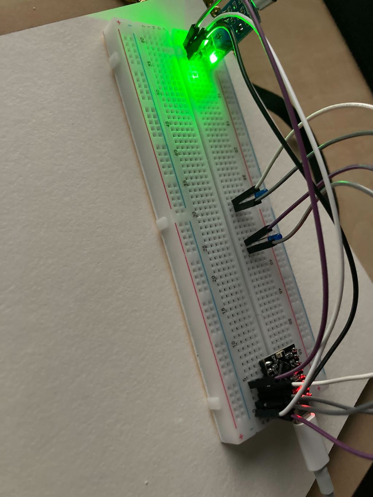
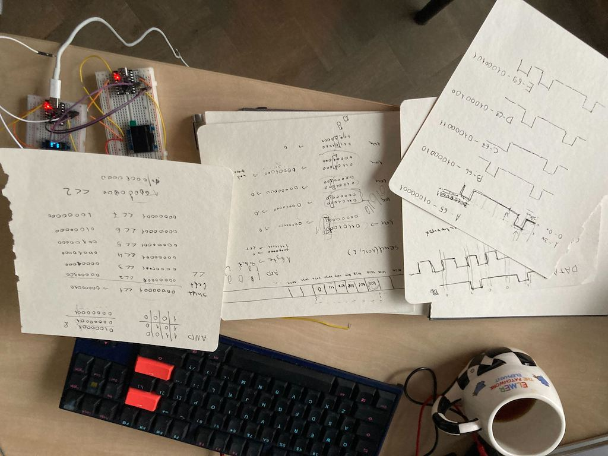
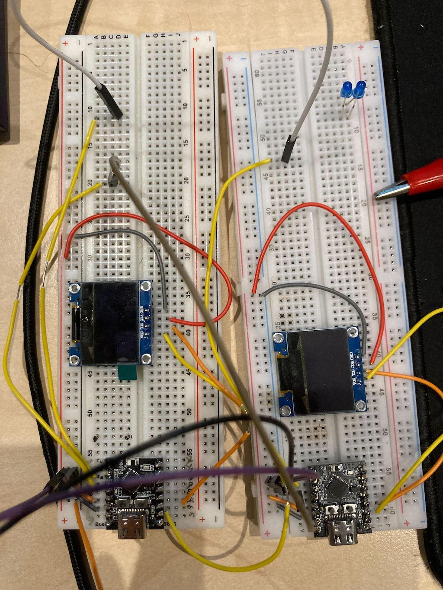
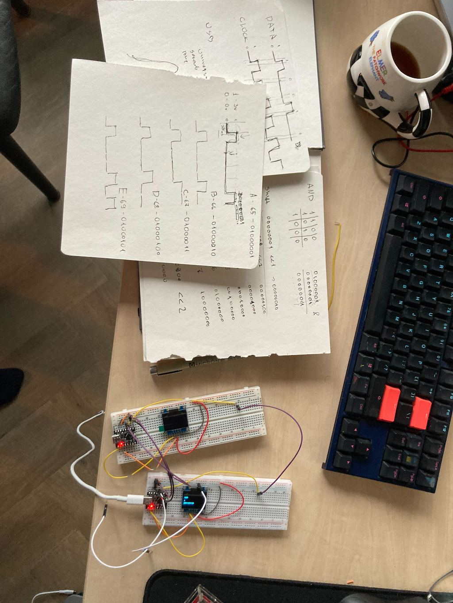

## [DAY-367] functions

make a fizzbuzz function that takes a parameter the final number to fizzbuzz to, also make another function to check if a number is prime, and print the prime numbers in the fizzbuzz function


```
def is_prime(n):
    if n== 0 or n == 1:
        return False
    for x in range(2,n):
        if n %x==0:
             return False
    return True
def fizzz(x):    
    for i in range(x):
        if i%15==0:
            print("fizzbuzz")
        elif i%5==0:
            print("buzz")
        elif i%3==0:
            print("fizzz")
        else:
            if is_prime(i):
                print("prime " + str(i))
            else:
                print(i)
fizzz(100000000000000)

```

## [DAY-368] functions

make a program that prints fizzbuzz or the area of the circle

> we are doing one small program per week, because high school in the netherlands starts at age 12, and its quite intense, so now we are taking it slow, this is the kind of program she can write by herself without help:

```
def fizzbuzz(n):
    for i in range(n):
        if i % 15 == 0:
            print("FIZZBUZZZ")
        elif i % 5 == 0:
            print("BUZZZZZ")
        elif i % 3 == 0:
            print("FIZZZZ")
        else:
            print(i)

def circumference(r):
    result = float(r)*2 * 3.14
    return result


ask = input("do u want fizzbuzz or area? ")
if ask == "fizzbuzz":
    a = input("what is the number")
    fizzbuzz(int(a))
elif ask == "area":
    re = input("what is the readius")
    v = circumference(re)
    print(v)
    
```

## [DAY-369] functions

Make a fizbuzz function that takes the start and end as parameters

```
def fb(a,n):
    for i in range(a,n):
        if i%15==0:
            print('fizzbuzz')
        if i%3==0:
            print('fizz')
        if i%5==0:
            print(buzz)
        else:
            print(i)
fb(1,100)
```


## [DAY-370] circuits

implement the following circuit on a breadboard:

```
.- battery + --- button -> led --.
|                                |
`--------------------------------'
```

so that when you press the button it closes the circuit and the led lights up






## [DAY-371] blink

We will do some experiments withg esp32, microphone and few LEDs. Flash the esp32 with micropython (in ourcase its esp32c3: https://micropython.org/download/ESP32_GENERIC_C3/)

first connect the LED to pin 4 and the ground pin like this:


Then make the LED blink:

```
from machine import Pin
from time import sleep_ms

p4 = Pin(4, Pin.OUT)

while True:
    p4.value(1)
    sleep_ms(1000)
    p4.value(0)
    sleep_ms(1000)

```


Now add another LED to pin 3, and make them alternate, when one is ON the other should be OFF:




```
from machine import Pin
from time import sleep_ms

p4 = Pin(4, Pin.OUT)
p3 = Pin(4, Pin.OUT)
while True:
    p4.value(1)
    p3.value(0)
    sleep_ms(1000)
    p4.value(0)
    p3.value(1)
    sleep_ms(1000)
```

Now get a microphone, and hook it to Pin 2, then read pin2 and only make one of the LEDs light when the microphone detects loud noise (like a clap):


```
from machine import Pin, ADC
from time import sleep_ms
p4 = Pin(4, Pin.OUT)
p2 = ADC(Pin(2))
p2.atten(ADC.ATTN_11DB)

while True:
    if p2.read() > 2000:
        p4.value(1)
    else:
        p4.value(0)
```


## [DAY-372] communication


Watch Ben Eater's Reliable data transmission: https://www.youtube.com/watch?v=eq5YpKHXJDM&

> We didnt actually watch it but I tried to explain it myself and also built a similar lab setup with 2 esp32s, including how we test for valid bits and also how we send bit by bit and how we build the character on the other side, first with nz encoding then with data + clock, the lesson was about 45 minutes. 




