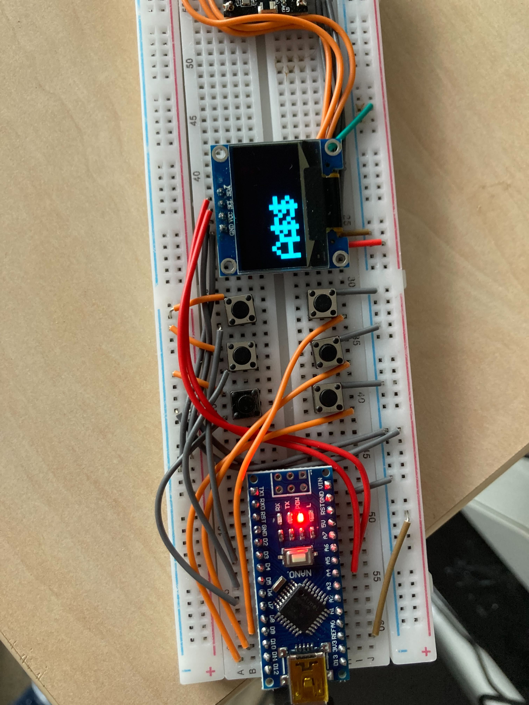
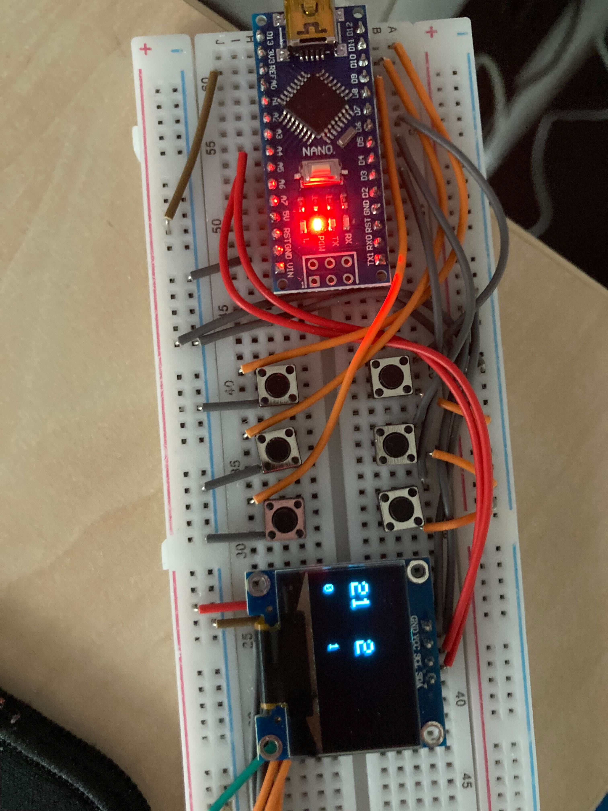
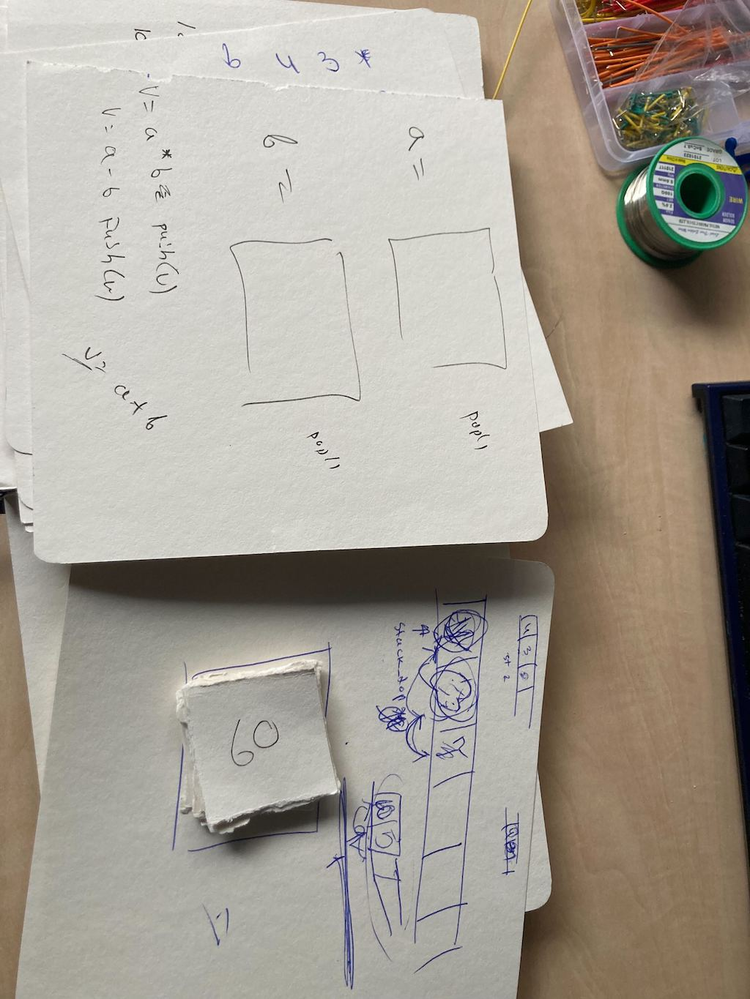
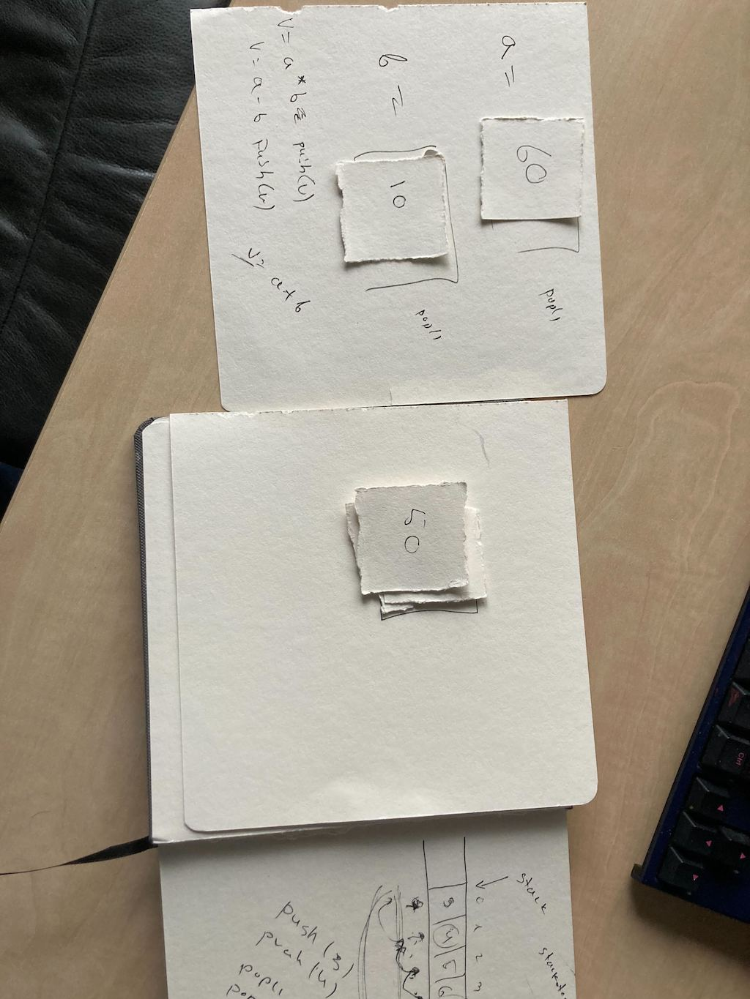
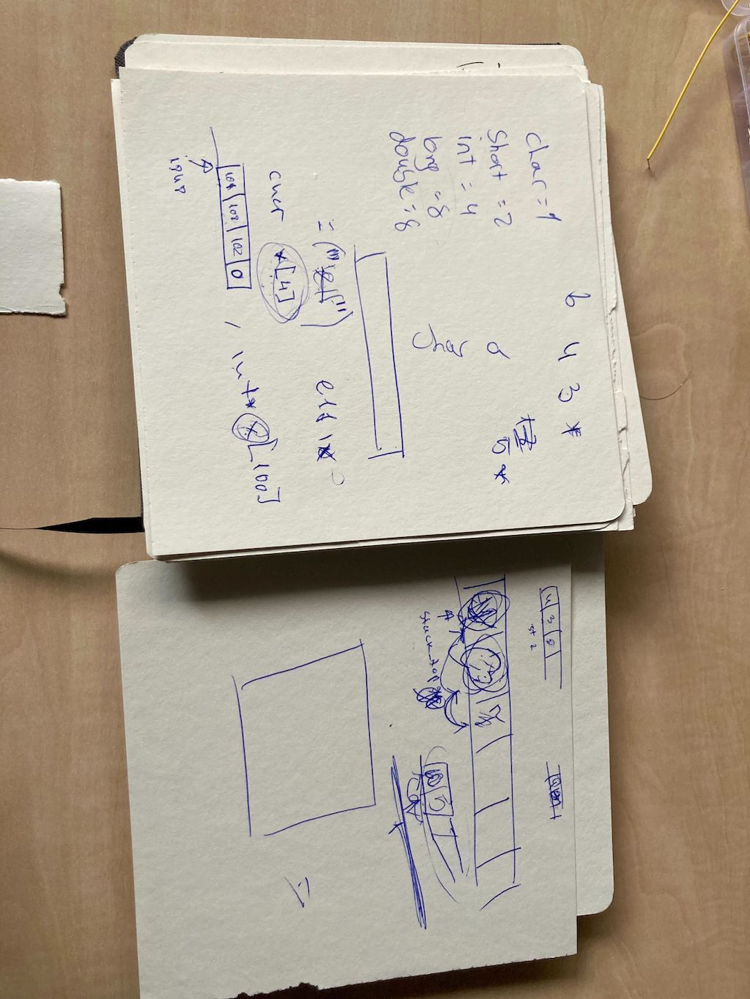

## [DAY-367] functions

make a fizzbuzz function that takes a parameter the final number to fizzbuzz to, also make another function to check if a number is prime, and print the prime numbers in the fizzbuzz function


```
def is_prime(n):
    if n== 0 or n == 1:
        return False
    for x in range(2,n):
        if n %x==0:
             return False
    return True
def fizzz(x):    
    for i in range(x):
        if i%15==0:
            print("fizzbuzz")
        elif i%5==0:
            print("buzz")
        elif i%3==0:
            print("fizzz")
        else:
            if is_prime(i):
                print("prime " + str(i))
            else:
                print(i)
fizzz(100000000000000)

```

## [DAY-368] functions

make a program that prints fizzbuzz or the area of the circle

> we are doing one small program per week, because high school in the netherlands starts at age 12, and its quite intense, so now we are taking it slow, this is the kind of program she can write by herself without help:

```
def fizzbuzz(n):
    for i in range(n):
        if i % 15 == 0:
            print("FIZZBUZZZ")
        elif i % 5 == 0:
            print("BUZZZZZ")
        elif i % 3 == 0:
            print("FIZZZZ")
        else:
            print(i)

def circumference(r):
    result = float(r)*2 * 3.14
    return result


ask = input("do u want fizzbuzz or area? ")
if ask == "fizzbuzz":
    a = input("what is the number")
    fizzbuzz(int(a))
elif ask == "area":
    re = input("what is the readius")
    v = circumference(re)
    print(v)
    
```

## [DAY-369] functions

Make a fizbuzz function that takes the start and end as parameters

```
def fb(a,n):
    for i in range(a,n):
        if i%15==0:
            print('fizzbuzz')
        if i%3==0:
            print('fizz')
        if i%5==0:
            print(buzz)
        else:
            print(i)
fb(1,100)
```


## [DAY-370] circuits

implement the following circuit on a breadboard:

```
.- battery + --- button -> led --.
|                                |
`--------------------------------'
```

so that when you press the button it closes the circuit and the led lights up


## [DAY-371] blink

We will do some experiments withg esp32, microphone and few LEDs. Flash the esp32 with micropython (in ourcase its esp32c3: https://micropython.org/download/ESP32_GENERIC_C3/)

first connect the LED to pin 4 and the ground pin like this:


Then make the LED blink:

```
from machine import Pin
from time import sleep_ms

p4 = Pin(4, Pin.OUT)

while True:
    p4.value(1)
    sleep_ms(1000)
    p4.value(0)
    sleep_ms(1000)

```


Now add another LED to pin 3, and make them alternate, when one is ON the other should be OFF:


```
from machine import Pin
from time import sleep_ms

p4 = Pin(4, Pin.OUT)
p3 = Pin(4, Pin.OUT)
while True:
    p4.value(1)
    p3.value(0)
    sleep_ms(1000)
    p4.value(0)
    p3.value(1)
    sleep_ms(1000)
```

Now get a microphone, and hook it to Pin 2, then read pin2 and only make one of the LEDs light when the microphone detects loud noise (like a clap):


```
from machine import Pin, ADC
from time import sleep_ms
p4 = Pin(4, Pin.OUT)
p2 = ADC(Pin(2))
p2.atten(ADC.ATTN_11DB)

while True:
    if p2.read() > 2000:
        p4.value(1)
    else:
        p4.value(0)
```


## [DAY-372] communication


Watch Ben Eater's Reliable data transmission: https://www.youtube.com/watch?v=eq5YpKHXJDM&

> We didnt actually watch it but I tried to explain it myself and also built a similar lab setup with 2 esp32s, including how we test for valid bits and also how we send bit by bit and how we build the character on the other side, first with nz encoding then with data + clock, the lesson was about 45 minutes. 


## [DAY-373] communication


Make a simple interface to draw characters/shapes on ssd1306 oled display




> I made the code and the device, but left the part that handles the keypresses to her, I printed the gfx pdf: https://cdn-learn.adafruit.com/downloads/pdf/adafruit-gfx-graphics-library.pdf of course she decided to write a$$ :)

```
#include <SPI.h>
#include <Wire.h>
#include <Adafruit_GFX.h>
#include <Adafruit_SSD1306.h>

Adafruit_SSD1306 screen(128, 64, &Wire, -1);
int pins[6] = { 12, 11, 10, 7, 6, 4 };
int pressed[6] = { 0, 0, 0, 0, 0, 0 };

void setup() {
  Serial.begin(9600);

  screen.begin(SSD1306_SWITCHCAPVCC, 0x3C);
  screen.clearDisplay();
  screen.display();

  // setup pins to INPUT mode
  for (int i = 0; i < 6; i++) {
    pinMode(pins[i], INPUT_PULLUP);
  }
}

void loop() {
  for (int i = 0; i < 6; i++) {
    int v = digitalRead(pins[i]);
    if (v == 0) {
      // press
      if (!pressed[i]) {
        pressed[i] = 1;
        press(i);
      }
    } else {
      pressed[i] = 0;
    }
  }
}
int x = 0;

void press(int button) {
  if (button == 0) {
    screen.clearDisplay();
  }
  if (button == 1) {
    screen.drawChar(x, 30, 65, WHITE, BLACK, 5);
    x += 25;
  }
  if (button == 2) {
    screen.fillRect(x, 32, 40, 20, WHITE);
  }
  if (button == 3) {
    screen.drawChar(x, 30, 36, WHITE, BLACK, 5);
    x += 25;
  }
  if (button == 4) {
    screen.fillRoundRect(x, 40, 20, 20, 10, WHITE);
  }
  if (button == 5) {
    screen.fillTriangle(x, 20, 45, 40, 60, 63, WHITE);
  }


  screen.display();
}

```

## [DAY-374] the stack

> Making a reverse polish notation calculator, I most of the lesson (which lasted about 25 mins) I was explaining the stack data structure, and showed some code about a possible implementation, and I modified the arduino+buttons thing from yesterday to be a simple calculator. I used stacks of paper to illustrate how it works, and why the stack is so powerful.




> This was the first actual programming lesson since we started few years ago. The impementation uses global variables on purpose to be as simple as possible to explain and focus on simply keeping an index into an array.


```
#include <SPI.h>
#include <Wire.h>
#include <Adafruit_GFX.h>
#include <Adafruit_SSD1306.h>

Adafruit_SSD1306 screen(128, 64, &Wire, -1);
int pins[6] = { 12, 11, 10, 7, 6, 4 };
int pressed[6] = { 0, 0, 0, 0, 0, 0 };


void setup() {
  Serial.begin(9600);

  screen.begin(SSD1306_SWITCHCAPVCC, 0x3C);
  screen.clearDisplay();
  screen.display();

  // setup pins to INPUT mode
  for (int i = 0; i < 6; i++) {
    pinMode(pins[i], INPUT_PULLUP);
  }
}

void loop() {
  for (int i = 0; i < 6; i++) {
    int v = digitalRead(pins[i]);
    if (v == 0) {
      // press
      if (!pressed[i]) {
        pressed[i] = 1;
        press(i);
      }
    } else {
      pressed[i] = 0;
    }
  }
  delay(10);
}


int stack[100] = { 0 };
volatile int stack_top = 0;

void stack_push(int v) {
  stack[stack_top] = v;
  stack_top++;
}

int stack_pop() {
  int v = stack[stack_top - 1];
  stack_top--;
  return v;
}
int stack_peek() {
  return stack[stack_top-1];
}
void displayStack() {
  screen.clearDisplay();
  int x = 0;

  for (int i = 0; i < stack_top; i++) {
    int v = stack[i];
    char buf[10] = { 0 };
    char *p = buf;
    sprintf(buf, "%d", v);
    screen.drawChar(x, 50, 48 + i, WHITE, BLACK, 1);
    while (*p) {
      screen.drawChar(x, 20, *p, WHITE, BLACK, 2);
      x += 12;
      p++;
    }
    x += 25;
  }
  screen.display();
}

void press(int button) {
  if (button == 0) {
    stack_push(1);
  }
  if (button == 1) {
    stack_push(2);
  }
  if (button == 2) {
    stack_push(3);
  }

  if (button == 3) {
    // multiply
    int a = stack_pop();
    int b = stack_pop();
    int r = a * b;
    stack_push(r);
  }
  if (button == 4) {
    // add
    int a = stack_pop();
    int b = stack_pop();
    int r = a + b;
    stack_push(r);
  }

  if (button == 5) {
    stack_top = 0;
  }
  displayStack();
}
```


## [DAY-375] the stack

> Again we spent the whole lesson on stacks, and arrays and primitive data types.






## [DAY-376] sql

Watch BroCode's MySQL Full Course:  https://www.youtube.com/watch?v=5OdVJbNCSso


## [DAY-376] sql

Write the SQL statement that does similar thing to the following code:

```
employees = [
    {"id": 1, "first_name": "John", "last_name": "Doe"},
    {"id": 2, "first_name": "Mike", "last_name": "Johnson"},
    {"id": 3, "first_name": "Jane", "last_name": "Smith"},
    {"id": 4, "first_name": "Tom", "last_name": "Brown"}
]

transactions = [
    {"id": 1, "employee_id": 1, "amount": 100},
    {"id": 2, "employee_id": 2, "amount": 150},
    {"id": 3, "employee_id": 3, "amount": 20},
    {"id": 4, "employee_id": 4, "amount": 400},
    {"id": 5, "employee_id": 3, "amount": 4}
]

# SQL: _____________________________________________
for employee in employees:
    print(employee["first_name"])


# SQL: _____________________________________________
for employee in employees:
    print(employee["first_name"], employee["last_name"])


# SQL: _____________________________________________
for employee in employees:
    if (employee["id"] == 3):
        print(employee["first_name"], employee["last_name"])


# SQL: _____________________________________________
for employee in employees:
    if (employee["id"] > 3):
        print(employee["first_name"], employee["last_name"])

# SQL: _____________________________________________
for employee in employees:
    if (employee["first_name"] == "Tom"):
        print(employee["first_name"], employee["last_name"])

# SQL: _____________________________________________
for employee in employees:
    if employee["last_name"].endswith("son"):
        print(employee["first_name"], employee["last_name"])


# SQL: _____________________________________________
employees.append({"id": 5, "first_name": "Sam", "last_name": "Pink"})
employees.append({"id": 6, "first_name": "Sue", "last_name": "Blue"})

# SQL: _____________________________________________
for employee in employees:
    if (employee["id"] == 3):
        employee["first_name"] = "Mary"

# SQL: _____________________________________________
sum = 0
for transaction in transactions:
    sum += transaction["amount"]
print(sum)


# SQL: _____________________________________________
max = 0
for transaction in transactions:
    if transaction["amount"] > max:
        max = transaction["amount"]
print(max)


# SQL: _____________________________________________
for employee in employees:
    sum = 0
    for transaction in transactions:
        if transaction["employee_id"] == employee["id"]:
            sum += transaction["amount"]
    print(employee["first_name"], sum)


# SQL: _____________________________________________
for transaction in transactions:
    for employee in employees:
        if transaction["employee_id"] == employee["id"]:
            print(employee["first_name"], transaction["amount"])

# SQL: _____________________________________________
for transaction in transactions:
    for employee in employees:
        if transaction["employee_id"] == employee["id"]:
            if employee["first_name"].startswith("A"):
                print(employee["first_name"], transaction["amount"])

```


Think about the code that would do this sql

```
INSERT INTO transactions(id, employee_id, amount) (1,1,10);
INSERT INTO employees(id, first_name, last_name) (1,"jack", "doe");
SELECT first_name FROM employees;
SELECT first_name, last_name FROM employees;
SELECT first_name, last_name FROM employees WHERE id = 3;
SELECT first_name, last_name FROM employees WHERE id > 3;
SELECT MAX(id) FROM empoloyees;
SELECT MAX(id) FROM empoloyees WHERE first_name LIKE "%a%";
SELECT COUNT(*) FROM empoloyees WHERE first_name LIKE "%b%";
SELECT e.first_name, t.amount FROM transactions t INNER JOIN empoloyees e ON e.id = t.employee_id WHERE e.first_name like "a%"
```


> This is a good over simplification of how to think about full table scans, which I think is good way to build intuition about how queries work
